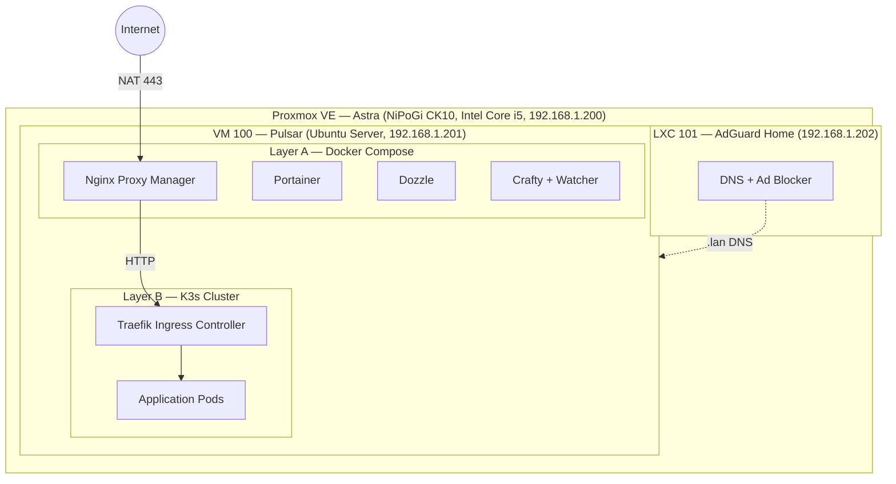
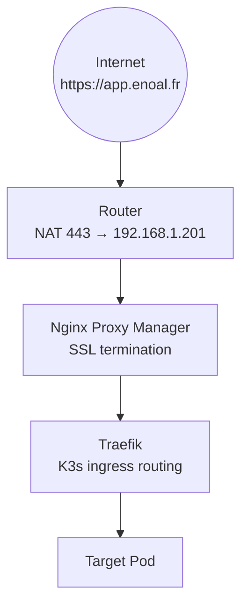
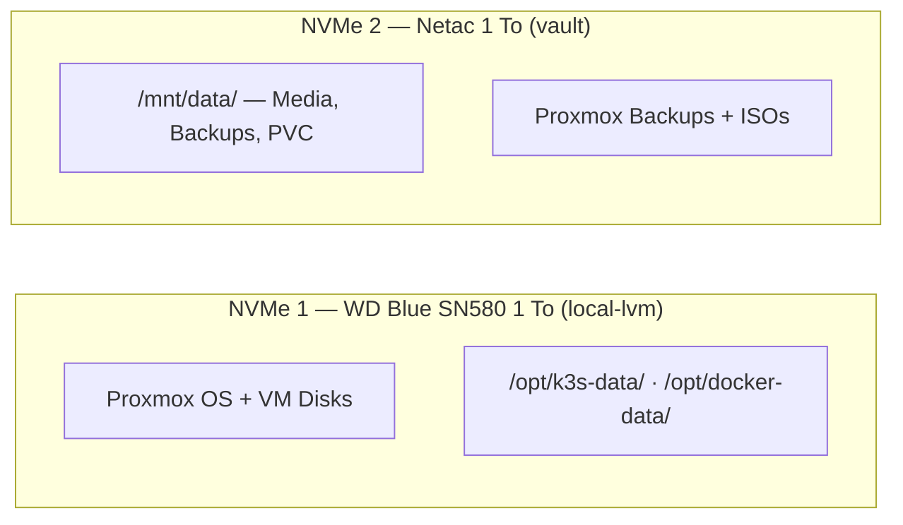
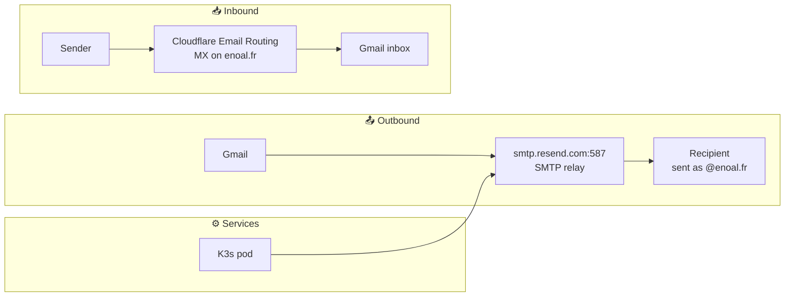
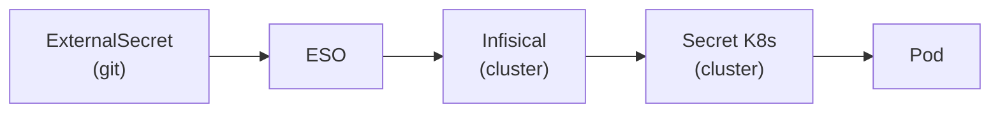

# 🚀 Astra-ops

GitOps monorepo for my homelab called **Astra** — a personal infrastructure running on Proxmox,
orchestrated with K3s and Docker Compose, and continuously deployed via ArgoCD.

[](https://www.gnu.org/licenses/gpl-3.0)
[](https://argoproj.github.io/cd/)
[](https://k3s.io/)
[](https://helm.sh/)
[](https://www.proxmox.com/)

---

## Table of contents

- [Overview](#overview)
- [About](#about)
- [Architecture](#architecture)
- [Tech stack](#tech-stack)
- [Repository structure](#repository-structure)
- [Services catalog](#services-catalog)
- [Network and DNS](#network-and-dns)
- [Email infrastructure](#email-infrastructure)
- [Storage strategy](#storage-strategy)
- [Secrets management](#secrets-management)
- [GitOps workflow](#gitops-workflow)
- [Prerequisites](#prerequisites)
- [Getting started](#getting-started)
- [Remote access](#remote-access)
- [License](#license)

---

## Overview

Astra-ops is the single source of truth for every service running on the **Astra** homelab.
All Kubernetes manifests, Helm charts, Docker Compose stacks, and ArgoCD application
definitions live in this repository. Any change pushed to `main` is automatically picked
up by ArgoCD and synced to the cluster.

The infrastructure is split into two deployment layers:

- **Layer A — Docker Compose**: core infrastructure services managed by Portainer
  (Nginx Proxy Manager, Dozzle, Crafty).
- **Layer B — K3s (Kubernetes)**: all application workloads, packaged as Helm charts
  or raw manifests and deployed through ArgoCD.

---

## About

Astra is not the most practical homelab architecture. A single reverse proxy handling both SSL termination and internal routing would be simpler. Running everything on bare metal would eliminate the VM overhead entirely. An opinionated all-in-one solution would take an afternoon to set up.

But simplicity was not the goal — learning was.

Every piece of this stack was chosen because it forced me to understand something real:

- **Kubernetes (K3s)** — container orchestration, namespaces, Helm packaging, HPA/VPA autoscaling, and the GitOps feedback loop with ArgoCD.
- **Networking** — split-horizon DNS with AdGuard Home, NAT and port forwarding, SSL termination, and the Traefik ingress controller.
- **SysAdmin / Linux** — Proxmox VE, VM and LXC provisioning, NVMe storage layout, and keeping a production-like system running continuously on a mini PC.
- **DevOps** — GitOps with ArgoCD, Renovate for automated dependency updates, and self-hosted GitHub Actions runners on K3s with ARC.
- **Email infrastructure** — SPF, DKIM, DMARC, routing inbound mail through Cloudflare Email Routing and outbound through an SMTP relay, without ever touching a mail server.
- **Backup strategy** — designing a 3-2-1 architecture with Proxmox Backup Server for local block-level snapshots and Zerobyte + Rclone + MEGA for offsite cloud backups, including data classification tiers and RTO/RPO planning.
- **Secrets management** — External Secrets Operator (ESO) syncing secrets from Infisical into Kubernetes, keeping credentials entirely out of Git.

> [!NOTE]
> The most visible architectural compromise is the double reverse proxy: Nginx Proxy Manager handles SSL termination and public routing, then passes plain HTTP to Traefik inside the cluster. The cleaner approach would be Traefik directly exposed with cert-manager — but NPM was already familiar and added a useful management UI.

---

## Architecture

### Physical and virtual layout



### Traffic flow



### Storage layout



---

## Tech stack

| Layer                    | Technology                | Role                                      |
| ------------------------ | ------------------------- | ----------------------------------------- |
| Hypervisor               | Proxmox VE                | Virtualization platform                   |
| DNS                      | AdGuard Home (LXC)        | Local DNS + ad blocking                   |
| Container runtime        | K3s                       | Lightweight Kubernetes distribution       |
| Container runtime        | Docker Compose            | Infrastructure services                   |
| Reverse proxy (external) | Nginx Proxy Manager       | SSL termination, public routing           |
| Reverse proxy (internal) | Traefik                   | K3s ingress controller                    |
| GitOps                   | ArgoCD                    | Continuous deployment from Git            |
| Package manager          | Helm                      | Kubernetes application packaging          |
| Dependency updates       | Renovate                  | Automated image/chart version bumps       |
| Secrets management       | External Secrets Operator | Sync secrets from Infisical into K8s      |
| Secrets backend          | Infisical (self-hosted)   | Centralized secrets store                 |
| Resource autoscaling     | VPA (cowboysysop)         | Resource usage recommendations (Off mode) |
| Container management     | Portainer EE              | Docker + Compose stack management         |
| Log viewer               | Dozzle                    | Real-time Docker log streaming            |
| CI runners               | Actions Runner Controller | GitHub Actions self-hosted runners on K3s |
| Email inbound            | Cloudflare Email Routing  | Catch-all forwarding to Gmail             |
| Email outbound           | Resend (SMTP relay)       | Authenticated sending for `@enoal.fr`     |

---

## Repository structure

```text
astra-ops/
├── apps/                    # ArgoCD Application manifests
│   ├── .disabled/           # Disabled apps (not picked up by ArgoCD)
│   └── *.yaml               # One file per active service
├── docker/                  # Docker Compose stacks (Layer A)
│   ├── crafty/              # Minecraft server + custom watcher proxy
│   ├── dozzle/              # Docker log viewer
│   ├── npm/                 # Nginx Proxy Manager
│   └── portainer/           # Container management UI
├── infra/
│   ├── argocd/
│   │   ├── argocd-ingress.yaml   # ArgoCD Ingress
│   │   └── root-app.yaml         # App-of-Apps bootstrap (apply once)
│   ├── eso/
│   │   ├── cluster-secret-store.yaml    # ClusterSecretStore (committed)
│   │   ├── infisical-bootstrap.example  # Bootstrap secret template (committed)
│   │   └── infisical-token.example      # Service token template (committed)
│   └── vpa/
│       └── <service>.yaml        # VPA objects (one per deployment, Off mode)
├── k3s/                     # K3s workloads (Layer B)
│   └── <service>/
│       ├── Chart.yaml            # (Helm) Chart metadata
│       ├── values.yaml           # (Helm) Configurable values
│       ├── templates/            # (Helm) Kubernetes templates
│       ├── 00-namespace.yaml     # (Raw) Namespace
│       └── 20-deployment.yaml    # (Raw) Deployment
├── organization/            # Internal notes
├── renovate.json            # Renovate bot configuration
├── LICENSE
└── .gitignore               # Excludes secrets and credentials
```

> Services are progressively being migrated from raw manifests to Helm charts.
> Both formats coexist in `k3s/`.

---

## Services catalog

> [!NOTE]
> **Status** — ✅ Active: running · ⏸️ Disabled: in repo but not deployed · 🔜 Planned: not yet in repo

| Service                                        | Description                                       | Category          | Namespace        | Type            | Exposure                                                   | Status      |
| ---------------------------------------------- | ------------------------------------------------- | ----------------- | ---------------- | --------------- | ---------------------------------------------------------- | ----------- |
| ArgoCD                                         | GitOps continuous deployment                      | 🗄️ DevOps         | `argocd`         | Helm (official) | `argocd.lan`                                               | ✅ Active   |
| [azerbot](k3s/azerbot)                         | Custom Discord bot                                | 🤖 Bots           | `bots`           | Helm            | `azerbot.lan`                                              | ✅ Active   |
| [azerdev-discord](k3s/azerdev-discord)         | URL redirect to Azerdev Discord                   | 🔀 Redirects      | `redirects`      | Raw             | `azerdev-discord.lan`                                      | ⏸️ Disabled |
| [azerdev-status](k3s/azerdev-status)           | URL redirect to Azerdev status                    | 🔀 Redirects      | `redirects`      | Raw             | `azerdev-status.lan`                                       | ⏸️ Disabled |
| [beszel](docker/beszel)                        | Server monitoring with docker stats               | 📊 Monitoring     | —                | Docker Compose  | `beszel.lan`                                               | ✅ Active   |
| [botenoal](k3s/botenoal)                       | Custom Discord bot                                | 🤖 Bots           | `bots`           | Helm            | `botenoal.lan`                                             | ✅ Active   |
| [cloudflared](docker/cloudflared)              | Cloudflare tunnel for secure public access        | 🐳 Infrastructure | —                | Docker Compose  | —                                                          | ⏸️ Disabled |
| [convertx](k3s/convertx)                       | Universal file converter                          | 🛠️ Utilities      | `utilities`      | Raw             | `convertx.lan`                                             | ⏸️ Disabled |
| [crafty](docker/crafty)                        | Minecraft server manager + watcher proxy          | 🎮 Gaming         | —                | Docker Compose  | `crafty.enoal.fr`                                          | ✅ Active   |
| [criterifresque](k3s/criteri-fresque)          | Criteri'Fresque website                           | 🌐 Web            | `web`            | Helm            | `beta.criterifresque.lesfresques.info`                     | ✅ Active   |
| [crowdsec](docker/crowdsec)                    | Intrusion detection for Nginx Proxy Manager       | 🐳 Infrastructure | —                | Docker Compose  | —                                                          | ⏸️ Disabled |
| [cv](k3s/cv)                                   | Personal CV/resume website (HPA enabled)          | 🌐 Web            | `web`            | Helm            | `cv.enoal.fr`                                              | ✅ Active   |
| [dashdot](k3s/dashdot)                         | Server hardware monitoring dashboard              | 📊 Monitoring     | `monitoring`     | Helm            | `dashdot.lan`                                              | ✅ Active   |
| [diun](k3s/diun)                               | Docker image update notifier                      | 📊 Monitoring     | `monitoring`     | Helm            | —                                                          | ⏸️ Disabled |
| [docker-registry](k3s/docker-registry)         | Private Docker image registry (htpasswd)          | 🗄️ DevOps         | `devops`         | Helm            | `registry.enoal.fr`                                        | ✅ Active   |
| [docker-registry-ui](k3s/docker-registry-ui)   | Web UI for private Docker registry                | 🗄️ DevOps         | `devops`         | Helm            | `registry-ui.enoal.fr`                                     | ✅ Active   |
| [dozzle](docker/dozzle)                        | Real-time Docker log viewer                       | 🐳 Infrastructure | —                | Docker Compose  | `dozzle.lan`                                               | ✅ Active   |
| [filebrowser](k3s/filebrowser)                 | Web-based file manager                            | 🎬 Media          | `media`          | Helm            | `filebrowser.lan`, `drive.enoal.fr`                        | ✅ Active   |
| [filebrowser-quantum](k3s/filebrowser-quantum) | Web file manager (Quantum edition)                | 🎬 Media          | `media`          | Helm            | `filebrowser-quantum.lan`                                  | ✅ Active   |
| [github-runners](apps/arc-controller.yaml)     | GitHub Actions self-hosted runners (ARC)          | 🗄️ DevOps         | `github-runners` | Helm (ARC)      | —                                                          | ✅ Active   |
| [homarr](docker/homarr)                        | Application dashboard / start page                | 📋 Dashboard      | —                | Docker Compose  | `homarr.lan`                                               | ✅ Active   |
| [homer](k3s/homer)                             | Application dashboard / start page                | 📋 Dashboard      | `dashboard`      | Helm            | `home.lan`, `homer.lan`, `home.enoal.fr`, `homer.enoal.fr` | ✅ Active   |
| [immich](k3s/immich)                           | Photo management (Server + ML + Postgres + Redis) | 🎬 Media          | `media`          | Raw             | `immich.lan`, `immich.enoal.fr`, `photos.enoal.fr`         | ✅ Active   |
| [infisical](k3s/infisical)                     | Self-hosted password manager                      | 🔐 Security       | `security`       | Helm            | `infisical.lan`                                            | ✅ Active   |
| [kiwix](k3s/kiwix)                             | Offline content server (Wikipedia, etc.)          | 🎬 Media          | `media`          | Raw             | `kiwix.lan`                                                | ⏸️ Disabled |
| [loandash](docker/loandash)                    | Personal finances management tool                 | 🛠️ Utilities      | —                | Docker Compose  | `loandash.lan`                                             | ✅ Active   |
| [myip](k3s/myip)                               | Public IP display tool                            | 🛠️ Utilities      | `utilities`      | Raw             | `myip.lan`                                                 | ⏸️ Disabled |
| [n8n](k3s/n8n)                                 | Workflow automation platform                      | 🗄️ DevOps         | `devops`         | Raw             | `n8n.enoal.fr`                                             | ✅ Active   |
| [npm](docker/npm)                              | Nginx Proxy Manager — reverse proxy + SSL         | 🐳 Infrastructure | —                | Docker Compose  | `npm.lan`, 80/443/81                                       | ✅ Active   |
| [ntfy](k3s/ntfy)                               | Self-hosted push notification server              | 🔔 Notifications  | `notifications`  | Raw             | `ntfy.enoal.fr`                                            | ⏸️ Disabled |
| [portainer](docker/portainer)                  | Container management + Docker stack deployment    | 🐳 Infrastructure | —                | Docker Compose  | `portainer.lan`                                            | ✅ Active   |
| [portfolio](k3s/portfolio)                     | Personal portfolio website                        | 🌐 Web            | `web`            | Helm            | `enoal.fr`, `portfolio.lan`                                | ✅ Active   |
| [portracker](docker/portracker)                | Port tracking dashboard                           | 🐳 Infrastructure | —                | Docker Compose  | `portracker.lan`                                           | ✅ Active   |
| [scanopy](k3s/scanopy)                         | Network diagram tool (Server + Daemon + Postgres) | 🐳 Infrastructure | `utilities`      | Raw             | `scanopy.lan`                                              | ✅ Active   |
| [sftpgo](k3s/sftpgo)                           | SFTP server for remote file access                | 🎬 Media          | `media`          | Helm            | `sftpgo.lan` (web), NodePort 30022 (SFTP)                  | ✅ Active   |
| [speedtest-tracker](k3s/speedtest-tracker)     | Speedtest results tracking                        | 📊 Monitoring     | —                | Docker Compose  | `speedtest-tracker.lan`                                    | ✅ Active   |
| [uptimekuma](k3s/uptimekuma)                   | Uptime monitoring and status page                 | 📊 Monitoring     | `monitoring`     | Raw             | `uptime.enoal.fr`                                          | ✅ Active   |
| [vaultwarden](k3s/vaultwarden)                 | Bitwarden-compatible password manager             | 🔐 Security       | `security`       | Helm            | `vault.enoal.fr`                                           | ✅ Active   |
| [webcheck](k3s/webcheck)                       | Website analysis and OSINT tool                   | 🛠️ Utilities      | `utilities`      | Helm            | `webcheck.lan`                                             | ✅ Active   |
| [zerobyte](docker/zerobyte)                    | Backup tool with Restic + Rclone integration      | 💾 Backups        | —                | Docker Compose  | `zerobyte.lan`                                             | ✅ Active   |

---

## Network and DNS

### Domain strategy

| Domain       | Scope             | Resolution                                         |
| ------------ | ----------------- | -------------------------------------------------- |
| `*.enoal.fr` | Public services   | Public DNS (internet-accessible via NAT)           |
| `*.lan`      | Internal services | AdGuard Home local DNS (LXC 101 — `192.168.1.202`) |

AdGuard Home acts as the local DNS server, resolving `.lan` hostnames to the Pulsar VM
(`192.168.1.201`). Internal services are accessible on the LAN without internet exposure.

### Port allocation

| Port        | Protocol | Service                    |
| ----------- | -------- | -------------------------- |
| 80          | TCP      | NPM (HTTP entry)           |
| 443         | TCP      | NPM (HTTPS entry)          |
| 81          | TCP      | NPM Admin UI               |
| 8443        | TCP      | Crafty Admin UI            |
| 9444        | TCP      | Portainer                  |
| 25500-25599 | TCP      | Minecraft servers (Crafty) |
| 30022       | TCP      | SFTPGo SFTP (K3s NodePort) |

### Email aliases

All `*@enoal.fr` addresses are caught by Cloudflare Email Routing and forwarded to the
personal Gmail inbox. No per-alias configuration is needed — the catch-all rule handles
everything automatically.

Here are some example aliases and their intended purposes:

| Alias               | Purpose                                      |
| ------------------- | -------------------------------------------- |
| `enoal@enoal.fr`    | Primary professional address (CV, LinkedIn)  |
| `contact@enoal.fr`  | General contact, portfolio                   |
| `admin@enoal.fr`    | Infrastructure accounts (OVH, Cloudflare...) |
| `dev@enoal.fr`      | Developer accounts (GitHub, npm, forums)     |
| `noreply@enoal.fr`  | Sender address for homelab services          |
| `alerts@enoal.fr`   | Monitoring alerts (Uptime Kuma, SFTPGo...)   |
| `discord@enoal.fr`  | Discord account — breach tracing             |
| `github@enoal.fr`   | GitHub account — breach tracing              |
| `epitech@enoal.fr`  | Epitech services — breach tracing            |
| `shopping@enoal.fr` | E-commerce accounts — breach tracing         |

> [!TIP]
> Breach tracing: if spam arrives on a specific alias, the leaking service is immediately
> identified. Compromised aliases can be silently dropped in Cloudflare Email Routing
> without changing any account password or primary address.

---

## Email infrastructure

Self-hosting a mail server on a residential IP is not viable — ISPs block port 25 and
residential IPs are universally blacklisted. The stack instead relies on two external
services that handle inbound and outbound mail separately, at zero cost.

### Email Flow



### Inbound — Cloudflare Email Routing

[Cloudflare Email Routing](https://developers.cloudflare.com/email-routing/) intercepts
all mail addressed to `@enoal.fr` and forwards it to Gmail. No infrastructure required.

- **Catch-all rule**: active — any `*@enoal.fr` address works immediately without
  per-alias configuration
- **MX records**: managed automatically by Cloudflare

### Outbound — Resend

[Resend](https://resend.com) acts as the SMTP relay for all outbound mail. It authenticates
sends from `@enoal.fr` via DKIM and routes them through AWS SES infrastructure, ensuring
high deliverability.

- **Free tier**: 3 000 emails/month, 100/day — sufficient for personal and homelab use
- **Domain**: `enoal.fr` verified via Cloudflare DomainConnect (one-time authorization)
- **SMTP credentials**: `smtp.resend.com:587`, username `resend`, password = API key

DNS records added by Resend:

| Type | Name                | Purpose                              |
| ---- | ------------------- | ------------------------------------ |
| TXT  | `resend._domainkey` | DKIM signature key                   |
| MX   | `send`              | Bounce handling (via AWS SES)        |
| TXT  | `send`              | SPF for the `send.enoal.fr` envelope |

> [!NOTE]
> The `send.enoal.fr` subdomain is used exclusively as the SMTP `Return-Path` for bounce
> processing. It does not conflict with the `enoal.fr` MX records used by Cloudflare Email
> Routing.

### DNS authentication records

| Type | Name     | Value                                             | Purpose                        |
| ---- | -------- | ------------------------------------------------- | ------------------------------ |
| TXT  | `@`      | `v=spf1 include:_spf.mx.cloudflare.net ~all`      | SPF — authorizes Cloudflare MX |
| TXT  | `_dmarc` | `v=DMARC1; p=none; rua=mailto:<dmarcreport-addr>` | DMARC policy (monitoring mode) |

> [!TIP]
> DMARC is currently in `p=none` (monitoring) mode. Switch to `p=quarantine` or `p=reject`
> once aggregate reports confirm all legitimate senders pass SPF/DKIM. Reports are parsed
> by [dmarcreport.com](https://dmarcreport.com).

### Gmail — sending as @enoal.fr

Gmail is configured to send as any `@enoal.fr` address via **Settings → Accounts and
Import → Send mail as**, using the Resend SMTP credentials. Each address requires a
one-time verification email (delivered via Cloudflare Email Routing).

### Homelab services — SMTP secret

Services that send email (Vaultwarden, n8n, Immich, Uptime Kuma, SFTPGo) consume
Kubernetes Secrets injected as environment variables. SMTP credentials (`SMTP_HOST`,
`SMTP_PASSWORD`, etc.) are stored in Infisical and synced automatically into the cluster
by ESO. Each service has a committed `external-secret.yaml` that maps the Infisical keys
to the expected Secret — no manual `kubectl apply` required after the initial bootstrap.

Reference in deployments is unchanged:

```yaml
env:
  - name: SMTP_HOST
    valueFrom:
      secretKeyRef:
        name: vaultwarden-secrets
        key: SMTP_HOST
  - name: SMTP_PASSWORD
    valueFrom:
      secretKeyRef:
        name: vaultwarden-secrets
        key: SMTP_PASSWORD
```

For **Docker Compose stacks** (Layer A), secrets are injected via Portainer's
**Environment variables** UI — no `.env` file on disk, no repository changes required.

### Services using SMTP

| Service     | Usage                                              | Priority    |
| ----------- | -------------------------------------------------- | ----------- |
| Vaultwarden | User invitations, password reset, 2FA alerts       | 🔴 Critical |
| n8n         | User invitations + `Send Email` workflow node      | 🔴 Critical |
| Uptime Kuma | Downtime alerts                                    | 🟠 Optional |
| Immich      | New user welcome, shared album notifications       | 🟠 Optional |
| SFTPGo      | Upload/download events, backup status, share codes | 🟠 Optional |

---

## Storage strategy

Both drives are NVMe, with distinct roles:

| Disk                            | Path on Pulsar                        | Usage                                 |
| ------------------------------- | ------------------------------------- | ------------------------------------- |
| **NVMe 1** — WD Blue SN580 1 To | `/opt/k3s-data/`, `/opt/docker-data/` | Hot data: databases, app state        |
| **NVMe 2** — Netac 1 To         | `/mnt/data/`                          | Cold data: media, backups, large PVCs |

### Path conventions

| Path                                  | Content                                     |
| ------------------------------------- | ------------------------------------------- |
| `/opt/k3s-data/<service>/`            | Persistent data for K3s services            |
| `/opt/docker-data/<service>/`         | Persistent data for Docker Compose services |
| `/mnt/data/media/`                    | Media library (films, music, etc.)          |
| `/mnt/data/backups/`                  | Backup archives                             |
| `/mnt/data/k3s-pvc/<service>/`        | Large or cold PVC data for K3s services     |
| `/mnt/data/docker-volumes/<service>/` | Large volume data for Docker services       |

---

## Secrets management

Secrets are **never** committed to this repository. The stack uses
[External Secrets Operator](https://external-secrets.io) (ESO) backed by a self-hosted
[Infisical](https://infisical.com) instance running on the cluster itself.

### How it works



Each service has a committed `k3s/<service>/external-secret.yaml` that describes which
keys to pull from Infisical and how to map them into a Kubernetes Secret. ArgoCD deploys
the `ExternalSecret` object; ESO resolves it automatically against Infisical and creates
the `Secret` — no manual intervention required.

### What lives in git

| File                                    | Status        | Description                          |
| --------------------------------------- | ------------- | ------------------------------------ |
| `k3s/<service>/external-secret.yaml`    | ✅ Committed  | Maps Infisical keys → K8s Secret     |
| `infra/eso/cluster-secret-store.yaml`   | ✅ Committed  | ESO connection config to Infisical   |
| `infra/eso/infisical-bootstrap.example` | ✅ Committed  | Template for the bootstrap secret    |
| `infra/eso/infisical-token.example`     | ✅ Committed  | Template for the service token       |
| `infra/eso/infisical-bootstrap.yaml`    | 🔒 Gitignored | Real bootstrap secret (fill locally) |
| `infra/eso/infisical-token.yaml`        | 🔒 Gitignored | Real service token (fill locally)    |

### Adding a secret to a service

1. Add the key/value in the Infisical UI (`infisical.lan` → project `astra-yrel` → env `prod`)
2. Push the `external-secret.yaml` for the service (already in repo) — ArgoCD + ESO handle the rest

### Bootstrap after a K3s reinstall

Infisical data persists on disk (`/opt/k3s-data/infisical/`). After a cluster reinstall,
two manual `kubectl apply` are needed before ArgoCD can sync secrets — retrieve them from
Vaultwarden if needed:

```bash
# Fill in values from infra/eso/infisical-bootstrap.example, then:
kubectl apply -f infra/eso/infisical-bootstrap.yaml

# Fill in the Infisical service token, then:
kubectl apply -f infra/eso/infisical-token.yaml
```

ArgoCD deploys everything else automatically.

### Registry credentials

Services using GHCR images need a `regcred` pull secret. Each such service includes a
`generate-regcred.sh` script:

```bash
cd k3s/<service>
./generate-regcred.sh   # prompts for GitHub username + PAT
kubectl apply -f regcred.yaml
```

### Layer A — Docker Compose

Secrets for Docker Compose stacks are injected via Portainer's **Environment variables**
UI — no `.env` file on disk, no repository changes required.

### gitignore patterns

```text
.env
*-secret.yaml       # catch-all for manual secrets
!external-secret.yaml  # exception: ExternalSecret manifests are committed
*-secrets.yaml
*-regcred.yaml
regcred.yaml
secrets.yaml
infisical-bootstrap.yaml
infisical-token.yaml
```

---

## GitOps workflow

### ArgoCD

ArgoCD watches this repository and automatically syncs changes to the K3s cluster.

This repository uses the **App-of-Apps** pattern: a single root application defined in
`infra/argocd/root-app.yaml` points to `apps/` and manages all other applications.

- **Sync policy**: automated with `prune: true` and `selfHeal: true`
- **Namespace creation**: via `CreateNamespace=true`
- **Disabled apps**: placed in `apps/.disabled/` — present in the repo but not synced

### Renovate

[Renovate](https://renovatebot.com) monitors this repository for dependency updates:

- Docker image versions in `docker-compose.yml` files
- Helm chart `values.yaml` image tags
- Kubernetes manifest image references
- Private GHCR images (`ghcr.io/enoal-fauchille-bolle/*`) via `GHCR_PAT` secret

### Helm migration

Services remaining to migrate from raw manifests to Helm: `immich`, `n8n`, `scanopy`,
`zerobyte`. Migrated services use this structure:

```text
k3s/<service>/
├── Chart.yaml
├── values.yaml
├── generate-regcred.sh    # (if GHCR access needed)
└── templates/
    ├── _helpers.tpl
    ├── deployment.yaml
    ├── service.yaml
    ├── ingress.yaml
    └── ...
```

### Vertical Pod Autoscaler (VPA)

[VPA](https://github.com/kubernetes/autoscaler/tree/master/vertical-pod-autoscaler) is
deployed via the `cowboysysop/vertical-pod-autoscaler` Helm chart and runs in **Off mode**
(recommendations only — pods are never automatically evicted or modified).

The recommender watches all application deployments and builds CPU/memory usage histograms
over time using `metrics-server`. After 24-48 h of observation, it produces per-container
recommendations (`Lower Bound`, `Target`, `Upper Bound`) that inform manual updates to
`values.yaml` resource fields.

```bash
# Read recommendations for a service
kubectl describe vpa <service> -n <namespace>
# or browse all at once in k9s
:vpa
```

VPA objects live in `infra/vpa/` (one file per deployment) and are deployed by the
`vpa-objects` ArgoCD Application. The operator itself (`vpa-system`) is managed separately
as a Helm chart Application pointing to the cowboysysop registry.

### Commit convention

This project uses the **Gitmoji** convention:

```text
<gitmoji> [<scope>] <subject>
```

- Imperative mood, under 100 characters, no body
- Scope from directory or module (e.g., `[SFTPGo]`, `[Homer]`, `[Docker/NPM]`)

Examples:

- `✨ [Vaultwarden] Migrate to Helm chart`
- `🐛 [n8n] Fix volume mount path`
- `🔧 [ArgoCD] Update ingress hosts`

---

## Prerequisites

### Hardware

- A server or mini PC (e.g., NiPoGi CK10)
- 2 NVMe drives recommended (system + cold storage)

### Software — server

- [Proxmox VE](https://www.proxmox.com/) — hypervisor
- Linux VM with [K3s](https://k3s.io/), [Docker](https://docs.docker.com/engine/install/), [Helm](https://helm.sh/docs/intro/install/)
- LXC container with [AdGuard Home](https://adguard.com/adguard-home.html)

### Software — workstation

- [kubectl](https://kubernetes.io/docs/tasks/tools/) — Kubernetes CLI
- [Helm](https://helm.sh/docs/intro/install/) — chart management
- [k9s](https://k9scli.io/) — terminal-based K8s UI (recommended)
- [lazydocker](https://github.com/jesseduffield/lazydocker) — Docker terminal UI (optional)

### Networking

- A domain name with DNS records pointing to your public IP
- Port forwarding on your router (80, 443 → server IP)
- Static IPs for server, VM, and LXC

---

## Getting started

### 1. Clone the repository

```bash
git clone https://github.com/Enoal-Fauchille-Bolle/Astra-ops.git /opt/ops
cd /opt/ops
```

### 2. Start Docker infrastructure (Layer A)

Portainer manages all Docker Compose stacks. Start it first, then deploy the others
from its web UI at `http://<server-ip>:9444`:

```bash
cd docker/portainer && docker compose up -d
# Then deploy via Portainer: npm, crowdsec, dozzle
# (crafty is deployed manually for now)
```

Or deploy manually:

```bash
cd docker/npm && docker compose up -d
cd ../crowdsec && docker compose up -d
cd ../dozzle && docker compose up -d
```

### 3. Install ArgoCD

```bash
kubectl create namespace argocd
kubectl apply -n argocd \
  -f https://raw.githubusercontent.com/argoproj/argo-cd/stable/manifests/install.yaml
kubectl apply -f infra/argocd/argocd-ingress.yaml
```

### 4. Bootstrap all K3s services

Apply the root App-of-Apps once — ArgoCD then deploys and manages everything in `apps/`:

```bash
kubectl apply -f infra/argocd/root-app.yaml
```

### 5. Bootstrap secrets

Application secrets are managed by ESO + Infisical. Two files must be applied manually
(copy from the `.example` templates in `infra/eso/`, fill in values, then apply):

```bash
# Infisical bootstrap (ENCRYPTION_KEY, AUTH_SECRET, DB credentials)
kubectl apply -f infra/eso/infisical-bootstrap.yaml

# Infisical service token (generated in the Infisical UI after first login)
kubectl apply -f infra/eso/infisical-token.yaml
```

All other application secrets are created automatically by ESO once the cluster is synced.

For services using GHCR private images, apply the registry credentials:

```bash
cd k3s/<service>
./generate-regcred.sh   # prompts for GitHub username + PAT
kubectl apply -f regcred.yaml
```

### 6. Configure Nginx Proxy Manager

Access NPM at `http://<server-ip>:81` and configure:

- Let's Encrypt SSL certificates
- Proxy hosts for each public service pointing to `192.168.1.201` (Traefik)

---

## Remote access

### kubectl from your workstation

```bash
scp <user>@192.168.1.201:/etc/rancher/k3s/k3s.yaml ~/.kube/config
# Replace 127.0.0.1 with the server IP:
sed -i 's/127.0.0.1/192.168.1.201/' ~/.kube/config
# Rename context for clarity:
kubectl config rename-context default pulsar
```

### Recommended tools

- **k9s** — powerful terminal UI for Kubernetes (`k9s -c pod`)
- **lazydocker** — terminal UI for Docker containers and images

---

## License

This project is licensed under the [GNU General Public License v3.0](LICENSE).
