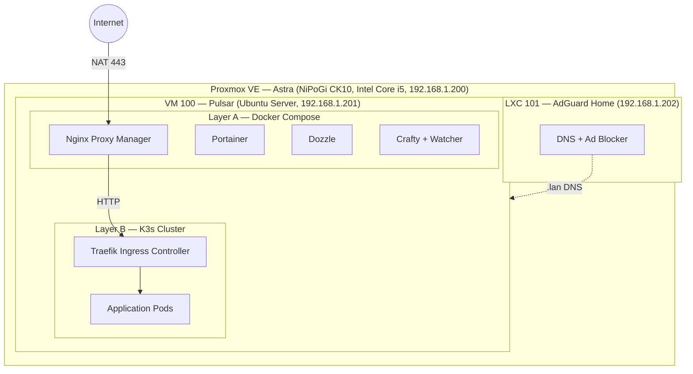
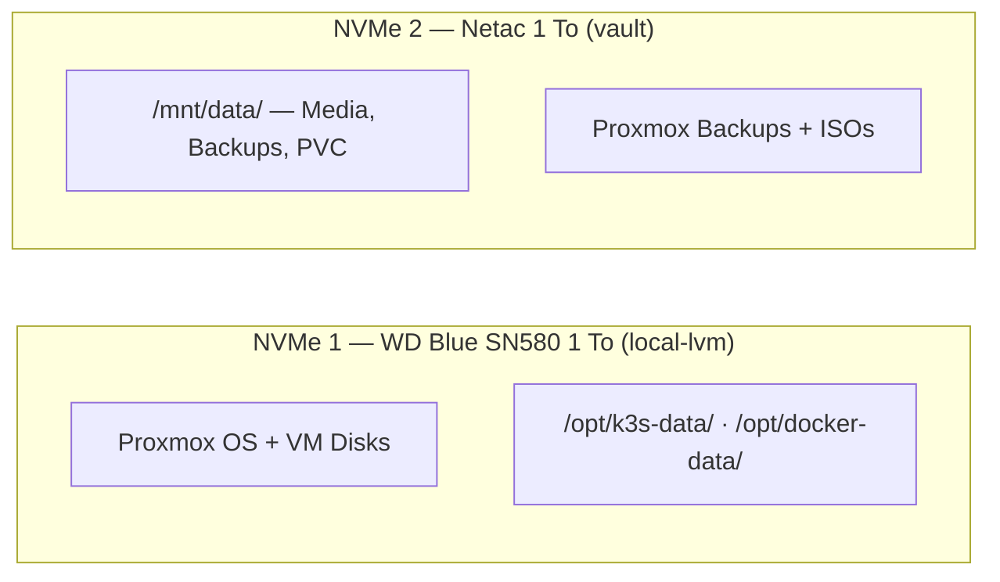

# 🚀 Astra-ops

GitOps monorepo for the **Astra homelab** — a personal infrastructure running on Proxmox,
orchestrated with K3s and Docker Compose, and continuously deployed via ArgoCD.

[](https://www.gnu.org/licenses/gpl-3.0)
[](https://argoproj.github.io/cd/)
[](https://k3s.io/)
[](https://helm.sh/)
[](https://www.proxmox.com/)

---

## Table of contents

- [Overview](#overview)
- [Architecture](#architecture)
- [Tech stack](#tech-stack)
- [Repository structure](#repository-structure)
- [Services catalog](#services-catalog)
- [Network and DNS](#network-and-dns)
- [Storage strategy](#storage-strategy)
- [Secrets management](#secrets-management)
- [GitOps workflow](#gitops-workflow)
- [Prerequisites](#prerequisites)
- [Getting started](#getting-started)
- [Remote access](#remote-access)
- [License](#license)

---

## Overview

Astra-ops is the single source of truth for every service running on the **Astra** homelab.
All Kubernetes manifests, Helm charts, Docker Compose stacks, and ArgoCD application
definitions live in this repository. Any change pushed to `main` is automatically picked
up by ArgoCD and synced to the cluster.

The infrastructure is split into two deployment layers:

- **Layer A — Docker Compose**: core infrastructure services managed by Portainer
  (Nginx Proxy Manager, Dozzle, Crafty).
- **Layer B — K3s (Kubernetes)**: all application workloads, packaged as Helm charts
  or raw manifests and deployed through ArgoCD.

---

## Architecture

### Physical and virtual layout



### Traffic flow

```text
Internet (https://app.enoal.fr)
  → Router (NAT 443 → 192.168.1.201)
    → Nginx Proxy Manager (SSL termination)
      → Traefik (K3s ingress routing)
        → Target Pod
```


### Storage layout



---

## Tech stack

| Layer                    | Technology                | Role                                      |
| ------------------------ | ------------------------- | ----------------------------------------- |
| Hypervisor               | Proxmox VE                | Virtualization platform                   |
| DNS                      | AdGuard Home (LXC)        | Local DNS + ad blocking                   |
| Container runtime        | K3s                       | Lightweight Kubernetes distribution       |
| Container runtime        | Docker Compose            | Infrastructure services                   |
| Reverse proxy (external) | Nginx Proxy Manager       | SSL termination, public routing           |
| Reverse proxy (internal) | Traefik                   | K3s ingress controller                    |
| GitOps                   | ArgoCD                    | Continuous deployment from Git            |
| Package manager          | Helm                      | Kubernetes application packaging          |
| Dependency updates       | Renovate                  | Automated image/chart version bumps       |
| Container management     | Portainer EE              | Docker + Compose stack management         |
| Log viewer               | Dozzle                    | Real-time Docker log streaming            |
| CI runners               | Actions Runner Controller | GitHub Actions self-hosted runners on K3s |

---

## Repository structure

```text
astra-ops/
├── apps/                    # ArgoCD Application manifests
│   ├── .disabled/           # Disabled apps (not picked up by ArgoCD)
│   └── *.yaml               # One file per active service
├── docker/                  # Docker Compose stacks (Layer A)
│   ├── crafty/              # Minecraft server + custom watcher proxy
│   ├── dozzle/              # Docker log viewer
│   ├── npm/                 # Nginx Proxy Manager
│   └── portainer/           # Container management UI
├── infra/
│   └── argocd/
│       ├── argocd-ingress.yaml   # ArgoCD Ingress
│       └── root-app.yaml         # App-of-Apps bootstrap (apply once)
├── k3s/                     # K3s workloads (Layer B)
│   └── <service>/
│       ├── Chart.yaml            # (Helm) Chart metadata
│       ├── values.yaml           # (Helm) Configurable values
│       ├── templates/            # (Helm) Kubernetes templates
│       ├── 00-namespace.yaml     # (Raw) Namespace
│       └── 20-deployment.yaml    # (Raw) Deployment
├── organization/            # Internal notes
├── renovate.json            # Renovate bot configuration
├── LICENSE
└── .gitignore               # Excludes secrets and credentials
```

> Services are progressively being migrated from raw manifests to Helm charts.
> Both formats coexist in `k3s/`.

---

## Services catalog

> [!NOTE]
> **Status** — ✅ Active: running · ⏸️ Disabled: in repo but not deployed · 💤 Offline: previously deployed, files kept as reference · 🔜 Planned: not yet in repo

| Service | Description | Category | Namespace | Type | Exposure | Status |
| --- | --- | --- | --- | --- | --- | --- |
| ArgoCD | GitOps continuous deployment | 🗄️ DevOps | `argocd` | Helm (official) | `argocd.lan` | ✅ Active |
| [azerbot](k3s/azerbot) | Custom Discord bot | 🤖 Bots | `bots` | Helm | `azerbot.lan` | ✅ Active |
| [azerdev-discord](k3s/azerdev-discord) | URL redirect to Azerdev Discord | 🔀 Redirects | `redirects` | Raw | `azerdev-discord.lan` | ⏸️ Disabled |
| [azerdev-status](k3s/azerdev-status) | URL redirect to Azerdev status | 🔀 Redirects | `redirects` | Raw | `azerdev-status.lan` | ⏸️ Disabled |
| [botenoal](k3s/botenoal) | Custom Discord bot | 🤖 Bots | `bots` | Helm | `botenoal.lan` | ✅ Active |
| [convertx](k3s/convertx) | Universal file converter | 🛠️ Utilities | `utilities` | Raw | `convertx.lan` | ⏸️ Disabled |
| [crafty](docker/crafty) | Minecraft server manager + watcher proxy | 🎮 Gaming | — | Docker Compose | `crafty.enoal.fr` | ✅ Active |
| criteri-fresque | Criteri'Fresque website | 🌐 Web | `web` | Helm | `criterifresque.enoal.fr` | 🔜 Planned |
| [cv](k3s/cv) | Personal CV/resume website (HPA enabled) | 🌐 Web | `web` | Helm | `cv.enoal.fr` | ✅ Active |
| [dashdot](k3s/dashdot) | Server hardware monitoring dashboard | 📊 Monitoring | `monitoring` | Helm | `dashdot.lan` | ✅ Active |
| [diun](k3s/diun) | Docker image update notifier | 📊 Monitoring | `monitoring` | Helm | — | ⏸️ Disabled |
| [docker-registry](k3s/docker-registry) | Private Docker image registry (htpasswd) | 🗄️ DevOps | `devops` | Raw | `registry.enoal.fr` | ✅ Active |
| [dozzle](docker/dozzle) | Real-time Docker log viewer | 🐳 Infrastructure | — | Docker Compose | `dozzle.lan` | ✅ Active |
| [filebrowser](k3s/filebrowser) | Web-based file manager | 🎬 Media | `media` | Helm | `filebrowser.lan`, `drive.enoal.fr` | ✅ Active |
| [filebrowser-quantum](k3s/filebrowser-quantum) | Web file manager (Quantum edition) | 🎬 Media | `media` | Helm | `filebrowser-quantum.lan` | ✅ Active |
| [github-runners](apps/arc-controller.yaml) | GitHub Actions self-hosted runners (ARC) | 🗄️ DevOps | `github-runners` | Helm (ARC) | — | ✅ Active |
| [homer](k3s/homer) | Application dashboard / start page | 📋 Dashboard | `dashboard` | Helm | `home.lan`, `homer.lan`, `home.enoal.fr`, `homer.enoal.fr` | ✅ Active |
| [immich](k3s/immich) | Photo management (Server + ML + Postgres + Redis) | 🎬 Media | `media` | Raw | `immich.lan`, `immich.enoal.fr`, `photos.enoal.fr` | ✅ Active |
| jellyfin | Media streaming server | 🎬 Media | `media` | Raw | `jellyfin.lan`, `jellyfin.enoal.fr` | 💤 Offline |
| [kiwix](k3s/kiwix) | Offline content server (Wikipedia, etc.) | 🎬 Media | `media` | Raw | `kiwix.lan` | ⏸️ Disabled |
| [myip](k3s/myip) | Public IP display tool | 🛠️ Utilities | `utilities` | Raw | `myip.lan` | 💤 Offline |
| [n8n](k3s/n8n) | Workflow automation platform | 🗄️ DevOps | `devops` | Raw | `n8n.enoal.fr` | ✅ Active |
| [npm](docker/npm) | Nginx Proxy Manager — reverse proxy + SSL | 🐳 Infrastructure | — | Docker Compose | `npm.lan`, 80/443/81 | ✅ Active |
| [ntfy](k3s/ntfy) | Self-hosted push notification server | 🔔 Notifications | `notifications` | Raw | `ntfy.enoal.fr` | ⏸️ Disabled |
| [portainer](docker/portainer) | Container management + Docker stack deployment | 🐳 Infrastructure | — | Docker Compose | `portainer.lan` | ✅ Active |
| [portfolio](k3s/portfolio) | Personal portfolio website | 🌐 Web | `web` | Helm | `enoal.fr`, `portfolio.lan` | ✅ Active |
| [scanopy](k3s/scanopy) | Network diagram tool (Server + Daemon + Postgres) | 🛠️ Utilities | `utilities` | Raw | `scanopy.lan` | ✅ Active |
| [sftpgo](k3s/sftpgo) | SFTP server for remote file access | 🎬 Media | `media` | Helm | `sftpgo.lan` (web), NodePort 30022 (SFTP) | ✅ Active |
| [uptimekuma](k3s/uptimekuma) | Uptime monitoring and status page | 📊 Monitoring | `monitoring` | Raw | `uptime.enoal.fr` | ⏸️ Disabled |
| [vaultwarden](k3s/vaultwarden) | Bitwarden-compatible password manager | 🔐 Security | `security` | Helm | `vault.enoal.fr` | ✅ Active |
| [webcheck](k3s/webcheck) | Website analysis and OSINT tool | 🛠️ Utilities | `utilities` | Helm | `webcheck.lan` | ✅ Active |
| [zerobyte](k3s/zerobyte) | Backup tool with rclone integration | 💾 Backups | `backups` | Raw | `zerobyte.enoal.fr`, `zerobyte.lan` | 💤 Offline |

---

## Network and DNS

### Domain strategy

| Domain       | Scope             | Resolution                                         |
| ------------ | ----------------- | -------------------------------------------------- |
| `*.enoal.fr` | Public services   | Public DNS (internet-accessible via NAT)           |
| `*.lan`      | Internal services | AdGuard Home local DNS (LXC 101 — `192.168.1.202`) |

AdGuard Home acts as the local DNS server, resolving `.lan` hostnames to the Pulsar VM
(`192.168.1.201`). Internal services are accessible on the LAN without internet exposure.

### Port allocation

| Port        | Protocol | Service                    |
| ----------- | -------- | -------------------------- |
| 80          | TCP      | NPM (HTTP entry)           |
| 443         | TCP      | NPM (HTTPS entry)          |
| 81          | TCP      | NPM Admin UI               |
| 8443        | TCP      | Crafty Admin UI            |
| 9444        | TCP      | Portainer                  |
| 25500–25599 | TCP      | Minecraft servers (Crafty) |
| 30022       | TCP      | SFTPGo SFTP (K3s NodePort) |

---

## Storage strategy

Both drives are NVMe, with distinct roles:

| Disk                            | Path on Pulsar                        | Usage                                 |
| ------------------------------- | ------------------------------------- | ------------------------------------- |
| **NVMe 1** — WD Blue SN580 1 To | `/opt/k3s-data/`, `/opt/docker-data/` | Hot data: databases, app state        |
| **NVMe 2** — Netac 1 To         | `/mnt/data/`                          | Cold data: media, backups, large PVCs |

### Path conventions

| Path                                  | Content                                     |
| ------------------------------------- | ------------------------------------------- |
| `/opt/k3s-data/<service>/`            | Persistent data for K3s services            |
| `/opt/docker-data/<service>/`         | Persistent data for Docker Compose services |
| `/mnt/data/media/`                    | Media library (films, music, etc.)          |
| `/mnt/data/backups/`                  | Backup archives                             |
| `/mnt/data/k3s-pvc/<service>/`        | Large or cold PVC data for K3s services     |
| `/mnt/data/docker-volumes/<service>/` | Large volume data for Docker services       |

---

## Secrets management

Secrets are **never** committed to this repository. The `.gitignore` excludes:

```text
.env
*-secret.yaml
*-secrets.yaml
*-regcred.yaml
regcred.yaml
secrets.yaml
```

### Registry credentials

Services using GHCR images need a `regcred` pull secret. Each such service includes a
`generate-regcred.sh` script:

```bash
cd k3s/<service>
./generate-regcred.sh   # prompts for GitHub username + PAT
kubectl apply -f regcred.yaml
```

### Application secrets

Secrets are injected via:

- `envFrom.secretRef` — all keys as environment variables
- `env.valueFrom.secretKeyRef` — individual keys

Each service that needs secrets includes a `secrets.example.yaml` template.
Copy it to `secrets.yaml`, fill in values, and apply:

```bash
cp k3s/<service>/secrets.example.yaml k3s/<service>/secrets.yaml
# edit secrets.yaml
kubectl apply -f k3s/<service>/secrets.yaml
```

---

## GitOps workflow

### ArgoCD

ArgoCD watches this repository and automatically syncs changes to the K3s cluster.

This repository uses the **App-of-Apps** pattern: a single root application defined in
`infra/argocd/root-app.yaml` points to `apps/` and manages all other applications.

- **Sync policy**: automated with `prune: true` and `selfHeal: true`
- **Namespace creation**: via `CreateNamespace=true`
- **Disabled apps**: placed in `apps/.disabled/` — present in the repo but not synced

### Renovate

[Renovate](https://renovatebot.com) monitors this repository for dependency updates:

- Docker image versions in `docker-compose.yml` files
- Helm chart `values.yaml` image tags
- Kubernetes manifest image references
- Private GHCR images (`ghcr.io/enoal-fauchille-bolle/*`) via `GHCR_PAT` secret

### Helm migration

Services remaining to migrate from raw manifests to Helm: `immich`, `n8n`, `scanopy`,
`zerobyte`. Migrated services use this structure:

```text
k3s/<service>/
├── Chart.yaml
├── values.yaml
├── generate-regcred.sh    # (if GHCR access needed)
└── templates/
    ├── _helpers.tpl
    ├── deployment.yaml
    ├── service.yaml
    ├── ingress.yaml
    └── ...
```

### Commit convention

This project uses the **Gitmoji** convention:

```text
<gitmoji> [<scope>] <subject>
```

- Imperative mood, under 100 characters, no body
- Scope from directory or module (e.g., `[SFTPGo]`, `[Homer]`, `[Docker/NPM]`)

Examples:

- `✨ [Vaultwarden] Migrate to Helm chart`
- `🐛 [n8n] Fix volume mount path`
- `🔧 [ArgoCD] Update ingress hosts`

---

## Prerequisites

### Hardware

- A server or mini PC (e.g., NiPoGi CK10)
- 2 NVMe drives recommended (system + cold storage)

### Software — server

- [Proxmox VE](https://www.proxmox.com/) — hypervisor
- Linux VM with [K3s](https://k3s.io/), [Docker](https://docs.docker.com/engine/install/), [Helm](https://helm.sh/docs/intro/install/)
- LXC container with [AdGuard Home](https://adguard.com/adguard-home.html)

### Software — workstation

- [kubectl](https://kubernetes.io/docs/tasks/tools/) — Kubernetes CLI
- [Helm](https://helm.sh/docs/intro/install/) — chart management
- [k9s](https://k9scli.io/) — terminal-based K8s UI (recommended)
- [lazydocker](https://github.com/jesseduffield/lazydocker) — Docker terminal UI (optional)

### Networking

- A domain name with DNS records pointing to your public IP
- Port forwarding on your router (80, 443 → server IP)
- Static IPs for server, VM, and LXC

---

## Getting started

### 1. Clone the repository

```bash
git clone https://github.com/Enoal-Fauchille-Bolle/Astra-ops.git /opt/ops
cd /opt/ops
```

### 2. Start Docker infrastructure (Layer A)

Portainer manages all Docker Compose stacks. Start it first, then deploy the others
from its web UI at `http://<server-ip>:9444`:

```bash
cd docker/portainer && docker compose up -d
# Then deploy via Portainer: npm, crowdsec, dozzle
# (crafty is deployed manually for now)
```

Or deploy manually:

```bash
cd docker/npm && docker compose up -d
cd ../crowdsec && docker compose up -d
cd ../dozzle && docker compose up -d
```

### 3. Install ArgoCD

```bash
kubectl create namespace argocd
kubectl apply -n argocd \
  -f https://raw.githubusercontent.com/argoproj/argo-cd/stable/manifests/install.yaml
kubectl apply -f infra/argocd/argocd-ingress.yaml
```

### 4. Bootstrap all K3s services

Apply the root App-of-Apps once — ArgoCD then deploys and manages everything in `apps/`:

```bash
kubectl apply -f infra/argocd/root-app.yaml
```

### 5. Create secrets

```bash
# GHCR registry credentials
cd k3s/<service>
./generate-regcred.sh
kubectl apply -f regcred.yaml

# Application secrets
cp k3s/<service>/secrets.example.yaml k3s/<service>/secrets.yaml
# Edit secrets.yaml, then:
kubectl apply -f k3s/<service>/secrets.yaml
```

### 6. Configure Nginx Proxy Manager

Access NPM at `http://<server-ip>:81` and configure:

- Let's Encrypt SSL certificates
- Proxy hosts for each public service pointing to `192.168.1.201` (Traefik)

---

## Remote access

### kubectl from your workstation

```bash
scp <user>@192.168.1.201:/etc/rancher/k3s/k3s.yaml ~/.kube/config
# Replace 127.0.0.1 with the server IP:
sed -i 's/127.0.0.1/192.168.1.201/' ~/.kube/config
# Rename context for clarity:
kubectl config rename-context default pulsar
```

### Recommended tools

- **k9s** — powerful terminal UI for Kubernetes (`k9s -c pod`)
- **lazydocker** — terminal UI for Docker containers and images

---

## License

This project is licensed under the [GNU General Public License v3.0](LICENSE).
