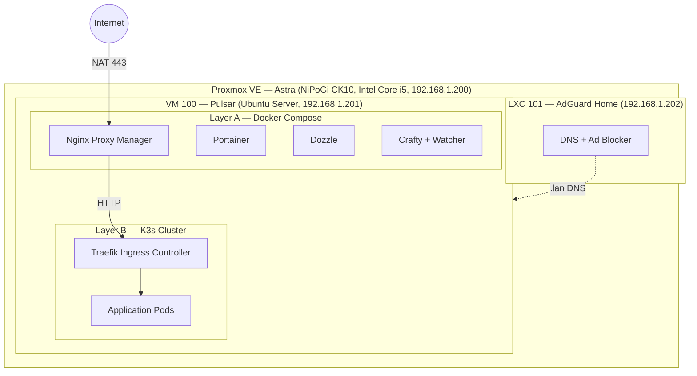
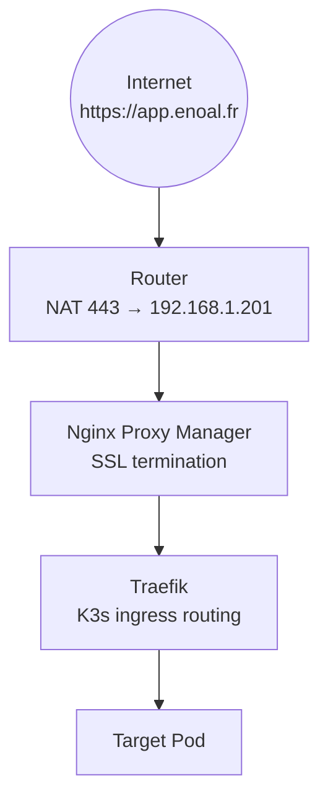

# 🚀 Astra-ops

GitOps monorepo for my homelab called **Astra** — a personal infrastructure running on Proxmox,
orchestrated with K3s and Docker Compose, and continuously deployed via ArgoCD.

[](https://www.gnu.org/licenses/gpl-3.0)
[](https://argoproj.github.io/cd/)
[](https://k3s.io/)
[](https://helm.sh/)
[](https://www.proxmox.com/)

---

## Table of contents

- [Overview](#overview)
- [About](#about)
- [Architecture](#architecture)
- [Tech stack](#tech-stack)
- [Repository structure](#repository-structure)
- [Services catalog](#services-catalog)
- [Documentation](#documentation)
- [License](#license)

---

## Overview

Astra-ops is the single source of truth for every service running on the **Astra** homelab.
All Kubernetes manifests, Helm charts, Docker Compose stacks, and ArgoCD application
definitions live in this repository. Any change pushed to `main` is automatically picked
up by ArgoCD and synced to the cluster.

The infrastructure is split into two deployment layers:

- **Layer A — Docker Compose**: infrastructure and a few apps, deployed by Portainer from
  Git (Nginx Proxy Manager, Crafty, Zerobyte, CrowdSec, Beszel…).
- **Layer B — K3s (Kubernetes)**: most application workloads, packaged as Helm charts or
  raw manifests and deployed through ArgoCD — except Immich and n8n, applied by hand.

---

## About

Astra is not the most practical homelab architecture. A single reverse proxy handling both SSL termination and internal routing would be simpler. Running everything on bare metal would eliminate the VM overhead entirely. An opinionated all-in-one solution would take an afternoon to set up.

But simplicity was not the goal — learning was.

Every piece of this stack was chosen because it forced me to understand something real:

- **Kubernetes (K3s)** — container orchestration, namespaces, Helm packaging, HPA/VPA autoscaling, and the GitOps feedback loop with ArgoCD.
- **Networking** — split-horizon DNS with AdGuard Home, NAT and port forwarding, SSL termination, and the Traefik ingress controller.
- **SysAdmin / Linux** — Proxmox VE, VM and LXC provisioning, NVMe storage layout, and keeping a production-like system running continuously on a mini PC.
- **DevOps** — GitOps with ArgoCD, Renovate for automated dependency updates, and self-hosted GitHub Actions runners on K3s with ARC.
- **Email infrastructure** — SPF, DKIM, DMARC, routing inbound mail through Cloudflare Email Routing and outbound through an SMTP relay, without ever touching a mail server.
- **Backup strategy** — designing a 3-2-1 architecture with Proxmox Backup Server for local block-level snapshots and Zerobyte + Rclone + Backblaze B2 and MEGA for offsite cloud backups, including data classification tiers and RTO/RPO planning.
- **Secrets management** — External Secrets Operator (ESO) syncing secrets from Infisical into Kubernetes, keeping credentials entirely out of Git.

> [!NOTE]
> The most visible architectural compromise is the double reverse proxy: Nginx Proxy Manager handles SSL termination and public routing, then passes plain HTTP to Traefik inside the cluster. The cleaner approach would be Traefik directly exposed with cert-manager — but NPM was already familiar and added a useful management UI.

---

## Architecture

### Physical and virtual layout


```mermaid
graph TB
    subgraph PROXMOX["Proxmox VE — Astra (NiPoGi CK10, Intel Core i5, 192.168.1.200)"]
        subgraph LXC101["LXC 101 — AdGuard Home (192.168.1.202)"]
            AGH[DNS + Ad Blocker]
        end
        subgraph VM100["VM 100 — Pulsar (Ubuntu Server, 192.168.1.201)"]
            subgraph DOCKER["Layer A — Docker Compose"]
                NPM[Nginx Proxy Manager]
                PORTAINER[Portainer]
                DOZZLE[Dozzle]
                CRAFTY[Crafty + Watcher]
            end
            subgraph K3S["Layer B — K3s Cluster"]
                TRAEFIK[Traefik Ingress Controller]
                PODS[Application Pods]
            end
        end
    end

    INTERNET((Internet)) -->|NAT 443| NPM
    NPM -->|HTTP| TRAEFIK
    TRAEFIK --> PODS
    AGH -.->|".lan" DNS| VM100
```

### Traffic flow


```mermaid
flowchart TD
    INET((Internet\nhttps://app.enoal.fr))
    ROUTER[Router\nNAT 443 → 192.168.1.201]
    NPM[Nginx Proxy Manager\nSSL termination]
    TRAEFIK[Traefik\nK3s ingress routing]
    POD[Target Pod]

    INET --> ROUTER --> NPM --> TRAEFIK --> POD
```

---

## Tech stack

| Layer                    | Technology                | Role                                      |
| ------------------------ | ------------------------- | ----------------------------------------- |
| Hypervisor               | Proxmox VE                | Virtualization platform                   |
| DNS                      | AdGuard Home (LXC)        | Local DNS + ad blocking                   |
| Container runtime        | K3s                       | Lightweight Kubernetes distribution       |
| Container runtime        | Docker Compose            | Infrastructure services                   |
| Reverse proxy (external) | Nginx Proxy Manager       | SSL termination, public routing           |
| Reverse proxy (internal) | Traefik                   | K3s ingress controller                    |
| GitOps                   | ArgoCD                    | Continuous deployment from Git            |
| Package manager          | Helm                      | Kubernetes application packaging          |
| Dependency updates       | Renovate                  | Automated image/chart version bumps       |
| Secrets management       | External Secrets Operator | Sync secrets from Infisical into K8s      |
| Secrets backend          | Infisical (self-hosted)   | Centralized secrets store                 |
| Resource autoscaling     | VPA (cowboysysop)         | Resource usage recommendations (Off mode) |
| Container management     | Portainer EE              | Docker + Compose stack management         |
| Log viewer               | Dozzle                    | Real-time Docker log streaming            |
| CI runners               | Actions Runner Controller | GitHub Actions self-hosted runners on K3s |
| Email inbound            | Cloudflare Email Routing  | Catch-all forwarding to Gmail             |
| Email outbound           | Resend (SMTP relay)       | Authenticated sending for `@enoal.fr`     |

---

## Repository structure

```text
astra-ops/
├── apps/                    # ArgoCD Application manifests (App-of-Apps)
│   ├── .disabled/           # Disabled apps (not picked up by ArgoCD)
│   └── *.yaml               # One file per synced app
├── docker/<stack>/          # Docker Compose stacks (Layer A), deployed by Portainer from Git
├── k3s/<service>/           # K3s workloads (Layer B)
│   ├── Chart.yaml           # (Helm) Chart metadata
│   ├── values.yaml          # (Helm) Configurable values
│   ├── templates/           # (Helm) Kubernetes templates
│   └── NN-*.yaml            # (Raw) Numbered manifests, applied in order
├── infra/
│   ├── argocd/              # ArgoCD ingress + root App-of-Apps (apply once)
│   ├── astra/               # Host files for the Proxmox node (installed by hand)
│   ├── pulsar/              # Host files for the Pulsar VM: nightly database dumps
│   ├── eso/                 # ClusterSecretStore + bootstrap secret templates
│   └── vpa/                 # VPA objects (one per deployment, Off mode)
├── docs/                    # Documentation (see Documentation below)
├── .githooks/               # pre-commit and commit-msg hooks (see CONTRIBUTING.md)
├── .github/workflows/       # Discord notifier for Renovate pull requests
├── renovate.json            # Renovate bot configuration
├── CONTRIBUTING.md
├── LICENSE
└── .gitignore               # Excludes secrets and credentials
```

> Services are progressively being migrated from raw manifests to Helm charts.
> Both formats coexist in `k3s/`.

---

## Services catalog

> [!NOTE]
> **Status** — ✅ Active: running · ⏸️ Disabled: in repo but not deployed · 🔜 Planned: not yet in repo
>
> **Type** — Helm and Raw apps are deployed by ArgoCD from `apps/`, except _Raw (by hand)_:
> applied with `kubectl apply`. Docker Compose stacks are deployed by Portainer from Git.
>
> **Access** — 🌍 Public: internet-accessible · 🔒 LAN only: LAN-restricted

| Service                                        | Description                                       | Category          | Namespace          | Type            | Exposure                                                   | Access      | Status      |
| ---------------------------------------------- | ------------------------------------------------- | ----------------- | ------------------ | --------------- | ---------------------------------------------------------- | ----------- | ----------- |
| ArgoCD                                         | GitOps continuous deployment                      | 🗄️ DevOps         | `argocd`           | Helm (official) | `argocd.lan`                                               | 🔒 LAN only | ✅ Active   |
| External Secrets Operator                      | Syncs Infisical secrets into Kubernetes           | 🔐 Security       | `external-secrets` | Helm (official) | —                                                          | —           | ✅ Active   |
| [azerbot](k3s/azerbot)                         | Custom Discord bot                                | 🤖 Bots           | `bots`             | Helm            | `azerbot.lan`                                              | 🔒 LAN only | ✅ Active   |
| [azerdev-discord](k3s/azerdev-discord)         | URL redirect to Azerdev Discord                   | 🔀 Redirects      | `redirects`        | Helm            | `azerdev-discord.lan`                                      | 🔒 LAN only | ⏸️ Disabled |
| [azerdev-status](k3s/azerdev-status)           | URL redirect to Azerdev status                    | 🔀 Redirects      | `redirects`        | Helm            | `azerdev-status.lan`                                       | 🔒 LAN only | ⏸️ Disabled |
| [beszel](docker/beszel)                        | Server monitoring with docker stats               | 📊 Monitoring     | —                  | Docker Compose  | `beszel.lan`                                               | 🔒 LAN only | ✅ Active   |
| [botenoal](k3s/botenoal)                       | Custom Discord bot                                | 🤖 Bots           | `bots`             | Helm            | `botenoal.lan`                                             | 🔒 LAN only | ✅ Active   |
| [convertx](k3s/convertx)                       | Universal file converter                          | 🛠️ Utilities      | `utilities`        | Helm            | `convertx.lan`                                             | 🔒 LAN only | ⏸️ Disabled |
| [couchdb](k3s/couchdb)                         | Sync server for Obsidian Self-hosted LiveSync     | 📝 Productivity   | `productivity`     | Helm            | `couchdb.enoal.fr`                                         | 🌍 Public   | ✅ Active   |
| [crafty](docker/crafty)                        | Minecraft server manager + watcher proxy          | 🎮 Gaming         | —                  | Docker Compose  | `crafty.enoal.fr`                                          | 🌍 Public   | ✅ Active   |
| [criterifresque](k3s/criteri-fresque)          | Criteri'Fresque website                           | 🌐 Web            | `web`              | Helm            | `beta.criterifresque.lesfresques.info`                     | 🌍 Public   | ✅ Active   |
| [crowdsec](docker/crowdsec)                    | Intrusion detection for Nginx Proxy Manager       | 🐳 Infrastructure | —                  | Docker Compose  | —                                                          | —           | ✅ Active   |
| [cv](k3s/cv)                                   | Personal CV/resume website (HPA enabled)          | 🌐 Web            | `web`              | Helm            | `cv.enoal.fr`                                              | 🌍 Public   | ✅ Active   |
| [dashdot](k3s/dashdot)                         | Server hardware monitoring dashboard              | 📊 Monitoring     | `monitoring`       | Helm            | `dashdot.lan`                                              | 🔒 LAN only | ✅ Active   |
| [docker-registry](k3s/docker-registry)         | Private Docker image registry (htpasswd)          | 🗄️ DevOps         | `devops`           | Helm            | `registry.enoal.fr`                                        | 🌍 Public   | ✅ Active   |
| [docker-registry-ui](k3s/docker-registry-ui)   | Web UI for private Docker registry                | 🗄️ DevOps         | `devops`           | Helm            | `registry-ui.enoal.fr`                                     | 🌍 Public   | ✅ Active   |
| [dozzle](docker/dozzle)                        | Real-time Docker log viewer                       | 🐳 Infrastructure | —                  | Docker Compose  | `dozzle.lan`                                               | 🔒 LAN only | ✅ Active   |
| [filebrowser-quantum](k3s/filebrowser-quantum) | Web file manager (Quantum edition)                | 🎬 Media          | `media`            | Helm            | `filebrowser-quantum.lan`, `drive.enoal.fr`                | 🌍 Public   | ✅ Active   |
| [github-runners](apps/arc-controller.yaml)     | GitHub Actions self-hosted runners (ARC)          | 🗄️ DevOps         | `github-runners`   | Helm (ARC)      | —                                                          | —           | ✅ Active   |
| [homarr](docker/homarr)                        | Application dashboard / start page                | 📋 Dashboard      | —                  | Docker Compose  | `homarr.lan`                                               | 🔒 LAN only | ✅ Active   |
| [homer](k3s/homer)                             | Application dashboard / start page                | 📋 Dashboard      | `dashboard`        | Helm            | `home.lan`, `homer.lan`, `home.enoal.fr`, `homer.enoal.fr` | 🌍 Public   | ✅ Active   |
| [immich](k3s/immich)                           | Photo management (Server + ML + Postgres + Redis) | 🎬 Media          | `media`            | Raw (by hand)   | `immich.lan`, `immich.enoal.fr`, `photos.enoal.fr`         | 🌍 Public   | ✅ Active   |
| [infisical](k3s/infisical)                     | Secrets backend for ESO                           | 🔐 Security       | `security`         | Helm            | `infisical.lan`                                            | 🔒 LAN only | ✅ Active   |
| [isponsorblocktv](docker/isponsorblocktv)      | SponsorBlock TV — YouTube ad skipping             | 🎬 Media          | —                  | Docker Compose  | —                                                          | —           | ✅ Active   |
| [kiwix](k3s/kiwix)                             | Offline content server (Wikipedia, etc.)          | 🎬 Media          | `media`            | Helm            | `kiwix.lan`                                                | 🔒 LAN only | ⏸️ Disabled |
| [loandash](docker/loandash)                    | Personal finances management tool                 | 🛠️ Utilities      | —                  | Docker Compose  | `loandash.lan`                                             | 🔒 LAN only | ✅ Active   |
| [n8n](k3s/n8n)                                 | Workflow automation platform                      | 🗄️ DevOps         | `devops`           | Raw (by hand)   | `n8n.enoal.fr` (NPM: LAN clients only)                     | 🔒 LAN only | ✅ Active   |
| [npm](docker/npm)                              | Nginx Proxy Manager — reverse proxy + SSL         | 🐳 Infrastructure | —                  | Docker Compose  | `npm.lan`, 80/443/81                                       | 🔒 LAN only | ✅ Active   |
| [ntfy](k3s/ntfy)                               | Self-hosted push notification server              | 🔔 Notifications  | `notifications`    | Helm            | `ntfy.enoal.fr`                                            | 🌍 Public   | ⏸️ Disabled |
| [portainer](docker/portainer)                  | Container management + Docker stack deployment    | 🐳 Infrastructure | —                  | Docker Compose  | `portainer.lan`                                            | 🔒 LAN only | ✅ Active   |
| [portfolio](k3s/portfolio)                     | Personal portfolio website                        | 🌐 Web            | `web`              | Helm            | `enoal.fr`, `portfolio.lan`                                | 🌍 Public   | ✅ Active   |
| [portracker](docker/portracker)                | Port tracking dashboard                           | 🐳 Infrastructure | —                  | Docker Compose  | `portracker.lan`                                           | 🔒 LAN only | ✅ Active   |
| [roots-smp-web](k3s/roots-smp-web)             | Roots SMP Minecraft server website                | 🌐 Web            | `web`              | Helm            | `rootssmp.enoal.fr`                                        | 🌍 Public   | ✅ Active   |
| [scanopy](k3s/scanopy)                         | Network diagram tool (Server + Daemon + Postgres) | 🐳 Infrastructure | `utilities`        | Raw (by hand)   | `scanopy.lan`                                              | 🔒 LAN only | ⏸️ Disabled |
| [sftpgo](k3s/sftpgo)                           | SFTP server for remote file access                | 🎬 Media          | `media`            | Helm            | `sftpgo.lan` (web), NodePort 30022 (SFTP)                  | 🔒 LAN only | ✅ Active   |
| [speedtest-tracker](docker/speedtest-tracker)  | Speedtest results tracking                        | 📊 Monitoring     | —                  | Docker Compose  | `speedtest-tracker.lan`                                    | 🔒 LAN only | ✅ Active   |
| [umami](k3s/umami)                             | Privacy-focused web analytics (App + Postgres)    | 📈 Analytics      | `analytics`        | Helm            | `analytics.lan` + tracker on `enoal.fr/s.js`               | 🔒 LAN only | ✅ Active   |
| [uptimekuma](k3s/uptimekuma)                   | Uptime monitoring and status page                 | 📊 Monitoring     | `monitoring`       | Helm            | `uptime.enoal.fr`                                          | 🌍 Public   | ✅ Active   |
| [VPA](infra/vpa)                               | Vertical Pod Autoscaler (recommendations only)    | 📊 Monitoring     | `kube-system`      | Helm (official) | —                                                          | —           | ✅ Active   |
| [vaultwarden](k3s/vaultwarden)                 | Bitwarden-compatible password manager             | 🔐 Security       | `security`         | Helm            | `vault.enoal.fr`                                           | 🌍 Public   | ✅ Active   |
| [wallos](docker/wallos)                        | Personal subscription tracker                     | 🛠️ Utilities      | —                  | Docker Compose  | `wallos.lan`                                               | 🔒 LAN only | ✅ Active   |
| [webcheck](k3s/webcheck)                       | Website analysis and OSINT tool                   | 🛠️ Utilities      | `utilities`        | Helm            | `webcheck.lan`                                             | 🔒 LAN only | ✅ Active   |
| [zerobyte](docker/zerobyte)                    | Backup tool with Restic + Rclone integration      | 💾 Backups        | —                  | Docker Compose  | `zerobyte.lan`                                             | 🔒 LAN only | ✅ Active   |

---

## Documentation

| Document                                                  | What it covers                                                                    |
| --------------------------------------------------------- | --------------------------------------------------------------------------------- |
| [Infrastructure](docs/infrastructure.md)                  | Domains, DNS, ports, disks and path conventions                                   |
| [Deployment](docs/deployment.md)                          | ArgoCD, Renovate, Helm, VPA, prerequisites, bootstrap from scratch, remote access |
| [Secrets](docs/secrets.md)                                | External Secrets Operator + Infisical, registry credentials, gitignore patterns   |
| [Email](docs/email.md)                                    | Aliases, Cloudflare Email Routing, Resend, SMTP for homelab services              |
| [Monitoring](docs/monitoring.md)                          | What watches what, and where the alerts go                                        |
| [Backups](docs/backup/README.md)                          | Backup strategy, data inventory, PBS and Zerobyte layers                          |
| [Database dumps](docs/backup/database-dumps.md)           | Nightly consistent dumps of every database                                        |
| [Proxmox config copy](docs/backup/proxmox-config-copy.md) | Nightly copy of the Proxmox and PBS configuration, and how to restore it          |
| [Restore runbooks](docs/backup/restore.md)                | Restore scenarios and restore testing                                             |
| [To do](docs/todo.md)                                     | Open work: backups, storage, security hardening                                   |
| [Decisions](docs/decisions.md)                            | Finished work and the reasons behind it                                           |
| [Contributing](CONTRIBUTING.md)                           | Git hooks and commit convention                                                   |

Some apps keep their own notes next to their files: [Crafty](docker/crafty/README.md)
and its [watcher](docker/crafty/watcher/README.md), [CrowdSec](docker/crowdsec/README.md),
[NPM](docker/npm/README.md), [CouchDB](k3s/couchdb/README.md),
[Filebrowser Quantum](k3s/filebrowser-quantum/README.md).

---

## License

This project is licensed under the [GNU General Public License v3.0](LICENSE).
