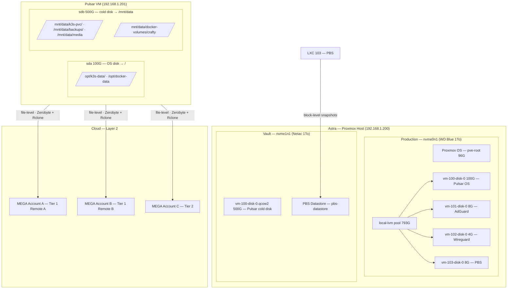

# Backup Architecture — Astra Homelab

> **Status:** Layer 1 operational. Layer 2 deployment in progress.
> **Last updated:** May 2026
> **Language:** English (technical reference)

---

## Table of Contents

1. [Overview](#1-overview)
2. [Physical Infrastructure](#2-physical-infrastructure)
   - 2.1 [Astra — Proxmox Host](#21-astra--proxmox-host)
   - 2.2 [Pulsar — Main VM](#22-pulsar--main-vm)
   - 2.3 [Accepted Constraints](#23-accepted-constraints)
3. [Data Classification Model — 3 Tiers](#3-data-classification-model--3-tiers)
   - 3.1 [Tier Definitions](#31-tier-definitions)
   - 3.2 [Complete Data Inventory](#32-complete-data-inventory)
4. [Layer 1 — Proxmox Backup Server (PBS)](#4-layer-1--proxmox-backup-server-pbs)
   - 4.1 [Mechanism](#41-mechanism)
   - 4.2 [Scope](#42-scope)
   - 4.3 [Retention Policy](#43-retention-policy)
   - 4.4 [Automated Schedule](#44-automated-schedule)
   - 4.5 [RTO / RPO](#45-rto--rpo)
5. [Layer 2 — Zerobyte + Rclone (Cloud)](#5-layer-2--zerobyte--rclone-cloud)
   - 5.1 [Mechanism](#51-mechanism)
   - 5.2 [Cloud Storage Strategy](#52-cloud-storage-strategy)
   - 5.3 [Rclone Remotes](#53-rclone-remotes)
   - 5.4 [Backup Jobs](#54-backup-jobs)
   - 5.5 [RTO / RPO](#55-rto--rpo)
6. [Database Dump Strategy](#6-database-dump-strategy)
7. [Secrets Management](#7-secrets-management)
8. [Storage Layout](#8-storage-layout)
   - 8.1 [Current Layout](#81-current-layout)
9. [Restoration Runbooks](#9-restoration-runbooks)
   - 9.1 [Scenario A — Logical Corruption (service-level)](#91-scenario-a--logical-corruption-service-level)
   - 9.2 [Scenario B — Netac NVMe Failure](#92-scenario-b--netac-nvme-failure)
   - 9.3 [Scenario C — Total Loss of Astra](#93-scenario-c--total-loss-of-astra)
10. [Monitoring & Alerts](#10-monitoring--alerts)
11. [Restore Testing](#11-restore-testing)
12. [Pending Tasks & Future Work](#12-pending-tasks--future-work)

---

## 1. Overview

The Astra homelab backup system follows a **3-2-1 strategy** (3 copies, 2 different media types, 1 offsite) implemented across two complementary layers.

| Rule          | Implementation                                                |
| ------------- | ------------------------------------------------------------- |
| **3 copies**  | Production + Layer 1 (PBS, local NVMe) + Layer 2 (MEGA cloud) |
| **2 media**   | NVMe storage + cloud object storage (MEGA)                    |
| **1 offsite** | MEGA cloud remotes (off-premises)                             |

### Architecture Diagram



### Layer Responsibilities

| Layer       | Tool                                         | Level | Purpose                                                           |
| ----------- | -------------------------------------------- | ----- | ----------------------------------------------------------------- |
| **Layer 1** | Proxmox Backup Server (LXC 103)              | Block | Fast local restore from logical corruption or accidental deletion |
| **Layer 2** | Zerobyte + Rclone (Docker Compose on Pulsar) | File  | Offsite disaster recovery — survives total hardware loss          |

---

## 2. Physical Infrastructure

### 2.1 Astra — Proxmox Host

| Disk              | Device    | Mount                    | Role                                           |
| ----------------- | --------- | ------------------------ | ---------------------------------------------- |
| WD Blue SN580 1To | `nvme0n1` | `pve-root` + `local-lvm` | Proxmox OS + VM/LXC virtual disks (production) |
| Netac 1To         | `nvme1n1` | `/mnt/pve/vault`         | Pulsar cold disk (qcow2) + PBS datastore       |

```txt
nvme0n1 (931G)
├── pve-swap        8G
├── pve-root       96G   → Proxmox OS (/etc/pve, /etc/proxmox-backup)
└── pve-data      793G   → local-lvm pool
    ├── vm-100-disk-0   100G  → Pulsar OS disk (= sda in Pulsar)
    ├── vm-101-disk-0     8G  → AdGuard
    ├── vm-102-disk-0     4G  → Wireguard
    └── vm-103-disk-0     8G  → PBS

nvme1n1 (938G — "vault")
├── vm-100-disk-0.qcow2  501G  → Pulsar cold disk (= sdb in Pulsar)
├── vm-100-state-*.raw    16G  → Pulsar RAM snapshot (manual, not for backup)
├── template/              3G  → ISOs
└── pbs-datastore/         ?   → PBS backup chunks
```

### 2.2 Pulsar — Main VM

Pulsar (VM 100) sees two virtual disks:

| Disk                                       | Device | Mount       | Size | Role                                   |
| ------------------------------------------ | ------ | ----------- | ---- | -------------------------------------- |
| OS disk (`vm-100-disk-0` on `local-lvm`)   | `sda`  | `/`         | 200G | OS, hot app data, K3s/Docker state     |
| Cold disk (`vm-100-disk-0.qcow2` on vault) | `sdb`  | `/mnt/data` | 500G | Cold data: media, PVCs, Crafty volumes |

```txt
sda (200G) → /
├── /opt/k3s-data/      Hot persistent data for K3s services
├── /opt/docker-data/   Hot persistent data for Docker services
└── /opt/ops/           GitOps repo (astra-ops — also on GitHub)

sdb (500G) → /mnt/data
├── /mnt/data/k3s-pvc/          Cold PVC data for K3s services
├── /mnt/data/docker-volumes/   Cold volume data for Docker services
├── /mnt/data/backups/          Personal backups (manually uploaded via Filebrowser)
└── /mnt/data/media/            Media library (movies, photos, documents)
```

> **Disk usage (as of June 2026):**
> `sda`: 119G used / 195G (64%)
> `sdb`: 206G used / 492G (57%)

### 2.3 Accepted Constraints

The Netac NVMe (`nvme1n1`) hosts both the Pulsar cold disk and the PBS datastore. This means Layer 1 backups and the associated production data reside on the same physical device. A single Netac failure would result in simultaneous loss of Pulsar's cold data AND its Layer 1 backups.

This is a known, accepted constraint given the single-server hardware budget. Layer 2 (cloud) is the mitigation.

The original USB external drive (`sda` on Astra) was removed from the architecture due to I/O instability caused by the JMicron USB controller locking the drive read-only under backup load.

---

## 3. Data Classification Model — 3 Tiers

### 3.1 Tier Definitions

**Tier 1 — Active System (Layer 1 only)**
Live databases and application runtime state. Backed up exclusively by PBS block-level snapshots. Rclone/Zerobyte does not touch these directly because live databases cannot be safely copied at the file level without risking corruption. They are covered by the DB dump strategy (see §6) which promotes dump outputs to Tier 2 for cloud upload.

**Tier 2 — Critical Vault (Layer 1 + Layer 2)**
Static personal files, cold PVC data, pre-generated database dumps, and other irreplaceable data that is safe to copy at the file level. This is the only data sent to cloud storage.

**Tier 3 — Disposable (No cloud backup)**
Bulk data that is either reconstructible (Minecraft servers, Kiwix ZIM archives) or acceptable to lose and re-download (movies). Protected only by PBS snapshots of the Pulsar VM (which includes the `/mnt/data` mount).

### 3.2 Complete Data Inventory

| Service / Path          | Current Location                           | Target Location                                | Size            | Tier | Layer 2        | DB Dump Needed                                               |
| ----------------------- | ------------------------------------------ | ---------------------------------------------- | --------------- | ---- | -------------- | ------------------------------------------------------------ |
| **Vaultwarden**         | `/opt/k3s-data/vaultwarden/`               | unchanged                                      | 6.7M            | 1    | dump only      | SQLite                                                       |
| **Immich DB**           | `/opt/k3s-data/immich/`                    | unchanged                                      | 1.1G            | 1    | dump only      | PostgreSQL + Redis                                           |
| **n8n**                 | `/opt/k3s-data/n8n/`                       | unchanged                                      | 41M             | 1    | dump only      | SQLite                                                       |
| **Scanopy**             | `/opt/k3s-data/scanopy/`                   | unchanged                                      | 68M             | 1    | dump only      | PostgreSQL                                                   |
| **Uptimekuma**          | `/opt/k3s-data/uptimekuma/`                | unchanged                                      | 231M            | 1    | dump only      | SQLite                                                       |
| **Crowdsec**            | `/opt/docker-data/crowdsec/`               | unchanged                                      | 92M             | 1    | dump only      | SQLite                                                       |
| **SFTPgo**              | `/opt/k3s-data/sftpgo/`                    | unchanged                                      | 380K            | 1    | dump only      | SQLite                                                       |
| **Docker Registry**     | `/opt/k3s-data/docker-registry/`           | unchanged                                      | 57M             | 1    | files (no DB)  | —                                                            |
| **NPM**                 | `/opt/docker-data/npm/`                    | unchanged                                      | 20M             | 1    | dump only      | SQLite (`database.sqlite` in `/data/`)                       |
| **Portainer**           | `/opt/docker-data/portainer/`              | unchanged                                      | 15M             | 1    | files (no DB)  | BoltDB (`portainer.db`) — PBS only, file cold copy if needed |
| **Filebrowser Quantum** | `/opt/k3s-data/filebrowser-quantum/`       | unchanged                                      | 896K            | 1    | dump only      | SQLite (`database.db`)                                       |
| **Ntfy**                | `/opt/k3s-data/ntfy/`                      | unchanged                                      | 160K            | 1    | dump only      | SQLite (`cache.db` + `user.db`)                              |
| `/etc/pve/`             | Astra host                                 | unchanged                                      | ~5M             | 1    | ✅ files       | —                                                            |
| `/etc/proxmox-backup/`  | Astra host                                 | unchanged                                      | ~5M             | 1    | ✅ files       | —                                                            |
| **Immich photos**       | `/opt/k3s-data/immich/library/`            | unchanged                                      | 6.4G            | 2    | ✅ files       | —                                                            |
| **Filebrowser files**   | `/mnt/data/k3s-pvc/filebrowser/`           | unchanged                                      | 9.1G            | 2    | ✅ files       | —                                                            |
| **Homer config**        | `/opt/k3s-data/homer/`                     | unchanged                                      | 5.3M            | 2    | ✅ files       | —                                                            |
| **Criteri-fresque**     | `/opt/k3s-data/criteri-fresque/`           | unchanged                                      | 38M             | 2    | ✅ files       | —                                                            |
| **Personal backups**    | `/mnt/data/backups/`                       | unchanged                                      | ~1-5G (growing) | 2    | ✅ files       | —                                                            |
| **Photos**              | `/mnt/data/media/photos/`                  | unchanged                                      | 946M            | 2    | ✅ files       | —                                                            |
| **DB Dumps**            | `/mnt/data/backups/dumps/` _(to create)_   | unchanged                                      | ~500M           | 2    | ✅ files       | —                                                            |
| **Secrets**             | `~/astra-secrets/` on operator's computer  | rclone → MEGA                                  | ~1M             | 2    | ✅ rclone sync | —                                                            |
| **Crafty backups**      | `/mnt/data/docker-volumes/crafty/backups/` | unchanged                                      | 4.3G            | 2    | ✅ files       | —                                                            |
| **Crafty config**       | `/mnt/data/docker-volumes/crafty/config/`  | `/opt/docker-data/crafty/config/` _(planned)_  | 53M             | 2    | ✅ files       | —                                                            |
| **Crafty servers**      | `/mnt/data/docker-volumes/crafty/servers/` | `/opt/docker-data/crafty/servers/` _(planned)_ | 14G             | ❌ 3 | —              | —                                                            |
| **Crafty logs**         | `/mnt/data/docker-volumes/crafty/logs/`    | unchanged                                      | 207M            | ❌ 3 | —              | —                                                            |
| **Kiwix ZIM**           | `/mnt/data/k3s-pvc/kiwix/`                 | unchanged                                      | 136G            | ❌ 3 | —              | —                                                            |
| **Movies**              | `/mnt/data/media/movies/`                  | unchanged                                      | 93G             | ❌ 3 | —              | —                                                            |

---

## 4. Layer 1 — Proxmox Backup Server (PBS)

### 4.1 Mechanism

PBS (LXC 103 on Astra) operates at the **block level**. It uses QEMU dirty bitmaps to track modified storage blocks since the last backup. Only changed blocks are transferred — no full copies after the first run.

Data is hashed, deduplicated, and compressed with **ZSTD** on the fly before being written to the datastore. Backups are taken in **snapshot mode**: the hypervisor momentarily freezes VM/LXC state (RAM + filesystem), reads the data, then releases the snapshot. Services continue running with no downtime.

Datastore location: `/mnt/pve/vault/` (Netac NVMe, `nvme1n1`).

### 4.2 Scope

| Guest     | ID  | Type | Included                  |
| --------- | --- | ---- | ------------------------- |
| Pulsar    | 100 | VM   | ✅ Both disks (OS + cold) |
| AdGuard   | 101 | LXC  | ✅                        |
| Wireguard | 102 | LXC  | ✅                        |
| PBS       | 103 | LXC  | ❌ Excluded by design     |

PBS (LXC 103) is intentionally excluded. It is stateless: in the event of PBS loss, a new LXC can be created and pointed at the existing datastore directory to immediately reindex all existing backup chunks. Backing up the backup tool into itself would create circular I/O dependencies.

### 4.3 Retention Policy

| Window      | Copies kept |
| ----------- | ----------- |
| Most recent | 3           |
| Daily       | 7 days      |
| Weekly      | 4 weeks     |
| Monthly     | 6 months    |

### 4.4 Automated Schedule

All jobs run nightly during low-activity periods:

| Time         | Job                | Description                                                        |
| ------------ | ------------------ | ------------------------------------------------------------------ |
| 03:00 daily  | Backup             | PBS snapshots Pulsar, AdGuard, Wireguard                           |
| 04:00 daily  | Prune              | Retention policy applied; old index entries dereferenced logically |
| 05:00 Sunday | Garbage Collection | Orphaned data chunks physically deleted from disk                  |

### 4.5 RTO / RPO

| Metric              | Value            | Notes                                                          |
| ------------------- | ---------------- | -------------------------------------------------------------- |
| **RPO**             | ≤ 24 hours       | Daily backup at 03:00; worst case = ~23h of data loss          |
| **RTO**             | 30 min – 2 hours | Depends on VM size and disk throughput (~400–500 MB/s on NVMe) |
| **Backup duration** | ~15–45 min       | Incremental after first run; full first backup is longer       |

---

## 5. Layer 2 — Zerobyte + Rclone (Cloud)

### 5.1 Mechanism

Zerobyte is a self-hosted backup automation tool running as a **Docker Compose service on Pulsar**. It provides a web UI over **Restic**, handling scheduling, retention, and monitoring.

Restic operates at the **file level**: it chunks files, deduplicates content across snapshots, compresses with ZSTD, and encrypts with AES-256 before uploading. Rclone provides the transport layer, mapping Restic's backend protocol to MEGA's API.

> Zerobyte is NOT a cloud service. It is a local tool (running at `zerobyte.lan`) that pushes encrypted backup snapshots to MEGA remote storage via Rclone.

Zerobyte Docker Compose is part of Layer A infrastructure, deployed via Portainer alongside NPM, Dozzle, and Crowdsec. Its raw manifest K3s entry (`k3s/zerobyte/`) is archived in `apps/.disabled/` — it was never deployed via K3s.

### 5.2 Cloud Storage Strategy

All cloud storage uses **MEGA** accounts (20 GB free per account). Multiple accounts are used to accommodate the total Tier 2 data volume (~20–25G) and provide redundancy.

| Remote Name | MEGA Account | Covers                          | Estimated Usage |
| ----------- | ------------ | ------------------------------- | --------------- |
| `mega-a`    | Account A    | Tier 2 — all data               | ~20G            |
| `mega-b`    | Account B    | Tier 2 — same data (redundancy) | ~20G            |
| `mega-c`    | Account C    | Tier 2 — overflow / Crafty      | ~5G             |

**Why no other cloud providers?**
The requirement is zero recurring cost and long-term durability. MEGA's free tier is account-bound and persistent (unlike the Google Workspace student 5TB plan, which expires in December). Multiple MEGA accounts serve as both capacity extension and geographic redundancy.

**Tier 3 data (Kiwix, movies, Crafty servers) receives no cloud backup.** These are reconstructible from internet sources or from Crafty's own internal backup system. They are covered only by PBS Layer 1 snapshots.

### 5.3 Rclone Remotes

Rclone must be configured on the Pulsar host before the Zerobyte container starts. The rclone config is bind-mounted read-only into the container.

```bash
# Install rclone on Pulsar
curl https://rclone.org/install.sh | sudo bash

# Configure each MEGA remote interactively
rclone config
# → New remote → name: mega-a → type: mega → authenticate

# Verify
rclone listremotes
# mega-a:
# mega-b:
# mega-c:
```

The Zerobyte container mounts the rclone config:

```yaml
volumes:
  - /root/.config/rclone:/root/.config/rclone:ro
```

### 5.4 Backup Jobs

All jobs run after the DB dump script has completed (see §6). Jobs are defined in the Zerobyte web UI at `zerobyte.lan`.

#### Tier 2 Jobs — Remote A (mega-a) + Remote B (mega-b)

Both remotes receive identical data for redundancy.

| Job                     | Source Paths                                                                                                                                                                | Schedule                        | Retention                    |
| ----------------------- | --------------------------------------------------------------------------------------------------------------------------------------------------------------------------- | ------------------------------- | ---------------------------- |
| `tier2-hot-data`        | `/opt/docker-data/npm/` `/opt/docker-data/portainer/` `/opt/k3s-data/docker-registry/` `/opt/k3s-data/filebrowser-quantum/` `/opt/k3s-data/ntfy/` `/opt/k3s-data/jellyfin/` | Daily 01:00                     | 7 daily, 4 weekly, 3 monthly |
| `tier2-cold-files`      | `/mnt/data/k3s-pvc/filebrowser/` `/mnt/data/backups/` `/mnt/data/media/photos/`                                                                                             | Daily 02:00                     | 7 daily, 4 weekly, 3 monthly |
| `tier2-db-dumps`        | `/mnt/data/backups/dumps/`                                                                                                                                                  | Daily 01:30 (after dump script) | 7 daily, 4 weekly, 3 monthly |
| `tier2-proxmox-configs` | `/etc/pve/` `/etc/proxmox-backup/`                                                                                                                                          | Weekly Sunday 00:00             | 4 weekly, 6 monthly          |

> `/etc/pve/` and `/etc/proxmox-backup/` live on the **Astra host**, not inside Pulsar. To back them up with Zerobyte running on Pulsar, they must be exposed via a mechanism such as: SFTP from Astra, NFS mount, or a dedicated cron job on Astra that rsyncs them to `/mnt/data/backups/proxmox-configs/` before the Zerobyte job runs.

#### Tier 2 Jobs — Remote C (mega-c)

| Job            | Source Paths                                                                         | Schedule            | Retention           |
| -------------- | ------------------------------------------------------------------------------------ | ------------------- | ------------------- |
| `tier2-crafty` | `/mnt/data/docker-volumes/crafty/backups/` `/mnt/data/docker-volumes/crafty/config/` | Weekly Sunday 03:00 | 4 weekly, 3 monthly |

### 5.5 RTO / RPO

| Metric              | Value            | Notes                                                     |
| ------------------- | ---------------- | --------------------------------------------------------- |
| **RPO**             | ≤ 24 hours       | Daily jobs; worst case = ~23h of data loss                |
| **RTO**             | 4–24 hours       | Depends on upstream bandwidth and total data size (~20G)  |
| **Backup duration** | 30 min – 2 hours | Incremental via Restic deduplication; first run is longer |

---

## 6. Database Dump Strategy

Live databases cannot be safely copied at the file level while running — doing so risks backing up a partially-written, corrupt state. Instead, a dump script runs **before** Zerobyte jobs and writes cold, consistent export files to `/mnt/data/backups/dumps/`. Zerobyte then backs up this directory as part of the `tier2-db-dumps` job.

> **Phase:** DB dump automation is planned for a future phase. Current Layer 2 setup covers file-based data only.

### Services Requiring Dumps

| Service             | DB Type    | Active Data Path                     | Dump Command                                                                                                     | Dump Output                                                |
| ------------------- | ---------- | ------------------------------------ | ---------------------------------------------------------------------------------------------------------------- | ---------------------------------------------------------- |
| Immich              | PostgreSQL | `/opt/k3s-data/immich/`              | `pg_dump -U immich immich > immich.sql`                                                                          | `/mnt/data/backups/dumps/immich.sql`                       |
| Scanopy             | PostgreSQL | `/opt/k3s-data/scanopy/`             | `pg_dump -U scanopy scanopy > scanopy.sql`                                                                       | `/mnt/data/backups/dumps/scanopy.sql`                      |
| Vaultwarden         | SQLite     | `/opt/k3s-data/vaultwarden/`         | `sqlite3 db.sqlite3 .dump > vaultwarden.sql`                                                                     | `/mnt/data/backups/dumps/vaultwarden.sql`                  |
| n8n                 | SQLite     | `/opt/k3s-data/n8n/`                 | `sqlite3 database.sqlite .dump > n8n.sql`                                                                        | `/mnt/data/backups/dumps/n8n.sql`                          |
| Uptimekuma          | SQLite     | `/opt/k3s-data/uptimekuma/`          | `sqlite3 kuma.db .dump > uptimekuma.sql`                                                                         | `/mnt/data/backups/dumps/uptimekuma.sql`                   |
| Crowdsec            | SQLite     | `/opt/docker-data/crowdsec/`         | `sqlite3 crowdsec.db .dump > crowdsec.sql`                                                                       | `/mnt/data/backups/dumps/crowdsec.sql`                     |
| SFTPgo              | SQLite     | `/opt/k3s-data/sftpgo/`              | `sqlite3 sftpgo.db .dump > sftpgo.sql`                                                                           | `/mnt/data/backups/dumps/sftpgo.sql`                       |
| NPM                 | SQLite     | `/opt/docker-data/npm/`              | `sqlite3 /data/database.sqlite .dump > npm.sql`                                                                  | `/mnt/data/backups/dumps/npm.sql`                          |
| Filebrowser Quantum | SQLite     | `/opt/k3s-data/filebrowser-quantum/` | `sqlite3 /data/database.db .dump > filebrowser-quantum.sql`                                                      | `/mnt/data/backups/dumps/filebrowser-quantum.sql`          |
| Ntfy                | SQLite     | `/opt/k3s-data/ntfy/`                | `sqlite3 /var/cache/ntfy/cache.db .dump > ntfy-cache.sql && sqlite3 /var/lib/ntfy/user.db .dump > ntfy-user.sql` | `/mnt/data/backups/dumps/ntfy-cache.sql` + `ntfy-user.sql` |

> If additional services with databases are added in the future, add them to this table and to the dump script. The script itself should run at 01:00 daily (before the `tier2-db-dumps` Zerobyte job at 01:30).

### Dump Script Location

The script lives at `/opt/ops/docker/zerobyte/dump-databases.sh` and is executed by a systemd timer on Pulsar (or a cron job). It must run inside or alongside the relevant containers to access the database files.

---

## 7. Secrets Management

K3s application secrets (`secrets.yaml`, `.env` files) are **never committed to the astra-ops Git repository** (enforced by `.gitignore`). They are maintained locally on the operator's workstation.

### Current Setup

Secrets are stored in `~/astra-secrets/` on the operator's computer and applied manually to the K3s cluster:

```bash
kubectl apply -f ~/astra-secrets/<service>/secrets.yaml
```

### Planned — rclone Sync to MEGA

To protect secrets against workstation loss, they will be encrypted and synced to MEGA using `rclone crypt`:

```bash
# Configure encrypted remote on top of existing mega-a
rclone config
# → New remote → name: mega-a-crypt → type: crypt
# → Remote: mega-a:astra-secrets-encrypted
# → Filename encryption: standard
# → Set password

# Sync encrypted secrets
rclone sync ~/astra-secrets mega-a-crypt: \
  --backup-dir mega-a:astra-secrets-old \
  --suffix "-$(date +%Y%m%d)"
```

This sync will be automated via a **systemd timer on Fedora** (daily or on significant changes). Versioned old copies are kept for 30 days in the `astra-secrets-old` prefix.

---

## 8. Storage Layout

### 8.1 Current Layout

```txt
Pulsar /opt/ (sda — hot)
├── k3s-data/
│   ├── vaultwarden/        6.7M
│   ├── immich/             1.1G   (DB only)
│   │   └── library/        6.4G   (photos)
│   ├── homer/              5.3M
│   ├── criteri-fresque/     38M
│   ├── n8n/                 41M
│   ├── scanopy/             68M
│   ├── uptimekuma/         231M
│   ├── docker-registry/     57M
│   ├── sftpgo/             380K
│   ├── filebrowser/         64K
│   ├── filebrowser-quantum/ 896K
│   ├── ntfy/               160K
│   ├── diun/               536K
│   └── convertx/           356K
└── docker-data/
    ├── crowdsec/            92M
    ├── npm/                 20M
    └── portainer/           15M

Pulsar /mnt/data/ (sdb — cold)
├── k3s-pvc/
│   ├── filebrowser/        9.1G
│   ├── crafty/              92K
│   └── kiwix/             136G   (Tier 3)
├── docker-volumes/
│   └── crafty/
│       ├── backups/        4.3G   (Tier 2)
│       ├── config/          53M   (Tier 2)
│       ├── servers/         14G   (Tier 3)
│       ├── logs/           207M   (Tier 3)
│       └── import/           8K
├── backups/                102M   → growing (personal uploads + future dumps)
└── media/
    ├── photos/             946M   (Tier 2)
    └── movies/              93G   (Tier 3)
```

---

## 9. Restoration Runbooks

### 9.1 Scenario A — Logical Corruption (service-level)

**Trigger:** A service is broken, a database is corrupted, or files were accidentally deleted. The Astra host and Netac NVMe are healthy.

**Recovery via Layer 1 (PBS):**

1. Access PBS web UI at `pbs.lan` (or directly at the LXC IP).
2. Navigate to the relevant datastore → find the most recent healthy snapshot of Pulsar (VM 100).
3. If restoring the entire VM: Proxmox UI → VM 100 → Backups → Restore.
4. If restoring individual files: use `proxmox-backup-client` to mount the snapshot and extract specific paths.

```bash
# Mount a specific PBS snapshot on Astra
proxmox-backup-client mount \
  --repository user@pbs-host:datastore \
  <snapshot-id> /mnt/restore-point

# Extract specific directory
cp -r /mnt/restore-point/mnt/data/k3s-pvc/immich/ /mnt/data/k3s-pvc/immich-restored/
```

1. Restart the affected service.
2. Validate service health.

**Estimated time:** 15 min – 1 hour depending on restore scope.

---

### 9.2 Scenario B — Netac NVMe Failure

**Trigger:** `nvme1n1` (Netac) fails. Both Pulsar's cold disk (`/mnt/data`) and the PBS datastore are lost simultaneously.

**What is lost:**

- `/mnt/data/` contents (cold PVCs, media, backups)
- All Layer 1 PBS snapshots

**What survives:**

- Pulsar OS disk (`sda`, on `nvme0n1`) — `/opt/k3s-data/`, `/opt/docker-data/`, running services
- Layer 2 cloud backups (MEGA)

**Recovery steps:**

1. Replace Netac NVMe with a new drive.
2. In Proxmox, create a new storage pool on the new drive (e.g., `vault`).
3. Create a new PBS LXC (ID 103) and point it to the new datastore — no historical backups, but PBS is operational again.
4. Add the new drive as a second disk to Pulsar (Proxmox UI → VM 100 → Hardware → Add → Hard Disk).
5. Inside Pulsar, format and mount the new disk at `/mnt/data`.
6. Restore Tier 2 data from MEGA via Zerobyte:
   - Access Zerobyte UI at `zerobyte.lan`
   - Select the `mega-a` or `mega-b` repository
   - Browse snapshots and restore to `/mnt/data/`
7. Restore directory structure (`k3s-pvc/`, `backups/`, `media/`, etc.).
8. Restart services that depend on `/mnt/data/` mounts.

**Estimated time:** 4–24 hours (depends on total data size ~20G and upstream bandwidth).

---

### 9.3 Scenario C — Total Loss of Astra

**Trigger:** Complete hardware failure, theft, fire, or similar. The entire Astra node is gone.

**What survives:**

- Layer 2 cloud backups (MEGA) — all Tier 2 data
- The `astra-ops` GitOps repository (GitHub) — all manifests, Helm charts, configurations
- K3s secrets on the operator's computer

**Recovery steps:**

1. Provision a new server (or reinstall on repaired hardware).
2. Install Proxmox VE.
3. Recreate the VM/LXC structure (refer to `astra-ops` README and this document).
4. Create Pulsar VM (Ubuntu Server), install K3s and Docker.
5. Install Zerobyte (Docker Compose in `docker/zerobyte/`).
6. Configure rclone remotes (mega-a, mega-b, mega-c) on the new Pulsar.
7. Restore Tier 2 data from MEGA via Zerobyte.
8. Apply K3s secrets from the operator's computer:

   ```bash
   kubectl apply -f ~/astra-secrets/<service>/secrets.yaml
   ```

9. Bootstrap ArgoCD and the App-of-Apps:

   ```bash
   kubectl apply -f /opt/ops/infra/argocd/root-app.yaml
   ```

10. ArgoCD will deploy all K3s services automatically from GitHub.
11. Restore Docker Compose stacks via Portainer.
12. Validate all services via Uptime Kuma and Homer dashboard.

**Estimated time:** 1–3 days for full restoration.

---

## 10. Monitoring & Alerts

| Component               | Monitoring Method                  | Alert Channel          |
| ----------------------- | ---------------------------------- | ---------------------- |
| Zerobyte job failures   | Zerobyte built-in notifications    | ntfy (`ntfy.enoal.fr`) |
| PBS backup job status   | PBS web UI + email (if configured) | PBS UI                 |
| Disk usage — Netac      | Dashdot (`dashdot.lan`)            | Visual monitoring      |
| Disk usage — Pulsar sda | Dashdot + manual check             | Threshold: 85%         |
| Cloud storage usage     | MEGA web UI                        | Manual quarterly check |

> **Recommended:** set a Zerobyte webhook to ntfy for all job completions and failures. This provides a push notification to mobile on every backup cycle.

---

## 11. Restore Testing

Backups that have never been tested are assumptions, not guarantees.

### Recommended Testing Schedule

| Frequency         | Test                                                      | Priority    |
| ----------------- | --------------------------------------------------------- | ----------- |
| **Quarterly**     | Full restore of Vaultwarden from Layer 2 snapshot         | 🔴 Critical |
| **Quarterly**     | Full restore of Immich photos (sample) from Layer 2       | 🔴 Critical |
| **Semi-annually** | Restore single Pulsar service from Layer 1 PBS snapshot   | High        |
| **Annually**      | Full Scenario C simulation (new VM, restore from scratch) | High        |

### Restore Validation Checklist

For each tested restore:

- [ ] Service starts without errors
- [ ] Data integrity verified (spot-check files, query DB)
- [ ] No data loss beyond expected RPO window
- [ ] Service accessible via expected URL (`.lan` or `.enoal.fr`)
- [ ] Dependent services unaffected
- [ ] Restore duration recorded (baseline for RTO estimates)

---

## 12. Pending Tasks & Future Work

### Immediate (before Layer 2 goes live)

- [ ] Configure rclone remotes on Pulsar (`mega-a`, `mega-b`, `mega-c`)
- [x] Deploy Zerobyte via Docker Compose (`docker/zerobyte/docker-compose.yml`)
- [ ] Create Zerobyte repositories in the UI pointing to each MEGA remote
- [ ] Create Zerobyte volumes for all Tier 2 source paths
- [ ] Create all backup jobs per §5.4
- [x] Add `zerobyte.lan` DNS entry in AdGuard Home
- [x] Add NPM proxy host for `zerobyte.lan`
- [ ] Set up ntfy webhook in Zerobyte settings
- [ ] Create `/mnt/data/backups/dumps/` directory
- [ ] Create `/mnt/data/backups/proxmox-configs/` directory
- [ ] Write rsync cron on Astra to sync `/etc/pve/` and `/etc/proxmox-backup/` to `/mnt/data/backups/proxmox-configs/`

### Storage Migrations (after Layer 2 is stable)

- [x] Resize Pulsar `sda` from 100G → 200G (Proxmox UI + `growpart` inside Pulsar)
- [x] Move `/mnt/data/k3s-pvc/immich/` → `/opt/k3s-data/immich/library/` (update PVC)
- [x] Move `/mnt/data/k3s-pvc/homer/` → `/opt/k3s-data/homer/` (update PVC)
- [x] Move `/mnt/data/k3s-pvc/criteri-fresque/` → `/opt/k3s-data/criteri-fresque/` (update PVC)
- [x] Delete residue: `sudo rm -rf /opt/k3s-data/crafty/`

### Phase 2 — Database Dumps

- [ ] Write `/opt/ops/docker/zerobyte/dump-databases.sh`
- [ ] Test each dump command individually (verify output is valid)
- [ ] Set up systemd timer on Pulsar to run dumps at 01:00 daily
- [ ] Add `tier2-db-dumps` job in Zerobyte pointing to `/mnt/data/backups/dumps/`
- [ ] Validate: dump → Zerobyte backup → restore dump → import to DB

### Phase 3 — Secrets Sync

- [ ] Configure `rclone crypt` on the operator's computer for `mega-a-crypt` remote
- [ ] Create `~/astra-secrets/` and consolidate all secrets
- [ ] Write rclone sync script with versioned backup dir
- [ ] Create systemd timer on Fedora (daily sync)
- [ ] First restore test: decrypt and apply secrets on a clean machine

### Long-term

- [ ] Evaluate replacing multi-account MEGA setup with a paid single account if storage needs grow beyond 3×20G
- [ ] Consider Backblaze B2 (~$0.006/GB/month) as a more scalable alternative for Tier 2
- [ ] Monitor Pulsar `sda` usage monthly — alert threshold at 85%
