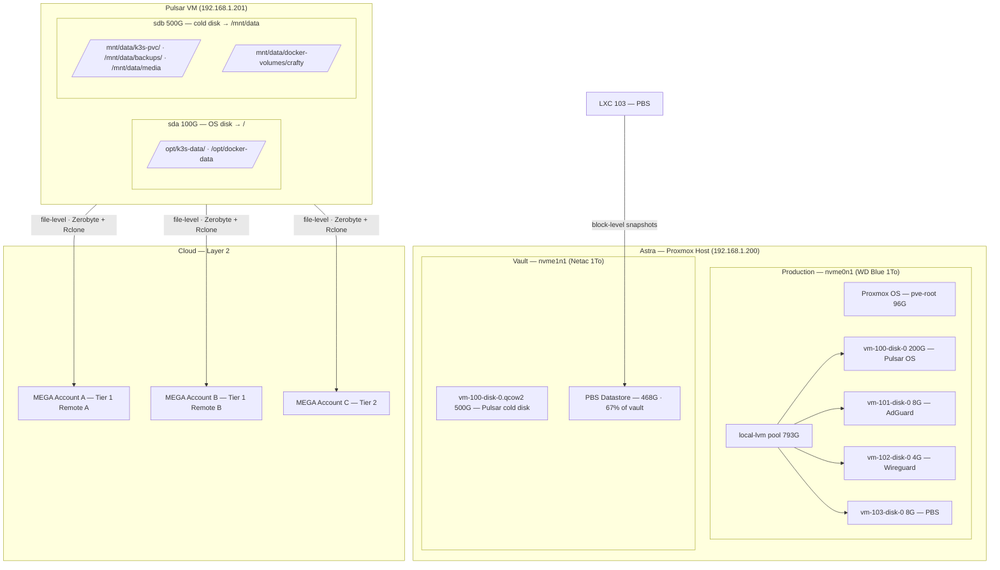

# Backup Architecture — Astra Homelab

> **Status:** Layer 1 operational. Layer 2 partially deployed — see §12.
> **Last updated:** 2026-09-09 (sizes in §3.2 and §8.1 remeasured; §2.3, §4.2 and §12 revised)
> **Language:** English (technical reference)

---

## Table of Contents

1. [Overview](#1-overview)
2. [Physical Infrastructure](#2-physical-infrastructure)
   - 2.1 [Astra — Proxmox Host](#21-astra--proxmox-host)
   - 2.2 [Pulsar — Main VM](#22-pulsar--main-vm)
   - 2.3 [Accepted Constraints](#23-accepted-constraints)
3. [Data Classification Model — 3 Tiers](#3-data-classification-model--3-tiers)
   - 3.1 [Tier Definitions](#31-tier-definitions)
   - 3.2 [Complete Data Inventory](#32-complete-data-inventory)
4. [Layer 1 — Proxmox Backup Server (PBS)](#4-layer-1--proxmox-backup-server-pbs)
   - 4.1 [Mechanism](#41-mechanism)
   - 4.2 [Scope](#42-scope)
   - 4.3 [Retention Policy](#43-retention-policy)
   - 4.4 [Automated Schedule](#44-automated-schedule)
   - 4.5 [RTO / RPO](#45-rto--rpo)
5. [Layer 2 — Zerobyte + Rclone (Cloud)](#5-layer-2--zerobyte--rclone-cloud)
   - 5.1 [Mechanism](#51-mechanism)
   - 5.2 [Cloud Storage Strategy](#52-cloud-storage-strategy)
   - 5.3 [Rclone Remotes](#53-rclone-remotes)
   - 5.4 [Backup Jobs](#54-backup-jobs)
   - 5.5 [RTO / RPO](#55-rto--rpo)
6. [Database Dump Strategy](#6-database-dump-strategy)
7. [Secrets Management](#7-secrets-management)
8. [Storage Layout](#8-storage-layout)
   - 8.1 [Current Layout](#81-current-layout)
9. [Restoration Runbooks](#9-restoration-runbooks)
   - 9.1 [Scenario A — Logical Corruption (service-level)](#91-scenario-a--logical-corruption-service-level)
   - 9.2 [Scenario B — Netac NVMe Failure](#92-scenario-b--netac-nvme-failure)
   - 9.3 [Scenario C — Total Loss of Astra](#93-scenario-c--total-loss-of-astra)
10. [Monitoring & Alerts](#10-monitoring--alerts)
11. [Restore Testing](#11-restore-testing)
12. [Pending Tasks & Future Work](#12-pending-tasks--future-work)

---

## 1. Overview

The Astra homelab backup system follows a **3-2-1 strategy** (3 copies, 2 different media types, 1 offsite) implemented across two complementary layers.

| Rule          | Implementation                                                |
| ------------- | ------------------------------------------------------------- |
| **3 copies**  | Production + Layer 1 (PBS, local NVMe) + Layer 2 (MEGA cloud) |
| **2 media**   | NVMe storage + cloud object storage (MEGA)                    |
| **1 offsite** | MEGA cloud remotes (off-premises)                             |

### Architecture Diagram


```mermaid
graph TB
    subgraph ASTRA["Astra — Proxmox Host (192.168.1.200)"]
        subgraph PROD["Production — nvme0n1 (WD Blue 1To)"]
            PVE_OS[Proxmox OS — pve-root 96G]
            LVM[local-lvm pool 793G]
            LVM --> DISK0[vm-100-disk-0 200G — Pulsar OS]
            LVM --> DISK1[vm-101-disk-0 8G — AdGuard]
            LVM --> DISK2[vm-102-disk-0 4G — Wireguard]
            LVM --> DISK3[vm-103-disk-0 8G — PBS]
        end

        subgraph VAULT["Vault — nvme1n1 (Netac 1To)"]
            VAULT_IMAGES[vm-100-disk-0.qcow2 500G — Pulsar cold disk]
            PBS_DS[PBS Datastore — 468G · 67% of vault]
        end
    end

    subgraph PULSAR["Pulsar VM (192.168.1.201)"]
        subgraph SDA["sda 100G — OS disk → /"]
            OPT[/opt/k3s-data/ · /opt/docker-data/]
        end
        subgraph SDB["sdb 500G — cold disk → /mnt/data"]
            MNT[/mnt/data/k3s-pvc/ · /mnt/data/backups/ · /mnt/data/media/]
            CRAFTY_VOL[/mnt/data/docker-volumes/crafty/]
        end
    end

    subgraph CLOUD["Cloud — Layer 2"]
        MEGA_A[MEGA Account A — Tier 1 Remote A]
        MEGA_B[MEGA Account B — Tier 1 Remote B]
        MEGA_C[MEGA Account C — Tier 2]
    end

    PBS_LXC[LXC 103 — PBS] -->|block-level snapshots| PBS_DS
    PULSAR -->|file-level · Zerobyte + Rclone| MEGA_A
    PULSAR -->|file-level · Zerobyte + Rclone| MEGA_B
    PULSAR -->|file-level · Zerobyte + Rclone| MEGA_C
```

### Layer Responsibilities

| Layer       | Tool                                         | Level | Purpose                                                           |
| ----------- | -------------------------------------------- | ----- | ----------------------------------------------------------------- |
| **Layer 1** | Proxmox Backup Server (LXC 103)              | Block | Fast local restore from logical corruption or accidental deletion |
| **Layer 2** | Zerobyte + Rclone (Docker Compose on Pulsar) | File  | Offsite disaster recovery — survives total hardware loss          |

---

## 2. Physical Infrastructure

### 2.1 Astra — Proxmox Host

| Disk              | Device    | Mount                    | Role                                           |
| ----------------- | --------- | ------------------------ | ---------------------------------------------- |
| WD Blue SN580 1To | `nvme0n1` | `pve-root` + `local-lvm` | Proxmox OS + VM/LXC virtual disks (production) |
| Netac 1To         | `nvme1n1` | `/mnt/pve/vault`         | Pulsar cold disk (qcow2) + PBS datastore       |

```txt
nvme0n1 (931G)
├── pve-swap        8G
├── pve-root       96G   → Proxmox OS (/etc/pve, /etc/proxmox-backup)
└── pve-data      793G   → local-lvm pool
    ├── vm-100-disk-0   200G  → Pulsar OS disk (= sda in Pulsar)
    ├── vm-101-disk-0     8G  → AdGuard
    ├── vm-102-disk-0     4G  → Wireguard
    └── vm-103-disk-0     8G  → PBS

nvme1n1 (938G — "vault")
├── vm-100-disk-0.qcow2  501G declared / 88G allocated  → Pulsar cold disk (= sdb)
├── template/            4.6G  → ISOs
└── pbs-datastore/       468G  → PBS backup chunks — largest consumer of this disk
```

> **Remeasured 2026-09-09.** `vault`: **560G used / 938G (61 %)**, 369G free. The
> `vm-100-state-*.raw` entry listed here previously no longer exists. `pve-data` is at
> **24.5 %** (194.5 / 793.8 GiB) with 370 GiB provisioned — 47 % over-commit, comfortable.
>
> Note the `.qcow2` is *sparse*: 501G declared, **88G actually allocated** after the
> 2026-09-09 `fstrim`. Before that trim it held 225G, of which ~137G was dead space left by
> the deleted Kiwix library — freeing files inside a guest returns nothing to the host until
> `fstrim` issues the TRIM and QEMU punches the holes.

### 2.2 Pulsar — Main VM

Pulsar (VM 100) sees two virtual disks:

| Disk                                       | Device | Mount       | Size | Role                                   |
| ------------------------------------------ | ------ | ----------- | ---- | -------------------------------------- |
| OS disk (`vm-100-disk-0` on `local-lvm`)   | `sda`  | `/`         | 200G | OS, hot app data, K3s/Docker state     |
| Cold disk (`vm-100-disk-0.qcow2` on vault) | `sdb`  | `/mnt/data` | 500G | Cold data: media, PVCs, Crafty volumes |

```txt
sda (200G) → /
├── /opt/k3s-data/      Hot persistent data for K3s services
├── /opt/docker-data/   Hot persistent data for Docker services
└── /opt/ops/           GitOps repo (astra-ops — also on GitHub)

sdb (500G) → /mnt/data
├── /mnt/data/k3s-pvc/          Cold PVC data for K3s services
├── /mnt/data/docker-volumes/   Cold volume data for Docker services
├── /mnt/data/backups/          Personal backups (manually uploaded via Filebrowser)
└── /mnt/data/media/            Media library (movies, photos, documents)
```

> **Disk usage (measured 2026-09-09):**
> `sda`: **103G used / 195G (55 %)** — 85G free
> `sdb`: **87G used / 492G (19 %)** — 380G free
>
> Of `sdb`'s 87G, roughly **73G is reconstructible or derived** (47G of re-downloadable
> movies, 26G of Crafty archives that are themselves backups). Only about **13G is
> irreplaceable**.

### 2.3 Accepted Constraints

The Netac NVMe (`nvme1n1`) hosts both the Pulsar cold disk and the PBS datastore. This means Layer 1 backups and the associated production data reside on the same physical device. A single Netac failure would result in simultaneous loss of Pulsar's cold data AND its Layer 1 backups.

This is a known, accepted constraint given the single-server hardware budget. Layer 2 (cloud) is the mitigation.

> **Revision 2026-09-09 — the mitigation is not fully in service.** Several Layer 2 items in
> §12 remain unchecked, and three directories are bind-mounted into the Zerobyte container
> without a corresponding volume declaration, so they are **never** backed up off-site:
> `/mnt/data/backups`, `/mnt/data/media/photos` and `/opt/docker-data/portainer`. Until
> those are declared, the argument that justifies accepting the co-location does not hold.
>
> **Also revised 2026-09-09:** hardware expansion is more constrained than assumed. Both M.2
> slots are populated (`lspci` shows two NVMe controllers, both occupied); only **two unused
> SATA ports** remain (`ata1`/`ata2`, both `SATA link down`). A third NVMe is not an option.
>
> **Measured the same day**, the Netac was at **79 % (194 GB free)** and growing at
> **9.38 GiB/day**, projecting saturation around 30 September 2026. Two non-destructive
> reclaims brought it to **61 % (369 GB free)**: `fstrim -av` on Pulsar returned **137 GB**
> of dead space still allocated in the `.qcow2` after the Kiwix deletion, and
> `tune2fs -m 1 /dev/nvme1n1p1` released **38 GB** of ext4 root reserve that PBS — running as
> uid `100034` — could never use. The growth rate is unchanged; see
> `~/.claude/exports/plan-stockage-astra-2026-09-09.md` for the remaining steps.

---

## 3. Data Classification Model — 3 Tiers

### 3.1 Tier Definitions

**Tier 1 — Active System (Layer 1 only)**
Live databases and application runtime state. Backed up exclusively by PBS block-level snapshots. Rclone/Zerobyte does not touch these directly because live databases cannot be safely copied at the file level without risking corruption. They are covered by the DB dump strategy (see §6) which promotes dump outputs to Tier 2 for cloud upload.

**Tier 2 — Critical Vault (Layer 1 + Layer 2)**
Static personal files, cold PVC data, pre-generated database dumps, and other irreplaceable data that is safe to copy at the file level. This is the only data sent to cloud storage.

**Tier 3 — Disposable (No cloud backup)**
Bulk data that is either reconstructible (Minecraft servers, Kiwix ZIM archives) or acceptable to lose and re-download (movies). Protected only by PBS snapshots of the Pulsar VM (which includes the `/mnt/data` mount).

### 3.2 Complete Data Inventory

> **Sizes marked `2026-09-09` were remeasured that day; the rest still date from May 2026
> and should be re-checked before being relied on.**

| Service / Path | Location | Size | Tier | Layer 2 | DB dump | Verified |
| -------------- | -------- | ---- | ---- | ------- | ------- | -------- |
| **Vaultwarden** | `/opt/k3s-data/vaultwarden/` | 6.7M | 1 | dump only | SQLite | May 2026 |
| **Immich DB** | `/opt/k3s-data/immich/postgres/` | **295M** | 1 | covered — Immich dumps itself into `library/backups/` | PostgreSQL 14 + vectorchord | 2026-09-09 |
| **Umami DB** | K3s ns `analytics` | not measured | 1 | ❌ none | PostgreSQL 16 | **added 2026-09-09** |
| **Infisical DB** | K3s ns `infisical` | not measured | 1 | ❌ none | PostgreSQL 16 | **added 2026-09-09** |
| **Dawarich DB** | Docker `dawarich_db` | not measured | 1 | ❌ none | PostGIS 17 | **added 2026-09-09** |
| **n8n** | `/opt/k3s-data/n8n/` | 41M | 1 | dump only | SQLite | May 2026 |
| **Scanopy** | `/opt/k3s-data/scanopy/` | 68M | 1 | dump only | PostgreSQL — **no running deployment found on 2026-09-09, confirm before scripting** | May 2026 |
| **Uptimekuma** | `/opt/k3s-data/uptimekuma/` | 231M | 1 | dump only | SQLite | May 2026 |
| **Crowdsec** | `/opt/docker-data/crowdsec/` | 92M | 1 | dump only | SQLite | May 2026 |
| **SFTPgo** | `/opt/k3s-data/sftpgo/` | 380K | 1 | dump only | SQLite | May 2026 |
| **Docker Registry** | `/opt/k3s-data/docker-registry/` | 57M | 1 | ✅ files | — | May 2026 |
| **NPM** | `/opt/docker-data/npm/` | 20M | 1 | dump only | SQLite | May 2026 |
| **Portainer** | `/opt/docker-data/portainer/` | **83M** | 1 | ⚠️ **mounted, never declared** | BoltDB | 2026-09-09 |
| **Filebrowser Quantum** | `/opt/k3s-data/filebrowser-quantum/` | 896K | 1 | dump only | SQLite | May 2026 |
| **Ntfy** | `/opt/k3s-data/ntfy/` | 160K | 1 | dump only | SQLite | May 2026 |
| `/etc/pve/` | Astra host | ~5M | 1 | ❌ not yet | — | May 2026 |
| `/etc/proxmox-backup/` | LXC 103 | **60K** | 1 | ❌ not yet | — | 2026-09-09 |
| **Immich photos** | `/opt/k3s-data/immich/library/` | **31G** | 2 | ✅ Backblaze B2 | — | 2026-09-09 |
| **Filebrowser files** | `/mnt/data/k3s-pvc/filebrowser/` | **4.7G** | 2 | ✅ files | — | 2026-09-09 |
| **Homer config** | `/opt/k3s-data/homer/` | 5.3M | 2 | ✅ files | — | May 2026 |
| **Criteri-fresque** | `/opt/k3s-data/criteri-fresque/` | 38M | 2 | ✅ files | — | May 2026 |
| **Personal backups** | `/mnt/data/backups/` | **8.8G** | 2 | ⚠️ **mounted, never declared** | — | 2026-09-09 |
| **Photos** | `/mnt/data/media/photos/` | **946M** | 2 | ⚠️ **mounted, never declared** | — | 2026-09-09 |
| **DB dumps** | `/mnt/data/backups/dumps/` | — | 2 | ❌ directory does not exist | — | 2026-09-09 |
| **Secrets** | `~/astra-secrets/` (workstation) | ~1M | 2 | ❌ not yet | — | May 2026 |
| **Crafty backups** | `/mnt/data/docker-volumes/crafty/backups/` | **26G** | 2 | ✅ files | — | 2026-09-09 |
| **Crafty config** | `/opt/docker-data/crafty/config/` | **169M** | 2 | ✅ files | — | 2026-09-09 |
| **Crafty servers** | `/opt/docker-data/crafty/servers/` | **17G** | ❌ 3 | — | — | 2026-09-09 |
| **Crafty logs** | `/mnt/data/docker-volumes/crafty/logs/` | **430M** | ❌ 3 | — | — | 2026-09-09 |
| **Portracker** | `/opt/docker-data/portracker/` | 68K | ❌ 3 | — | — | May 2026 |
| **Kiwix ZIM** | `/mnt/data/k3s-pvc/kiwix/` | **empty** — 136G deleted 2026-09-09 | ❌ 3 | — | — | 2026-09-09 |
| **Movies** | `/mnt/data/media/movies/` | **47G** (19 files) | ❌ 3 | — | — | 2026-09-09 |

> **⚠️ The three rows marked "mounted, never declared"** are bind-mounted read-only into the
> Zerobyte container by `docker/zerobyte/docker-compose.yml`, but no matching *volume* exists
> in Zerobyte, so no job ever backs them up. Their only protection today is PBS — i.e. the
> Netac. Note that most of the 8.8G under `/mnt/data/backups/` is a single Minecraft server
> archive, likely redundant with the Crafty backups; triage before declaring it.
>
> **Growth driver, measured 2026-09-09:** Crafty produces **28.6 GiB/week** of new `.zip`
> archives across three servers, one of them daily. ZIP streams do not deduplicate, so PBS
> stores each archive whole, every night. Immich by comparison adds 0.86 GiB/week.

---

## 4. Layer 1 — Proxmox Backup Server (PBS)

### 4.1 Mechanism

PBS (LXC 103 on Astra) operates at the **block level**. It uses QEMU dirty bitmaps to track modified storage blocks since the last backup. Only changed blocks are transferred — no full copies after the first run.

Data is hashed, deduplicated, and compressed with **ZSTD** on the fly before being written to the datastore. Backups are taken in **snapshot mode**: the hypervisor momentarily freezes VM/LXC state (RAM + filesystem), reads the data, then releases the snapshot. Services continue running with no downtime.

Datastore location: `/mnt/pve/vault/` (Netac NVMe, `nvme1n1`).

### 4.2 Scope

| Guest     | ID  | Type | Included                  |
| --------- | --- | ---- | ------------------------- |
| Pulsar    | 100 | VM   | ✅ Both disks (OS + cold) |
| AdGuard   | 101 | LXC  | ✅                        |
| Wireguard | 102 | LXC  | ✅                        |
| PBS       | 103 | LXC  | ❌ Excluded by design     |

PBS (LXC 103) is intentionally excluded — but **not** for the reason previously given here.

> **Correction, 2026-09-09.** This section used to claim that backing up the PBS container
> would "create circular I/O dependencies". That is **false**. LXC 103 reaches its datastore
> through a *bind mount* (`mp0: /mnt/pve/vault/pbs-datastore,mp=/mnt/datastore`), and the
> Proxmox VE documentation is explicit: *"The contents of bind mount points are not backed up
> when using vzdump."* The `backup=1` option exists only for **volume** mount points. A
> `vzdump` of LXC 103 would therefore capture its 8 GB rootfs and nothing else — no recursion
> is possible.

The real reason to exclude it: a backup of LXC 103 would live **inside the datastore it is
meant to help rebuild**, making it useless in the one scenario that matters — loss of the
Netac drive. And it is unnecessary, because the datastore is self-describing: point a fresh
PBS install at the existing directory (or pass `reuse-datastore`) and every chunk and index
is recovered.

What genuinely needs protecting is the **configuration**, which is *not* in the datastore —
about **60 KB** in `/etc/proxmox-backup/`:

| File | Lost without it |
| ---- | --------------- |
| `datastore.cfg` | datastore definition, GC schedule (`Sun 05:00`) |
| `verification.cfg` | the `verify-weekly` job |
| `prune.cfg` | retention policy |
| `notifications.cfg` + `notifications-priv.cfg` | the Resend notification target |
| `user.cfg`, `acl.cfg`, `shadow.json` | accounts, permissions, password hashes |
| `authkey.key`, `csrf.key`, `proxy.pem` | API tokens and TLS certificate |

This is what the unchecked §12 task — rsyncing `/etc/pve/` and `/etc/proxmox-backup/` to
`/mnt/data/backups/proxmox-configs/` — is for. It remains **to do**.

### 4.3 Retention Policy

| Window      | Copies kept |
| ----------- | ----------- |
| Most recent | 3           |
| Daily       | 7 days      |
| Weekly      | 4 weeks     |
| Monthly     | 6 months    |

### 4.4 Automated Schedule

All jobs run nightly during low-activity periods:

| Time         | Job                | Description                                                        |
| ------------ | ------------------ | ------------------------------------------------------------------ |
| 03:00 daily  | Backup             | PBS snapshots Pulsar, AdGuard, Wireguard                           |
| 04:00 daily  | Prune              | Retention policy applied; old index entries dereferenced logically |
| 05:00 Sunday | Garbage Collection | Orphaned data chunks physically deleted from disk                  |

### 4.5 RTO / RPO

| Metric              | Value            | Notes                                                          |
| ------------------- | ---------------- | -------------------------------------------------------------- |
| **RPO**             | ≤ 24 hours       | Daily backup at 03:00; worst case = ~23h of data loss          |
| **RTO**             | 30 min – 2 hours | Depends on VM size and disk throughput (~400–500 MB/s on NVMe) |
| **Backup duration** | ~15–45 min       | Incremental after first run; full first backup is longer       |

---

## 5. Layer 2 — Zerobyte + Rclone (Cloud)

### 5.1 Mechanism

Zerobyte is a self-hosted backup automation tool running as a **Docker Compose service on Pulsar**. It provides a web UI over **Restic**, handling scheduling, retention, and monitoring.

Restic operates at the **file level**: it chunks files, deduplicates content across snapshots, compresses with ZSTD, and encrypts with AES-256 before uploading. Rclone provides the transport layer, mapping Restic's backend protocol to MEGA's API.

### 5.2 Cloud Storage Strategy

All cloud storage uses **MEGA** accounts (20 GB free per account). Multiple accounts are used to accommodate the total Tier 2 data volume (~20–25G) and provide redundancy.

| Remote Name | MEGA Account | Covers                          | Estimated Usage |
| ----------- | ------------ | ------------------------------- | --------------- |
| `mega-a`    | Account A    | Tier 2 — all data               | ~20G            |
| `mega-b`    | Account B    | Tier 2 — same data (redundancy) | ~20G            |
| `mega-c`    | Account C    | Tier 2 — overflow / Crafty      | ~5G             |

**Why no other cloud providers?**
The requirement is zero recurring cost and long-term durability. MEGA's free tier is account-bound and persistent (unlike the Google Workspace student 5TB plan, which expires in December). Multiple MEGA accounts serve as both capacity extension and geographic redundancy.

**Tier 3 data (Kiwix, movies, Crafty servers) receives no cloud backup.** These are reconstructible from internet sources or from Crafty's own internal backup system. They are covered only by PBS Layer 1 snapshots.

### 5.3 Rclone Remotes

Rclone must be configured on the Pulsar host before the Zerobyte container starts. The rclone config is bind-mounted read-only into the container.

```bash
# Install rclone on Pulsar
curl https://rclone.org/install.sh | sudo bash

# Configure each MEGA remote interactively
rclone config
# → New remote → name: mega-a → type: mega → authenticate

# Verify
rclone listremotes
# mega-a:
# mega-b:
# mega-c:
```

The Zerobyte container mounts the rclone config:

```yaml
volumes:
  - /root/.config/rclone:/root/.config/rclone:ro
```

### 5.4 Backup Jobs

All jobs run after the DB dump script has completed (see §6). Jobs are defined in the Zerobyte web UI at `zerobyte.lan`.

#### Tier 2 Jobs — Remote A (mega-a) + Remote B (mega-b)

Both remotes receive identical data for redundancy.

| Job                     | Source Paths                                                                                                                                                                | Schedule                        | Retention                    |
| ----------------------- | --------------------------------------------------------------------------------------------------------------------------------------------------------------------------- | ------------------------------- | ---------------------------- |
| `tier2-hot-data`        | `/opt/docker-data/npm/` `/opt/docker-data/portainer/` `/opt/k3s-data/docker-registry/` `/opt/k3s-data/filebrowser-quantum/` `/opt/k3s-data/ntfy/` `/opt/k3s-data/jellyfin/` | Daily 01:00                     | 7 daily, 4 weekly, 3 monthly |
| `tier2-cold-files`      | `/mnt/data/k3s-pvc/filebrowser/` `/mnt/data/backups/` `/mnt/data/media/photos/`                                                                                             | Daily 02:00                     | 7 daily, 4 weekly, 3 monthly |
| `tier2-db-dumps`        | `/mnt/data/backups/dumps/`                                                                                                                                                  | Daily 01:30 (after dump script) | 7 daily, 4 weekly, 3 monthly |
| `tier2-proxmox-configs` | `/etc/pve/` `/etc/proxmox-backup/`                                                                                                                                          | Weekly Sunday 00:00             | 4 weekly, 6 monthly          |

> `/etc/pve/` and `/etc/proxmox-backup/` live on the **Astra host**, not inside Pulsar. To back them up with Zerobyte running on Pulsar, they must be exposed via a mechanism such as: SFTP from Astra, NFS mount, or a dedicated cron job on Astra that rsyncs them to `/mnt/data/backups/proxmox-configs/` before the Zerobyte job runs.

#### Tier 2 Jobs — Remote C (mega-c)

| Job            | Source Paths                                                                         | Schedule            | Retention           |
| -------------- | ------------------------------------------------------------------------------------ | ------------------- | ------------------- |
| `tier2-crafty` | `/mnt/data/docker-volumes/crafty/backups/` `/mnt/data/docker-volumes/crafty/config/` | Weekly Sunday 03:00 | 4 weekly, 3 monthly |

### 5.5 RTO / RPO

| Metric              | Value            | Notes                                                     |
| ------------------- | ---------------- | --------------------------------------------------------- |
| **RPO**             | ≤ 24 hours       | Daily jobs; worst case = ~23h of data loss                |
| **RTO**             | 4–24 hours       | Depends on upstream bandwidth and total data size (~20G)  |
| **Backup duration** | 30 min – 2 hours | Incremental via Restic deduplication; first run is longer |

---

## 6. Database Dump Strategy

Live databases cannot be safely copied at the file level while running — doing so risks backing up a partially-written, corrupt state. Instead, a dump script runs **before** Zerobyte jobs and writes cold, consistent export files to `/mnt/data/backups/dumps/`. Zerobyte then backs up this directory as part of the `tier2-db-dumps` job.

> **Phase:** DB dump automation is planned for a future phase. Current Layer 2 setup covers file-based data only.

### Services Requiring Dumps

| Service             | DB Type    | Active Data Path                     | Dump Command                                                                                                     | Dump Output                                                |
| ------------------- | ---------- | ------------------------------------ | ---------------------------------------------------------------------------------------------------------------- | ---------------------------------------------------------- |
| Immich              | PostgreSQL | `/opt/k3s-data/immich/`              | `pg_dump -U immich immich > immich.sql`                                                                          | `/mnt/data/backups/dumps/immich.sql`                       |
| Scanopy             | PostgreSQL | `/opt/k3s-data/scanopy/`             | `pg_dump -U scanopy scanopy > scanopy.sql`                                                                       | `/mnt/data/backups/dumps/scanopy.sql`                      |
| Vaultwarden         | SQLite     | `/opt/k3s-data/vaultwarden/`         | `sqlite3 db.sqlite3 .dump > vaultwarden.sql`                                                                     | `/mnt/data/backups/dumps/vaultwarden.sql`                  |
| n8n                 | SQLite     | `/opt/k3s-data/n8n/`                 | `sqlite3 database.sqlite .dump > n8n.sql`                                                                        | `/mnt/data/backups/dumps/n8n.sql`                          |
| Uptimekuma          | SQLite     | `/opt/k3s-data/uptimekuma/`          | `sqlite3 kuma.db .dump > uptimekuma.sql`                                                                         | `/mnt/data/backups/dumps/uptimekuma.sql`                   |
| Crowdsec            | SQLite     | `/opt/docker-data/crowdsec/`         | `sqlite3 crowdsec.db .dump > crowdsec.sql`                                                                       | `/mnt/data/backups/dumps/crowdsec.sql`                     |
| SFTPgo              | SQLite     | `/opt/k3s-data/sftpgo/`              | `sqlite3 sftpgo.db .dump > sftpgo.sql`                                                                           | `/mnt/data/backups/dumps/sftpgo.sql`                       |
| NPM                 | SQLite     | `/opt/docker-data/npm/`              | `sqlite3 /data/database.sqlite .dump > npm.sql`                                                                  | `/mnt/data/backups/dumps/npm.sql`                          |
| Filebrowser Quantum | SQLite     | `/opt/k3s-data/filebrowser-quantum/` | `sqlite3 /data/database.db .dump > filebrowser-quantum.sql`                                                      | `/mnt/data/backups/dumps/filebrowser-quantum.sql`          |
| Ntfy                | SQLite     | `/opt/k3s-data/ntfy/`                | `sqlite3 /var/cache/ntfy/cache.db .dump > ntfy-cache.sql && sqlite3 /var/lib/ntfy/user.db .dump > ntfy-user.sql` | `/mnt/data/backups/dumps/ntfy-cache.sql` + `ntfy-user.sql` |

> If additional services with databases are added in the future, add them to this table and to the dump script. The script itself should run at 01:00 daily (before the `tier2-db-dumps` Zerobyte job at 01:30).

### Dump Script Location

The script lives at `/opt/ops/docker/zerobyte/dump-databases.sh` and is executed by a systemd timer on Pulsar (or a cron job). It must run inside or alongside the relevant containers to access the database files.

---

## 7. Secrets Management

K3s application secrets (`secrets.yaml`, `.env` files) are **never committed to the astra-ops Git repository** (enforced by `.gitignore`). They are maintained locally on the operator's workstation.

### Current Setup

Secrets are stored in `~/astra-secrets/` on the operator's computer and applied manually to the K3s cluster:

```bash
kubectl apply -f ~/astra-secrets/<service>/secrets.yaml
```

### Planned — rclone Sync to MEGA

To protect secrets against workstation loss, they will be encrypted and synced to MEGA using `rclone crypt`:

```bash
# Configure encrypted remote on top of existing mega-a
rclone config
# → New remote → name: mega-a-crypt → type: crypt
# → Remote: mega-a:astra-secrets-encrypted
# → Filename encryption: standard
# → Set password

# Sync encrypted secrets
rclone sync ~/astra-secrets mega-a-crypt: \
  --backup-dir mega-a:astra-secrets-old \
  --suffix "-$(date +%Y%m%d)"
```

This sync will be automated via a **systemd timer on my workstation** (daily or on significant changes). Versioned old copies are kept for 30 days in the `astra-secrets-old` prefix.

---

## 8. Storage Layout

### 8.1 Current Layout

```txt
Pulsar /opt/ (sda — hot)          103G used / 195G (55 %)   [2026-09-09]
├── k3s-data/
│   ├── immich/            32G   ├── library/upload   29G   (Tier 2)
│   │                            ├── library/thumbs  1.5G   (Tier 3, regenerable)
│   │                            ├── model-cache     786M   (Tier 3, re-downloaded)
│   │                            └── postgres        295M   (Tier 1)
│   ├── uptimekuma/       231M
│   ├── scanopy/           68M
│   ├── docker-registry/   57M
│   ├── n8n/               41M
│   ├── criteri-fresque/   38M
│   ├── vaultwarden/      6.7M
│   ├── homer/            5.3M
│   ├── filebrowser-quantum/ 896K · sftpgo/ 380K · ntfy/ 160K
│   └── diun/ 536K · convertx/ 356K · filebrowser/ 64K
├── docker-data/
│   ├── crafty/            17G   └── servers/ 17G (Tier 3) · config/ 169M (Tier 2)
│   ├── portainer/         83M   ⚠️ mounted in Zerobyte, never declared
│   ├── crowdsec/          92M
│   ├── npm/               20M
│   └── portracker/        68K
└── ops/                   11M   GitOps clone (also on GitHub)

  Not application data, but the bulk of this disk:
  /var/lib/rancher/k3s/.../containerd  25G   container images (reconstructible)
  /var/lib/containerd                  13G   second image store (reconstructible)
  /var/lib/docker                     8.0G   (reconstructible)
  /swap.img 4.1G · /usr 3.6G · /var/log 2.7G

Pulsar /mnt/data/ (sdb — cold)     87G used / 492G (19 %)   [2026-09-09]
├── media/
│   ├── movies/            47G   (Tier 3 — 19 re-downloadable files)
│   └── photos/           946M   (Tier 2) ⚠️ mounted in Zerobyte, never declared
├── docker-volumes/crafty/
│   ├── backups/           26G   (Tier 2) — 28.6 GiB/week of new ZIPs, main growth driver
│   └── logs/             430M   (Tier 3)
├── backups/              8.8G   ⚠️ mounted in Zerobyte, never declared
│   ├── 2026-06-15_*.zip  8.7G   Minecraft server archive — likely redundant with Crafty
│   └── OnePlus-10T/      102M   phone backup (irreplaceable)
└── k3s-pvc/
    ├── filebrowser/      4.7G   (Tier 2)
    ├── crafty/            92K
    └── kiwix/            empty  (136G deleted 2026-09-09)
```

---

## 9. Restoration Runbooks

### 9.1 Scenario A — Logical Corruption (service-level)

**Trigger:** A service is broken, a database is corrupted, or files were accidentally deleted. The Astra host and Netac NVMe are healthy.

**Recovery via Layer 1 (PBS):**

1. Access PBS web UI at `pbs.enoal.fr` (or directly at the LXC IP).
2. Navigate to the relevant datastore → find the most recent healthy snapshot of Pulsar (VM 100).
3. If restoring the entire VM: Proxmox UI → VM 100 → Backups → Restore.
4. If restoring individual files: use `proxmox-backup-client` to mount the snapshot and extract specific paths.

```bash
# Mount a specific PBS snapshot on Astra
proxmox-backup-client mount \
  --repository user@pbs-host:datastore \
  <snapshot-id> /mnt/restore-point

# Extract specific directory
cp -r /mnt/restore-point/mnt/data/k3s-pvc/immich/ /mnt/data/k3s-pvc/immich-restored/
```

1. Restart the affected service.
2. Validate service health.

**Estimated time:** 15 min – 1 hour depending on restore scope.

---

### 9.2 Scenario B — Netac NVMe Failure

**Trigger:** `nvme1n1` (Netac) fails. Both Pulsar's cold disk (`/mnt/data`) and the PBS datastore are lost simultaneously.

**What is lost:**

- `/mnt/data/` contents (cold PVCs, media, backups)
- All Layer 1 PBS snapshots

**What survives:**

- Pulsar OS disk (`sda`, on `nvme0n1`) — `/opt/k3s-data/`, `/opt/docker-data/`, running services
- Layer 2 cloud backups (MEGA)

**Recovery steps:**

1. Replace Netac NVMe with a new drive.
2. In Proxmox, create a new storage pool on the new drive (e.g., `vault`).
3. Create a new PBS LXC (ID 103) and point it to the new datastore — no historical backups, but PBS is operational again.
4. Add the new drive as a second disk to Pulsar (Proxmox UI → VM 100 → Hardware → Add → Hard Disk).
5. Inside Pulsar, format and mount the new disk at `/mnt/data`.
6. Restore Tier 2 data from MEGA via Zerobyte:
   - Access Zerobyte UI at `zerobyte.lan`
   - Select the `mega-a` or `mega-b` repository
   - Browse snapshots and restore to `/mnt/data/`
7. Restore directory structure (`k3s-pvc/`, `backups/`, `media/`, etc.).
8. Restart services that depend on `/mnt/data/` mounts.

**Estimated time:** 4–24 hours (depends on total data size ~20G and upstream bandwidth).

---

### 9.3 Scenario C — Total Loss of Astra

**Trigger:** Complete hardware failure, theft, fire, or similar. The entire Astra node is gone.

**What survives:**

- Layer 2 cloud backups (MEGA) — all Tier 2 data
- The `astra-ops` GitOps repository (GitHub) — all manifests, Helm charts, configurations
- K3s secrets on the operator's computer

**Recovery steps:**

1. Provision a new server (or reinstall on repaired hardware).
2. Install Proxmox VE.
3. Recreate the VM/LXC structure (refer to `astra-ops` README and this document).
4. Create Pulsar VM (Ubuntu Server), install K3s and Docker.
5. Install Zerobyte (Docker Compose in `docker/zerobyte/`).
6. Configure rclone remotes (mega-a, mega-b, mega-c) on the new Pulsar.
7. Restore Tier 2 data from MEGA via Zerobyte.
8. Apply K3s secrets from the operator's computer:

   ```bash
   kubectl apply -f ~/astra-secrets/<service>/secrets.yaml
   ```

9. Bootstrap ArgoCD and the App-of-Apps:

   ```bash
   kubectl apply -f /opt/ops/infra/argocd/root-app.yaml
   ```

10. ArgoCD will deploy all K3s services automatically from GitHub.
11. Restore Docker Compose stacks via Portainer.
12. Validate all services via Uptime Kuma and Homer dashboard.

**Estimated time:** 1–3 days for full restoration.

---

## 10. Monitoring & Alerts

| Component               | Monitoring Method                  | Alert Channel          |
| ----------------------- | ---------------------------------- | ---------------------- |
| Zerobyte job failures   | Zerobyte built-in notifications    | ntfy (`ntfy.enoal.fr`) |
| PBS backup job status   | PBS web UI + email (if configured) | PBS UI                 |
| Disk usage — Netac      | Dashdot (`dashdot.lan`)            | Visual monitoring      |
| Disk usage — Pulsar sda | Dashdot + manual check             | Threshold: 85%         |
| Cloud storage usage     | MEGA web UI                        | Manual quarterly check |

> **Recommended:** set a Zerobyte webhook to ntfy for all job completions and failures. This provides a push notification to mobile on every backup cycle.

---

## 11. Restore Testing

Backups that have never been tested are assumptions, not guarantees.

### Recommended Testing Schedule

| Frequency         | Test                                                      | Priority    |
| ----------------- | --------------------------------------------------------- | ----------- |
| **Quarterly**     | Full restore of Vaultwarden from Layer 2 snapshot         | 🔴 Critical |
| **Quarterly**     | Full restore of Immich photos (sample) from Layer 2       | 🔴 Critical |
| **Semi-annually** | Restore single Pulsar service from Layer 1 PBS snapshot   | High        |
| **Annually**      | Full Scenario C simulation (new VM, restore from scratch) | High        |

### Restore Validation Checklist

For each tested restore:

- [ ] Service starts without errors
- [ ] Data integrity verified (spot-check files, query DB)
- [ ] No data loss beyond expected RPO window
- [ ] Service accessible via expected URL (`.lan` or `.enoal.fr`)
- [ ] Dependent services unaffected
- [ ] Restore duration recorded (baseline for RTO estimates)

---

## 12. Pending Tasks & Future Work

> **Reviewed against the machines on 2026-09-09.** Items are checked only where the state was
> actually verified, not where it was merely planned.

### Layer 2 — Zerobyte

- [x] Configure rclone remotes on Pulsar — `mega-a`, `mega-b`, `mega-c`, `mega-d`, `backblaze-test`
- [x] Deploy Zerobyte via Docker Compose (`docker/zerobyte/docker-compose.yml`, v0.42)
- [x] Create Zerobyte repositories — `Mega A`, `Mega C`, `Mega D`, `Backblaze`
- [x] Add `zerobyte.lan` DNS entry in AdGuard Home
- [x] Add NPM proxy host for `zerobyte.lan`
- [x] Move Immich off-site to Backblaze B2 (2026-09-09) — 7/7 schedules now `success`
- [ ] **Declare the three mounted-but-undeclared volumes**: `/data/backups`,
      `/data/media/photos`, `/data/portainer`. Triage `/mnt/data/backups/` first — most of its
      8.8G is a Minecraft archive that is probably redundant.
- [ ] Set up ntfy webhook in Zerobyte settings
- [ ] Create `/mnt/data/backups/dumps/` directory
- [ ] Create `/mnt/data/backups/proxmox-configs/` directory
- [ ] Write rsync + systemd timer on Astra to sync `/etc/pve/` and `/etc/proxmox-backup/`
      to `/mnt/data/backups/proxmox-configs/`, then declare it as a Zerobyte volume.
      **Blocker to investigate first:** `/etc/pve` is a FUSE mount (`pmxcfs`), and reading
      `/etc/pve/storage.cfg` returned `Permission denied` even under `sudo` on 2026-09-09.

### Storage — reclaimed 2026-09-09

- [x] Resize Pulsar `sda` from 100G → 200G
- [x] Move `/mnt/data/k3s-pvc/immich/` → `/opt/k3s-data/immich/library/`
- [x] Move `/mnt/data/k3s-pvc/homer/` → `/opt/k3s-data/homer/`
- [x] Move `/mnt/data/k3s-pvc/criteri-fresque/` → `/opt/k3s-data/criteri-fresque/`
- [x] Delete residue `/opt/k3s-data/crafty/`
- [x] **`fstrim -av` on Pulsar** — returned **137G** of dead space to `vault` (79 % → 63 %)
- [x] **`tune2fs -m 1 /dev/nvme1n1p1`** — released **38G** of ext4 root reserve (63 % → 61 %)
- [x] **AdGuard query log** — retention 90d → 7d and log cleared; LXC 101 went 95 % → 11 %

### Storage — still open

- [ ] **Cut the growth at the source**: Crafty produces 28.6 GiB/week of non-deduplicating
      ZIPs. Reduce cadence or retention on the server created 2026-08-31, which alone emits
      1.5 GiB/day. Nothing else meaningfully slows `vault`.
- [ ] **Set `backup=0` on `scsi1`** so PBS stops backing up the 500G cold disk that lives on
      the very drive it writes to. Only after the three Zerobyte volumes above are declared.
- [ ] Decide the fate of LXC 102 (`wireguard`, stopped since 2026-05-04) in the vzdump job
- [ ] Consider a SATA SSD for the datastore — **both M.2 slots are occupied**, only two SATA
      ports remain free

### Phase 2 — Database dumps

- [ ] Write `/opt/ops/docker/zerobyte/dump-databases.sh`
- [ ] **Exclude Immich from the script** — its database runs on
      `postgres:14-vectorchord0.4.3-pgvectors0.2.0`, and a plain `pg_dump` produces a file no
      vanilla PostgreSQL can restore. Immich already dumps itself into `library/backups/`,
      which Backblaze covers.
- [ ] **Add Umami, Infisical and Dawarich** — absent from the §6 table, and unprotected today
- [ ] Confirm whether Scanopy still runs before scripting its dump
- [ ] Test each dump command individually
- [ ] Set up systemd timer on Pulsar to run dumps at 01:00 daily
- [ ] Add `tier2-db-dumps` job in Zerobyte pointing to `/mnt/data/backups/dumps/`
- [ ] Validate end to end: dump → Zerobyte backup → restore dump → import to DB

### Phase 3 — Secrets sync

- [ ] Configure `rclone crypt` on the workstation for a `mega-a-crypt` remote
- [ ] Create `~/astra-secrets/` and consolidate all secrets
- [ ] Write rclone sync script with versioned backup dir
- [ ] Create systemd timer on the workstation (daily sync)
- [ ] First restore test: decrypt and apply secrets on a clean machine

### Monitoring

- [ ] **Move the disk alert threshold from `sda` to `vault`.** The current rule watches Pulsar
      `sda` at 85 %; `sda` sits at 55 % while `vault` — which holds every backup — reached
      79 % unnoticed. Alert on `/mnt/pve/vault` at 75 %.
- [ ] Alert on LXC 101 (`adguard`) — it hit 95 % unnoticed on 2026-09-09

### Long-term

- [x] Evaluate Backblaze B2 as a scalable Tier 2 alternative — **adopted for Immich**
      (bucket `astra-pulsar-backup`, ~30.4 GiB, lifecycle `daysFromHidingToDeleting: 1`)
- [ ] Decide whether to migrate the remaining MEGA jobs to B2
- [ ] `Mega B` is **retired**: removed from Zerobyte on 2026-09-09, its 10 snapshots left
      intact on MEGA, neither copied nor purged. Still readable with `restic --no-lock`.
