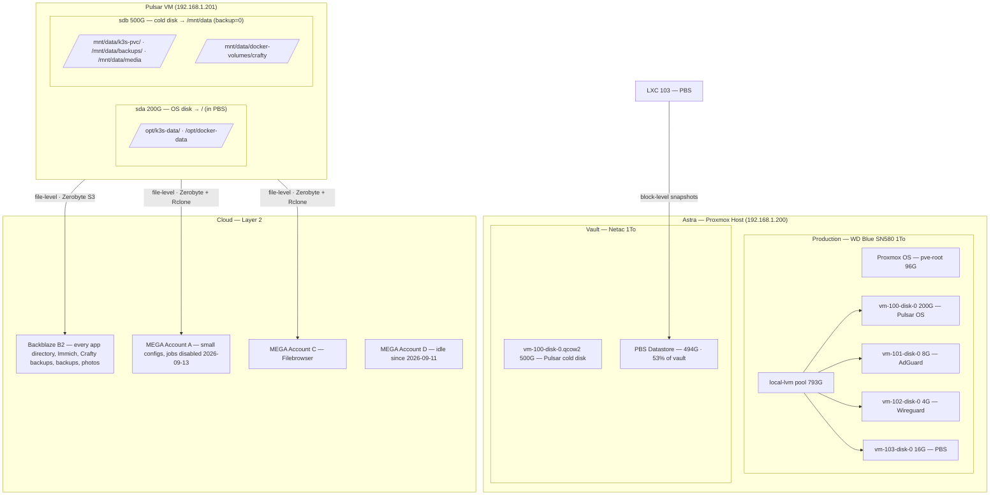

# Backup Architecture — Astra Homelab

> **Status:** Layer 1 operational. Layer 2 in service for every Tier 2 path on `/mnt/data`,
> every app directory, the Proxmox configuration and, since 2026-09-14, the database dumps
> (restore tested end to end on 2026-09-15) — see §12.
> **Last updated:** 2026-09-22 (documented how to reinstall the Proxmox config backup
> mechanism from scratch, verified against the live setup — §4.2)
> **Language:** English (technical reference)

---

## Table of Contents

1. [Overview](#1-overview)
2. [Physical Infrastructure](#2-physical-infrastructure)
   - 2.1 [Astra — Proxmox Host](#21-astra--proxmox-host)
   - 2.2 [Pulsar — Main VM](#22-pulsar--main-vm)
   - 2.3 [Accepted Constraints](#23-accepted-constraints)
3. [Data Classification Model — 3 Tiers](#3-data-classification-model--3-tiers)
   - 3.1 [Tier Definitions](#31-tier-definitions)
   - 3.2 [Complete Data Inventory](#32-complete-data-inventory)
4. [Layer 1 — Proxmox Backup Server (PBS)](#4-layer-1--proxmox-backup-server-pbs)
   - 4.1 [Mechanism](#41-mechanism)
   - 4.2 [Scope](#42-scope)
   - 4.3 [Retention Policy](#43-retention-policy)
   - 4.4 [Automated Schedule](#44-automated-schedule)
   - 4.5 [RTO / RPO](#45-rto--rpo)
5. [Layer 2 — Zerobyte + Rclone (Cloud)](#5-layer-2--zerobyte--rclone-cloud)
   - 5.1 [Mechanism](#51-mechanism)
   - 5.2 [Cloud Storage Strategy](#52-cloud-storage-strategy)
   - 5.3 [Rclone Remotes](#53-rclone-remotes)
   - 5.4 [Backup Jobs](#54-backup-jobs)
   - 5.5 [RTO / RPO](#55-rto--rpo)
6. [Database Dump Strategy](#6-database-dump-strategy)
7. [Secrets Management](#7-secrets-management)
8. [Storage Layout](#8-storage-layout)
   - 8.1 [Current Layout](#81-current-layout)
9. [Restoration Runbooks](#9-restoration-runbooks)
   - 9.1 [Scenario A — Logical Corruption (service-level)](#91-scenario-a--logical-corruption-service-level)
   - 9.2 [Scenario B — Netac NVMe Failure](#92-scenario-b--netac-nvme-failure)
   - 9.3 [Scenario C — Total Loss of Astra](#93-scenario-c--total-loss-of-astra)
   - 9.4 [Restoring the Proxmox configuration](#94-restoring-the-proxmox-configuration)
   - 9.5 [Restoring the Obsidian notes (CouchDB)](#95-restoring-the-obsidian-notes-couchdb)
   - 9.6 [Restoring files with Zerobyte](#96-restoring-files-with-zerobyte)
10. [Monitoring & Alerts](#10-monitoring--alerts)
11. [Restore Testing](#11-restore-testing)
12. [Pending Tasks & Future Work](#12-pending-tasks--future-work)

---

## 1. Overview

The Astra homelab backup system follows a **3-2-1 strategy** (3 copies, 2 different media types, 1 offsite) implemented across two complementary layers.

| Rule          | Implementation                                                |
| ------------- | ------------------------------------------------------------- |
| **3 copies**  | Production + Layer 1 (PBS, local NVMe) + Layer 2 (cloud)      |
| **2 media**   | NVMe storage + cloud storage (Backblaze B2 and MEGA)          |
| **1 offsite** | Backblaze B2 bucket + MEGA accounts (off-premises)            |

> Not every path gets all three copies. Since 2026-09-11 Pulsar's cold disk (`/mnt/data`) is
> excluded from PBS by decision (§4.2): its Tier 2 content has production + cloud only.

### Architecture Diagram


```mermaid
graph TB
    subgraph ASTRA["Astra — Proxmox Host (192.168.1.200)"]
        subgraph PROD["Production — WD Blue SN580 1To"]
            PVE_OS[Proxmox OS — pve-root 96G]
            LVM[local-lvm pool 793G]
            LVM --> DISK0[vm-100-disk-0 200G — Pulsar OS]
            LVM --> DISK1[vm-101-disk-0 8G — AdGuard]
            LVM --> DISK2[vm-102-disk-0 4G — Wireguard]
            LVM --> DISK3[vm-103-disk-0 16G — PBS]
        end

        subgraph VAULT["Vault — Netac 1To"]
            VAULT_IMAGES[vm-100-disk-0.qcow2 500G — Pulsar cold disk]
            PBS_DS[PBS Datastore — 494G · 53% of vault]
        end
    end

    subgraph PULSAR["Pulsar VM (192.168.1.201)"]
        subgraph SDA["sda 200G — OS disk → / (in PBS)"]
            OPT[/opt/k3s-data/ · /opt/docker-data/]
        end
        subgraph SDB["sdb 500G — cold disk → /mnt/data (backup=0)"]
            MNT[/mnt/data/k3s-pvc/ · /mnt/data/backups/ · /mnt/data/media/]
            CRAFTY_VOL[/mnt/data/docker-volumes/crafty/]
        end
    end

    subgraph CLOUD["Cloud — Layer 2"]
        B2[Backblaze B2 — every app directory, Immich, Crafty backups, backups, photos]
        MEGA_A[MEGA Account A — small configs, jobs disabled 2026-09-13]
        MEGA_C[MEGA Account C — Filebrowser]
        MEGA_D[MEGA Account D — idle since 2026-09-11]
    end

    PBS_LXC[LXC 103 — PBS] -->|block-level snapshots| PBS_DS
    PULSAR -->|file-level · Zerobyte S3| B2
    PULSAR -->|file-level · Zerobyte + Rclone| MEGA_A
    PULSAR -->|file-level · Zerobyte + Rclone| MEGA_C
```

### Layer Responsibilities

| Layer       | Tool                                         | Level | Purpose                                                           |
| ----------- | -------------------------------------------- | ----- | ----------------------------------------------------------------- |
| **Layer 1** | Proxmox Backup Server (LXC 103)              | Block | Fast local restore from logical corruption or accidental deletion |
| **Layer 2** | Zerobyte + Rclone (Docker Compose on Pulsar) | File  | Offsite disaster recovery — survives total hardware loss          |

---

## 2. Physical Infrastructure

### 2.1 Astra — Proxmox Host

| Disk              | Model in `lsblk`    | Mount                    | Role                                           |
| ----------------- | ------------------- | ------------------------ | ---------------------------------------------- |
| WD Blue SN580 1To | `WD Blue SN580 1TB` | `pve-root` + `local-lvm` | Proxmox OS + VM/LXC virtual disks (production) |
| Netac 1To         | `G932E1Q 1T`        | `/mnt/pve/vault`         | Pulsar cold disk (qcow2) + PBS datastore       |

> **Kernel names are not stable — found 2026-09-13.** Linux names NVMe drives in the order
> they answer at boot. Until then the WD Blue was `nvme0n1` and the Netac `nvme1n1`; on the
> 2026-09-13 reboot they came up the other way round. Nothing broke: `vault` mounts by
> filesystem UUID (`mnt-pve-vault.mount`,
> `What=/dev/disk/by-uuid/78f0c026-a80f-4a58-be0c-36734be85c5a`), LVM finds `pve` by its own
> UUIDs, and Beszel watches the path `/mnt/pve/vault`. This document therefore names drives
> by model. Before any command on a drive, check `lsblk -d -o NAME,MODEL` and address it as
> `/dev/disk/by-id/nvme-<model>_…` or by UUID, never as `nvmeXn1`.

```txt
WD Blue SN580 (931G)
├── pve-swap        8G
├── pve-root       96G   → Proxmox OS (/etc/pve, /etc/proxmox-backup)
└── pve-data      793G   → local-lvm pool
    ├── vm-100-disk-0   200G  → Pulsar OS disk (= sda in Pulsar)
    ├── vm-101-disk-0     8G  → AdGuard
    ├── vm-102-disk-0     4G  → Wireguard
    └── vm-103-disk-0    16G  → PBS (8G until 2026-09-13)

Netac (938G — "vault")
├── vm-100-disk-0.qcow2  501G declared / 79G allocated  → Pulsar cold disk (= sdb)
├── template/            4.6G  → ISOs
└── pbs-datastore/       494G  → PBS backup chunks — largest consumer of this disk
```

> **Remeasured 2026-09-11.** `vault`: **578G used (63 %)**, 351G free. A second `fstrim -av`
> on Pulsar, after `/mnt/data/backups` was triaged, shrank the `.qcow2` from 106 571 083 776 to
> **84 823 097 344 bytes** (−20.25 GiB). The datastore grew from 468G to 494G in two days:
> Crafty archives on `sdb` were still being backed up by PBS (see §4.2). `pve-data` is at
> **19.96 %**.

> **Remeasured 2026-09-09.** `vault`: **560G used / 938G (61 %)**, 369G free. The
> `vm-100-state-*.raw` entry listed here previously no longer exists. `pve-data` is at
> **24.5 %** (194.5 / 793.8 GiB) with 370 GiB provisioned — 47 % over-commit, comfortable.
>
> Note the `.qcow2` is *sparse*: 501G declared, **88G actually allocated** after the
> 2026-09-09 `fstrim`. Before that trim it held 225G, of which ~137G was dead space left by
> the deleted Kiwix library — freeing files inside a guest returns nothing to the host until
> `fstrim` issues the TRIM and QEMU punches the holes.

### 2.2 Pulsar — Main VM

Pulsar (VM 100) sees three virtual disks:

| Disk                                       | Proxmox | Device | Mount       | Size | Role                                   | In PBS |
| ------------------------------------------ | ------- | ------ | ----------- | ---- | -------------------------------------- | ------ |
| OS disk (`vm-100-disk-0` on `local-lvm`)   | `scsi0` | `sda`  | `/`         | 200G | OS, hot app data, K3s/Docker state     | ✅     |
| Cold disk (`vm-100-disk-0.qcow2` on vault) | `scsi1` | `sdb`  | `/mnt/data` | 500G | Cold data: media, PVCs, Crafty volumes | ❌ `backup=0` since 2026-09-11, see §4.2 |
| Personal disk (`vm-100-disk-1` on `local-lvm`) | `scsi2` | `sdc` | `/mnt/drive` | 64G | Personal files, served by Filebrowser Quantum and SFTPGo (§8.1) | ✅ since 2026-09-21 |

```txt
sda (200G) → /
├── /opt/k3s-data/      Hot persistent data for K3s services
├── /opt/docker-data/   Hot persistent data for Docker services
└── /opt/ops/           GitOps repo (astra-ops — also on GitHub)

sdb (500G) → /mnt/data
├── /mnt/data/k3s-pvc/          Cold PVC data for K3s services
├── /mnt/data/docker-volumes/   Cold volume data for Docker services
├── /mnt/data/backups/          Database dumps and the Proxmox configuration copy
└── /mnt/data/media/            Movies (replaceable)

sdc (64G) → /mnt/drive          Personal files (since 2026-09-20)
```

`sdc` is mounted by UUID (`e6ec6a2d-878e-4843-a8de-f10c55e200e7`, label `drive`) in
`/etc/fstab`: kernel names follow detection order and are not stable. It is thin: the 64G
reserve nothing on the WD Blue, and `fstrim.timer` hands deleted blocks back to the pool.

> **Disk usage (measured 2026-09-09):**
> `sda`: **103G used / 195G (55 %)** — 85G free
> `sdb`: **87G used / 492G (19 %)** — 380G free
>
> Of `sdb`'s 87G, roughly **73G is reconstructible or derived** (47G of re-downloadable
> movies, 26G of Crafty archives that are themselves backups). Only about **13G is
> irreplaceable**.
>
> **Remeasured 2026-09-11:** `sda` **107G / 195G (57 %)** · `sdb` **79G / 492G (17 %)**.
>
> **Remeasured 2026-09-21**, after the personal files left `sdb`: `sda` **115G / 195G
> (62 %)** · `sdb` **72G / 492G (16 %)** · `sdc` **5.7G / 63G (10 %)**.

### 2.3 Accepted Constraints

The Netac NVMe hosts both the Pulsar cold disk and the PBS datastore. This means Layer 1 backups and the associated production data reside on the same physical device. A single Netac failure would result in simultaneous loss of Pulsar's cold data AND its Layer 1 backups.

This is a known, accepted constraint given the single-server hardware budget. Layer 2 (cloud) is the mitigation.

> **Revision 2026-09-09 — the mitigation is not fully in service.** Several Layer 2 items in
> §12 remain unchecked, and three directories are bind-mounted into the Zerobyte container
> without a corresponding volume declaration, so they are **never** backed up off-site:
> `/mnt/data/backups`, `/mnt/data/media/photos` and `/opt/docker-data/portainer`. Until
> those are declared, the argument that justifies accepting the co-location does not hold.
>
> **Resolved 2026-09-11.** The three volumes were declared on 2026-09-10 and back up nightly to
> Backblaze. The Crafty backup job, found to cover only one of the three servers, now covers
> all three (§5.4). Every Tier 2 path on the Netac therefore has an off-site copy, which is
> what made it acceptable to exclude `sdb` from PBS (§4.2).
>
> **Since 2026-09-21 the Netac holds no personal file.** They moved to `drive`, on the WD Blue
> (§8.1). What stays on the Netac is either a copy (Crafty archives, dumps, the Proxmox
> configuration copy, the PBS datastore) or replaceable (movies, Crafty logs).
>
> **Also revised 2026-09-09:** hardware expansion is more constrained than assumed. Both M.2
> slots are populated (`lspci` shows two NVMe controllers, both occupied); only **two unused
> SATA ports** remain (`ata1`/`ata2`, both `SATA link down`). A third NVMe is not an option.
>
> **Measured the same day**, the Netac was at **79 % (194 GB free)** and growing at
> **9.38 GiB/day**, projecting saturation around 30 September 2026. Two non-destructive
> reclaims brought it to **61 % (369 GB free)**: `fstrim -av` on Pulsar returned **137 GB**
> of dead space still allocated in the `.qcow2` after the Kiwix deletion, and
> `tune2fs -m 1 /dev/nvme1n1p1` (the Netac's name that day, see §2.1) released **38 GB** of
> ext4 root reserve that PBS — running as uid `100034` — could never use. The growth rate is unchanged; see
> `~/.claude/exports/plan-stockage-astra-2026-09-09.md` for the remaining steps.

---

## 3. Data Classification Model — 3 Tiers

### 3.1 Tier Definitions

**Tier 1 — Active System (Layer 1 only)**
Live databases and application runtime state. Backed up exclusively by PBS block-level snapshots. Rclone/Zerobyte does not touch these directly because live databases cannot be safely copied at the file level without risking corruption. They are covered by the DB dump strategy (see §6) which promotes dump outputs to Tier 2 for cloud upload.

> **Revised 2026-09-13.** Zerobyte now copies every app directory (jobs 16 and 17, §5.4), but
> excludes the data directories of the live PostgreSQL, MariaDB and Redis servers. SQLite files
> are copied as they are: usually readable, not guaranteed consistent. The dumps of §6 remain
> the consistent copy.

**Tier 2 — Critical Vault (Layer 1 + Layer 2)**
Static personal files, cold PVC data, pre-generated database dumps, and other irreplaceable data that is safe to copy at the file level. This is the only data sent to cloud storage.

**Tier 3 — Disposable (No cloud backup)**
Bulk data that is either reconstructible (Minecraft servers, Kiwix ZIM archives) or acceptable to lose and re-download (movies). Tier 3 data on `sda` (Crafty server worlds, container images) is protected by PBS snapshots of the Pulsar VM. Tier 3 data on `sdb` (`/mnt/data`: movies, Crafty logs) has **no backup at all** since `backup=0` was applied on 2026-09-11 — an accepted loss.

### 3.2 Complete Data Inventory

> **Sizes marked `2026-09-09` or later were remeasured that day; the rest still date from May
> 2026 and should be re-checked before being relied on.** "Job 16" and "job 17" are the
> Zerobyte jobs that copy the whole of `/opt/k3s-data` and `/opt/docker-data` (§5.4). A
> raw copy of a live SQLite file is usually readable but not guaranteed consistent.

| Service / Path | Location | Size | Tier | Layer 2 | DB dump | Verified |
| -------------- | -------- | ---- | ---- | ------- | ------- | -------- |
| **Vaultwarden** | `/opt/k3s-data/vaultwarden/` | 8.6M | 1 | ✅ Backblaze B2, job 16 (raw SQLite) | SQLite — dumped nightly (§6) | 2026-09-14 |
| **Immich DB** | `/opt/k3s-data/immich/postgres/` | **295M** | 1 | covered — Immich dumps itself into `library/backups/`; raw directory excluded from job 16 | PostgreSQL 14 + vectorchord | 2026-09-13 |
| **Umami DB** | `/opt/k3s-data/umami/postgres/` | 48M (whole `umami/`) | 1 | its dump, job 13 (first upload 2026-09-15) — raw directory excluded from job 16 | PostgreSQL 16.14 — dumped nightly (§6) | 2026-09-14 |
| **Infisical DB** | `/opt/k3s-data/infisical/postgres/` + `redis/` | 157M (whole `infisical/`) | 1 | its dump, job 13 (first upload 2026-09-15) — both directories excluded from job 16 | PostgreSQL 16.14 — dumped nightly (§6) | 2026-09-14 |
| **n8n** | `/opt/k3s-data/n8n/` | 42M | 1 | ✅ Backblaze B2, job 16 (raw SQLite) | SQLite — dumped nightly (§6) | 2026-09-14 |
| **Scanopy** | `/opt/k3s-data/scanopy/` | 68M | 1 | ✅ Backblaze B2, job 16 — not running on 2026-09-13, so the raw PostgreSQL copy is consistent | PostgreSQL | 2026-09-13 |
| **AppFlowy** | `/opt/k3s-data/appflowy/` | 52M | 1 | ✅ Backblaze B2, job 16 — not running on 2026-09-13, raw copy consistent | PostgreSQL | 2026-09-13 |
| **Uptimekuma** | `/opt/k3s-data/uptimekuma/` | 311M | 1 | ✅ Backblaze B2, job 16, **except** `mariadb/`, which leaves as its dump through job 13 (first upload 2026-09-15) | **embedded MariaDB** 10.11.14 (`db-config.json`, Uptime Kuma 2.5.3) — not SQLite; `kuma.db` is empty; dumped nightly (§6) | 2026-09-14 |
| **Crowdsec** | `/opt/docker-data/crowdsec/` | 110M | 1 | ✅ Backblaze B2, job 17 (raw SQLite) | SQLite | 2026-09-13 |
| **SFTPgo** | `/opt/k3s-data/sftpgo/` | 380K | 1 | ✅ Backblaze B2, job 16 (raw SQLite) | SQLite — dumped nightly (§6) | 2026-09-14 |
| **Docker Registry** | `/opt/k3s-data/docker-registry/` | 57M | 1 | ✅ Backblaze B2, job 16 (Mega A job 11 disabled 2026-09-13) | — | 2026-09-13 |
| **NPM** | `/opt/docker-data/npm/` | 17M | 1 | ✅ Backblaze B2, job 17 (raw SQLite) | SQLite — dumped nightly (§6) | 2026-09-14 |
| **Portainer** | `/opt/docker-data/portainer/` | 76M | 1 | ✅ Backblaze B2, job 17 (job 12 disabled 2026-09-13) | BoltDB | 2026-09-13 |
| **Filebrowser Quantum** | `/opt/k3s-data/filebrowser-quantum/` | 1.1M | 1 | ✅ Backblaze B2, job 16 (raw) | BoltDB — `database.db` is not SQLite (checked 2026-09-14) | 2026-09-14 |
| **Ntfy** | `/opt/k3s-data/ntfy/` | 160K | 1 | ✅ Backblaze B2, job 16 — not running on 2026-09-14 | SQLite — `user.db` dumped nightly, `cache.db` not (§6) | 2026-09-14 |
| **CouchDB (Obsidian notes)** | `/opt/k3s-data/couchdb/` | 5.1M | 1 | ✅ Backblaze B2, job 16 (raw `.couch` files) — end-to-end encrypted by LiveSync, restore tested 2026-09-14 (§9.5) | — not dumped, on purpose (§6) | 2026-09-14 |
| **Every other app directory** | `/opt/k3s-data/*`, `/opt/docker-data/*` — Jellyfin, Beszel, Homarr, Speedtest Tracker, Wallos, Loandash, Diun, ConvertX, Scrutiny… | ~100M | 1–2 | ✅ Backblaze B2, jobs 16 and 17 — any new directory is picked up automatically | mostly SQLite — Jellyfin, Beszel, Homarr, Speedtest Tracker, Wallos and Loandash dumped nightly (§6) | 2026-09-14 |
| **Termix** | `/opt/ops/docker/termix/data/` | 15M | 1 | ❌ none — outside the app roots | — | 2026-09-13 |
| `/etc/pve/` | Astra host | ~5M | 1 | ✅ Backblaze B2 — nightly copy to Pulsar, job 13 (since 2026-09-11, §4.2) | — | 2026-09-12 |
| `/etc/proxmox-backup/` | LXC 103 | **60K** | 1 | ✅ Backblaze B2 — nightly copy to Pulsar, job 13 (since 2026-09-11, §4.2) | — | 2026-09-12 |
| **Immich photos** | `/opt/k3s-data/immich/library/` | **31G** | 2 | ✅ Backblaze B2, job 8 — excluded from job 16 | — | 2026-09-13 |
| **Personal files** | `/mnt/drive/` — `Documents/`, `Photos/`, `Téléphone/`, `Archives/` (216 files) | **5.7G** | 2 | ✅ PBS with VM 100 (`scsi2`) and Backblaze B2, job 18 — both since 2026-09-21 | — | 2026-09-21 |
| **Homer config** | `/opt/k3s-data/homer/` | 5.3M | 2 | ✅ Backblaze B2, job 16 (Mega A job 4 disabled 2026-09-13) | — | 2026-09-13 |
| **Criteri-fresque** | `/opt/k3s-data/criteri-fresque/` | 41M | 2 | ✅ Backblaze B2, job 16 (Mega A job 6 disabled 2026-09-13) | — | 2026-09-13 |
| **DB dumps** | `/mnt/data/backups/dumps/` | **154M** (17 files) | 2 | ✅ Backblaze B2, job 13 — first upload 2026-09-15 at 02:00, restore tested the same day (§6) | — | 2026-09-15 |
| **Secrets** | `~/astra-secrets/` (workstation) | ~1M | 2 | ❌ not yet | — | May 2026 |
| **Crafty backups** | `/mnt/data/docker-volumes/crafty/backups/` | **26G** | 2 | ✅ Backblaze B2 — all 3 servers (since 2026-09-11) | — | 2026-09-11 |
| **Crafty config** | `/opt/docker-data/crafty/config/` | **186M** | 2 | ✅ Backblaze B2, job 17 (Mega A job 7 disabled 2026-09-13) | SQLite — `crafty.sqlite` dumped nightly (§6) | 2026-09-14 |
| **Crafty servers** | `/opt/docker-data/crafty/servers/` | **17G** | ❌ 3 | — excluded from job 17; the worlds leave through Crafty's archives (job 15) | — | 2026-09-13 |
| **Crafty logs** | `/mnt/data/docker-volumes/crafty/logs/` | **430M** | ❌ 3 | — | — | 2026-09-09 |
| **Portracker** | `/opt/docker-data/portracker/` | 72K | ❌ 3 | in job 17 anyway (whole root) | — | 2026-09-13 |
| **Kiwix ZIM** | `/mnt/data/k3s-pvc/kiwix/` | **empty** — 136G deleted 2026-09-09 | ❌ 3 | — | — | 2026-09-09 |
| **Movies** | `/mnt/data/media/movies/` | **47G** (19 files) | ❌ 3 | — | — | 2026-09-09 |

> **2026-09-13 — every app directory off-site.** Until then only 11 directories reached the
> cloud, and about 25 app directories (Vaultwarden, Infisical, CouchDB, n8n, Umami, Uptime
> Kuma, NPM…) existed only inside Astra: on the WD and in PBS, both in the same box. Jobs 16
> and 17 now copy the two app roots whole, so a new app is covered without any Zerobyte
> change. The live PostgreSQL and MariaDB databases (Umami, Infisical, Uptime Kuma, Dawarich)
> leave as nightly dumps since 2026-09-14 (§6). Still without an off-site copy: Termix and
> Dawarich's files, which live outside the two roots.
>
> **2026-09-21 — personal files on their own disk.** The Filebrowser files, the photos and the
> phone backup left the Netac for `/mnt/drive` (§8.1), a virtual disk on the WD Blue that PBS
> backs up and job 18 sends to Backblaze. The originals were deleted on 2026-09-21 once both
> copies were checked.
>
> **2026-09-21 — Dawarich removed.** The trial instance (app and worker stopped since
> 2026-08-20) is gone: its four containers and five Docker volumes were deleted, and it left
> the nightly dumps. Its last dump, `dawarich.sql` of 2026-09-20 (73 MB, 136 064 points),
> stays in `/mnt/data/backups/dumps/` and keeps going to Backblaze with job 13, but nothing
> refreshes it any more. The 26M of files (imports, storage) had no off-site copy and are lost.
>
> **Resolved 2026-09-10 — the three "mounted, never declared" paths.** Portainer, personal
> backups and photos were bind-mounted into Zerobyte but had no matching *volume*, so no job
> ever backed them up. `/mnt/data/backups/` was triaged first (8.8G → 102M: a redundant
> Minecraft archive and a plaintext password export were deleted), then all three were
> declared. A mount makes a path visible to Zerobyte; only a *schedule* backs it up.
>
> **Growth driver, measured 2026-09-09, revised 2026-09-11:** Crafty produced **28.6 GiB/week**
> of new `.zip` archives. By volume the largest producer was **Survie Gay** (~2.9 GiB/day),
> not the daily Roots SMP (~1.5 GiB/day). Survie Gay and Nous Deux are no longer played; their
> Crafty backup schedules were paused on 2026-09-11, leaving only Roots SMP's daily archive.

---

## 4. Layer 1 — Proxmox Backup Server (PBS)

### 4.1 Mechanism

PBS (LXC 103 on Astra) operates at the **block level**. It uses QEMU dirty bitmaps to track modified storage blocks since the last backup. Only changed blocks are transferred — no full copies after the first run.

Data is hashed, deduplicated, and compressed with **ZSTD** on the fly before being written to the datastore. Backups are taken in **snapshot mode**: the hypervisor momentarily freezes VM/LXC state (RAM + filesystem), reads the data, then releases the snapshot. Services continue running with no downtime.

Datastore location: `/mnt/pve/vault/` (Netac NVMe).

The container: Debian 13 (trixie) and PBS 4.2.5 since 2026-09-13 — upgraded from Debian 12 /
PBS 3.4.9, which reached end of life in 2026-08. Unprivileged, `features: nesting=1` since
2026-09-12, time zone `timezone: host` (Europe/Paris) since 2026-09-13; it was `Etc/UTC`
before, which shifted every PBS schedule by two hours (§4.4). Root disk 16G since
2026-09-13 (was 8G). APT pulls
from `pbs-no-subscription` only; `pbs-enterprise` is disabled (no subscription, it answered
`401` on every `apt update`). The PBS 4 upgrade brought it back as a new, **enabled**
`/etc/apt/sources.list.d/pbs-enterprise.sources`; the commented-out `.list` did not carry
over. Disabled again in the PBS UI (Administration → Repositories → Disable), which writes
`Enabled: false`. Proxmox refuses to snapshot it because of the bind mount `mp0`,
so the safety net before maintenance is `vzdump 103 --mode stop --storage local` — 846 MB and
19 seconds of downtime on 2026-09-12.

> **`pam_systemd` removed on 2026-05-02.** `/etc/pam.d/common-session` lacks the
> `session optional pam_systemd.so` line — the usual workaround for logins that hang while
> `systemd-logind` is dead, which it was until `nesting=1`. A PAM upgrade asks whether to
> override the local changes: answer **No** unless you mean to restore the line.

### 4.2 Scope

| Guest     | ID  | Type | Included                  |
| --------- | --- | ---- | ------------------------- |
| Pulsar    | 100 | VM   | ✅ OS disk `scsi0` and personal disk `scsi2` — cold disk `scsi1` set to `backup=0` (applied 2026-09-11 11:21) |
| AdGuard   | 101 | LXC  | ✅                        |
| Wireguard | 102 | LXC  | ✅                        |
| PBS       | 103 | LXC  | ❌ Excluded by design     |

**Why Pulsar's cold disk is excluded (decided 2026-09-11).** `scsi1` is a `.qcow2` file on the
Netac, and PBS wrote its backup to a datastore on the same Netac. That copy never protected
against the drive failing — only against accidental deletion, which Zerobyte already covers
for every Tier 2 path on `/mnt/data` (§3.2). Meanwhile each new Crafty `.zip` was stored twice
on the drive: once in the `.qcow2`, once as fresh PBS chunks (the datastore grew 26G in two
days). What loses its only backup: movies (47G, re-downloadable) and Crafty logs.

- VM backups cannot exclude directories. `vzdump`'s `exclude-path` applies to containers
  only; for a VM the unit of exclusion is a whole disk (`backup=<1|0>` on `scsi[n]`).
  A dedicated third virtual disk for Crafty archives was considered and rejected as too
  much work for what it would keep.
- Existing snapshots that include `scsi1` are **not** removed immediately; they age out
  through the retention policy (§4.3), up to ~6 months for the monthly ones. **Superseded
  2026-09-21:** the seven left (2026-05-31 to 2026-09-06 UTC) were deleted by hand to make
  room for the Netac split (§12); the oldest VM 100 snapshot is now 2026-09-12.
- **Restore caution:** the documentation does not say what happens to an excluded disk when a
  VM is restored over itself. Restore Pulsar to a **new VMID**, never over VM 100.
- Applied in the UI on 2026-09-11 at 11:21 (VM 100 → Hardware → `scsi1` → Edit → Advanced →
  uncheck *Backup*). Verify with `qm config 100 | grep scsi1`, which must end in `backup=0`.
- Confirmed on 2026-09-12: snapshot `vm/100/2026-09-12T01:00:01Z` (03:00) holds
  `drive-scsi0.img.fidx` only; the one of 2026-09-11 still held `drive-scsi1.img.fidx` too.

**The personal disk `scsi2` is backed up (since 2026-09-21).** Created on 2026-09-20 on
`local-lvm` (the WD Blue) without `backup=0`, so vzdump picks it up with no change to the job.
Its PBS copy lands on the Netac, a different drive, which is exactly what `scsi1` lacked.

- First run, 2026-09-21 03:00: the log reads `include disk 'scsi2' 'local-lvm:vm-100-disk-1'
  64G`, then `scsi2: dirty-bitmap status: created new` (a new disk is read whole once, then
  only its changes); `Finished Backup of VM 100 (00:01:29)`.
- Snapshot `vm/100/2026-09-21T01:00:02Z` holds `drive-scsi0.img.fidx` **and**
  `drive-scsi2.img.fidx`. The datastore's `.chunks` went from 476.3 GiB (after the GC of
  2026-09-20) to **482G**: the ~5.7G of personal files.

PBS (LXC 103) is intentionally excluded — but **not** for the reason previously given here.

> **Correction, 2026-09-09.** This section used to claim that backing up the PBS container
> would "create circular I/O dependencies". That is **false**. LXC 103 reaches its datastore
> through a *bind mount* (`mp0: /mnt/pve/vault/pbs-datastore,mp=/mnt/datastore`), and the
> Proxmox VE documentation is explicit: *"The contents of bind mount points are not backed up
> when using vzdump."* The `backup=1` option exists only for **volume** mount points. A
> `vzdump` of LXC 103 would therefore capture its 16 GB rootfs and nothing else — no recursion
> is possible.

The real reason to exclude it: a backup of LXC 103 would live **inside the datastore it is
meant to help rebuild**, making it useless in the one scenario that matters — loss of the
Netac drive. And it is unnecessary, because the datastore is self-describing: point a fresh
PBS install at the existing directory (or pass `reuse-datastore`) and every chunk and index
is recovered.

What genuinely needs protecting is the **configuration**, which is *not* in the datastore —
about **60 KB** in `/etc/proxmox-backup/`:

| File | Lost without it |
| ---- | --------------- |
| `datastore.cfg` | datastore definition, GC schedule (`Sun 05:00`) |
| `verification.cfg` | the `verify-weekly` job |
| `prune.cfg` | retention policy |
| `notifications.cfg` + `notifications-priv.cfg` | the Resend notification target |
| `user.cfg`, `acl.cfg`, `shadow.json` | accounts, permissions, password hashes |
| `authkey.key`, `csrf.key`, `proxy.pem` | API tokens and TLS certificate |

#### Proxmox configuration copy — in service since 2026-09-11

A nightly job on Astra copies both configurations to Pulsar, where Zerobyte job 13
(**Backups**) ships them to Backblaze at 02:00 — no new Zerobyte volume was needed.
First unattended night, 2026-09-12: copy sent at 01:30:05, Kuma push `up`, and job 13 went
from 12 to 62 files (50 new) in `succeeded`.

| Piece | Where | What it does |
| --- | --- | --- |
| Script | `infra/astra/proxmox-config-backup.sh` → `/usr/local/sbin/proxmox-config-backup` on Astra | stages the copy in `/run` (tmpfs), then rsyncs it to Pulsar with `--delete` |
| Timer | `infra/astra/proxmox-config-backup.{service,timer}` | daily at **01:30**, `Persistent=true` (catches up at boot) |
| Destination | `/mnt/data/backups/proxmox-configs/` on Pulsar | owned by `astra-configs`, directories `700`, files `600` |
| Alerting | Uptime Kuma push monitor **Proxmox Config Backup** | `up` on success, `down` on any failure, alert on Discord if no push for 25 h (§10) |

What the copy holds (~70 KB):

| Folder | Content | Used for |
| --- | --- | --- |
| `pve/` | `/etc/pve` as readable files (runtime dotfiles and `priv/lock/` skipped) | reading or re-creating a single setting |
| `pmxcfs/config.db` | the pmxcfs database, copied with `sqlite3 .backup` and integrity-checked | the official full recovery (§9.4) |
| `pbs/proxmox-backup/` | `/etc/proxmox-backup` from LXC 103 (lock files skipped) | rebuilding PBS (§9.4) |
| `host/` | `/etc/hostname`, `/etc/hosts`, `/etc/network/interfaces`, `/etc/fstab`, `mnt-pve-vault.mount` | identity, network and `vault` mount of Astra |
| `MANIFEST.txt` | date, `pveversion -v`, `proxmox-backup-manager versions` | reinstalling the same versions first |

**Transport.** Astra pushes; Pulsar never gets any access to Astra. Root on Astra uses a
dedicated key (`/root/.ssh/proxmox-config-backup_ed25519`) and a pinned host key
(`/root/.ssh/proxmox-config-backup_known_hosts`). On Pulsar, the system account
`astra-configs` (shell `dash`, root-owned home and `authorized_keys`) accepts that key only as:

```
restrict,from="192.168.1.200",command="rrsync -wo /mnt/data/backups/proxmox-configs" ssh-ed25519 …
```

Verified on 2026-09-11: an interactive shell, an arbitrary command, reading back, a path
outside the directory (`..`) and both port-forwarding directions are refused; writing works.
This does not protect Pulsar from a compromised Astra (the hypervisor owns the VM anyway); it
confines a script mistake or a leaked key to one directory.

**Secrets.** The copy contains private keys, password hashes, the PBS storage password and
the Resend API key. They are protected by file permissions on Pulsar and by restic encryption
off-site — no second encryption layer, since Zerobyte on Pulsar already holds the keys to
every repository. File permissions do not stop a container running as root: both Filebrowser
apps could browse this copy until 2026-09-14 (§6, *Who else can read the dumps*). The push URL lives in `/etc/default/proxmox-config-backup` (root, `600`),
outside this repository.

**Failure behaviour.** Every step runs under `set -e` and the transfer comes last: if one step
fails (integrity check, LXC 103 stopped…), nothing is sent and Pulsar keeps the last good copy.

#### Reinstalling this mechanism from scratch

Nothing here is deployed by ArgoCD or Portainer — after a fresh Astra or Pulsar (§9.3), both
sides must be rebuilt by hand, in this order. Verified against the live setup on 2026-09-22.

**1. On Pulsar — the receiving account.** Root-owned home and `.ssh`, so a compromised
`rrsync` command cannot rewrite its own restriction:

```bash
sudo useradd --system --home-dir /var/lib/astra-configs --create-home --shell /usr/bin/dash astra-configs
sudo chown root:root /var/lib/astra-configs
sudo chmod 755 /var/lib/astra-configs
sudo mkdir -p /var/lib/astra-configs/.ssh
sudo chown root:root /var/lib/astra-configs/.ssh
sudo chmod 755 /var/lib/astra-configs/.ssh
sudo touch /var/lib/astra-configs/.ssh/authorized_keys
sudo chown root:root /var/lib/astra-configs/.ssh/authorized_keys
sudo chmod 644 /var/lib/astra-configs/.ssh/authorized_keys

sudo install -d -o astra-configs -g astra-configs -m 700 /mnt/data/backups/proxmox-configs
```

`rrsync` ships inside the `rsync` package, already installed by default on Ubuntu Server —
nothing extra to install for it.

**2. On Astra — the key pair and pinned host key.**

```bash
sudo ssh-keygen -t ed25519 -f /root/.ssh/proxmox-config-backup_ed25519 \
  -C "root@astra proxmox-config-backup" -N ""
sudo ssh-keyscan -t ed25519 192.168.1.201 | sudo tee /root/.ssh/proxmox-config-backup_known_hosts
```

> [!CAUTION]
> `ssh-keyscan` trusts whatever answers on the network the first time (TOFU). On a LAN this is
> usually fine, but for real confidence compare its output against Pulsar's actual host key,
> read directly on its console: `ssh-keygen -lf /etc/ssh/ssh_host_ed25519_key.pub`.

**3. Authorize that key on Pulsar.** Append one line to
`/var/lib/astra-configs/.ssh/authorized_keys` (still root-owned — edit it as root, not as
`astra-configs`), pasting the public key just generated after `command="..."`. The full line,
with its `restrict` and `rrsync -wo` restriction, is shown above under *Transport*.

**4. On Astra — install the script and the timer**, from a clone of this repository:

```bash
sudo install -o root -g root -m 755 infra/astra/proxmox-config-backup.sh /usr/local/sbin/proxmox-config-backup
sudo install -o root -g root -m 644 infra/astra/proxmox-config-backup.service /etc/systemd/system/proxmox-config-backup.service
sudo install -o root -g root -m 644 infra/astra/proxmox-config-backup.timer /etc/systemd/system/proxmox-config-backup.timer
```

**5. Recreate the push URL**, from the **Proxmox Config Backup** monitor in Uptime Kuma
(§10) — copy its push URL and keep only the part before `?`:

```bash
printf 'PUSH_URL=%s\n' '<push URL from the Uptime Kuma monitor>' | sudo tee /etc/default/proxmox-config-backup
sudo chmod 600 /etc/default/proxmox-config-backup
```

**6. Enable and test:**

```bash
sudo systemctl daemon-reload
sudo systemctl enable --now proxmox-config-backup.timer
sudo systemctl start proxmox-config-backup.service   # first run, on demand
journalctl -u proxmox-config-backup --no-pager -n 30
```

A successful run leaves the four folders (`pve/`, `pmxcfs/`, `pbs/`, `host/`) and
`MANIFEST.txt` under `/mnt/data/backups/proxmox-configs/` on Pulsar (owned by
`astra-configs`, `700`/`600`, as in §4.2) and turns the Kuma monitor green.

### 4.3 Retention Policy

| Window      | Copies kept |
| ----------- | ----------- |
| Most recent | 3           |
| Daily       | 7 days      |
| Weekly      | 4 weeks     |
| Monthly     | 6 months    |

### 4.4 Automated Schedule

All jobs run nightly during low-activity periods:

| Time         | Job                | Description                                                        |
| ------------ | ------------------ | ------------------------------------------------------------------ |
| 03:00 daily    | Backup             | PBS snapshots Pulsar, AdGuard, Wireguard                           |
| 04:00 daily    | Prune              | Retention policy applied; old index entries dereferenced logically |
| 05:00 Saturday | Verify             | `verify-weekly` re-reads the chunks and checks their checksums     |
| 05:00 Sunday   | Garbage Collection | Orphaned data chunks physically deleted from disk                  |

> Read from the live configuration on 2026-09-11 (`vzdump` job, `prune.cfg`,
> `verification.cfg`, `datastore.cfg`). **PBS reads these times on its own clock.** LXC 103
> was on `Etc/UTC` until 2026-09-13, so prune actually ran at 06:00 Paris and verify/GC at
> 07:00 (task history 2026-08-12 → 2026-09-13); in winter the Saturday verify would have met
> the 06:00 Crafty upload. Since `timezone: host`, the times above are Paris time all year.
> Keep heavy jobs that read the Netac — Zerobyte's Crafty upload, manual `fstrim` — out of
> the 03:00–05:59 window; the Saturday verify takes ~38 min (2026-09-12).

### 4.5 RTO / RPO

| Metric              | Value            | Notes                                                          |
| ------------------- | ---------------- | -------------------------------------------------------------- |
| **RPO**             | ≤ 24 hours       | Daily backup at 03:00; worst case = ~23h of data loss          |
| **RTO**             | 30 min – 2 hours | Depends on VM size and disk throughput (~400–500 MB/s on NVMe) |
| **Backup duration** | ~15–45 min       | Incremental after first run; full first backup is longer       |

---

## 5. Layer 2 — Zerobyte + Rclone (Cloud)

### 5.1 Mechanism

Zerobyte is a self-hosted backup automation tool running as a **Docker Compose service on Pulsar**. It provides a web UI over **Restic**, handling scheduling, retention, and monitoring.

Restic operates at the **file level**: it chunks files, deduplicates content across snapshots, compresses with ZSTD, and encrypts with AES-256 before uploading. Rclone provides the transport layer, mapping Restic's backend protocol to MEGA's API. Backblaze B2 is reached directly through Restic's S3 backend, without Rclone.

Because Restic cuts files by **content**, identical files cost nothing twice: on 2026-09-11 the first Crafty upload read 25.2 GiB and stored 12.0 GiB, as the five byte-identical Nous Deux archives were stored once. PBS, which cuts a disk into fixed blocks, gets almost no such benefit from new `.zip` files.

### 5.2 Cloud Storage Strategy

> **Rewritten 2026-09-11 from the live Zerobyte database.** The previous version described an
> all-MEGA design (`mega-a` + `mega-b` mirrors, ~20G each) that was never deployed as written.

Two providers, with a clear split:

- **Backblaze B2** — bucket `astra-pulsar-backup`, about **$0.006/GB/month**, no size limit.
  Everything large or growing goes here. Two safeguards: the account's spending cap (*Caps &
  Alerts*) must be raised before adding a large job — it blocked the first Immich upload on
  2026-09-09 — and the bucket lifecycle rule `daysFromHidingToDeleting: 1` makes deleted
  data disappear the next day. Zerobyte's S3 connector has no path field, so one Zerobyte
  repository = one bucket.
- **MEGA** free accounts (20 GB each) — small, slowly-changing data only. A full MEGA account
  fails **silently**: Mega B overflowed on 2026-09-03 and nobody noticed. Nothing that grows
  is sent to MEGA.

| Zerobyte repository | Backend | Used (Zerobyte stats, 2026-09-11) | Snapshots | Holds |
| ------------------- | ------- | --------------------------------- | --------- | ----- |
| **Backblaze** | S3 (B2) | **43.4 GiB** (~$0.28/month) | 7 | Immich, Crafty backups, dumps and Proxmox configuration (job 13), every app directory since 2026-09-13 (jobs 16, 17), personal files since 2026-09-21 (job 18) |
| **Mega A** | rclone `mega-a` | 113 MiB | 44 | Homer, Criteri'Fresque, Crafty config, Docker Registry — **jobs disabled 2026-09-13**, snapshots kept until about 2026-12-13 |
| **Mega C** | rclone `mega-c` | 3.7 GiB | 11 | Filebrowser files |
| **Mega D** | rclone `mega-d` | 874 MiB | 7 | old Nous Deux snapshots only — its job was disabled on 2026-09-11, snapshots kept until about 2026-12-15 |
| Mega B | rclone `mega-b` | — | 10 | **retired** 2026-09-09: removed from Zerobyte, left intact on MEGA, readable with `restic --no-lock` |
| `test-backblaze`, `test-local` | — | negligible | — | test repositories |

**Tier 3 data (Kiwix, movies, Crafty server worlds, logs) receives no cloud backup.** Movies
and Kiwix are re-downloadable. Crafty worlds reach the cloud indirectly, through the `.zip`
archives Crafty makes of them (Crafty backups job below).

### 5.3 Rclone Remotes

Rclone must be configured on the Pulsar host before the Zerobyte container starts. The rclone config is bind-mounted read-only into the container.

```bash
# Install rclone on Pulsar
curl https://rclone.org/install.sh | sudo bash

# Configure each MEGA remote interactively
rclone config
# → New remote → name: mega-a → type: mega → authenticate

# Verify
rclone listremotes
# mega-a:
# mega-b:   (retired — kept only to read the old snapshots)
# mega-c:
# mega-d:
# backblaze-test:
```

The Zerobyte container mounts the rclone config from a path set in its `.env`
(`docker/zerobyte/docker-compose.yml`):

```yaml
volumes:
  - ${RCLONE_CONFIG_PATH}:/root/.config/rclone:ro
```

The Backblaze repository does not use Rclone: its S3 endpoint and key are stored in
Zerobyte's own (encrypted) configuration.

### 5.4 Backup Jobs

Jobs ("schedules") are defined in the Zerobyte web UI at `zerobyte.lan`. Each one links a
**volume** (a directory bind-mounted into the container, see `docker-compose.yml`) to a
**repository**. Declaring a volume alone backs up nothing.

State read from `zerobyte.db` on 2026-09-13, rows 10, 14 and 18 on 2026-09-21. Times are
Europe/Paris (the container's `TZ`). Every job keeps **7 daily, 4 weekly, 3 monthly**
snapshots and was in `success`.

| id | Schedule | Host path | Repository | Cron | State |
| -- | -------- | --------- | ---------- | ---- | ----- |
| 16 | K3s Data | `/opt/k3s-data` (whole root) | Backblaze | `00 01 * * *` | active — created 2026-09-13 |
| 17 | Docker Data | `/opt/docker-data` (whole root) | Backblaze | `00 01 * * *` | active — created 2026-09-13 |
| 4  | Homer | `/opt/k3s-data/homer` | Mega A | `00 01 * * *` | **disabled** 2026-09-13 — covered by job 16 |
| 6  | Criteri'Fresque | `/opt/k3s-data/criteri-fresque` | Mega A | `00 01 * * *` | **disabled** 2026-09-13 — covered by job 16 |
| 7  | Crafty Config | `/opt/docker-data/crafty/config` | Mega A | `00 01 * * *` | **disabled** 2026-09-13 — covered by job 17 |
| 11 | Docker Registry | `/opt/k3s-data/docker-registry` | Mega A | `00 01 * * *` | **disabled** 2026-09-13 — covered by job 16 |
| 12 | Portainer | `/opt/docker-data/portainer` | Backblaze | `00 01 * * *` | **disabled** 2026-09-13 — covered by job 17 |
| 8  | Immich Library | `/opt/k3s-data/immich/library` | Backblaze | `00 02 * * *` | active |
| 10 | Filebrowser Files | `/mnt/data/k3s-pvc/filebrowser` | Mega C | `00 02 * * *` | **disabled** 2026-09-20 — covered by job 18; the folder is empty since 2026-09-21 |
| 13 | Backups | `/mnt/data/backups` | Backblaze | `00 02 * * *` | active — created 2026-09-10 |
| 14 | Photos | `/mnt/data/media/photos` | Backblaze | `00 02 * * *` | **disabled** 2026-09-20 — covered by job 18; the folder is empty since 2026-09-21 |
| 18 | Drive | `/mnt/drive` (whole disk) | Backblaze | `00 02 * * *` | active — created 2026-09-20 |
| 15 | Crafty Backups | `/mnt/data/docker-volumes/crafty/backups` (all servers) | Backblaze | `00 06 * * *` | active — created 2026-09-11 |
| 9  | Crafty Backups (MEGA) | same volume, Nous Deux folder only | Mega D | `00 03 * * 0` | **disabled** 2026-09-11 |

- **Jobs 16 and 17 copy the app roots whole, minus what is covered elsewhere or unsafe to
  copy live** (decided 2026-09-13, following the value-based layout of §12). Exclusion
  patterns, one per line in the job:
  - job 16: `/immich/library` (job 8), `/immich/model-cache` (re-downloaded),
    `/immich/postgres` (Immich dumps itself), `/umami/postgres`, `/infisical/postgres`,
    `/infisical/redis`, `/uptimekuma/mariadb` (live servers; the databases leave as dumps, §6);
  - job 17: `/crafty/servers` (Crafty's archives, job 15), `/homarr/redis`.

  A leading `/` anchors a pattern to the **volume root** (Zerobyte's `processPattern`); without
  it, restic matches the name at any depth, so `postgres` would drop every directory of that
  name. Restic does not warn when a pattern matches nothing. The first runs (2026-09-13,
  22:29) prove the patterns work: restic read **8,418 files / 445,536,710 bytes** (job 16)
  and **4,600 files** (job 17), exactly what `find` counts on disk with those paths pruned.
  Uploaded after compression: 181 MB and 70 MB.
- **Stopped databases stay in the copy on purpose.** Scanopy and AppFlowy have no running
  deployment, so their PostgreSQL files are cold and the raw copy is consistent. The dump
  script cannot export a database that is not running.
- **Disabled jobs keep their snapshots, frozen.** Zerobyte runs retention right after each
  backup and only for that job's tag (`forget --group-by tags --tag <short_id>`), so a
  disabled job's snapshots are never pruned. Kept until about **2026-12-13**, when job 16/17
  has built its own three months of history; then delete job 12 and its snapshots, remove
  `Mega A` from Zerobyte, and drop the per-app mounts from `docker-compose.yml` that no
  volume uses any more.
- **Job 18 copies the personal disk whole** (created 2026-09-20, no exclusion, no include
  filter), for the same reason as jobs 16 and 17: a folder added to `drive` is covered
  without touching Zerobyte. Zerobyte sees the disk read-only at `/data/drive` (volume
  `Drive`, commit `646c539`). First run, 2026-09-21 at 02:00: `success` in 2 min 03 s,
  **216 files** read (6,074,504,976 bytes), all new, **4,077,623,950 bytes added** (4.02 GB
  after compression). The ~2 GB not added were chunks already in the repository — the
  photos and phone backup, sent by jobs 14 and 13, account for about 1 GB — or repeated
  inside the new files; the split was not measured.
- **Jobs 10 and 14 were disabled on 2026-09-20 at 23:32** (last runs that morning at 02:00,
  `success`). Their snapshots stay frozen like those of the other disabled jobs, and hold
  the off-site history of the personal files before 2026-09-21. Their mounts in
  `docker-compose.yml` (`/data/filebrowser`, `/data/media/photos`) are kept so that the two
  volumes stay `mounted`; the host folders exist but are empty.
- **Do not keep more than two or three Zerobyte tabs open.** Each tab holds an `EventSource`
  stream; `zerobyte.lan` is plain HTTP/1.1, where Chrome allows 6 connections per host across
  all tabs. With five tabs open on 2026-09-13 the site looked dead while the container
  answered in 1.5 ms. Closing tabs is enough.
- **Jobs starting at the same minute on the same repository are fine.** Zerobyte runs the
  backups in parallel and only queues the retention `forget` runs, one per repository. Four
  Mega A jobs have started at the same second every night without failure.
- **Crafty Backups runs at 06:00** because Crafty writes Roots SMP's archive at 04:00: earlier
  would upload the previous day's archive, 04:00 itself could catch a half-written `.zip`, and
  05:00 belongs to PBS verify/GC on the same drive.
- **What a day of Crafty costs off-site:** the first scheduled run (2026-09-12 06:00) read
  7 archives, found one new Roots SMP archive and added **574,541,862 bytes (0.54 GiB)** to
  the repository in 14 s. The other archives are deduplicated.
- **Why job 9 was replaced:** it was restricted by `include_paths` to Nous Deux
  (`9ca997b5-…`), so **Survie Gay and Roots SMP had no off-site copy until 2026-09-11**. Crafty
  names archive folders by server UUID, not by name:

| UUID | Crafty server | Crafty archive schedule (2026-09-11) |
| ---- | ------------- | ------------------------------------ |
| `9ca997b5-937f-4fbd-bf5c-95f5eb06cfb2` | Nous Deux | paused (world unchanged since 2026-08-15), keeps 2 |
| `69dc796b-62cf-450b-a846-48893db1a6cd` | Survie Gay | paused (world unchanged since 2026-09-07), keeps 2 |
| `c5da3465-e127-4ad2-9d36-bd313bf3eebe` | Roots SMP (SMP 26.2) | daily 04:00, keeps 3 |

#### No job planned

Two kinds of data reach the cloud through the existing **Backups** job (13) instead of a job
of their own:

- the Proxmox configuration, which Astra copies nightly into
  `/mnt/data/backups/proxmox-configs/` (§4.2);
- the database dumps, which the script of §6 writes to `/mnt/data/backups/dumps/` at 01:00
  since 2026-09-14 — decided 2026-09-13, replacing the `tier2-db-dumps` job planned earlier.

### 5.5 RTO / RPO

| Metric              | Value            | Notes                                                     |
| ------------------- | ---------------- | --------------------------------------------------------- |
| **RPO**             | ≤ 24 hours       | Daily jobs; worst case = ~23h of data loss                |
| **RTO**             | 4–24 hours       | Depends on bandwidth and total data size (~50G across all repositories) |
| **Backup duration** | seconds – minutes | Nightly runs take 3–30 s; a first upload takes minutes (Crafty: 12 GiB in 201 s) |

> **Restores go through `/restore`.** Every data mount in `docker-compose.yml` is `:ro`, so
> Zerobyte restores into its one writable directory, `/mnt/data/restore` (since 2026-09-14),
> and the files are copied into place by hand — §9.6.

---

## 6. Database Dump Strategy

Live databases cannot be safely copied at the file level while running — doing so risks backing up a partially-written, corrupt state. Instead, a dump script runs **before** Zerobyte jobs and writes cold, consistent export files to `/mnt/data/backups/dumps/`. Zerobyte then backs up this directory as part of the existing **Backups** job (13, 02:00). A dump is a copy, so its place is the Netac (§12, disk layout).

> **In service since 2026-09-14.** First run by hand at 14:27 Paris: 16 dumps, 156 MB, 8 s,
> Kuma push `up`. First nightly run on 2026-09-15: 01:00:00 → 01:00:08 Paris, 16/16, 157 MB,
> push `up`; job 13 picked the 16 files up at 02:00 (81 files instead of 65, `success`), and
> the restore was tested end to end the same day (see *Restoring* below). Zerobyte's own
> database joined on 2026-09-15 afternoon: run by hand, 17/17, push `up`; the copy holds the
> same 13 schedules, 6 repositories and 12 volumes as the original.

| Piece | Where | What it does |
| --- | --- | --- |
| Script | `infra/pulsar/dump-databases.sh` → `/usr/local/sbin/dump-databases` on Pulsar (root, `755`) | dumps each database on its own, checks the result, then replaces the previous dump |
| Timer | `infra/pulsar/dump-databases.{service,timer}` | daily at **01:00 Europe/Paris**, `Persistent=true` (catches up at boot) |
| Destination | `/mnt/data/backups/dumps/` | root, directory `700`, files `600`; one file per database, replaced every night |
| Alerting | Uptime Kuma push monitor **Database Dumps** (id 38) | `up` when all 17 succeed, `down` naming the failed ones, alert on Discord if no push for 25 h (§10) |

The push URL lives in `/etc/default/dump-databases` (root, `600`), outside this repository.

**Who else can read the dumps.** Root, and any container running as root that mounts
`/mnt/data/backups` — the `700`/`600` modes stop users, not root. Until 2026-09-14 both
Filebrowser apps (`runAsUser: 0`) mounted that whole directory: the dumps and the Proxmox
configuration copy (§4.2) could be browsed and downloaded, from the Internet through
`drive.enoal.fr` for the classic one. Since commit `f6d4527` both mount
`/mnt/data/backups/OnePlus-10T` only; checked after ArgoCD's sync, neither pod sees `dumps/`
or `proxmox-configs/` any more. The classic app was removed the same day (`ca56a5a`) and
`drive.enoal.fr` now reaches Quantum, which runs as uid 1000 since `c1b5a9e` (§12). Since
`c9e98e1` (2026-09-20) neither app mounts anything under `/mnt/data/backups`: the phone backup
moved to `/mnt/drive` (§8.1). **Never mount
`/mnt/data/backups` whole into an app.**
The script is installed by copy, not run from `/opt/ops`: that clone is updated by hand (last
pull 2026-08-31) and owned by `enoal`, and root must not run a file a user account can edit.

### What is dumped

| Dump | Source | Engine | How |
| --- | --- | --- | --- |
| `umami.sql` | deployment `analytics/umami-postgres` | PostgreSQL 16.14 | `pg_dump` inside the pod, as `$POSTGRES_USER` on `$POSTGRES_DB` |
| `infisical.sql` | deployment `infisical/infisical-postgres` | PostgreSQL 16.14 | same |
| `uptimekuma.sql` | deployment `monitoring/uptimekuma`, socket `/app/data/run/mariadb.sock` | embedded MariaDB 10.11.14 | `mariadb-dump -u root --single-transaction --databases kuma` — its 28 tables are all InnoDB, so the dump is consistent without locking |
| `<app>.sqlite` × 12 | Vaultwarden, n8n, SFTPGo, ntfy `user.db`, Jellyfin, NPM, Homarr, Wallos, Crafty `crafty.sqlite`, Beszel `data.db`, Speedtest Tracker, Loandash — paths in the script | SQLite | Python's online backup API (no `sqlite3` binary on Pulsar), run as the file's owner |
| `zerobyte.sqlite` | `/var/lib/zerobyte/data/zerobyte.db` (since 2026-09-15) | SQLite | same. Its only off-site copy: `/var/lib/zerobyte` lies outside both app roots, so jobs 16 and 17 never see it. It keeps the 13 jobs, their exclusions and the repositories, which §9.3 otherwise rebuilds by hand |

Not dumped, on purpose:

- **Immich** — `postgres:14-vectorchord…`: a plain `pg_dump` cannot be restored on vanilla
  PostgreSQL. Immich dumps itself into `library/backups/` (job 8).
- **Scanopy, AppFlowy** — not running; their cold raw files are copied by job 16.
- **The other SQLite files** — caches (ntfy `cache.db`), statistics (Crafty's
  `crafty_server_stats.sqlite`, 132 MB for Roots SMP), indexes, CrowdSec, Scrutiny, ConvertX,
  Portracker and old copies. Jobs 16 and 17 copy them raw. Decided 2026-09-14: any dump can
  raise the alert, so the script only lists data worth one.
- **Filebrowser Quantum** — no SQLite: its `database.db` is a BoltDB file, copied raw by
  job 16. The removed classic app's `filebrowser/filebrowser.db` (BoltDB, 64K) was deleted on
  2026-09-14; job 16's snapshots still hold it.
- **Redis** (Infisical, Homarr) — caches and queues.
- **CouchDB** (Obsidian notes, §9.5) — decided 2026-09-14. The CouchDB documentation
  (*Maintenance → Backing up CouchDB*) states that copying `.couch` files while the server runs
  is safe, the format being append-only, so job 16's raw copy is consistent. The order it
  recommends, secondary indexes before databases, does not apply: `courses` has no design
  document, hence no `data/.shards`. A replication to a backup database was rejected:
  replication never copies `_local` documents, and LiveSync keeps half of its encryption key
  there (§9.5). The content is end-to-end encrypted either way.

A new app with a database needs a line in the script; jobs 16 and 17 already copy its raw files.

### How a dump is checked

- **One database at a time.** A failure keeps that database's previous dump, lets the others
  through, and reports `down` with the failed names.
- **Written aside, renamed once checked.** Each dump goes to `.<name>.tmp` first:
  - SQL dumps must end with the tool's marker (`-- PostgreSQL database dump complete`,
    `-- Dump completed`) and contain a `CREATE TABLE`. A crash or a timeout (15 min per dump)
    leaves no marker; an empty database has no table.
  - SQLite copies must pass `PRAGMA integrity_check` and hold a table. They are opened with
    `mode=rw`, so a wrong path fails instead of creating an empty database.
- **SQLite copies run as the file's owner** (`setpriv`). Opening a WAL database may create its
  `-wal` and `-shm` files, and root-owned ones would lock the app out of its own database.
  Checked on 2026-09-14: every companion file kept its owner.
- **No compression.** restic deduplicates plain dumps from one night to the next and compresses
  them itself; a `.gz` would be uploaded whole every night.
- **Pulsar's clock is UTC**, Zerobyte's schedules are Paris time: the timer pins
  `Europe/Paris`. Without it the dumps ran at 03:00 Paris, after job 13.

### Restoring

- **PostgreSQL:** `psql -U <user> -d <empty database> -f <app>.sql`, with **`psql` 16.10 / 17.6
  or newer**: the dumps open with `\restrict` and close with `\unrestrict`, which older clients
  reject. Dawarich needs a PostGIS image (`postgis/postgis:17-3.5-alpine`). Into a fresh server,
  create the owner role first (`umami`, `infisical`): the dumps set every object's owner with
  `OWNER TO <role>`. Restore into a new, empty database (`createdb -T template0`), not the
  image's default one: PostGIS's image preinstalls its extensions in `postgres` and
  `template_postgis`, and the Dawarich dump creates them itself.
- **Uptime Kuma:** `mariadb -u root < uptimekuma.sql` into the same MariaDB; the dump creates
  database `kuma`. Its first line, `/*M!999999\- enable the sandbox mode */`, is only
  understood by recent MariaDB clients.
- **SQLite:** stop the app, replace its database file with the copy (same owner and mode),
  delete any leftover `-wal` and `-shm`, start the app. Six copies keep their original's WAL
  flag (Beszel, Crafty, Jellyfin, Loandash, n8n, Vaultwarden) — harmless in place; to read one
  elsewhere, open it with `?immutable=1`.

**Tested end to end on 2026-09-15.** Job 13's snapshot `fd07fcc1` (02:00), folder `dumps`,
restored from Backblaze into `/restore/dumps-2026-09-15` (§9.6), then loaded into throwaway
containers on Pulsar (`--network none`, `--rm`):

| Check | Result |
| --- | --- |
| Restored files vs the originals | 16/16 identical in content (SHA-256), owner, mode and modification time |
| 12 SQLite copies | `integrity_check` ok for all; e.g. Vaultwarden 2 users, 888 ciphers; NPM 75 proxy hosts |
| Umami (`postgres:16`, psql 16.15) | imported with `ON_ERROR_STOP`, 0 errors; 25/25 tables, 128 rows, same as the dump's `COPY` blocks |
| Infisical (`postgres:16`) | 0 errors, 9 s; 770 tables, 1 247 rows, all equal to the dump |
| Dawarich (`postgis/postgis:17-3.5-alpine`) | 0 errors, 3 s; the dump's 39 tables of data equal, 136 064 points; the 4 other differences are rows PostGIS ships itself (`spatial_ref_sys`, `tiger.pagc_*`), which `pg_dump` leaves out |
| Uptime Kuma (`mariadb:10.11`, 10.11.19) | 0 errors, 2 s; 28 tables, 187 898 rows, all equal to the dump |

Counting a Kuma dump's rows: `mariadb-dump` 10.11 writes `INSERT INTO … VALUES` and then one
row per line up to the `;`, not a whole statement on one line.

---

## 7. Secrets Management

K3s application secrets (`secrets.yaml`, `.env` files) are **never committed to the astra-ops Git repository** (enforced by `.gitignore`). They are maintained locally on the operator's workstation.

### Current Setup

Secrets are stored in `~/astra-secrets/` on the operator's computer and applied manually to the K3s cluster:

```bash
kubectl apply -f ~/astra-secrets/<service>/secrets.yaml
```

### Planned — rclone Sync to MEGA

To protect secrets against workstation loss, they will be encrypted and synced to MEGA using `rclone crypt`:

```bash
# Configure encrypted remote on top of existing mega-a
rclone config
# → New remote → name: mega-a-crypt → type: crypt
# → Remote: mega-a:astra-secrets-encrypted
# → Filename encryption: standard
# → Set password

# Sync encrypted secrets
rclone sync ~/astra-secrets mega-a-crypt: \
  --backup-dir mega-a:astra-secrets-old \
  --suffix "-$(date +%Y%m%d)"
```

This sync will be automated via a **systemd timer on my workstation** (daily or on significant changes). Versioned old copies are kept for 30 days in the `astra-secrets-old` prefix.

---

## 8. Storage Layout

### 8.1 Current Layout

```txt
Pulsar /opt/ (sda — hot)          103G used / 195G (55 %)   [2026-09-09]
├── k3s-data/                    → Backblaze, job 16, since 2026-09-13 (exclusions §5.4)
│   ├── immich/            32G   ├── library/upload   29G   (Tier 2)
│   │                            ├── library/thumbs  1.5G   (Tier 3, regenerable)
│   │                            ├── model-cache     786M   (Tier 3, re-downloaded)
│   │                            └── postgres        295M   (Tier 1)
│   ├── uptimekuma/       231M
│   ├── scanopy/           68M
│   ├── docker-registry/   57M
│   ├── n8n/               41M
│   ├── criteri-fresque/   38M
│   ├── vaultwarden/      6.7M
│   ├── homer/            5.3M
│   ├── filebrowser-quantum/ 896K · sftpgo/ 380K · ntfy/ 160K
│   └── diun/ 536K · convertx/ 356K
├── docker-data/                 → Backblaze, job 17, since 2026-09-13 (exclusions §5.4)
│   ├── crafty/            17G   └── servers/ 17G (Tier 3) · config/ 169M (Tier 2)
│   ├── portainer/         83M   (Tier 1)
│   ├── crowdsec/          92M
│   ├── npm/               20M
│   └── portracker/        68K
└── ops/                   11M   GitOps clone (also on GitHub)

  Not application data, but the bulk of this disk:
  /var/lib/rancher/k3s/.../containerd  25G   container images (reconstructible)
  /var/lib/containerd                  13G   second image store (reconstructible)
  /var/lib/docker                     8.0G   (reconstructible)
  /swap.img 4.1G · /usr 3.6G · /var/log 2.7G

Pulsar /mnt/data/ (sdb — cold)     72G used / 492G (16 %)   [2026-09-21]
                                   not in PBS since backup=0, 2026-09-11 (§4.2)
├── media/
│   ├── movies/            47G   (Tier 3 — 19 re-downloadable files, no backup),
│   │                            shown read-only in Filebrowser Quantum and SFTPGo
│   └── photos/          empty   moved to /mnt/drive/Photos, emptied 2026-09-21
├── docker-volumes/crafty/
│   ├── backups/           26G   (Tier 2) → Backblaze since 2026-09-11, all 3 servers
│   └── logs/             432M   (Tier 3, no backup)
├── backups/              156M   (Tier 2) → Backblaze, job 13
│   ├── dumps/            154M   nightly database dumps (§6)
│   └── proxmox-configs/   70K   Astra + PBS configuration, refreshed nightly (§4.2)
└── k3s-pvc/
    ├── filebrowser/     empty   moved to /mnt/drive, emptied 2026-09-21
    ├── crafty/            92K
    └── kiwix/            empty  (136G deleted 2026-09-09)

Pulsar /mnt/drive/ (sdc — personal) 5.7G used / 63G (10 %)  [2026-09-21]
                                   in PBS with VM 100 (§4.2) → Backblaze, job 18
├── Archives/             4.7G   Nexus Backup/ 3.9G, Snapchat/ 750M
├── Photos/               946M   AstralRedshift/ 807M, Timelaps/ 139M
├── Téléphone/            102M   DataBackup/ — the OnePlus 10T backup
└── Documents/             15M
```

**How `drive` was filled (2026-09-20).** `rsync -a` as root, which keeps the owner
`1000:1000` that both apps need to write (§12); then `rsync -anic` (compare every file's
checksum, change nothing) returned no line on any pair, 216 files on each side. Not carried
over on purpose: a 6-byte test file (`filebrowser/a/b`) and the empty mount points `Media/`
and `Backups/OnePlus-10T/`. `lost+found` was removed from `/mnt/drive`: it showed among the
personal folders and made Filebrowser Quantum log an error at start-up; `e2fsck` recreates
it if a repair ever needs it.

| Before (Netac) | After (`/mnt/drive`) |
| --- | --- |
| `/mnt/data/k3s-pvc/filebrowser/Documents` | `Documents/` |
| `/mnt/data/media/photos` | `Photos/` |
| `/mnt/data/backups/OnePlus-10T` | `Téléphone/` |
| `/mnt/data/k3s-pvc/filebrowser/Backups/Nexus Backup` and `Snapchat` | `Archives/` |

Both apps mount `/mnt/drive` read-write and `/mnt/data/media/movies` read-only (commit
`c9e98e1`): Filebrowser Quantum at `/srv/drive` and `/srv/Films`, SFTPGo at `/data/drive` and
`/data/Films`. The read-only flag is set on the Kubernetes mount, so no setting inside either
app can make the movies writable. Neither app mounts anything under `/mnt/data/backups` any
more. Quantum's list of sources lives outside this repository, in
`/opt/k3s-data/filebrowser-quantum/config.yaml`, and is read only at start-up: change it
**before** removing a mount, never after, or the app starts in error.

---

## 9. Restoration Runbooks

### 9.1 Scenario A — Logical Corruption (service-level)

**Trigger:** A service is broken, a database is corrupted, or files were accidentally deleted. The Astra host and Netac NVMe are healthy.

**Recovery via Layer 1 (PBS):**

1. Access PBS web UI at `pbs.enoal.fr` (or directly at the LXC IP).
2. Navigate to the relevant datastore → find the most recent healthy snapshot of Pulsar (VM 100).
3. If restoring the entire VM: Proxmox UI → VM 100 → Backups → Restore — **to a new VMID**.
   Snapshots taken after `backup=0` do not contain `scsi1`, and the documentation does not say
   what an in-place restore does to an excluded disk (§4.2).
4. If restoring individual files: use `proxmox-backup-client` to mount the snapshot and extract specific paths.

```bash
# Mount a specific PBS snapshot on Astra
proxmox-backup-client mount \
  --repository user@pbs-host:datastore \
  <snapshot-id> /mnt/restore-point

# Extract specific directory
cp -r /mnt/restore-point/mnt/data/k3s-pvc/immich/ /mnt/data/k3s-pvc/immich-restored/
```

1. Restart the affected service.
2. Validate service health.

**Files under `/mnt/data`** are no longer in PBS since `backup=0` (2026-09-11): restore them from
Zerobyte (§5.4) through its restore directory (§9.6).

**Estimated time:** 15 min – 1 hour depending on restore scope.

---

### 9.2 Scenario B — Netac NVMe Failure

**Trigger:** The Netac NVMe fails. Both Pulsar's cold disk (`/mnt/data`) and the PBS datastore are lost simultaneously.

**What is lost:**

- `/mnt/data/` contents (cold PVCs, media, backups)
- All Layer 1 PBS snapshots

**What survives:**

- Pulsar OS disk (`sda`, on the WD Blue) — `/opt/k3s-data/`, `/opt/docker-data/`, running services
- Layer 2 cloud backups (Backblaze B2, MEGA)

**Recovery steps:**

1. Replace Netac NVMe with a new drive.
2. In Proxmox, create a new storage pool on the new drive (e.g., `vault`).
3. Create a new PBS LXC (ID 103) and point it to the new datastore — no historical backups, but PBS is operational again.
   Restore its configuration (users, retention, verify job, notifications) from the Proxmox config copy (§9.4).
4. Add the new drive as a second disk to Pulsar (Proxmox UI → VM 100 → Hardware → Add → Hard Disk).
5. Inside Pulsar, format and mount the new disk at `/mnt/data`.
6. Restore Tier 2 data via Zerobyte:
   - Recreate the restore directory first: `sudo install -d -m 700 -o root -g root /mnt/data/restore`
   - Access Zerobyte UI at `zerobyte.lan`
   - Pick the repository that holds the path (§5.4): **Backblaze** for `backups/` and Crafty
     backups. Personal files are not on the Netac since 2026-09-21: `/mnt/drive` is on the WD
     Blue and survives this scenario
   - Restore each path into its own subfolder of `/restore`, then move it into `/mnt/data/` (§9.6)
   - Movies and Crafty logs are not backed up anywhere: re-download or accept the loss
7. Restore directory structure (`k3s-pvc/`, `backups/`, `media/`, etc.).
8. Restart services that depend on `/mnt/data/` mounts.

**Estimated time:** 4–24 hours (depends on total data size ~35G for `/mnt/data` and bandwidth).

---

### 9.3 Scenario C — Total Loss of Astra

**Trigger:** Complete hardware failure, theft, fire, or similar. The entire Astra node is gone.

**What survives:**

- Layer 2 cloud backups (Backblaze B2, MEGA) — all Tier 2 data
- The `astra-ops` GitOps repository (GitHub) — all manifests, Helm charts, configurations
- K3s secrets on the operator's computer

**Recovery steps:**

1. Provision a new server (or reinstall on repaired hardware).
2. Install Proxmox VE — the version recorded in the config copy's `MANIFEST.txt`.
3. Recreate the VM/LXC structure from the Proxmox config copy (§9.4). That copy sits in
   Backblaze, and opening it takes the B2 key and Zerobyte's restic password. Both are kept
   in the **official Bitwarden cloud** — not in the self-hosted Vaultwarden, which runs on
   Astra and would be lost with it.
4. Create Pulsar VM (Ubuntu Server), install K3s and Docker.
5. Reinstall the Proxmox config backup mechanism (§4.2, *Reinstalling this mechanism from
   scratch*) so nightly copies of the new Proxmox configuration resume.
6. Install Zerobyte (Docker Compose in `docker/zerobyte/`). To get its 13 jobs back instead of
   re-creating them, fetch `dumps/zerobyte.sqlite` from job 13's latest snapshot with the
   `restic` command line (B2 key and restic password as above) and put it at
   `/var/lib/zerobyte/data/zerobyte.db` before the first start. Zerobyte encrypts the secrets
   it stores with `APP_SECRET`: the new stack needs the **same** value, or those secrets are
   lost. It is set in Portainer's stack 11 environment, on Astra; no copy elsewhere is
   recorded (2026-09-15).
7. Configure rclone remotes (`mega-a`, `mega-c`, `mega-d`) on the new Pulsar, and re-create
   the Backblaze S3 repository in Zerobyte with the B2 key (skip the latter with the
   database of step 6).
8. Restore Tier 2 data from Backblaze and MEGA via Zerobyte, through `/mnt/data/restore` (§9.6).
9. Apply K3s secrets from the operator's computer:

   ```bash
   kubectl apply -f ~/astra-secrets/<service>/secrets.yaml
   ```

10. Bootstrap ArgoCD and the App-of-Apps:

    ```bash
    kubectl apply -f /opt/ops/infra/argocd/root-app.yaml
    ```

11. ArgoCD will deploy all K3s services automatically from GitHub.
12. Restore Docker Compose stacks via Portainer.
13. Validate all services via Uptime Kuma and Homer dashboard.

**Estimated time:** 1–3 days for full restoration.

---

### 9.4 Restoring the Proxmox configuration

**Where to get it:** `/mnt/data/backups/proxmox-configs/` on Pulsar if it survived, otherwise
Zerobyte job 13 (**Backups**, repository **Backblaze**) — pick a snapshot from before the
incident, since the nightly copy mirrors the current state with `--delete`.

**Proxmox VE — full recovery** (`pmxcfs` documentation, section *Recovery*), on a fresh
install with nothing running:

1. Install the Proxmox VE version listed in `MANIFEST.txt`.
2. `systemctl stop pve-cluster`
3. Copy `pmxcfs/config.db` to `/var/lib/pve-cluster/config.db` and set it to `0600`, owned by root.
4. Adapt `/etc/hostname` and `/etc/hosts` from `host/`, and `/etc/network/interfaces` if the
   hardware (NIC names) is the same.
5. Reboot, then check storage, VMs and LXCs — the disks themselves come from PBS or Layer 2.

For a single setting, read the matching file under `pve/` instead.

**Proxmox Backup Server** — in a fresh LXC with the same PBS version, stop
`proxmox-backup-proxy` and `proxmox-backup`, copy `pbs/proxmox-backup/*` into
`/etc/proxmox-backup/`, and restore the original ownership, which the copy does not keep
(every file arrives as `600`):

| Files | Owner | Mode |
| --- | --- | --- |
| `authkey.key`, `notifications-priv.cfg`, `shadow.json` | `root:root` | `600` |
| every other file (`*.cfg`, `authkey.pub`, `csrf.key`, `proxy.key`, `proxy.pem`) | `root:backup` | `640` |
| the directory `/etc/proxmox-backup` | `backup:backup` | `700` |

Then start both services again. The datastore itself is self-describing (§4.2).

---

### 9.5 Restoring the Obsidian notes (CouchDB)

The course notes (Obsidian vault `~/Documents/Courses` on the laptop, also on the phone) sync
through Self-hosted LiveSync and the CouchDB of `k3s/couchdb` (namespace `productivity`,
`couchdb.enoal.fr`), in a single database, `courses`. Job 16 copies `/opt/k3s-data/couchdb/`
(`data/` and `etc/`) to Backblaze every night at 01:00. Nothing else does: no dump (§6), no
readable export (below).

**What it takes to read the copy** — all three in the official Bitwarden cloud since
2026-09-14, because Vaultwarden runs on Astra:

| Secret | Needed for |
| --- | --- |
| LiveSync end-to-end encryption passphrase | reading anything — without it the copy stays unreadable |
| Setup URI and its own passphrase | reconnecting a device in one step |
| CouchDB account (`enoal`) | reconnecting the devices to a restored server |

**The passphrase is only half of the key.** Every chunk is encrypted (`encrypt: true`,
`E2EEAlgorithm: v2`, paths obfuscated — read from `_local/obsydian_livesync_milestone` on
2026-09-14). The key is derived from the passphrase **and** a salt kept in
`_local/obsidian_livesync_sync_parameters`. `_local` documents live in the `.couch` files, so
the raw copy has the salt. CouchDB replication never copies them: a replicated copy decrypts
to garbage, with an error that reads exactly like a wrong passphrase (livesync-bridge issue
#72).

**CouchDB is not a history.** CouchDB 3 compacts its databases on its own (default `smoosh`
settings) and drops old revisions on the way. An older version of a note comes from an older
job 16 snapshot.

#### Reading the notes from a backup — tested 2026-09-14

For a partial loss (a note deleted or damaged): restore into a throwaway CouchDB on the
workstation, read the note in a test vault, copy it back by hand into the real vault. Leave
the production database alone: a deletion made on any device is a newer revision and would
win again.

1. Zerobyte → repository **Backblaze** → a **K3s Data** snapshot from before the incident →
   folder `couchdb` → **Download**. The archive holds `couchdb/data/` (`_dbs.couch`,
   `_nodes.couch`, `shards/*/courses.<n>.couch`) and `couchdb/etc/`.
2. Load it into Docker volumes — the image `chown`s its data directory, which would hand
   files in a home directory over to uid 5984:

   ```bash
   docker volume create restore-test-couchdb-data
   docker volume create restore-test-couchdb-etc
   docker run --rm -v restore-test-couchdb-data:/data -v restore-test-couchdb-etc:/etc-out \
     -v ~/Downloads/snapshot-<id>.tar:/in.tar:ro couchdb:3.5.2.1 sh -c \
     'tar -xf /in.tar -C /data --strip-components=2 couchdb/data &&
      tar -xf /in.tar -C /etc-out --strip-components=2 couchdb/etc/10-livesync.ini'
   ```

3. Start a throwaway CouchDB bound to the workstation only, with a throwaway admin (the
   production admin lives in `etc/docker.ini`, left out on purpose):

   ```bash
   docker run -d --name restore-test-couchdb -p 127.0.0.1:15984:5984 \
     -e COUCHDB_USER=restoretest -e COUCHDB_PASSWORD=<throwaway> \
     -v restore-test-couchdb-data:/opt/couchdb/data \
     -v restore-test-couchdb-etc:/opt/couchdb/etc/local.d couchdb:3.5.2.1
   curl -s -u restoretest:<throwaway> http://127.0.0.1:15984/courses
   curl -s -u restoretest:<throwaway> \
     http://127.0.0.1:15984/courses/_local/obsidian_livesync_sync_parameters   # must exist
   ```

4. Build a test vault in its own folder (`~/restore-test-courses`):
   - copy the plugin's `main.js`, `manifest.json` and `styles.css` from the real vault —
     **not** `data.json`, whose connection points at production and is encrypted per device;
   - list `obsidian-livesync` in `.obsidian/community-plugins.json`;
   - write a `data.json` with the throwaway connection in plain fields (`couchDB_URI`
     `http://127.0.0.1:15984`, `couchDB_USER`, `couchDB_PASSWORD`, `couchDB_DBNAME` `courses`,
     `isConfigured: true`) — LiveSync turns them into a remote on first load — plus
     `encrypt: true`, `E2EEAlgorithm: "v2"`, `usePathObfuscation: true`, an empty
     `passphrase`, every automatic sync off, and the chunk settings of the milestone's
     `tweak_values` (`customChunkSize` 60, `minimumChunkSize` 20, `hashAlg` `xxhash64`,
     `chunkSplitterVersion` `v3-rabin-karp`).

   **Never use the Setup URI in a test vault: it points at production.**
5. In Obsidian: *Manage vaults → Open folder as vault*, trust the plugin, type the
   passphrase, then run **Fetch everything from the remote**.
6. Clean up: close the window and *Remove from list* in *Manage vaults*, then
   `docker rm -f restore-test-couchdb`,
   `docker volume rm restore-test-couchdb-data restore-test-couchdb-etc`, and delete the test
   folder and the archive.

**Result on 2026-09-14.** Snapshot `4bcb4081` (01:00, 1.3 MB archive). CouchDB 3.5.2.1
recognised `courses` — 51 documents, the salt document present, every chunk still encrypted.
Obsidian 1.13.7 with LiveSync 1.0.28 decrypted all **8 files** that existed at 01:00 (seven
Markdown files and `Courses.base`). Compared with the live vault by `diff`: the four
*Advanced Project* notes were identical except for a front-matter property renamed later that
day (`to_review` → `processed`); the other four were their 01:00 versions, lacking only what
was added or changed after. Notes created after 01:00 were absent, as expected (RPO ≤ 24 h).

#### Losing the server

Not tested. The devices hold the whole vault, so losing Astra does not lose the notes.
Putting job 16's copy back into `/opt/k3s-data/couchdb/` (deployment scaled to 0 first, owner
`5984:5984`) returns the server to its 01:00 state; check LiveSync's documentation of the day
for how the devices then catch up.

#### Why there is no readable copy

Decided 2026-09-14. A Markdown export on Pulsar would need the passphrase on Astra, and would
leave the notes in plain text on Pulsar and in Backblaze — exactly what the end-to-end
encryption is there to prevent. The LiveSync CLI, the tool such an export would use, was
also assessed: no published release, a daemon mode that deleted documents at startup (issue
#1143, open), and a `sync` that writes checkpoints into the remote database (issue #846). A
copy made from the laptop was offered and declined. The readable copies are the devices.

### 9.6 Restoring files with Zerobyte

Every data mount of the Zerobyte container is read-only, so a backup can never damage its
source — and Zerobyte cannot restore to the *original location* either. Since 2026-09-14 it
has one writable directory for that: `/mnt/data/restore` on Pulsar (root, `700`), mounted at
**`/restore`** in the container. Restore there, check, then copy into place by hand.

1. Open `http://zerobyte.lan/backups/<job short id>/<snapshot short id>/restore` (page
   *Restore Snapshot*). A job's short id is in `zerobyte.db` (`backup_schedules_table.short_id`,
   `2JsgS07p` for job 13 *Backups*); a snapshot's is the first 8 hex characters of its id.
2. Under *Select Files to Restore*, tick the folders wanted.
3. Under *Restore Location*, choose **Custom location** and give a **subfolder per restore**,
   e.g. `/restore/crafty`. Zerobyte writes the *contents* of the ticked folder straight into
   the target, without the `/data/...` path above it, so two restores into `/restore` itself
   end up mixed together.
4. Wait for **Restore completed**, then from Pulsar compare and move the files into place,
   for example `sudo diff -r /mnt/data/restore/crafty <destination>`. Owners, modes and
   modification times are kept (uid `1000` for Quantum and SFTPGo, root for the rest), so no
   `chown` is needed after the copy.
5. Empty the directory afterwards: `sudo find /mnt/data/restore -mindepth 1 -delete`. A plain
   `sudo rm -rf /mnt/data/restore/*` removes nothing — the `*` is expanded by the user's shell,
   which cannot read a root-only directory.

Where it lives, and why: on the Netac with the data it usually restores (a move into
`/mnt/data` is then instant), 390 GB free on 2026-09-14, and outside PBS (`scsi1`,
`backup=0`), so a forgotten restore is not kept for months in Layer 1. It is not a Zerobyte
volume, so nothing restored there is ever backed up again. After a Netac failure (§9.2),
recreate it on the new disk before Zerobyte starts: `sudo install -d -m 700 -o root -g root
/mnt/data/restore`.

Zerobyte refuses only its own directories as a target (read in v0.42's code): its database
and repository directories under `/var/lib/zerobyte`, the restic cache, the rclone
configuration, `/app` and the temporary directory.

**Tested on 2026-09-14.** Job 13's snapshot `156b3871` (02:00), folder `proxmox-configs`,
restored from Backblaze into `/restore` in 2.5 s: 53 files, 70 KB, identical to
`/mnt/data/backups/proxmox-configs` in content (`diff -r`) and in owner, mode and
modification time. Second test on 2026-09-15: the database dumps of snapshot `fd07fcc1`, into
`/restore/dumps-2026-09-15`, then imported into throwaway databases (§6, *Restoring*). The
subfolder Zerobyte creates is `755`; the files keep their `600`, and `/mnt/data/restore` itself
stays `700`.

---

## 10. Monitoring & Alerts

| Component               | Monitoring Method                  | Alert Channel          |
| ----------------------- | ---------------------------------- | ---------------------- |
| Zerobyte job failures   | Zerobyte built-in notifications    | Discord webhook — ⚠️ **broken for long messages** (below) |
| PVE backup job (vzdump) | PVE notifications, `default-matcher` | Email, **errors only**: target `mail-to-root` → root@pam's address, sent by Postfix through Resend |
| PBS jobs (GC, verify, prune) | PBS notifications, `default-matcher` | Email, **errors only**: SMTP target `resend` (configured 2026-09-09) |
| Proxmox config copy     | Uptime Kuma push monitor (§4.2)    | Discord (`APS #monitoring`): `down` pushed on failure, or no push for 25 h |
| Database dumps          | Uptime Kuma push monitor **Database Dumps**, id 38 (§6) | Discord (`APS #monitoring`): `down` pushed on failure, naming the databases, or no push for 25 h |
| Disk usage — `vault`    | Beszel agent on Astra, drop-in below | Discord (`APS #monitoring`, Beszel webhook): above 75 % |
| Disk usage — Pulsar sda | Beszel agent on Pulsar             | Discord (Beszel): above 85 % |
| LXC 101 `adguard`       | Beszel agent in the container      | Discord (Beszel): disk or memory above 80 % |
| AdGuard DNS answers     | Uptime Kuma DNS monitor **AdGuard DNS**: resolves `beszel.lan` through `192.168.1.202` | Discord (`APS #monitoring`) |
| LXC 103 `pbs`           | Beszel agent in the container      | Discord (Beszel): disk above 80 %, memory above 80 % for 10 min |
| Cloud storage usage     | MEGA web UI · B2 *Caps & Alerts*   | Manual quarterly check · B2 spending cap |

> **PVE and PBS mail only failures since 2026-09-13.** Each `default-matcher` keeps a single
> rule, `match-severity error`: every job success is `info`, every failure `error`, so success
> mails stop — and so do the *package updates available* ones, also `info`. Both matchers are
> now `modified-builtin`; *Reset* in the GUI brings back the built-in one, which sends
> everything. A job that never starts sends nothing either: silence does not prove the backup
> ran.

> **Until 2026-09-11 no disk alert existed.** Dashdot only draws graphs: `vault` reached 79 %
> and LXC 101 95 % without a single message. The Beszel alerts above replace it.

> **Beszel keeps one disk alert per machine, and it fires on the fullest disk.** The agent on
> Astra only reports `/` until told otherwise; the drop-in
> [`infra/astra/beszel-agent.service.d/extra-filesystems.conf`](../infra/astra/beszel-agent.service.d/extra-filesystems.conf)
> adds `/mnt/pve/vault`. With `/` at 14 % and `vault` at 22 % (2026-09-21), the 75 % rule is
> in practice a `vault` rule. The alert message names the machine, not the disk.

> **`local-lvm` has no alert, on purpose.** A thin pool has no file system, so Beszel cannot
> see it, and its `Data%` counts every block ever written, not what the guests use. Measured
> 2026-09-11: 378G provisioned on a 794G pool, `Data` 20 %, `Meta` 0.93 %. The pool cannot
> fill while provisioning stays below its size; add an alert before it goes above.

> **The agents in LXC 101 and 103 log `lookup beszel.lan on 1.1.1.1:53: no such host`.** Not a
> failure: both containers resolve through `1.1.1.1`, which does not know `beszel.lan`, so the
> hub falls back to reaching the agent over SSH on port 45876. Left as is — AdGuard must not
> depend on itself to resolve. Beszel's *Status* alert only proves the agent answers; the
> Kuma DNS monitor proves AdGuard actually serves.

> **⚠️ Zerobyte → Discord loses the start of long messages (HTTP 400).** Diagnosed on
> 2026-09-12 from the source of Zerobyte v0.42.0 and of Shoutrrr v0.17.0, the sender inside
> the image; not reproduced against Discord. Zerobyte always sends a title and
> `splitLines=false`. Shoutrrr then cuts the body into batches of up to 6,000 characters, each
> sent as one message of embeds. Discord caps the text of all embeds in a message at 6,000
> characters **including the title**, so every full batch is rejected. A body under ~5,970
> characters arrives whole; a longer one loses each full 6,000-character batch and only its
> tail arrives. The failure messages of 2026-09-09 (9,741 and 13,379 characters) hit this —
> the earlier explanation, Discord's 2,000-character limit, was wrong: Shoutrrr already
> splits at 2,000. The loudest failures are exactly the ones that lose their beginning.
> **Accepted as is on 2026-09-12:** the title and the tail of the error still arrive, and the
> full error stays readable in the Zerobyte UI.

> **No ntfy webhook, by decision (2026-09-15):** Zerobyte notifies Discord only.

---

## 11. Restore Testing

Backups that have never been tested are assumptions, not guarantees.

### Recommended Testing Schedule

| Frequency         | Test                                                      | Priority    |
| ----------------- | --------------------------------------------------------- | ----------- |
| **Quarterly**     | Full restore of Vaultwarden from Layer 2 snapshot         | 🔴 Critical |
| **Quarterly**     | Full restore of Immich photos (sample) from Layer 2       | 🔴 Critical |
| **Semi-annually** | Restore single Pulsar service from Layer 1 PBS snapshot   | High        |
| **Annually**      | Full Scenario C simulation (new VM, restore from scratch) | High        |

### Restore Validation Checklist

For each tested restore:

- [ ] Service starts without errors
- [ ] Data integrity verified (spot-check files, query DB)
- [ ] No data loss beyond expected RPO window
- [ ] Service accessible via expected URL (`.lan` or `.enoal.fr`)
- [ ] Dependent services unaffected
- [ ] Restore duration recorded (baseline for RTO estimates)

---

## 12. Pending Tasks & Future Work

> **Reviewed against the machines on 2026-09-11.** Items are checked only where the state was
> actually verified, not where it was merely planned.

### Layer 2 — Zerobyte

- [x] Configure rclone remotes on Pulsar — `mega-a`, `mega-b`, `mega-c`, `mega-d`, `backblaze-test`
- [x] Deploy Zerobyte via Docker Compose (`docker/zerobyte/docker-compose.yml`, v0.42)
- [x] Create Zerobyte repositories — `Mega A`, `Mega C`, `Mega D`, `Backblaze`
- [x] Add `zerobyte.lan` DNS entry in AdGuard Home
- [x] Add NPM proxy host for `zerobyte.lan`
- [x] Move Immich off-site to Backblaze B2 (2026-09-09) — 7/7 schedules now `success`
- [x] **Declare the three mounted-but-undeclared volumes** (2026-09-10) — `/mnt/data/backups`
      triaged first (8.8G → 102M), then volumes 11, 12, 13 and jobs 12, 13, 14 to Backblaze.
      First nightly run 2026-09-11: all `success`.
- [x] **Send every Crafty server off-site** (2026-09-11) — job 9 (Mega D) only covered Nous
      Deux; replaced by job 15 to Backblaze covering all three servers, retention 7/4/3.
- [ ] **Fix Zerobyte → Discord notifications**: a message over ~5,970 characters loses its
      first 6,000 with HTTP 400 — Shoutrrr does not count the title against Discord's
      6,000-character embed cap (§10). Accepted as is for now (2026-09-12)
- [x] **Give Zerobyte a writable restore target** (2026-09-14) — `/mnt/data/restore` (root
      `700`) mounted at `/restore`; restore from Backblaze tested, identical to the original (§9.6)
- [ ] Revisit `Mega D` about 2026-12-15 — kept as is for three months (decided 2026-09-15):
      job disabled, 7 dormant Nous Deux snapshots
- [x] **Send `zerobyte.db` off-site** (2026-09-15) — `/var/lib/zerobyte` lies outside every
      Zerobyte volume, so only PBS held it (found 2026-09-14). Added to the nightly dumps (§6),
      which job 13 ships to Backblaze; first run by hand: 17/17, the copy matches the original
      (13 schedules, 6 repositories, 12 volumes)
- [x] **Keep Zerobyte's `APP_SECRET` off Astra** (2026-09-20) — saved by Enoal outside Astra;
      the database copy above is only usable with it (§9.3, step 5). It stays set in
      Portainer's stack 11 environment
- [x] ~~Set up ntfy webhook in Zerobyte settings~~ — not wanted: Discord only (decided 2026-09-15)
- [x] Create `/mnt/data/backups/dumps/` directory — created by the dump script on its first run
      (2026-09-14), root `700`
- [x] **Back up the Proxmox configuration** (2026-09-11) — nightly copy of `/etc/pve`,
      `config.db`, `/etc/proxmox-backup` and host files to `/mnt/data/backups/proxmox-configs/`,
      picked up by job 13; Uptime Kuma push monitor (§4.2). The `Permission denied` of
      2026-09-09 did not reproduce: the files are `root:www-data 640`, so any read without
      `sudo` fails — most likely the second half of a `sudo a; b` command.
- [x] **Put the B2 key and Zerobyte's restic password somewhere off Astra** — both kept in
      the official Bitwarden cloud, not the self-hosted Vaultwarden (§9.3); recorded 2026-09-12

### Storage — reclaimed 2026-09-09

- [x] Resize Pulsar `sda` from 100G → 200G
- [x] Move `/mnt/data/k3s-pvc/immich/` → `/opt/k3s-data/immich/library/`
- [x] Move `/mnt/data/k3s-pvc/homer/` → `/opt/k3s-data/homer/`
- [x] Move `/mnt/data/k3s-pvc/criteri-fresque/` → `/opt/k3s-data/criteri-fresque/`
- [x] Delete residue `/opt/k3s-data/crafty/`
- [x] **`fstrim -av` on Pulsar** — returned **137G** of dead space to `vault` (79 % → 63 %)
- [x] **`tune2fs -m 1 /dev/nvme1n1p1`** — released **38G** of ext4 root reserve (63 % → 61 %).
      `nvme1n1` was the Netac then; the name now points at the WD Blue (§2.1)
- [x] **AdGuard query log** — retention 90d → 7d and log cleared; LXC 101 went 95 % → 11 %
- [x] **Second `fstrim -av` on Pulsar** (2026-09-11) — **20.25 GiB** returned after the
      `/mnt/data/backups` triage (65 % → 63 %)
- [x] **Cut the growth at the source** (2026-09-11) — Survie Gay and Nous Deux Crafty archive
      schedules paused (worlds no longer played); only Roots SMP still archives daily.

### Storage — still open

- [x] **Apply `backup=0` on `scsi1`** — applied 2026-09-11 at 11:21 (§4.2); the 2026-09-12
      03:00 snapshot of VM 100 holds `drive-scsi0` only
- [x] Delete the three surplus Nous Deux archives in Crafty (2026-09-11) — 2 remain
- [x] **Upgrade PBS to 3.4.9** (2026-09-12) — this item used to say 3.4.9-2 was installed and
      only a restart was missing. Wrong: `dpkg` still had `3.4.8-3`, and
      `proxmox-backup-manager versions` prints the APT *candidate*, not the installed version.
      `apt full-upgrade` in LXC 103, the first since install on 2026-04-16 (78 packages);
      `running version: 3.4.9` afterwards
- [x] Delete the safety backup `vzdump-lxc-103-2026_09_12-16_26_15.tar.zst` from `local`
      (888 MB) once the first nights after the upgrade are checked — deleted 2026-09-13
- [x] **Upgrade PBS to 4** (2026-09-13) — Debian 12 → 13, PBS 3.4.9 → 4.2.5. Safety net
      first: `vzdump-lxc-103-2026_09_13-15_12_10.tar.zst` (1.07 GB). Local versions kept for
      `/etc/pam.d/common-session`, `/etc/issue`, `/etc/crontab` and `/etc/cron.d/e2scrub_all`.
      Root disk grown 8G → 16G beforehand (UI: Resources → Root Disk → Volume Action →
      Resize): the guide asks for 10 GB free and there were 3.9, eaten by kernel packages the
      container never boots. 11G free afterwards. `pbs3to4 --full` still warns about NTP and
      `grub-efi-amd64`; both are moot in a container, which uses the host's clock and never
      boots through GRUB — do not install `grub-efi-amd64`
- [x] **Put LXC 103 on Paris time** (2026-09-13) — `pct set 103 --timezone host`. Prune
      "04:00" had been running at 06:00 Paris, verify and GC "05:00" at 07:00
- [x] Delete the safety backup `vzdump-lxc-103-2026_09_13-15_12_10.tar.zst` from `local`
      once the first night on PBS 4 is checked — deleted 2026-09-14. That night: vzdump 03:00
      `OK` (VM 100, CT 101, CT 102 in PBS), prune at **04:00** Paris, logrotate at 00:00,
      `systemctl --failed` empty
- [x] **First verify and GC under PBS 4** (2026-09-19 and 20) — both fired at 05:00 Paris as
      scheduled, where the last runs (12 and 13 September) had drifted to 07:00 under PBS 3.
      Verify: `TASK OK` in 10 min 55 s, 21 snapshots read with 0 errors; the 30 others were
      skipped as `recently verified` (the job carries `ignore-verified` with a 30-day window,
      so the snapshots last checked under PBS 3 come back one by one over the next month).
      GC: `TASK OK` in 9 s, **36.797 GiB** and 33 617 chunks removed, 0 bad chunks, 0 chunks
      left pending. Afterwards the datastore holds **476.314 GiB** for 7.297 TiB of original
      data (deduplication 15.69, average chunk 1.982 MiB), and the Netac is at **62 %** —
      571G used of 938G, 358G free. The week's nightly jobs were all `OK` as well (backups
      03:00, prune 04:00), and `systemctl --failed` is empty in LXC 103
- [x] **Reboot Astra onto kernel `7.0.14-16-pve`** (2026-09-13, 15:38) — installed with
      PVE 9.2.11 → 9.2.18 on 2026-09-12. Pulsar, AdGuard and PBS came back on their own
      (`onboot: 1`), `systemctl --failed` empty on the host, `pvesm list pbs-local` lists the
      51 snapshots. The two NVMe drives swapped kernel names on this boot (§2.1)
- [x] ~~Crafty backups use `compress=1` and `shutdown=0`~~ — kept as is (decided 2026-09-15).
      Crafty's documentation recommends stopping the server during backups and warns
      compression can damage chunk data. But the watcher already stops Roots SMP 10 minutes
      after the last player leaves (on 2026-09-15 it had slept since 22:29), so the 04:00
      archive, done in 45 s, copies a stopped server unless someone plays at that moment;
      `shutdown=1` would make Crafty restart a sleeping server while the watcher holds its
      port (untested). Compression takes each archive from 2.8G to 1.7G, 3.3G saved on the
      Netac for the three kept. No Crafty archive has been test-restored yet
- [x] Rotate the passwords from the deleted Google export — it survives in PBS snapshots of
      VM 100 for up to ~6 months; passwords changed by Enoal (recorded 2026-09-15)
- [ ] Decide the fate of LXC 102 (`wireguard`, stopped since 2026-05-04) in the vzdump job

### Disk layout — decided 2026-09-13

Data is placed by its value, not by the service it belongs to. Inside Pulsar:

- **Irreplaceable** (databases, configs, photos, Minecraft worlds) → `/opt/k3s-data` or
  `/opt/docker-data`, on the WD Blue. Three copies: the disk, PBS on the Netac, Backblaze.
- **Replaceable, or already a copy** (films, ISOs, lab VMs, Crafty archives, the PBS
  datastore) → `/mnt/data` or `vault`, on the Netac. No backup required.

No hardware purchase: both M.2 slots are taken and the case has no room for a SATA drive.
Backblaze carries the off-site copy of 3-2-1. A dead disk is handled by restoring within
hours, not by a mirror, so ZFS was ruled out.

- [x] **Send every app directory off-site** (2026-09-13) — jobs 16 and 17 copy
      `/opt/k3s-data` and `/opt/docker-data` whole to Backblaze, with 9 exclusions (§5.4); the
      five per-app jobs they replace (4, 6, 7, 11, 12) are disabled. The live PostgreSQL and
      MariaDB directories are excluded; their dumps (Phase 2, since 2026-09-14) are the copy.
      First nightly run 2026-09-14 at 01:00: both `success`, same file counts as the manual run
- [ ] Delete job 12 and its snapshots, remove `Mega A` from Zerobyte and drop the unused
      per-app mounts from `docker-compose.yml` — **about 2026-12-13**, once jobs 16 and 17
      hold three months of history (§5.4)
- [ ] Once jobs 10 and 14 are no longer wanted: delete them and their snapshots, then drop
      the `/data/filebrowser` and `/data/media/photos` mounts from `docker-compose.yml` and the
      two empty host folders. Their snapshots hold the off-site history of the personal files
      before 2026-09-21
- [ ] Bring Termix (`/opt/ops/docker/termix/data`, 15M) under the app roots — it is outside
      them and has no off-site copy. Not urgent (2026-09-15): Termix is a test, started by
      hand outside Portainer, no backup wanted yet. Dawarich's file volumes were on the same
      list until Dawarich was removed on 2026-09-21
- [x] **Remove the classic Filebrowser and serve `drive.enoal.fr` from Filebrowser Quantum**
      (2026-09-14, `ca56a5a`) — the classic project was archived on 2026-09-01 and gets no
      security fixes. Both apps shared `/mnt/data/k3s-pvc/filebrowser`, so no file moved; the
      classic app had no share links, and its `test` account (an empty folder) was not
      recreated. Checked after ArgoCD's sync: no classic Deployment, Service, Ingress or VPA
      left, `drive.enoal.fr` answers with Quantum, whose pod sees `OnePlus-10T/` and no
      `dumps/`. Login is a personal account (`enoal`) created by Enoal; `filebrowser.lan`
      now gets NPM's default 404 page (proxy host 34 removed). Kuma: Enoal deleted monitor 13
      and pointed monitor 15 ("Filebrowser Quantum") at `https://drive.enoal.fr`; no monitor
      probes `filebrowser-quantum.lan` any more (checked 2026-09-14)
- [x] **Run Filebrowser Quantum as non-root** (2026-09-14, `c1b5a9e`) — `runAsUser`/`runAsGroup`
      1000, `runAsNonRoot`, no privilege escalation, every capability dropped. 1000 is the
      image's own `filebrowser` user and already owned `/mnt/data/media` (`enoal` on Pulsar).
      hostPath volumes ignore `fsGroup`, so Enoal chowned `/mnt/data/k3s-pvc/filebrowser`,
      `/mnt/data/backups/OnePlus-10T` and `/opt/k3s-data/filebrowser-quantum` to `1000:1000`
      by hand; SFTPGo, which mounts the same directories and still runs as root, got uid/gid
      1000 on its `enoal` user so that it chowns every file it creates (checked with an
      upload: `enoal:enoal 644`). Port 80 binds without root (`ip_unprivileged_port_start=0`
      in the pod). Checked after ArgoCD's sync: `id` → `uid=1000(filebrowser)`, `CapEff` 0,
      `NoNewPrivs` 1, no error in the logs, Kuma monitor 15 stayed `up`, no file outside
      `1000:1000` in the four directories. Enoal created, edited and deleted a file in
      `files` and browsed `Media` and `Backups`. **Undone by**: a file put there by root on
      the host (`sudo cp`), or a restore from a snapshot older than the night of 2026-09-15 —
      re-run the `chown -R 1000:1000`. A new account's sidebar lists one source only: add
      the others with the pencil next to *Navigation*
- [x] **Run SFTPGo as non-root** (2026-09-15, `e87b3b6`) — same settings as Quantum: uid/gid
      1000 (the image's own `sftpgo` user), `runAsNonRoot`, no privilege escalation, every
      capability dropped. Found that morning: as root, SFTPGo mounted `/mnt/data/backups` whole
      and its only account (`enoal`, home `/data`, every permission) could read, change and
      delete the database dumps and the Proxmox configuration copy — the leak closed on
      2026-09-14 for Filebrowser, LAN and VPN only here. Only `/opt/k3s-data/sftpgo` (its
      database and host keys) was still root's; Enoal chowned it to `1000:1000`. Checked after
      ArgoCD's sync: `id` → `uid=1000(sftpgo)`, `CapEff` 0, `NoNewPrivs` 1, `dumps/` and
      `proxmox-configs/` → `Permission denied` from the pod, phone backups and media still
      readable, both listeners up with no error, `sftpgo.lan` → `200`, Kuma monitor up; Enoal
      uploaded and deleted a file. The mount itself goes away with `drive` (below)
- [x] **Delete `/opt/k3s-data/filebrowser`** (64K, the removed app's database, 2026-09-14) —
      no pod, container or open file used it; job 16 had already copied it to Backblaze
- [x] **Gather personal files into one `drive`** (decided 2026-09-15, after the first verify and
      GC under PBS 4) — replaces "move `/mnt/data/media/photos` and `/mnt/data/k3s-pvc/filebrowser`
      under `/opt/k3s-data`". Personal files are the only thing SFTPGo and Filebrowser Quantum
      may mount; everything else on Pulsar is system. Decided:
      - a dedicated virtual disk for Pulsar on the WD Blue (`local-lvm`, thin), not a folder of
        the system disk: a full `drive` must not stop the apps and their databases. PBS backs
        it up with VM 100, and it gets its own Backblaze job
      - one account, a plain tree — `Documents/`, `Photos/`, `Téléphone/` (today
        `backups/OnePlus-10T`), `Archives/` (`Nexus Backup`, `Snapchat`)
      - films stay on the Netac (replaceable, 47G), shown read-only as a second folder in both
        apps
      Measured 2026-09-15: 5.7G to move without the films; `local-lvm` 657G free, Pulsar's
      system disk 81G free. Keep the owner `1000:1000` (`rsync -a` as root), or both apps lose
      write access

      **Done 2026-09-20 and 21** (§2.2, §8.1):
      - 2026-09-20: `scsi2`, 64G on `local-lvm`, created by Enoal in the UI and hot-plugged
        (`sdc`); ext4 labelled `drive`, `-m 1`, mounted by UUID at `/mnt/drive`. 5.7G copied,
        216 files, checksums identical, no file outside `1000:1000`. Both apps switched to
        `/mnt/drive` + read-only movies (`c9e98e1`), Zerobyte given `/data/drive` read-only
        (`646c539`); Enoal created volume and job 18 **Drive** (Backblaze, 02:00, 7/4/3) and
        disabled jobs 10 and 14 (§5.4)
      - 2026-09-21: job 18 `success`, 216 files; PBS snapshot of VM 100 holds
        `drive-scsi2.img.fidx` (§4.2). The checksums were compared once more (0 difference,
        45 + 128 + 12 + 30 + 1 = 216 files), then the originals on the Netac were deleted:
        `/mnt/data` 78G → 72G. `k3s-pvc/filebrowser/` and `media/photos/` were emptied but
        kept, as Zerobyte still mounts them for the frozen jobs 10 and 14
- [ ] Move the lab VMs to `vault`. Template 105 is undecided, and 106 is a linked clone of it
- [ ] **Split the Netac with LVM** — a fixed LV for the PBS datastore, a thin pool for the
      rest. Today both share one ext4 filesystem, and the cold disk (500G declared) plus the
      datastore (476G after the GC of 2026-09-20, 113G since 2026-09-21) could exceed the 938G
      drive. **Plan approved by
      Enoal on 2026-09-15**, in this order:
      1. ~~after the first verify and GC under PBS 4~~ — both `OK` on 2026-09-19 and 20;
      2. ~~**`drive` first**~~ — done 2026-09-21 (above). This changed the 2026-09-13 order
         (LVM, then tidy up): the Netac now holds only copies and replaceable data, so the
         worst accident during the split destroys nothing unique;
      3. ~~measure what the datastore weighs without the `vm/100` snapshots that still hold
         `drive-scsi1`~~ — measured 2026-09-21, read-only. Only **7** were left, not 13: the
         dailies had expired (3 monthlies 2026-05-31, 06-28, 07-26; 4 weeklies 08-16, 08-23,
         08-30, 09-06, UTC). A script read every index of the datastore and summed the chunks
         that no other snapshot references: **349.20 GiB** for the seven, but only 72.41 GiB
         for the monthlies alone and 84.21 GiB for the weeklies alone — they share the cold
         disk's chunks, so it is all or nothing. The other 44 snapshots reference
         **113.40 GiB**;
      4. ~~Enoal decides whether to delete those snapshots~~ — **deleted 2026-09-21** by Enoal
         in the PBS web UI (the history of Pulsar's system disk before 2026-09-12 went with
         them; app data has Backblaze history since 2026-09-13, dumps since 2026-09-14, the
         Crafty archives since 2026-09-11). Proxmox's `pvesm free` could not do it:
         `backup_user@pbs` only holds `DatastoreBackup` on the datastore, which cannot delete —
         kept that way on purpose, so a compromised Astra cannot erase its backups. A manual GC
         right after: `TASK OK`, **367.491 GiB** and 174 402 chunks removed (the 349 GiB plus
         chunks already orphaned by the nightly prunes); the datastore holds **113.238 GiB**
         (76 290 chunks, deduplication 18.87), and the Netac went from 62 % to **22 %** — 199G
         used of 938G, 730G free;
      5. **method A** if the snapshots go and the datastore falls under ~250G: copy it to the
         WD with a PBS sync job (the `local-lvm` thin pool stays under ~55 %), wipe the Netac,
         build the LVM, sync back. **Otherwise method B**: move the cold disk `scsi1` and the
         ISOs to the WD online (*Move disk*), shrink the datastore's ext4 and partition in
         place with PBS stopped, build the thin pool in the freed space, move `scsi1` back.
         Never park the whole 489G on the WD: a full thin pool freezes every guest, Pulsar
         included.
      Reserve an LV for the 64–128 GiB local cache a future S3 datastore needs (below), so the
      disk is not split twice
- [ ] Later: a PBS 4 datastore on Backblaze (S3 backend) to restore whole VMs after losing
      Astra. It needs a 64–128 GiB local cache; support status and B2 compatibility unchecked
- Films (`/mnt/data/media/movies`, 47G) are replaceable: no backup, by decision

### Phase 2 — Database dumps

- [x] **Write the dump script** (2026-09-14) — `infra/pulsar/dump-databases.sh`, installed as
      `/usr/local/sbin/dump-databases`, not run from `/opt/ops` as first planned (§6)
- [x] **Exclude Immich from the script** — its database runs on
      `postgres:14-vectorchord0.4.3-pgvectors0.2.0`, and a plain `pg_dump` produces a file no
      vanilla PostgreSQL can restore. Immich already dumps itself into `library/backups/`,
      which Backblaze covers.
- [x] **Add Umami, Infisical and Dawarich** (2026-09-14)
- [x] **Dump Uptime Kuma with `mariadb-dump`** (2026-09-14) — present in the image, root reaches
      the embedded MariaDB over its socket without a password
- [x] **Choose the SQLite databases** (2026-09-14) — the 12 worth a guaranteed copy, out of the
      25 SQLite files found by their header under the app roots (§6)
- [x] Confirm whether Scanopy still runs before scripting its dump — not running on
      2026-09-13 (nor AppFlowy): no dump, their cold raw files are copied by job 16
- [x] Test each dump command individually (2026-09-14) — a test run into `/tmp`, then checked:
      every SQL dump ends with its marker, Umami's table row counts equal the dump's `COPY`
      rows, every SQLite copy passes `integrity_check`, no `-wal`/`-shm` changed owner
- [x] Set up systemd timer on Pulsar to run dumps at 01:00 daily, with an Uptime Kuma push
      monitor on full success (2026-09-14) — 01:00 **Europe/Paris**, monitor 38; first run by
      hand: 16/16, push `up`
- [x] **Check the first nightly run** (2026-09-15) — dumps 01:00:00 → 01:00:08 Paris, 16/16,
      Kuma monitor 38 `up` "OK, 16 dumps"; job 13 at 02:00 `success`, 16 new files (81
      instead of 65), 104.8 MB added, 16.8 MB after compression
- [x] ~~Add `tier2-db-dumps` job in Zerobyte~~ — not needed: `/mnt/data/backups/dumps/` is
      inside job 13 (decided 2026-09-13)
- [x] **Validate end to end** (2026-09-15): dump → Zerobyte backup → restore dump → import to
      DB — snapshot `fd07fcc1` from Backblaze, 16/16 identical to the originals, the 4 SQL dumps
      imported with 0 errors and the same row counts, the 12 SQLite copies pass
      `integrity_check` (§6, *Restoring*)
- [x] **Hide the dumps from Filebrowser** (2026-09-14, `f6d4527`) — both apps run as root and
      mounted `/mnt/data/backups` whole, dumps and Proxmox configuration copy included (§6).
      They now mount `OnePlus-10T/` only. Side effects: `Nexus Backup/` and `Snapchat/`, which
      the old mount hid in `/mnt/data/k3s-pvc/filebrowser/Backups/`, show again (kept there,
      decided 2026-09-14), and an empty `OnePlus-10T/` mount point was created there

### Obsidian notes (CouchDB)

- [x] **Check that job 16 carries the CouchDB files** (2026-09-14) — snapshot `4bcb4081`
      (01:00) holds `couchdb/data/shards/*/courses.1789121873.couch`, 336 and 824 KiB
- [x] **Put the LiveSync passphrase, the Setup URI and the CouchDB account in the official
      Bitwarden cloud** (2026-09-14) — Vaultwarden alone would go down with Astra (§9.5)
- [x] **Test a restore of the notes end to end** (2026-09-14) — Backblaze → throwaway
      CouchDB on the workstation → test vault: 8 files of 8 decrypted, content as of 01:00 (§9.5)

### Phase 3 — Secrets sync

- [ ] Configure `rclone crypt` on the workstation for a `mega-a-crypt` remote
- [ ] Create `~/astra-secrets/` and consolidate all secrets
- [ ] Write rclone sync script with versioned backup dir
- [ ] Create systemd timer on the workstation (daily sync)
- [ ] First restore test: decrypt and apply secrets on a clean machine

### Monitoring

- [x] **Alert on `vault` at 75 %** — Beszel, 2026-09-11 (§10); tested by lowering the
      threshold to 60 %, which fired at 61.6 %
- [x] Alert on LXC 101 (`adguard`) — Beszel agent and Kuma DNS monitor, 2026-09-11 (§10)
- [x] Alert on LXC 103 (`pbs`) — Beszel agent, 2026-09-11 (§10)
- [x] **Fix the failed units in LXC 103** (2026-09-12) — without `nesting=1`, every unit that
      asks systemd for sandboxing died with `226/NAMESPACE`: `logrotate` (every night, since
      install), `man-db`, `systemd-logind`, `systemd-networkd` and its socket. `nesting=1`
      set and the container rebooted: `systemctl --failed` is empty, `is-system-running`
      says `running`, and a `systemd-run` with `logrotate`'s sandbox exits 0. `zfs-mount`
      and `zfs-share` disabled, as `zfs-zed` was. The journal needs nothing: 797.5M is
      journald's default cap of 10 % of the 7.8G root. First real `logrotate` run: 2026-09-13
      at 00:00 UTC. Since the root went to 16G (2026-09-13), that cap is ~1.6G

### Long-term

- [x] Evaluate Backblaze B2 as a scalable Tier 2 alternative — **adopted** for Immich
      (2026-09-09), then Portainer, personal backups, photos (2026-09-10) and Crafty backups
      (2026-09-11). Bucket `astra-pulsar-backup`, 43.4 GiB, lifecycle
      `daysFromHidingToDeleting: 1`
- [ ] Decide whether to migrate the remaining MEGA jobs to B2 — Mega A's four jobs moved to
      jobs 16 and 17 on 2026-09-13; Mega C's job 10 (Filebrowser) was replaced by job 18 to
      Backblaze on 2026-09-20 and is disabled, its snapshots frozen. What to do with Mega A
      and Mega C themselves is still open
- [ ] `Mega B` is **retired**: removed from Zerobyte on 2026-09-09, its 10 snapshots left
      intact on MEGA, neither copied nor purged. Still readable with `restic --no-lock`.
