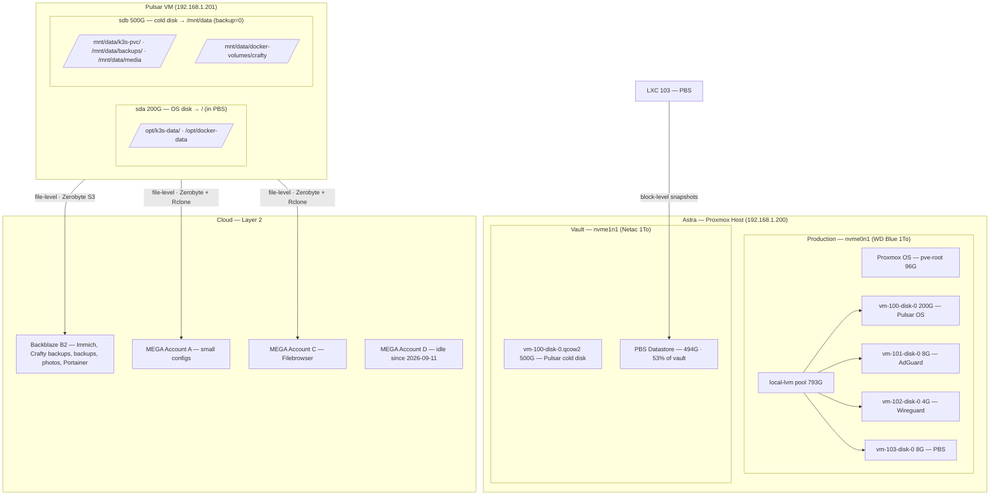

# Backup Architecture — Astra Homelab

> **Status:** Layer 1 operational. Layer 2 in service for every Tier 2 path on `/mnt/data`
> and for the Proxmox configuration; database dumps still missing — see §12.
> **Last updated:** 2026-09-11 (§5 rewritten from the live Zerobyte database; all Crafty
> servers now off-site; `backup=0` applied on Pulsar's cold disk; nightly Proxmox config
> copy in service, §4.2 and §9.4; §2, §3.2, §8.1 remeasured)
> **Language:** English (technical reference)

---

## Table of Contents

1. [Overview](#1-overview)
2. [Physical Infrastructure](#2-physical-infrastructure)
   - 2.1 [Astra — Proxmox Host](#21-astra--proxmox-host)
   - 2.2 [Pulsar — Main VM](#22-pulsar--main-vm)
   - 2.3 [Accepted Constraints](#23-accepted-constraints)
3. [Data Classification Model — 3 Tiers](#3-data-classification-model--3-tiers)
   - 3.1 [Tier Definitions](#31-tier-definitions)
   - 3.2 [Complete Data Inventory](#32-complete-data-inventory)
4. [Layer 1 — Proxmox Backup Server (PBS)](#4-layer-1--proxmox-backup-server-pbs)
   - 4.1 [Mechanism](#41-mechanism)
   - 4.2 [Scope](#42-scope)
   - 4.3 [Retention Policy](#43-retention-policy)
   - 4.4 [Automated Schedule](#44-automated-schedule)
   - 4.5 [RTO / RPO](#45-rto--rpo)
5. [Layer 2 — Zerobyte + Rclone (Cloud)](#5-layer-2--zerobyte--rclone-cloud)
   - 5.1 [Mechanism](#51-mechanism)
   - 5.2 [Cloud Storage Strategy](#52-cloud-storage-strategy)
   - 5.3 [Rclone Remotes](#53-rclone-remotes)
   - 5.4 [Backup Jobs](#54-backup-jobs)
   - 5.5 [RTO / RPO](#55-rto--rpo)
6. [Database Dump Strategy](#6-database-dump-strategy)
7. [Secrets Management](#7-secrets-management)
8. [Storage Layout](#8-storage-layout)
   - 8.1 [Current Layout](#81-current-layout)
9. [Restoration Runbooks](#9-restoration-runbooks)
   - 9.1 [Scenario A — Logical Corruption (service-level)](#91-scenario-a--logical-corruption-service-level)
   - 9.2 [Scenario B — Netac NVMe Failure](#92-scenario-b--netac-nvme-failure)
   - 9.3 [Scenario C — Total Loss of Astra](#93-scenario-c--total-loss-of-astra)
   - 9.4 [Restoring the Proxmox configuration](#94-restoring-the-proxmox-configuration)
10. [Monitoring & Alerts](#10-monitoring--alerts)
11. [Restore Testing](#11-restore-testing)
12. [Pending Tasks & Future Work](#12-pending-tasks--future-work)

---

## 1. Overview

The Astra homelab backup system follows a **3-2-1 strategy** (3 copies, 2 different media types, 1 offsite) implemented across two complementary layers.

| Rule          | Implementation                                                |
| ------------- | ------------------------------------------------------------- |
| **3 copies**  | Production + Layer 1 (PBS, local NVMe) + Layer 2 (cloud)      |
| **2 media**   | NVMe storage + cloud storage (Backblaze B2 and MEGA)          |
| **1 offsite** | Backblaze B2 bucket + MEGA accounts (off-premises)            |

> Not every path gets all three copies. Since 2026-09-11 Pulsar's cold disk (`/mnt/data`) is
> excluded from PBS by decision (§4.2): its Tier 2 content has production + cloud only.

### Architecture Diagram


```mermaid
graph TB
    subgraph ASTRA["Astra — Proxmox Host (192.168.1.200)"]
        subgraph PROD["Production — nvme0n1 (WD Blue 1To)"]
            PVE_OS[Proxmox OS — pve-root 96G]
            LVM[local-lvm pool 793G]
            LVM --> DISK0[vm-100-disk-0 200G — Pulsar OS]
            LVM --> DISK1[vm-101-disk-0 8G — AdGuard]
            LVM --> DISK2[vm-102-disk-0 4G — Wireguard]
            LVM --> DISK3[vm-103-disk-0 8G — PBS]
        end

        subgraph VAULT["Vault — nvme1n1 (Netac 1To)"]
            VAULT_IMAGES[vm-100-disk-0.qcow2 500G — Pulsar cold disk]
            PBS_DS[PBS Datastore — 494G · 53% of vault]
        end
    end

    subgraph PULSAR["Pulsar VM (192.168.1.201)"]
        subgraph SDA["sda 200G — OS disk → / (in PBS)"]
            OPT[/opt/k3s-data/ · /opt/docker-data/]
        end
        subgraph SDB["sdb 500G — cold disk → /mnt/data (backup=0)"]
            MNT[/mnt/data/k3s-pvc/ · /mnt/data/backups/ · /mnt/data/media/]
            CRAFTY_VOL[/mnt/data/docker-volumes/crafty/]
        end
    end

    subgraph CLOUD["Cloud — Layer 2"]
        B2[Backblaze B2 — Immich, Crafty backups, backups, photos, Portainer]
        MEGA_A[MEGA Account A — small configs]
        MEGA_C[MEGA Account C — Filebrowser]
        MEGA_D[MEGA Account D — idle since 2026-09-11]
    end

    PBS_LXC[LXC 103 — PBS] -->|block-level snapshots| PBS_DS
    PULSAR -->|file-level · Zerobyte S3| B2
    PULSAR -->|file-level · Zerobyte + Rclone| MEGA_A
    PULSAR -->|file-level · Zerobyte + Rclone| MEGA_C
```

### Layer Responsibilities

| Layer       | Tool                                         | Level | Purpose                                                           |
| ----------- | -------------------------------------------- | ----- | ----------------------------------------------------------------- |
| **Layer 1** | Proxmox Backup Server (LXC 103)              | Block | Fast local restore from logical corruption or accidental deletion |
| **Layer 2** | Zerobyte + Rclone (Docker Compose on Pulsar) | File  | Offsite disaster recovery — survives total hardware loss          |

---

## 2. Physical Infrastructure

### 2.1 Astra — Proxmox Host

| Disk              | Device    | Mount                    | Role                                           |
| ----------------- | --------- | ------------------------ | ---------------------------------------------- |
| WD Blue SN580 1To | `nvme0n1` | `pve-root` + `local-lvm` | Proxmox OS + VM/LXC virtual disks (production) |
| Netac 1To         | `nvme1n1` | `/mnt/pve/vault`         | Pulsar cold disk (qcow2) + PBS datastore       |

```txt
nvme0n1 (931G)
├── pve-swap        8G
├── pve-root       96G   → Proxmox OS (/etc/pve, /etc/proxmox-backup)
└── pve-data      793G   → local-lvm pool
    ├── vm-100-disk-0   200G  → Pulsar OS disk (= sda in Pulsar)
    ├── vm-101-disk-0     8G  → AdGuard
    ├── vm-102-disk-0     4G  → Wireguard
    └── vm-103-disk-0     8G  → PBS

nvme1n1 (938G — "vault")
├── vm-100-disk-0.qcow2  501G declared / 79G allocated  → Pulsar cold disk (= sdb)
├── template/            4.6G  → ISOs
└── pbs-datastore/       494G  → PBS backup chunks — largest consumer of this disk
```

> **Remeasured 2026-09-11.** `vault`: **578G used (63 %)**, 351G free. A second `fstrim -av`
> on Pulsar, after `/mnt/data/backups` was triaged, shrank the `.qcow2` from 106 571 083 776 to
> **84 823 097 344 bytes** (−20.25 GiB). The datastore grew from 468G to 494G in two days:
> Crafty archives on `sdb` were still being backed up by PBS (see §4.2). `pve-data` is at
> **19.96 %**.

> **Remeasured 2026-09-09.** `vault`: **560G used / 938G (61 %)**, 369G free. The
> `vm-100-state-*.raw` entry listed here previously no longer exists. `pve-data` is at
> **24.5 %** (194.5 / 793.8 GiB) with 370 GiB provisioned — 47 % over-commit, comfortable.
>
> Note the `.qcow2` is *sparse*: 501G declared, **88G actually allocated** after the
> 2026-09-09 `fstrim`. Before that trim it held 225G, of which ~137G was dead space left by
> the deleted Kiwix library — freeing files inside a guest returns nothing to the host until
> `fstrim` issues the TRIM and QEMU punches the holes.

### 2.2 Pulsar — Main VM

Pulsar (VM 100) sees two virtual disks:

| Disk                                       | Proxmox | Device | Mount       | Size | Role                                   | In PBS |
| ------------------------------------------ | ------- | ------ | ----------- | ---- | -------------------------------------- | ------ |
| OS disk (`vm-100-disk-0` on `local-lvm`)   | `scsi0` | `sda`  | `/`         | 200G | OS, hot app data, K3s/Docker state     | ✅     |
| Cold disk (`vm-100-disk-0.qcow2` on vault) | `scsi1` | `sdb`  | `/mnt/data` | 500G | Cold data: media, PVCs, Crafty volumes | ❌ `backup=0` since 2026-09-11, see §4.2 |

```txt
sda (200G) → /
├── /opt/k3s-data/      Hot persistent data for K3s services
├── /opt/docker-data/   Hot persistent data for Docker services
└── /opt/ops/           GitOps repo (astra-ops — also on GitHub)

sdb (500G) → /mnt/data
├── /mnt/data/k3s-pvc/          Cold PVC data for K3s services
├── /mnt/data/docker-volumes/   Cold volume data for Docker services
├── /mnt/data/backups/          Personal backups (manually uploaded via Filebrowser)
└── /mnt/data/media/            Media library (movies, photos, documents)
```

> **Disk usage (measured 2026-09-09):**
> `sda`: **103G used / 195G (55 %)** — 85G free
> `sdb`: **87G used / 492G (19 %)** — 380G free
>
> Of `sdb`'s 87G, roughly **73G is reconstructible or derived** (47G of re-downloadable
> movies, 26G of Crafty archives that are themselves backups). Only about **13G is
> irreplaceable**.
>
> **Remeasured 2026-09-11:** `sda` **107G / 195G (57 %)** · `sdb` **79G / 492G (17 %)**.

### 2.3 Accepted Constraints

The Netac NVMe (`nvme1n1`) hosts both the Pulsar cold disk and the PBS datastore. This means Layer 1 backups and the associated production data reside on the same physical device. A single Netac failure would result in simultaneous loss of Pulsar's cold data AND its Layer 1 backups.

This is a known, accepted constraint given the single-server hardware budget. Layer 2 (cloud) is the mitigation.

> **Revision 2026-09-09 — the mitigation is not fully in service.** Several Layer 2 items in
> §12 remain unchecked, and three directories are bind-mounted into the Zerobyte container
> without a corresponding volume declaration, so they are **never** backed up off-site:
> `/mnt/data/backups`, `/mnt/data/media/photos` and `/opt/docker-data/portainer`. Until
> those are declared, the argument that justifies accepting the co-location does not hold.
>
> **Resolved 2026-09-11.** The three volumes were declared on 2026-09-10 and back up nightly to
> Backblaze. The Crafty backup job, found to cover only one of the three servers, now covers
> all three (§5.4). Every Tier 2 path on the Netac therefore has an off-site copy, which is
> what made it acceptable to exclude `sdb` from PBS (§4.2).
>
> **Also revised 2026-09-09:** hardware expansion is more constrained than assumed. Both M.2
> slots are populated (`lspci` shows two NVMe controllers, both occupied); only **two unused
> SATA ports** remain (`ata1`/`ata2`, both `SATA link down`). A third NVMe is not an option.
>
> **Measured the same day**, the Netac was at **79 % (194 GB free)** and growing at
> **9.38 GiB/day**, projecting saturation around 30 September 2026. Two non-destructive
> reclaims brought it to **61 % (369 GB free)**: `fstrim -av` on Pulsar returned **137 GB**
> of dead space still allocated in the `.qcow2` after the Kiwix deletion, and
> `tune2fs -m 1 /dev/nvme1n1p1` released **38 GB** of ext4 root reserve that PBS — running as
> uid `100034` — could never use. The growth rate is unchanged; see
> `~/.claude/exports/plan-stockage-astra-2026-09-09.md` for the remaining steps.

---

## 3. Data Classification Model — 3 Tiers

### 3.1 Tier Definitions

**Tier 1 — Active System (Layer 1 only)**
Live databases and application runtime state. Backed up exclusively by PBS block-level snapshots. Rclone/Zerobyte does not touch these directly because live databases cannot be safely copied at the file level without risking corruption. They are covered by the DB dump strategy (see §6) which promotes dump outputs to Tier 2 for cloud upload.

**Tier 2 — Critical Vault (Layer 1 + Layer 2)**
Static personal files, cold PVC data, pre-generated database dumps, and other irreplaceable data that is safe to copy at the file level. This is the only data sent to cloud storage.

**Tier 3 — Disposable (No cloud backup)**
Bulk data that is either reconstructible (Minecraft servers, Kiwix ZIM archives) or acceptable to lose and re-download (movies). Tier 3 data on `sda` (Crafty server worlds, container images) is protected by PBS snapshots of the Pulsar VM. Tier 3 data on `sdb` (`/mnt/data`: movies, Crafty logs) has **no backup at all** since `backup=0` was applied on 2026-09-11 — an accepted loss.

### 3.2 Complete Data Inventory

> **Sizes marked `2026-09-09` were remeasured that day; the rest still date from May 2026
> and should be re-checked before being relied on.**

| Service / Path | Location | Size | Tier | Layer 2 | DB dump | Verified |
| -------------- | -------- | ---- | ---- | ------- | ------- | -------- |
| **Vaultwarden** | `/opt/k3s-data/vaultwarden/` | 6.7M | 1 | dump only | SQLite | May 2026 |
| **Immich DB** | `/opt/k3s-data/immich/postgres/` | **295M** | 1 | covered — Immich dumps itself into `library/backups/` | PostgreSQL 14 + vectorchord | 2026-09-09 |
| **Umami DB** | K3s ns `analytics` | not measured | 1 | ❌ none | PostgreSQL 16 | **added 2026-09-09** |
| **Infisical DB** | K3s ns `infisical` | not measured | 1 | ❌ none | PostgreSQL 16 | **added 2026-09-09** |
| **Dawarich DB** | Docker `dawarich_db` | not measured | 1 | ❌ none | PostGIS 17 | **added 2026-09-09** |
| **n8n** | `/opt/k3s-data/n8n/` | 41M | 1 | dump only | SQLite | May 2026 |
| **Scanopy** | `/opt/k3s-data/scanopy/` | 68M | 1 | dump only | PostgreSQL — **no running deployment found on 2026-09-09, confirm before scripting** | May 2026 |
| **Uptimekuma** | `/opt/k3s-data/uptimekuma/` | 231M | 1 | dump only | SQLite | May 2026 |
| **Crowdsec** | `/opt/docker-data/crowdsec/` | 92M | 1 | dump only | SQLite | May 2026 |
| **SFTPgo** | `/opt/k3s-data/sftpgo/` | 380K | 1 | dump only | SQLite | May 2026 |
| **Docker Registry** | `/opt/k3s-data/docker-registry/` | 57M | 1 | ✅ Mega A | — | 2026-09-11 |
| **NPM** | `/opt/docker-data/npm/` | 20M | 1 | dump only | SQLite | May 2026 |
| **Portainer** | `/opt/docker-data/portainer/` | **83M** | 1 | ✅ Backblaze B2 (since 2026-09-10) | BoltDB | 2026-09-11 |
| **Filebrowser Quantum** | `/opt/k3s-data/filebrowser-quantum/` | 896K | 1 | dump only | SQLite | May 2026 |
| **Ntfy** | `/opt/k3s-data/ntfy/` | 160K | 1 | dump only | SQLite | May 2026 |
| `/etc/pve/` | Astra host | ~5M | 1 | ❌ not yet | — | May 2026 |
| `/etc/proxmox-backup/` | LXC 103 | **60K** | 1 | ❌ not yet | — | 2026-09-09 |
| **Immich photos** | `/opt/k3s-data/immich/library/` | **31G** | 2 | ✅ Backblaze B2 | — | 2026-09-09 |
| **Filebrowser files** | `/mnt/data/k3s-pvc/filebrowser/` | **4.7G** | 2 | ✅ Mega C | — | 2026-09-11 |
| **Homer config** | `/opt/k3s-data/homer/` | 5.3M | 2 | ✅ Mega A | — | May 2026 |
| **Criteri-fresque** | `/opt/k3s-data/criteri-fresque/` | 38M | 2 | ✅ Mega A | — | May 2026 |
| **Personal backups** | `/mnt/data/backups/` | **102M** — `OnePlus-10T/` only | 2 | ✅ Backblaze B2 (since 2026-09-10) | — | 2026-09-11 |
| **Photos** | `/mnt/data/media/photos/` | **946M** | 2 | ✅ Backblaze B2 (since 2026-09-10) | — | 2026-09-11 |
| **DB dumps** | `/mnt/data/backups/dumps/` | — | 2 | ❌ directory does not exist | — | 2026-09-09 |
| **Secrets** | `~/astra-secrets/` (workstation) | ~1M | 2 | ❌ not yet | — | May 2026 |
| **Crafty backups** | `/mnt/data/docker-volumes/crafty/backups/` | **26G** | 2 | ✅ Backblaze B2 — all 3 servers (since 2026-09-11) | — | 2026-09-11 |
| **Crafty config** | `/opt/docker-data/crafty/config/` | **169M** | 2 | ✅ Mega A | — | 2026-09-09 |
| **Crafty servers** | `/opt/docker-data/crafty/servers/` | **17G** | ❌ 3 | — | — | 2026-09-09 |
| **Crafty logs** | `/mnt/data/docker-volumes/crafty/logs/` | **430M** | ❌ 3 | — | — | 2026-09-09 |
| **Portracker** | `/opt/docker-data/portracker/` | 68K | ❌ 3 | — | — | May 2026 |
| **Kiwix ZIM** | `/mnt/data/k3s-pvc/kiwix/` | **empty** — 136G deleted 2026-09-09 | ❌ 3 | — | — | 2026-09-09 |
| **Movies** | `/mnt/data/media/movies/` | **47G** (19 files) | ❌ 3 | — | — | 2026-09-09 |

> **Resolved 2026-09-10 — the three "mounted, never declared" paths.** Portainer, personal
> backups and photos were bind-mounted into Zerobyte but had no matching *volume*, so no job
> ever backed them up. `/mnt/data/backups/` was triaged first (8.8G → 102M: a redundant
> Minecraft archive and a plaintext password export were deleted), then all three were
> declared. A mount makes a path visible to Zerobyte; only a *schedule* backs it up.
>
> **Growth driver, measured 2026-09-09, revised 2026-09-11:** Crafty produced **28.6 GiB/week**
> of new `.zip` archives. By volume the largest producer was **Survie Gay** (~2.9 GiB/day),
> not the daily Roots SMP (~1.5 GiB/day). Survie Gay and Nous Deux are no longer played; their
> Crafty backup schedules were paused on 2026-09-11, leaving only Roots SMP's daily archive.

---

## 4. Layer 1 — Proxmox Backup Server (PBS)

### 4.1 Mechanism

PBS (LXC 103 on Astra) operates at the **block level**. It uses QEMU dirty bitmaps to track modified storage blocks since the last backup. Only changed blocks are transferred — no full copies after the first run.

Data is hashed, deduplicated, and compressed with **ZSTD** on the fly before being written to the datastore. Backups are taken in **snapshot mode**: the hypervisor momentarily freezes VM/LXC state (RAM + filesystem), reads the data, then releases the snapshot. Services continue running with no downtime.

Datastore location: `/mnt/pve/vault/` (Netac NVMe, `nvme1n1`).

### 4.2 Scope

| Guest     | ID  | Type | Included                  |
| --------- | --- | ---- | ------------------------- |
| Pulsar    | 100 | VM   | ✅ OS disk `scsi0` only — cold disk `scsi1` set to `backup=0` (applied 2026-09-11 11:21) |
| AdGuard   | 101 | LXC  | ✅                        |
| Wireguard | 102 | LXC  | ✅                        |
| PBS       | 103 | LXC  | ❌ Excluded by design     |

**Why Pulsar's cold disk is excluded (decided 2026-09-11).** `scsi1` is a `.qcow2` file on the
Netac, and PBS wrote its backup to a datastore on the same Netac. That copy never protected
against the drive failing — only against accidental deletion, which Zerobyte already covers
for every Tier 2 path on `/mnt/data` (§3.2). Meanwhile each new Crafty `.zip` was stored twice
on the drive: once in the `.qcow2`, once as fresh PBS chunks (the datastore grew 26G in two
days). What loses its only backup: movies (47G, re-downloadable) and Crafty logs.

- VM backups cannot exclude directories. `vzdump`'s `exclude-path` applies to containers
  only; for a VM the unit of exclusion is a whole disk (`backup=<1|0>` on `scsi[n]`).
  A dedicated third virtual disk for Crafty archives was considered and rejected as too
  much work for what it would keep.
- Existing snapshots that include `scsi1` are **not** removed immediately; they age out
  through the retention policy (§4.3), up to ~6 months for the monthly ones.
- **Restore caution:** the documentation does not say what happens to an excluded disk when a
  VM is restored over itself. Restore Pulsar to a **new VMID**, never over VM 100.
- Applied in the UI on 2026-09-11 at 11:21 (VM 100 → Hardware → `scsi1` → Edit → Advanced →
  uncheck *Backup*). Verify with `qm config 100 | grep scsi1`, which must end in `backup=0`.

PBS (LXC 103) is intentionally excluded — but **not** for the reason previously given here.

> **Correction, 2026-09-09.** This section used to claim that backing up the PBS container
> would "create circular I/O dependencies". That is **false**. LXC 103 reaches its datastore
> through a *bind mount* (`mp0: /mnt/pve/vault/pbs-datastore,mp=/mnt/datastore`), and the
> Proxmox VE documentation is explicit: *"The contents of bind mount points are not backed up
> when using vzdump."* The `backup=1` option exists only for **volume** mount points. A
> `vzdump` of LXC 103 would therefore capture its 8 GB rootfs and nothing else — no recursion
> is possible.

The real reason to exclude it: a backup of LXC 103 would live **inside the datastore it is
meant to help rebuild**, making it useless in the one scenario that matters — loss of the
Netac drive. And it is unnecessary, because the datastore is self-describing: point a fresh
PBS install at the existing directory (or pass `reuse-datastore`) and every chunk and index
is recovered.

What genuinely needs protecting is the **configuration**, which is *not* in the datastore —
about **60 KB** in `/etc/proxmox-backup/`:

| File | Lost without it |
| ---- | --------------- |
| `datastore.cfg` | datastore definition, GC schedule (`Sun 05:00`) |
| `verification.cfg` | the `verify-weekly` job |
| `prune.cfg` | retention policy |
| `notifications.cfg` + `notifications-priv.cfg` | the Resend notification target |
| `user.cfg`, `acl.cfg`, `shadow.json` | accounts, permissions, password hashes |
| `authkey.key`, `csrf.key`, `proxy.pem` | API tokens and TLS certificate |

#### Proxmox configuration copy — in service since 2026-09-11

A nightly job on Astra copies both configurations to Pulsar, where Zerobyte job 13
(**Backups**) ships them to Backblaze at 02:00 — no new Zerobyte volume was needed.

| Piece | Where | What it does |
| --- | --- | --- |
| Script | `infra/astra/proxmox-config-backup.sh` → `/usr/local/sbin/proxmox-config-backup` on Astra | stages the copy in `/run` (tmpfs), then rsyncs it to Pulsar with `--delete` |
| Timer | `infra/astra/proxmox-config-backup.{service,timer}` | daily at **01:30**, `Persistent=true` (catches up at boot) |
| Destination | `/mnt/data/backups/proxmox-configs/` on Pulsar | owned by `astra-configs`, directories `700`, files `600` |
| Alerting | Uptime Kuma push monitor **Proxmox Config Backup** | `up` on success, `down` on any failure, alert on Discord if no push for 25 h (§10) |

What the copy holds (~70 KB):

| Folder | Content | Used for |
| --- | --- | --- |
| `pve/` | `/etc/pve` as readable files (runtime dotfiles and `priv/lock/` skipped) | reading or re-creating a single setting |
| `pmxcfs/config.db` | the pmxcfs database, copied with `sqlite3 .backup` and integrity-checked | the official full recovery (§9.4) |
| `pbs/proxmox-backup/` | `/etc/proxmox-backup` from LXC 103 (lock files skipped) | rebuilding PBS (§9.4) |
| `host/` | `/etc/hostname`, `/etc/hosts`, `/etc/network/interfaces`, `/etc/fstab`, `mnt-pve-vault.mount` | identity, network and `vault` mount of Astra |
| `MANIFEST.txt` | date, `pveversion -v`, `proxmox-backup-manager versions` | reinstalling the same versions first |

**Transport.** Astra pushes; Pulsar never gets any access to Astra. Root on Astra uses a
dedicated key (`/root/.ssh/proxmox-config-backup_ed25519`) and a pinned host key
(`/root/.ssh/proxmox-config-backup_known_hosts`). On Pulsar, the system account
`astra-configs` (shell `dash`, root-owned home and `authorized_keys`) accepts that key only as:

```
restrict,from="192.168.1.200",command="rrsync -wo /mnt/data/backups/proxmox-configs" ssh-ed25519 …
```

Verified on 2026-09-11: an interactive shell, an arbitrary command, reading back, a path
outside the directory (`..`) and both port-forwarding directions are refused; writing works.
This does not protect Pulsar from a compromised Astra (the hypervisor owns the VM anyway); it
confines a script mistake or a leaked key to one directory.

**Secrets.** The copy contains private keys, password hashes, the PBS storage password and
the Resend API key. They are protected by file permissions on Pulsar and by restic encryption
off-site — no second encryption layer, since Zerobyte on Pulsar already holds the keys to
every repository. The push URL lives in `/etc/default/proxmox-config-backup` (root, `600`),
outside this repository.

**Failure behaviour.** Every step runs under `set -e` and the transfer comes last: if one step
fails (integrity check, LXC 103 stopped…), nothing is sent and Pulsar keeps the last good copy.

### 4.3 Retention Policy

| Window      | Copies kept |
| ----------- | ----------- |
| Most recent | 3           |
| Daily       | 7 days      |
| Weekly      | 4 weeks     |
| Monthly     | 6 months    |

### 4.4 Automated Schedule

All jobs run nightly during low-activity periods:

| Time         | Job                | Description                                                        |
| ------------ | ------------------ | ------------------------------------------------------------------ |
| 03:00 daily    | Backup             | PBS snapshots Pulsar, AdGuard, Wireguard                           |
| 04:00 daily    | Prune              | Retention policy applied; old index entries dereferenced logically |
| 05:00 Saturday | Verify             | `verify-weekly` re-reads the chunks and checks their checksums     |
| 05:00 Sunday   | Garbage Collection | Orphaned data chunks physically deleted from disk                  |

> Read from the live configuration on 2026-09-11 (`vzdump` job, `prune.cfg`,
> `verification.cfg`, `datastore.cfg`). Keep heavy jobs that read the Netac — Zerobyte's
> Crafty upload, manual `fstrim` — out of the 03:00–05:59 window.

### 4.5 RTO / RPO

| Metric              | Value            | Notes                                                          |
| ------------------- | ---------------- | -------------------------------------------------------------- |
| **RPO**             | ≤ 24 hours       | Daily backup at 03:00; worst case = ~23h of data loss          |
| **RTO**             | 30 min – 2 hours | Depends on VM size and disk throughput (~400–500 MB/s on NVMe) |
| **Backup duration** | ~15–45 min       | Incremental after first run; full first backup is longer       |

---

## 5. Layer 2 — Zerobyte + Rclone (Cloud)

### 5.1 Mechanism

Zerobyte is a self-hosted backup automation tool running as a **Docker Compose service on Pulsar**. It provides a web UI over **Restic**, handling scheduling, retention, and monitoring.

Restic operates at the **file level**: it chunks files, deduplicates content across snapshots, compresses with ZSTD, and encrypts with AES-256 before uploading. Rclone provides the transport layer, mapping Restic's backend protocol to MEGA's API. Backblaze B2 is reached directly through Restic's S3 backend, without Rclone.

Because Restic cuts files by **content**, identical files cost nothing twice: on 2026-09-11 the first Crafty upload read 25.2 GiB and stored 12.0 GiB, as the five byte-identical Nous Deux archives were stored once. PBS, which cuts a disk into fixed blocks, gets almost no such benefit from new `.zip` files.

### 5.2 Cloud Storage Strategy

> **Rewritten 2026-09-11 from the live Zerobyte database.** The previous version described an
> all-MEGA design (`mega-a` + `mega-b` mirrors, ~20G each) that was never deployed as written.

Two providers, with a clear split:

- **Backblaze B2** — bucket `astra-pulsar-backup`, about **$0.006/GB/month**, no size limit.
  Everything large or growing goes here. Two safeguards: the account's spending cap (*Caps &
  Alerts*) must be raised before adding a large job — it blocked the first Immich upload on
  2026-09-09 — and the bucket lifecycle rule `daysFromHidingToDeleting: 1` makes deleted
  data disappear the next day. Zerobyte's S3 connector has no path field, so one Zerobyte
  repository = one bucket.
- **MEGA** free accounts (20 GB each) — small, slowly-changing data only. A full MEGA account
  fails **silently**: Mega B overflowed on 2026-09-03 and nobody noticed. Nothing that grows
  is sent to MEGA.

| Zerobyte repository | Backend | Used (Zerobyte stats, 2026-09-11) | Snapshots | Holds |
| ------------------- | ------- | --------------------------------- | --------- | ----- |
| **Backblaze** | S3 (B2) | **43.4 GiB** (~$0.28/month) | 7 | Immich, Crafty backups, personal backups, photos, Portainer |
| **Mega A** | rclone `mega-a` | 113 MiB | 44 | Homer, Criteri'Fresque, Crafty config, Docker Registry |
| **Mega C** | rclone `mega-c` | 3.7 GiB | 11 | Filebrowser files |
| **Mega D** | rclone `mega-d` | 874 MiB | 7 | old Nous Deux snapshots only — its job was disabled on 2026-09-11 |
| Mega B | rclone `mega-b` | — | 10 | **retired** 2026-09-09: removed from Zerobyte, left intact on MEGA, readable with `restic --no-lock` |
| `test-backblaze`, `test-local` | — | negligible | — | test repositories |

**Tier 3 data (Kiwix, movies, Crafty server worlds, logs) receives no cloud backup.** Movies
and Kiwix are re-downloadable. Crafty worlds reach the cloud indirectly, through the `.zip`
archives Crafty makes of them (Crafty backups job below).

### 5.3 Rclone Remotes

Rclone must be configured on the Pulsar host before the Zerobyte container starts. The rclone config is bind-mounted read-only into the container.

```bash
# Install rclone on Pulsar
curl https://rclone.org/install.sh | sudo bash

# Configure each MEGA remote interactively
rclone config
# → New remote → name: mega-a → type: mega → authenticate

# Verify
rclone listremotes
# mega-a:
# mega-b:   (retired — kept only to read the old snapshots)
# mega-c:
# mega-d:
# backblaze-test:
```

The Zerobyte container mounts the rclone config from a path set in its `.env`
(`docker/zerobyte/docker-compose.yml`):

```yaml
volumes:
  - ${RCLONE_CONFIG_PATH}:/root/.config/rclone:ro
```

The Backblaze repository does not use Rclone: its S3 endpoint and key are stored in
Zerobyte's own (encrypted) configuration.

### 5.4 Backup Jobs

Jobs ("schedules") are defined in the Zerobyte web UI at `zerobyte.lan`. Each one links a
**volume** (a directory bind-mounted into the container, see `docker-compose.yml`) to a
**repository**. Declaring a volume alone backs up nothing.

State read from `zerobyte.db` on 2026-09-11. Times are Europe/Paris (the container's `TZ`).
Every active job keeps **7 daily, 4 weekly, 3 monthly** snapshots and was in `success`.

| id | Schedule | Host path | Repository | Cron | State |
| -- | -------- | --------- | ---------- | ---- | ----- |
| 4  | Homer | `/opt/k3s-data/homer` | Mega A | `00 01 * * *` | active |
| 6  | Criteri'Fresque | `/opt/k3s-data/criteri-fresque` | Mega A | `00 01 * * *` | active |
| 7  | Crafty Config | `/opt/docker-data/crafty/config` | Mega A | `00 01 * * *` | active |
| 11 | Docker Registry | `/opt/k3s-data/docker-registry` | Mega A | `00 01 * * *` | active |
| 12 | Portainer | `/opt/docker-data/portainer` | Backblaze | `00 01 * * *` | active — created 2026-09-10 |
| 8  | Immich Library | `/opt/k3s-data/immich/library` | Backblaze | `00 02 * * *` | active |
| 10 | Filebrowser Files | `/mnt/data/k3s-pvc/filebrowser` | Mega C | `00 02 * * *` | active |
| 13 | Backups | `/mnt/data/backups` | Backblaze | `00 02 * * *` | active — created 2026-09-10 |
| 14 | Photos | `/mnt/data/media/photos` | Backblaze | `00 02 * * *` | active — created 2026-09-10 |
| 15 | Crafty Backups | `/mnt/data/docker-volumes/crafty/backups` (all servers) | Backblaze | `00 06 * * *` | active — created 2026-09-11 |
| 9  | Crafty Backups (MEGA) | same volume, Nous Deux folder only | Mega D | `00 03 * * 0` | **disabled** 2026-09-11 |

- **Jobs starting at the same minute on the same repository are fine.** Zerobyte runs the
  backups in parallel and only queues the retention `forget` runs, one per repository. Four
  Mega A jobs have started at the same second every night without failure.
- **Crafty Backups runs at 06:00** because Crafty writes Roots SMP's archive at 04:00: earlier
  would upload the previous day's archive, 04:00 itself could catch a half-written `.zip`, and
  05:00 belongs to PBS verify/GC on the same drive.
- **Why job 9 was replaced:** it was restricted by `include_paths` to Nous Deux
  (`9ca997b5-…`), so **Survie Gay and Roots SMP had no off-site copy until 2026-09-11**. Crafty
  names archive folders by server UUID, not by name:

| UUID | Crafty server | Crafty archive schedule (2026-09-11) |
| ---- | ------------- | ------------------------------------ |
| `9ca997b5-937f-4fbd-bf5c-95f5eb06cfb2` | Nous Deux | paused (world unchanged since 2026-08-15), keeps 2 |
| `69dc796b-62cf-450b-a846-48893db1a6cd` | Survie Gay | paused (world unchanged since 2026-09-07), keeps 2 |
| `c5da3465-e127-4ad2-9d36-bd313bf3eebe` | Roots SMP (SMP 26.2) | daily 04:00, keeps 3 |

#### Planned jobs — not created yet

| Job | Source | Blocker |
| --- | ------ | ------- |
| Database dumps | `/mnt/data/backups/dumps/` | the dump script (§6) does not exist |

> The Proxmox configuration needs no job of its own: Astra copies it nightly into
> `/mnt/data/backups/proxmox-configs/`, which the existing **Backups** job (13) already covers
> (§4.2).

### 5.5 RTO / RPO

| Metric              | Value            | Notes                                                     |
| ------------------- | ---------------- | --------------------------------------------------------- |
| **RPO**             | ≤ 24 hours       | Daily jobs; worst case = ~23h of data loss                |
| **RTO**             | 4–24 hours       | Depends on bandwidth and total data size (~50G across all repositories) |
| **Backup duration** | seconds – minutes | Nightly runs take 3–30 s; a first upload takes minutes (Crafty: 12 GiB in 201 s) |

> **Known gap — Zerobyte cannot restore in place today.** Every data mount in
> `docker-compose.yml` is `:ro`, so the container has no writable target. Add a writable
> restore directory (for example `/mnt/data/restore:/restore`) before you need it.

---

## 6. Database Dump Strategy

Live databases cannot be safely copied at the file level while running — doing so risks backing up a partially-written, corrupt state. Instead, a dump script runs **before** Zerobyte jobs and writes cold, consistent export files to `/mnt/data/backups/dumps/`. Zerobyte then backs up this directory as part of the `tier2-db-dumps` job.

> **Phase:** DB dump automation is planned for a future phase. Current Layer 2 setup covers file-based data only.

### Services Requiring Dumps

| Service             | DB Type    | Active Data Path                     | Dump Command                                                                                                     | Dump Output                                                |
| ------------------- | ---------- | ------------------------------------ | ---------------------------------------------------------------------------------------------------------------- | ---------------------------------------------------------- |
| Immich              | PostgreSQL | `/opt/k3s-data/immich/`              | `pg_dump -U immich immich > immich.sql`                                                                          | `/mnt/data/backups/dumps/immich.sql`                       |
| Scanopy             | PostgreSQL | `/opt/k3s-data/scanopy/`             | `pg_dump -U scanopy scanopy > scanopy.sql`                                                                       | `/mnt/data/backups/dumps/scanopy.sql`                      |
| Vaultwarden         | SQLite     | `/opt/k3s-data/vaultwarden/`         | `sqlite3 db.sqlite3 .dump > vaultwarden.sql`                                                                     | `/mnt/data/backups/dumps/vaultwarden.sql`                  |
| n8n                 | SQLite     | `/opt/k3s-data/n8n/`                 | `sqlite3 database.sqlite .dump > n8n.sql`                                                                        | `/mnt/data/backups/dumps/n8n.sql`                          |
| Uptimekuma          | SQLite     | `/opt/k3s-data/uptimekuma/`          | `sqlite3 kuma.db .dump > uptimekuma.sql`                                                                         | `/mnt/data/backups/dumps/uptimekuma.sql`                   |
| Crowdsec            | SQLite     | `/opt/docker-data/crowdsec/`         | `sqlite3 crowdsec.db .dump > crowdsec.sql`                                                                       | `/mnt/data/backups/dumps/crowdsec.sql`                     |
| SFTPgo              | SQLite     | `/opt/k3s-data/sftpgo/`              | `sqlite3 sftpgo.db .dump > sftpgo.sql`                                                                           | `/mnt/data/backups/dumps/sftpgo.sql`                       |
| NPM                 | SQLite     | `/opt/docker-data/npm/`              | `sqlite3 /data/database.sqlite .dump > npm.sql`                                                                  | `/mnt/data/backups/dumps/npm.sql`                          |
| Filebrowser Quantum | SQLite     | `/opt/k3s-data/filebrowser-quantum/` | `sqlite3 /data/database.db .dump > filebrowser-quantum.sql`                                                      | `/mnt/data/backups/dumps/filebrowser-quantum.sql`          |
| Ntfy                | SQLite     | `/opt/k3s-data/ntfy/`                | `sqlite3 /var/cache/ntfy/cache.db .dump > ntfy-cache.sql && sqlite3 /var/lib/ntfy/user.db .dump > ntfy-user.sql` | `/mnt/data/backups/dumps/ntfy-cache.sql` + `ntfy-user.sql` |

> If additional services with databases are added in the future, add them to this table and to the dump script. The script itself should run at 01:00 daily (before the `tier2-db-dumps` Zerobyte job at 01:30).

### Dump Script Location

The script lives at `/opt/ops/docker/zerobyte/dump-databases.sh` and is executed by a systemd timer on Pulsar (or a cron job). It must run inside or alongside the relevant containers to access the database files.

---

## 7. Secrets Management

K3s application secrets (`secrets.yaml`, `.env` files) are **never committed to the astra-ops Git repository** (enforced by `.gitignore`). They are maintained locally on the operator's workstation.

### Current Setup

Secrets are stored in `~/astra-secrets/` on the operator's computer and applied manually to the K3s cluster:

```bash
kubectl apply -f ~/astra-secrets/<service>/secrets.yaml
```

### Planned — rclone Sync to MEGA

To protect secrets against workstation loss, they will be encrypted and synced to MEGA using `rclone crypt`:

```bash
# Configure encrypted remote on top of existing mega-a
rclone config
# → New remote → name: mega-a-crypt → type: crypt
# → Remote: mega-a:astra-secrets-encrypted
# → Filename encryption: standard
# → Set password

# Sync encrypted secrets
rclone sync ~/astra-secrets mega-a-crypt: \
  --backup-dir mega-a:astra-secrets-old \
  --suffix "-$(date +%Y%m%d)"
```

This sync will be automated via a **systemd timer on my workstation** (daily or on significant changes). Versioned old copies are kept for 30 days in the `astra-secrets-old` prefix.

---

## 8. Storage Layout

### 8.1 Current Layout

```txt
Pulsar /opt/ (sda — hot)          103G used / 195G (55 %)   [2026-09-09]
├── k3s-data/
│   ├── immich/            32G   ├── library/upload   29G   (Tier 2)
│   │                            ├── library/thumbs  1.5G   (Tier 3, regenerable)
│   │                            ├── model-cache     786M   (Tier 3, re-downloaded)
│   │                            └── postgres        295M   (Tier 1)
│   ├── uptimekuma/       231M
│   ├── scanopy/           68M
│   ├── docker-registry/   57M
│   ├── n8n/               41M
│   ├── criteri-fresque/   38M
│   ├── vaultwarden/      6.7M
│   ├── homer/            5.3M
│   ├── filebrowser-quantum/ 896K · sftpgo/ 380K · ntfy/ 160K
│   └── diun/ 536K · convertx/ 356K · filebrowser/ 64K
├── docker-data/
│   ├── crafty/            17G   └── servers/ 17G (Tier 3) · config/ 169M (Tier 2)
│   ├── portainer/         83M   (Tier 1) → Backblaze since 2026-09-10
│   ├── crowdsec/          92M
│   ├── npm/               20M
│   └── portracker/        68K
└── ops/                   11M   GitOps clone (also on GitHub)

  Not application data, but the bulk of this disk:
  /var/lib/rancher/k3s/.../containerd  25G   container images (reconstructible)
  /var/lib/containerd                  13G   second image store (reconstructible)
  /var/lib/docker                     8.0G   (reconstructible)
  /swap.img 4.1G · /usr 3.6G · /var/log 2.7G

Pulsar /mnt/data/ (sdb — cold)     79G used / 492G (17 %)   [2026-09-11]
                                   not in PBS since backup=0, 2026-09-11 (§4.2)
├── media/
│   ├── movies/            47G   (Tier 3 — 19 re-downloadable files, no backup)
│   └── photos/           946M   (Tier 2) → Backblaze since 2026-09-10
├── docker-volumes/crafty/
│   ├── backups/           26G   (Tier 2) → Backblaze since 2026-09-11, all 3 servers
│   └── logs/             432M   (Tier 3, no backup)
├── backups/              102M   (Tier 2) → Backblaze since 2026-09-10
│   ├── OnePlus-10T/      102M   phone backup (irreplaceable) — the 8.7G Minecraft
│   │                            archive and a password export were deleted 2026-09-10
│   └── proxmox-configs/   70K   Astra + PBS configuration, refreshed nightly (§4.2)
└── k3s-pvc/
    ├── filebrowser/      4.7G   (Tier 2) → Mega C
    ├── crafty/            92K
    └── kiwix/            empty  (136G deleted 2026-09-09)
```

---

## 9. Restoration Runbooks

### 9.1 Scenario A — Logical Corruption (service-level)

**Trigger:** A service is broken, a database is corrupted, or files were accidentally deleted. The Astra host and Netac NVMe are healthy.

**Recovery via Layer 1 (PBS):**

1. Access PBS web UI at `pbs.enoal.fr` (or directly at the LXC IP).
2. Navigate to the relevant datastore → find the most recent healthy snapshot of Pulsar (VM 100).
3. If restoring the entire VM: Proxmox UI → VM 100 → Backups → Restore — **to a new VMID**.
   Snapshots taken after `backup=0` do not contain `scsi1`, and the documentation does not say
   what an in-place restore does to an excluded disk (§4.2).
4. If restoring individual files: use `proxmox-backup-client` to mount the snapshot and extract specific paths.

```bash
# Mount a specific PBS snapshot on Astra
proxmox-backup-client mount \
  --repository user@pbs-host:datastore \
  <snapshot-id> /mnt/restore-point

# Extract specific directory
cp -r /mnt/restore-point/mnt/data/k3s-pvc/immich/ /mnt/data/k3s-pvc/immich-restored/
```

1. Restart the affected service.
2. Validate service health.

**Files under `/mnt/data`** are no longer in PBS since `backup=0` (2026-09-11): restore them from
Zerobyte (§5.4), after adding a writable restore target (§5.5).

**Estimated time:** 15 min – 1 hour depending on restore scope.

---

### 9.2 Scenario B — Netac NVMe Failure

**Trigger:** `nvme1n1` (Netac) fails. Both Pulsar's cold disk (`/mnt/data`) and the PBS datastore are lost simultaneously.

**What is lost:**

- `/mnt/data/` contents (cold PVCs, media, backups)
- All Layer 1 PBS snapshots

**What survives:**

- Pulsar OS disk (`sda`, on `nvme0n1`) — `/opt/k3s-data/`, `/opt/docker-data/`, running services
- Layer 2 cloud backups (Backblaze B2, MEGA)

**Recovery steps:**

1. Replace Netac NVMe with a new drive.
2. In Proxmox, create a new storage pool on the new drive (e.g., `vault`).
3. Create a new PBS LXC (ID 103) and point it to the new datastore — no historical backups, but PBS is operational again.
   Restore its configuration (users, retention, verify job, notifications) from the Proxmox config copy (§9.4).
4. Add the new drive as a second disk to Pulsar (Proxmox UI → VM 100 → Hardware → Add → Hard Disk).
5. Inside Pulsar, format and mount the new disk at `/mnt/data`.
6. Restore Tier 2 data via Zerobyte:
   - Give the container a writable restore target first (§5.5)
   - Access Zerobyte UI at `zerobyte.lan`
   - Pick the repository that holds the path (§5.4): **Backblaze** for `backups/`,
     `media/photos/` and Crafty backups, **Mega C** for Filebrowser
   - Browse snapshots and restore to `/mnt/data/`
   - Movies and Crafty logs are not backed up anywhere: re-download or accept the loss
7. Restore directory structure (`k3s-pvc/`, `backups/`, `media/`, etc.).
8. Restart services that depend on `/mnt/data/` mounts.

**Estimated time:** 4–24 hours (depends on total data size ~35G for `/mnt/data` and bandwidth).

---

### 9.3 Scenario C — Total Loss of Astra

**Trigger:** Complete hardware failure, theft, fire, or similar. The entire Astra node is gone.

**What survives:**

- Layer 2 cloud backups (Backblaze B2, MEGA) — all Tier 2 data
- The `astra-ops` GitOps repository (GitHub) — all manifests, Helm charts, configurations
- K3s secrets on the operator's computer

**Recovery steps:**

1. Provision a new server (or reinstall on repaired hardware).
2. Install Proxmox VE — the version recorded in the config copy's `MANIFEST.txt`.
3. Recreate the VM/LXC structure from the Proxmox config copy (§9.4). **Catch:** that copy
   sits in Backblaze, and opening it takes the B2 key and Zerobyte's restic password — both
   live only on Pulsar today. Without them off-Astra (§12, Phase 3), fall back to the
   `astra-ops` README and this document.
4. Create Pulsar VM (Ubuntu Server), install K3s and Docker.
5. Install Zerobyte (Docker Compose in `docker/zerobyte/`).
6. Configure rclone remotes (`mega-a`, `mega-c`, `mega-d`) on the new Pulsar, and re-create
   the Backblaze S3 repository in Zerobyte with the B2 key.
7. Restore Tier 2 data from Backblaze and MEGA via Zerobyte.
8. Apply K3s secrets from the operator's computer:

   ```bash
   kubectl apply -f ~/astra-secrets/<service>/secrets.yaml
   ```

9. Bootstrap ArgoCD and the App-of-Apps:

   ```bash
   kubectl apply -f /opt/ops/infra/argocd/root-app.yaml
   ```

10. ArgoCD will deploy all K3s services automatically from GitHub.
11. Restore Docker Compose stacks via Portainer.
12. Validate all services via Uptime Kuma and Homer dashboard.

**Estimated time:** 1–3 days for full restoration.

---

### 9.4 Restoring the Proxmox configuration

**Where to get it:** `/mnt/data/backups/proxmox-configs/` on Pulsar if it survived, otherwise
Zerobyte job 13 (**Backups**, repository **Backblaze**) — pick a snapshot from before the
incident, since the nightly copy mirrors the current state with `--delete`.

**Proxmox VE — full recovery** (`pmxcfs` documentation, section *Recovery*), on a fresh
install with nothing running:

1. Install the Proxmox VE version listed in `MANIFEST.txt`.
2. `systemctl stop pve-cluster`
3. Copy `pmxcfs/config.db` to `/var/lib/pve-cluster/config.db` and set it to `0600`, owned by root.
4. Adapt `/etc/hostname` and `/etc/hosts` from `host/`, and `/etc/network/interfaces` if the
   hardware (NIC names) is the same.
5. Reboot, then check storage, VMs and LXCs — the disks themselves come from PBS or Layer 2.

For a single setting, read the matching file under `pve/` instead.

**Proxmox Backup Server** — in a fresh LXC with the same PBS version, stop
`proxmox-backup-proxy` and `proxmox-backup`, copy `pbs/proxmox-backup/*` into
`/etc/proxmox-backup/`, and restore the original ownership, which the copy does not keep
(every file arrives as `600`):

| Files | Owner | Mode |
| --- | --- | --- |
| `authkey.key`, `notifications-priv.cfg`, `shadow.json` | `root:root` | `600` |
| every other file (`*.cfg`, `authkey.pub`, `csrf.key`, `proxy.key`, `proxy.pem`) | `root:backup` | `640` |
| the directory `/etc/proxmox-backup` | `backup:backup` | `700` |

Then start both services again. The datastore itself is self-describing (§4.2).

---

## 10. Monitoring & Alerts

| Component               | Monitoring Method                  | Alert Channel          |
| ----------------------- | ---------------------------------- | ---------------------- |
| Zerobyte job failures   | Zerobyte built-in notifications    | Discord webhook — ⚠️ **broken for long messages** (below) |
| PBS backup job status   | PBS notifications                  | Email via Resend (configured 2026-09-09) |
| Proxmox config copy     | Uptime Kuma push monitor (§4.2)    | Discord (`APS #monitoring`): `down` pushed on failure, or no push for 25 h |
| Disk usage — `vault`    | Beszel agent on Astra, drop-in below | Discord (`APS #monitoring`, Beszel webhook): above 75 % |
| Disk usage — Pulsar sda | Beszel agent on Pulsar             | Discord (Beszel): above 85 % |
| LXC 101 `adguard`       | Beszel agent in the container      | Discord (Beszel): disk or memory above 80 % |
| AdGuard DNS answers     | Uptime Kuma DNS monitor **AdGuard DNS**: resolves `beszel.lan` through `192.168.1.202` | Discord (`APS #monitoring`) |
| LXC 103 `pbs`           | Beszel agent in the container      | Discord (Beszel): disk above 80 %, memory above 80 % for 10 min |
| Cloud storage usage     | MEGA web UI · B2 *Caps & Alerts*   | Manual quarterly check · B2 spending cap |

> **Until 2026-09-11 no disk alert existed.** Dashdot only draws graphs: `vault` reached 79 %
> and LXC 101 95 % without a single message. The Beszel alerts above replace it.

> **Beszel keeps one disk alert per machine, and it fires on the fullest disk.** The agent on
> Astra only reports `/` until told otherwise; the drop-in
> [`infra/astra/beszel-agent.service.d/extra-filesystems.conf`](../infra/astra/beszel-agent.service.d/extra-filesystems.conf)
> adds `/mnt/pve/vault`. With `/` at 14 % and `vault` at 62 %, the 75 % rule is in practice a
> `vault` rule. The alert message names the machine, not the disk.

> **`local-lvm` has no alert, on purpose.** A thin pool has no file system, so Beszel cannot
> see it, and its `Data%` counts every block ever written, not what the guests use. Measured
> 2026-09-11: 378G provisioned on a 794G pool, `Data` 20 %, `Meta` 0.93 %. The pool cannot
> fill while provisioning stays below its size; add an alert before it goes above.

> **The agents in LXC 101 and 103 log `lookup beszel.lan on 1.1.1.1:53: no such host`.** Not a
> failure: both containers resolve through `1.1.1.1`, which does not know `beszel.lan`, so the
> hub falls back to reaching the agent over SSH on port 45876. Left as is — AdGuard must not
> depend on itself to resolve. Beszel's *Status* alert only proves the agent answers; the
> Kuma DNS monitor proves AdGuard actually serves.

> **⚠️ Zerobyte → Discord returns HTTP 400 whenever a message exceeds Discord's 2,000-character
> limit.** The webhook itself works; the failure messages of 2026-09-09 were 9,741 and 13,379
> characters long and were never delivered. The loudest failures are exactly the ones that
> go missing. Not fixed as of 2026-09-11.

> **Recommended:** set a Zerobyte webhook to ntfy for all job completions and failures. This provides a push notification to mobile on every backup cycle.

---

## 11. Restore Testing

Backups that have never been tested are assumptions, not guarantees.

### Recommended Testing Schedule

| Frequency         | Test                                                      | Priority    |
| ----------------- | --------------------------------------------------------- | ----------- |
| **Quarterly**     | Full restore of Vaultwarden from Layer 2 snapshot         | 🔴 Critical |
| **Quarterly**     | Full restore of Immich photos (sample) from Layer 2       | 🔴 Critical |
| **Semi-annually** | Restore single Pulsar service from Layer 1 PBS snapshot   | High        |
| **Annually**      | Full Scenario C simulation (new VM, restore from scratch) | High        |

### Restore Validation Checklist

For each tested restore:

- [ ] Service starts without errors
- [ ] Data integrity verified (spot-check files, query DB)
- [ ] No data loss beyond expected RPO window
- [ ] Service accessible via expected URL (`.lan` or `.enoal.fr`)
- [ ] Dependent services unaffected
- [ ] Restore duration recorded (baseline for RTO estimates)

---

## 12. Pending Tasks & Future Work

> **Reviewed against the machines on 2026-09-11.** Items are checked only where the state was
> actually verified, not where it was merely planned.

### Layer 2 — Zerobyte

- [x] Configure rclone remotes on Pulsar — `mega-a`, `mega-b`, `mega-c`, `mega-d`, `backblaze-test`
- [x] Deploy Zerobyte via Docker Compose (`docker/zerobyte/docker-compose.yml`, v0.42)
- [x] Create Zerobyte repositories — `Mega A`, `Mega C`, `Mega D`, `Backblaze`
- [x] Add `zerobyte.lan` DNS entry in AdGuard Home
- [x] Add NPM proxy host for `zerobyte.lan`
- [x] Move Immich off-site to Backblaze B2 (2026-09-09) — 7/7 schedules now `success`
- [x] **Declare the three mounted-but-undeclared volumes** (2026-09-10) — `/mnt/data/backups`
      triaged first (8.8G → 102M), then volumes 11, 12, 13 and jobs 12, 13, 14 to Backblaze.
      First nightly run 2026-09-11: all `success`.
- [x] **Send every Crafty server off-site** (2026-09-11) — job 9 (Mega D) only covered Nous
      Deux; replaced by job 15 to Backblaze covering all three servers, retention 7/4/3.
- [ ] **Fix Zerobyte → Discord notifications**: messages over 2,000 characters are rejected
      with HTTP 400 (§10)
- [ ] **Give Zerobyte a writable restore target** — every data mount is read-only (§5.5)
- [ ] Decide the fate of `Mega D` (job disabled, 7 dormant Nous Deux snapshots)
- [ ] Set up ntfy webhook in Zerobyte settings
- [ ] Create `/mnt/data/backups/dumps/` directory
- [x] **Back up the Proxmox configuration** (2026-09-11) — nightly copy of `/etc/pve`,
      `config.db`, `/etc/proxmox-backup` and host files to `/mnt/data/backups/proxmox-configs/`,
      picked up by job 13; Uptime Kuma push monitor (§4.2). The `Permission denied` of
      2026-09-09 did not reproduce: the files are `root:www-data 640`, so any read without
      `sudo` fails — most likely the second half of a `sudo a; b` command.
- [ ] Put the B2 key and Zerobyte's restic password somewhere off Astra (Phase 3) — without
      them no Layer 2 copy, the Proxmox configuration included, can be opened after a total loss

### Storage — reclaimed 2026-09-09

- [x] Resize Pulsar `sda` from 100G → 200G
- [x] Move `/mnt/data/k3s-pvc/immich/` → `/opt/k3s-data/immich/library/`
- [x] Move `/mnt/data/k3s-pvc/homer/` → `/opt/k3s-data/homer/`
- [x] Move `/mnt/data/k3s-pvc/criteri-fresque/` → `/opt/k3s-data/criteri-fresque/`
- [x] Delete residue `/opt/k3s-data/crafty/`
- [x] **`fstrim -av` on Pulsar** — returned **137G** of dead space to `vault` (79 % → 63 %)
- [x] **`tune2fs -m 1 /dev/nvme1n1p1`** — released **38G** of ext4 root reserve (63 % → 61 %)
- [x] **AdGuard query log** — retention 90d → 7d and log cleared; LXC 101 went 95 % → 11 %
- [x] **Second `fstrim -av` on Pulsar** (2026-09-11) — **20.25 GiB** returned after the
      `/mnt/data/backups` triage (65 % → 63 %)
- [x] **Cut the growth at the source** (2026-09-11) — Survie Gay and Nous Deux Crafty archive
      schedules paused (worlds no longer played); only Roots SMP still archives daily.

### Storage — still open

- [x] **Apply `backup=0` on `scsi1`** — applied 2026-09-11 at 11:21 (§4.2). Still to check:
      the first VM 100 snapshot after it (2026-09-12 03:00) must hold `drive-scsi0` only
- [x] Delete the three surplus Nous Deux archives in Crafty (2026-09-11) — 2 remain
- [ ] Restart PBS onto the installed version — `proxmox-backup-server 3.4.9-2` is installed
      but `3.4.8` is still running (seen 2026-09-08 and again 2026-09-11)
- [ ] Crafty backups use `compress=1` and `shutdown=0`; Crafty's documentation recommends
      stopping the server during backups and warns compression can damage chunk data
- [ ] Rotate the passwords from the deleted Google export — it survives in PBS snapshots of
      VM 100 for up to ~6 months
- [ ] Decide the fate of LXC 102 (`wireguard`, stopped since 2026-05-04) in the vzdump job
- [ ] Consider a SATA SSD for the datastore — **both M.2 slots are occupied**, only two SATA
      ports remain free

### Phase 2 — Database dumps

- [ ] Write `/opt/ops/docker/zerobyte/dump-databases.sh`
- [ ] **Exclude Immich from the script** — its database runs on
      `postgres:14-vectorchord0.4.3-pgvectors0.2.0`, and a plain `pg_dump` produces a file no
      vanilla PostgreSQL can restore. Immich already dumps itself into `library/backups/`,
      which Backblaze covers.
- [ ] **Add Umami, Infisical and Dawarich** — absent from the §6 table, and unprotected today
- [ ] Confirm whether Scanopy still runs before scripting its dump
- [ ] Test each dump command individually
- [ ] Set up systemd timer on Pulsar to run dumps at 01:00 daily
- [ ] Add `tier2-db-dumps` job in Zerobyte pointing to `/mnt/data/backups/dumps/`
- [ ] Validate end to end: dump → Zerobyte backup → restore dump → import to DB

### Phase 3 — Secrets sync

- [ ] Configure `rclone crypt` on the workstation for a `mega-a-crypt` remote
- [ ] Create `~/astra-secrets/` and consolidate all secrets
- [ ] Write rclone sync script with versioned backup dir
- [ ] Create systemd timer on the workstation (daily sync)
- [ ] First restore test: decrypt and apply secrets on a clean machine

### Monitoring

- [x] **Alert on `vault` at 75 %** — Beszel, 2026-09-11 (§10); tested by lowering the
      threshold to 60 %, which fired at 61.6 %
- [x] Alert on LXC 101 (`adguard`) — Beszel agent and Kuma DNS monitor, 2026-09-11 (§10)
- [x] Alert on LXC 103 (`pbs`) — Beszel agent, 2026-09-11 (§10)
- [ ] Fix the failed units in LXC 103. The container runs without `nesting=1` (LXC 101 has
      it), so every unit that asks systemd for sandboxing dies with `226/NAMESPACE`:
      `logrotate` (every night, since install), `man-db`, `systemd-logind`,
      `systemd-networkd` and its socket. `zfs-mount` and `zfs-share` fail for the reason
      `zfs-zed` did. The journal is not at risk: it holds at 797.5M, journald's default cap
      of 10 % of the 7.8G root

### Long-term

- [x] Evaluate Backblaze B2 as a scalable Tier 2 alternative — **adopted** for Immich
      (2026-09-09), then Portainer, personal backups, photos (2026-09-10) and Crafty backups
      (2026-09-11). Bucket `astra-pulsar-backup`, 43.4 GiB, lifecycle
      `daysFromHidingToDeleting: 1`
- [ ] Decide whether to migrate the remaining MEGA jobs to B2
- [ ] `Mega B` is **retired**: removed from Zerobyte on 2026-09-09, its 10 snapshots left
      intact on MEGA, neither copied nor purged. Still readable with `restic --no-lock`.
