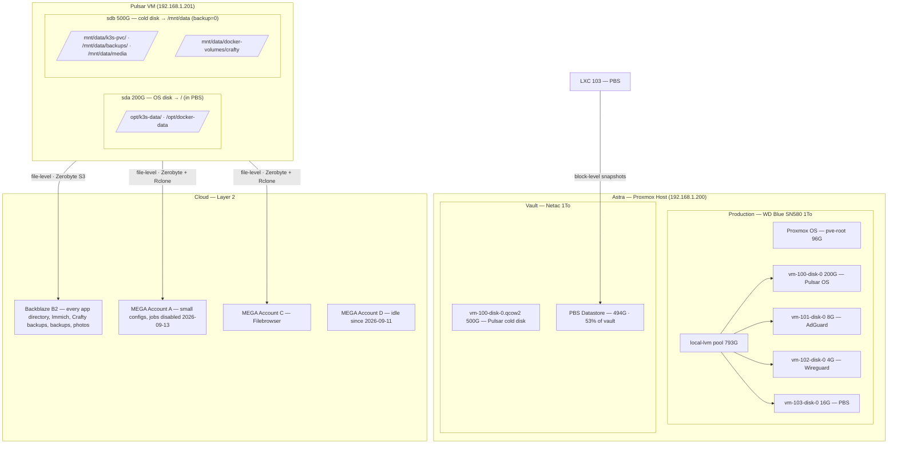

# Backup Architecture — Astra Homelab

> **Status:** Layer 1 operational. Layer 2 in service for every Tier 2 path on `/mnt/data`,
> every app directory, the Proxmox configuration and, since 2026-09-14, the database dumps
> (restore tested end to end on 2026-09-15) — see §12.
> **Last updated:** 2026-09-22 (documented how to reinstall the Proxmox config backup
> mechanism from scratch, verified against the live setup — §4.2)
> **Language:** English (technical reference)

---

## Table of Contents

1. [Overview](#1-overview)
2. [Physical Infrastructure](#2-physical-infrastructure)
   - 2.1 [Astra — Proxmox Host](#21-astra--proxmox-host)
   - 2.2 [Pulsar — Main VM](#22-pulsar--main-vm)
   - 2.3 [Accepted Constraints](#23-accepted-constraints)
3. [Data Classification Model — 3 Tiers](#3-data-classification-model--3-tiers)
   - 3.1 [Tier Definitions](#31-tier-definitions)
   - 3.2 [Complete Data Inventory](#32-complete-data-inventory)
4. [Layer 1 — Proxmox Backup Server (PBS)](#4-layer-1--proxmox-backup-server-pbs)
   - 4.1 [Mechanism](#41-mechanism)
   - 4.2 [Scope](#42-scope)
   - 4.3 [Retention Policy](#43-retention-policy)
   - 4.4 [Automated Schedule](#44-automated-schedule)
   - 4.5 [RTO / RPO](#45-rto--rpo)
5. [Layer 2 — Zerobyte + Rclone (Cloud)](#5-layer-2--zerobyte--rclone-cloud)
   - 5.1 [Mechanism](#51-mechanism)
   - 5.2 [Cloud Storage Strategy](#52-cloud-storage-strategy)
   - 5.3 [Rclone Remotes](#53-rclone-remotes)
   - 5.4 [Backup Jobs](#54-backup-jobs)
   - 5.5 [RTO / RPO](#55-rto--rpo)
6. [Database Dump Strategy](database-dumps.md)
7. [Secrets Management](#7-secrets-management)
8. [Storage Layout](#8-storage-layout)
   - 8.1 [Current Layout](#81-current-layout)
9. [Restoration Runbooks](restore.md)
   - 9.1 [Scenario A — Logical Corruption (service-level)](restore.md#91-scenario-a--logical-corruption-service-level)
   - 9.2 [Scenario B — Netac NVMe Failure](restore.md#92-scenario-b--netac-nvme-failure)
   - 9.3 [Scenario C — Total Loss of Astra](restore.md#93-scenario-c--total-loss-of-astra)
   - 9.4 [Restoring the Proxmox configuration](proxmox-config-copy.md#94-restoring-the-proxmox-configuration)
   - 9.5 [Restoring the Obsidian notes (CouchDB)](../../k3s/couchdb/README.md)
   - 9.6 [Restoring files with Zerobyte](restore.md#96-restoring-files-with-zerobyte)
10. [Monitoring & Alerts](../monitoring.md)
11. [Restore Testing](restore.md#11-restore-testing)
12. [Pending Tasks & Future Work](../todo.md)

---

## 1. Overview

The Astra homelab backup system follows a **3-2-1 strategy** (3 copies, 2 different media types, 1 offsite) implemented across two complementary layers.

| Rule          | Implementation                                                |
| ------------- | ------------------------------------------------------------- |
| **3 copies**  | Production + Layer 1 (PBS, local NVMe) + Layer 2 (cloud)      |
| **2 media**   | NVMe storage + cloud storage (Backblaze B2 and MEGA)          |
| **1 offsite** | Backblaze B2 bucket + MEGA accounts (off-premises)            |

> Not every path gets all three copies. Since 2026-09-11 Pulsar's cold disk (`/mnt/data`) is
> excluded from PBS by decision (§4.2): its Tier 2 content has production + cloud only.

### Architecture Diagram



### Layer Responsibilities

| Layer       | Tool                                         | Level | Purpose                                                           |
| ----------- | -------------------------------------------- | ----- | ----------------------------------------------------------------- |
| **Layer 1** | Proxmox Backup Server (LXC 103)              | Block | Fast local restore from logical corruption or accidental deletion |
| **Layer 2** | Zerobyte + Rclone (Docker Compose on Pulsar) | File  | Offsite disaster recovery — survives total hardware loss          |

---

## 2. Physical Infrastructure

### 2.1 Astra — Proxmox Host

Moved to [`docs/infrastructure.md`](../infrastructure.md#astra--proxmox-host).

### 2.2 Pulsar — Main VM

Moved to [`docs/infrastructure.md`](../infrastructure.md#pulsar--main-vm).

### 2.3 Accepted Constraints

The Netac NVMe hosts both the Pulsar cold disk and the PBS datastore. This means Layer 1 backups and the associated production data reside on the same physical device. A single Netac failure would result in simultaneous loss of Pulsar's cold data AND its Layer 1 backups.

This is a known, accepted constraint given the single-server hardware budget. Layer 2 (cloud) is the mitigation: every Tier 2 path on the Netac has an off-site copy since 2026-09-11, which is what made it acceptable to exclude `sdb` from PBS (§4.2).

Since 2026-09-21 the Netac holds no personal file. They moved to `drive`, on the WD Blue
([infrastructure.md](../infrastructure.md#disks)). What stays on the Netac is either a copy
(Crafty archives, dumps, the Proxmox configuration copy, the PBS datastore) or replaceable
(movies, Crafty logs).

---

## 3. Data Classification Model — 3 Tiers

### 3.1 Tier Definitions

**Tier 1 — Active System (Layer 1 only)**
Live databases and application runtime state. Backed up exclusively by PBS block-level snapshots. Rclone/Zerobyte does not touch these directly because live databases cannot be safely copied at the file level without risking corruption. They are covered by the DB dump strategy (see §6) which promotes dump outputs to Tier 2 for cloud upload.

> **Revised 2026-09-13.** Zerobyte now copies every app directory (jobs 16 and 17, §5.4), but
> excludes the data directories of the live PostgreSQL, MariaDB and Redis servers. SQLite files
> are copied as they are: usually readable, not guaranteed consistent. The dumps of §6 remain
> the consistent copy.

**Tier 2 — Critical Vault (Layer 1 + Layer 2)**
Static personal files, cold PVC data, pre-generated database dumps, and other irreplaceable data that is safe to copy at the file level. This is the only data sent to cloud storage.

**Tier 3 — Disposable (No cloud backup)**
Bulk data that is either reconstructible (Minecraft servers, Kiwix ZIM archives) or acceptable to lose and re-download (movies). Tier 3 data on `sda` (Crafty server worlds, container images) is protected by PBS snapshots of the Pulsar VM. Tier 3 data on `sdb` (`/mnt/data`: movies, Crafty logs) has **no backup at all** since `backup=0` was applied on 2026-09-11 — an accepted loss.

### 3.2 Complete Data Inventory

> **Sizes marked `2026-09-09` or later were remeasured that day; the rest still date from May
> 2026 and should be re-checked before being relied on.** "Job 16" and "job 17" are the
> Zerobyte jobs that copy the whole of `/opt/k3s-data` and `/opt/docker-data` (§5.4). A
> raw copy of a live SQLite file is usually readable but not guaranteed consistent.

| Service / Path | Location | Size | Tier | Layer 2 | DB dump | Verified |
| -------------- | -------- | ---- | ---- | ------- | ------- | -------- |
| **Vaultwarden** | `/opt/k3s-data/vaultwarden/` | 8.6M | 1 | ✅ Backblaze B2, job 16 (raw SQLite) | SQLite — dumped nightly (§6) | 2026-09-14 |
| **Immich DB** | `/opt/k3s-data/immich/postgres/` | **295M** | 1 | covered — Immich dumps itself into `library/backups/`; raw directory excluded from job 16 | PostgreSQL 14 + vectorchord | 2026-09-13 |
| **Umami DB** | `/opt/k3s-data/umami/postgres/` | 48M (whole `umami/`) | 1 | its dump, job 13 (first upload 2026-09-15) — raw directory excluded from job 16 | PostgreSQL 16.14 — dumped nightly (§6) | 2026-09-14 |
| **Infisical DB** | `/opt/k3s-data/infisical/postgres/` + `redis/` | 157M (whole `infisical/`) | 1 | its dump, job 13 (first upload 2026-09-15) — both directories excluded from job 16 | PostgreSQL 16.14 — dumped nightly (§6) | 2026-09-14 |
| **n8n** | `/opt/k3s-data/n8n/` | 42M | 1 | ✅ Backblaze B2, job 16 (raw SQLite) | SQLite — dumped nightly (§6) | 2026-09-14 |
| **Scanopy** | `/opt/k3s-data/scanopy/` | 68M | 1 | ✅ Backblaze B2, job 16 — not running on 2026-09-13, so the raw PostgreSQL copy is consistent | PostgreSQL | 2026-09-13 |
| **AppFlowy** | `/opt/k3s-data/appflowy/` | 52M | 1 | ✅ Backblaze B2, job 16 — not running on 2026-09-13, raw copy consistent | PostgreSQL | 2026-09-13 |
| **Uptimekuma** | `/opt/k3s-data/uptimekuma/` | 311M | 1 | ✅ Backblaze B2, job 16, **except** `mariadb/`, which leaves as its dump through job 13 (first upload 2026-09-15) | **embedded MariaDB** 10.11.14 (`db-config.json`, Uptime Kuma 2.5.3) — not SQLite; `kuma.db` is empty; dumped nightly (§6) | 2026-09-14 |
| **Crowdsec** | `/opt/docker-data/crowdsec/` | 110M | 1 | ✅ Backblaze B2, job 17 (raw SQLite) | SQLite | 2026-09-13 |
| **SFTPgo** | `/opt/k3s-data/sftpgo/` | 380K | 1 | ✅ Backblaze B2, job 16 (raw SQLite) | SQLite — dumped nightly (§6) | 2026-09-14 |
| **Docker Registry** | `/opt/k3s-data/docker-registry/` | 57M | 1 | ✅ Backblaze B2, job 16 (Mega A job 11 disabled 2026-09-13) | — | 2026-09-13 |
| **NPM** | `/opt/docker-data/npm/` | 17M | 1 | ✅ Backblaze B2, job 17 (raw SQLite) | SQLite — dumped nightly (§6) | 2026-09-14 |
| **Portainer** | `/opt/docker-data/portainer/` | 76M | 1 | ✅ Backblaze B2, job 17 (job 12 disabled 2026-09-13) | BoltDB | 2026-09-13 |
| **Filebrowser Quantum** | `/opt/k3s-data/filebrowser-quantum/` | 1.1M | 1 | ✅ Backblaze B2, job 16 (raw) | BoltDB — `database.db` is not SQLite (checked 2026-09-14) | 2026-09-14 |
| **Ntfy** | `/opt/k3s-data/ntfy/` | 160K | 1 | ✅ Backblaze B2, job 16 — not running on 2026-09-14 | SQLite — `user.db` dumped nightly, `cache.db` not (§6) | 2026-09-14 |
| **CouchDB (Obsidian notes)** | `/opt/k3s-data/couchdb/` | 5.1M | 1 | ✅ Backblaze B2, job 16 (raw `.couch` files) — end-to-end encrypted by LiveSync, restore tested 2026-09-14 (§9.5) | — not dumped, on purpose (§6) | 2026-09-14 |
| **Every other app directory** | `/opt/k3s-data/*`, `/opt/docker-data/*` — Jellyfin, Beszel, Homarr, Speedtest Tracker, Wallos, Loandash, Diun, ConvertX, Scrutiny… | ~100M | 1–2 | ✅ Backblaze B2, jobs 16 and 17 — any new directory is picked up automatically | mostly SQLite — Jellyfin, Beszel, Homarr, Speedtest Tracker, Wallos and Loandash dumped nightly (§6) | 2026-09-14 |
| **Termix** | `/opt/ops/docker/termix/data/` | 15M | 1 | ❌ none — outside the app roots | — | 2026-09-13 |
| `/etc/pve/` | Astra host | ~5M | 1 | ✅ Backblaze B2 — nightly copy to Pulsar, job 13 (since 2026-09-11, §4.2) | — | 2026-09-12 |
| `/etc/proxmox-backup/` | LXC 103 | **60K** | 1 | ✅ Backblaze B2 — nightly copy to Pulsar, job 13 (since 2026-09-11, §4.2) | — | 2026-09-12 |
| **Immich photos** | `/opt/k3s-data/immich/library/` | **31G** | 2 | ✅ Backblaze B2, job 8 — excluded from job 16 | — | 2026-09-13 |
| **Personal files** | `/mnt/drive/` — `Documents/`, `Photos/`, `Téléphone/`, `Archives/` (216 files) | **5.7G** | 2 | ✅ PBS with VM 100 (`scsi2`) and Backblaze B2, job 18 — both since 2026-09-21 | — | 2026-09-21 |
| **Homer config** | `/opt/k3s-data/homer/` | 5.3M | 2 | ✅ Backblaze B2, job 16 (Mega A job 4 disabled 2026-09-13) | — | 2026-09-13 |
| **Criteri-fresque** | `/opt/k3s-data/criteri-fresque/` | 41M | 2 | ✅ Backblaze B2, job 16 (Mega A job 6 disabled 2026-09-13) | — | 2026-09-13 |
| **DB dumps** | `/mnt/data/backups/dumps/` | **154M** (17 files) | 2 | ✅ Backblaze B2, job 13 — first upload 2026-09-15 at 02:00, restore tested the same day (§6) | — | 2026-09-15 |
| **Secrets** | hand-applied `secrets.yaml` and Infisical bootstrap files ([secrets.md](../secrets.md)) | ~1M | 2 | ❌ not yet | — | May 2026 |
| **Crafty backups** | `/mnt/data/docker-volumes/crafty/backups/` | **26G** | 2 | ✅ Backblaze B2 — all 3 servers (since 2026-09-11) | — | 2026-09-11 |
| **Crafty config** | `/opt/docker-data/crafty/config/` | **186M** | 2 | ✅ Backblaze B2, job 17 (Mega A job 7 disabled 2026-09-13) | SQLite — `crafty.sqlite` dumped nightly (§6) | 2026-09-14 |
| **Crafty servers** | `/opt/docker-data/crafty/servers/` | **17G** | ❌ 3 | — excluded from job 17; the worlds leave through Crafty's archives (job 15) | — | 2026-09-13 |
| **Crafty logs** | `/mnt/data/docker-volumes/crafty/logs/` | **430M** | ❌ 3 | — | — | 2026-09-09 |
| **Portracker** | `/opt/docker-data/portracker/` | 72K | ❌ 3 | in job 17 anyway (whole root) | — | 2026-09-13 |
| **Kiwix ZIM** | `/mnt/data/k3s-pvc/kiwix/` | **empty** — 136G deleted 2026-09-09 | ❌ 3 | — | — | 2026-09-09 |
| **Movies** | `/mnt/data/media/movies/` | **47G** (19 files) | ❌ 3 | — | — | 2026-09-09 |

> **2026-09-13 — every app directory off-site.** Until then only 11 directories reached the
> cloud, and about 25 app directories (Vaultwarden, Infisical, CouchDB, n8n, Umami, Uptime
> Kuma, NPM…) existed only inside Astra: on the WD and in PBS, both in the same box. Jobs 16
> and 17 now copy the two app roots whole, so a new app is covered without any Zerobyte
> change. The live PostgreSQL and MariaDB databases (Umami, Infisical, Uptime Kuma, Dawarich)
> leave as nightly dumps since 2026-09-14 (§6). Still without an off-site copy: Termix and
> Dawarich's files, which live outside the two roots.
>
> **2026-09-21 — personal files on their own disk.** The Filebrowser files, the photos and the
> phone backup left the Netac for `/mnt/drive` (§8.1), a virtual disk on the WD Blue that PBS
> backs up and job 18 sends to Backblaze. The originals were deleted on 2026-09-21 once both
> copies were checked.
>
> **2026-09-21 — Dawarich removed.** The trial instance (app and worker stopped since
> 2026-08-20) is gone: its four containers and five Docker volumes were deleted, and it left
> the nightly dumps. Its last dump, `dawarich.sql` of 2026-09-20 (73 MB, 136 064 points),
> stays in `/mnt/data/backups/dumps/` and keeps going to Backblaze with job 13, but nothing
> refreshes it any more. The 26M of files (imports, storage) had no off-site copy and are lost.
>
> **Resolved 2026-09-10 — the three "mounted, never declared" paths.** Portainer, personal
> backups and photos were bind-mounted into Zerobyte but had no matching *volume*, so no job
> ever backed them up. `/mnt/data/backups/` was triaged first (8.8G → 102M: a redundant
> Minecraft archive and a plaintext password export were deleted), then all three were
> declared. A mount makes a path visible to Zerobyte; only a *schedule* backs it up.
>
> **Growth driver, measured 2026-09-09, revised 2026-09-11:** Crafty produced **28.6 GiB/week**
> of new `.zip` archives. By volume the largest producer was **Survie Gay** (~2.9 GiB/day),
> not the daily Roots SMP (~1.5 GiB/day). Survie Gay and Nous Deux are no longer played; their
> Crafty backup schedules were paused on 2026-09-11, leaving only Roots SMP's daily archive.

---

## 4. Layer 1 — Proxmox Backup Server (PBS)

### 4.1 Mechanism

PBS (LXC 103 on Astra) operates at the **block level**. It uses QEMU dirty bitmaps to track modified storage blocks since the last backup. Only changed blocks are transferred — no full copies after the first run.

Data is hashed, deduplicated, and compressed with **ZSTD** on the fly before being written to the datastore. Backups are taken in **snapshot mode**: the hypervisor momentarily freezes VM/LXC state (RAM + filesystem), reads the data, then releases the snapshot. Services continue running with no downtime.

Datastore location: `/mnt/pve/vault/` (Netac NVMe).

The container: Debian 13 (trixie) and PBS 4.2.5 since 2026-09-13 — upgraded from Debian 12 /
PBS 3.4.9, which reached end of life in 2026-08. Unprivileged, `features: nesting=1` since
2026-09-12, time zone `timezone: host` (Europe/Paris) since 2026-09-13; it was `Etc/UTC`
before, which shifted every PBS schedule by two hours (§4.4). Root disk 16G since
2026-09-13 (was 8G). APT pulls
from `pbs-no-subscription` only; `pbs-enterprise` is disabled (no subscription, it answered
`401` on every `apt update`). The PBS 4 upgrade brought it back as a new, **enabled**
`/etc/apt/sources.list.d/pbs-enterprise.sources`; the commented-out `.list` did not carry
over. Disabled again in the PBS UI (Administration → Repositories → Disable), which writes
`Enabled: false`. Proxmox refuses to snapshot it because of the bind mount `mp0`,
so the safety net before maintenance is `vzdump 103 --mode stop --storage local` — 846 MB and
19 seconds of downtime on 2026-09-12.

> **`pam_systemd` removed on 2026-05-02.** `/etc/pam.d/common-session` lacks the
> `session optional pam_systemd.so` line — the usual workaround for logins that hang while
> `systemd-logind` is dead, which it was until `nesting=1`. A PAM upgrade asks whether to
> override the local changes: answer **No** unless you mean to restore the line.

### 4.2 Scope

| Guest     | ID  | Type | Included                  |
| --------- | --- | ---- | ------------------------- |
| Pulsar    | 100 | VM   | ✅ OS disk `scsi0` and personal disk `scsi2` — cold disk `scsi1` set to `backup=0` (applied 2026-09-11 11:21) |
| AdGuard   | 101 | LXC  | ✅                        |
| Wireguard | 102 | LXC  | ✅                        |
| PBS       | 103 | LXC  | ❌ Excluded by design     |

**Why Pulsar's cold disk is excluded (decided 2026-09-11).** `scsi1` is a `.qcow2` file on the
Netac, and PBS wrote its backup to a datastore on the same Netac. That copy never protected
against the drive failing — only against accidental deletion, which Zerobyte already covers
for every Tier 2 path on `/mnt/data` (§3.2). Meanwhile each new Crafty `.zip` was stored twice
on the drive: once in the `.qcow2`, once as fresh PBS chunks (the datastore grew 26G in two
days). What loses its only backup: movies (47G, re-downloadable) and Crafty logs.

- VM backups cannot exclude directories. `vzdump`'s `exclude-path` applies to containers
  only; for a VM the unit of exclusion is a whole disk (`backup=<1|0>` on `scsi[n]`).
  A dedicated third virtual disk for Crafty archives was considered and rejected as too
  much work for what it would keep.
- Existing snapshots that include `scsi1` are **not** removed immediately; they age out
  through the retention policy (§4.3), up to ~6 months for the monthly ones. **Superseded
  2026-09-21:** the seven left (2026-05-31 to 2026-09-06 UTC) were deleted by hand to make
  room for the Netac split (§12); the oldest VM 100 snapshot is now 2026-09-12.
- **Restore caution:** the documentation does not say what happens to an excluded disk when a
  VM is restored over itself. Restore Pulsar to a **new VMID**, never over VM 100.
- Applied in the UI on 2026-09-11 at 11:21 (VM 100 → Hardware → `scsi1` → Edit → Advanced →
  uncheck *Backup*). Verify with `qm config 100 | grep scsi1`, which must end in `backup=0`.
- Confirmed on 2026-09-12: snapshot `vm/100/2026-09-12T01:00:01Z` (03:00) holds
  `drive-scsi0.img.fidx` only; the one of 2026-09-11 still held `drive-scsi1.img.fidx` too.

**The personal disk `scsi2` is backed up (since 2026-09-21).** Created on 2026-09-20 on
`local-lvm` (the WD Blue) without `backup=0`, so vzdump picks it up with no change to the job.
Its PBS copy lands on the Netac, a different drive, which is exactly what `scsi1` lacked.

- First run, 2026-09-21 03:00: the log reads `include disk 'scsi2' 'local-lvm:vm-100-disk-1'
  64G`, then `scsi2: dirty-bitmap status: created new` (a new disk is read whole once, then
  only its changes); `Finished Backup of VM 100 (00:01:29)`.
- Snapshot `vm/100/2026-09-21T01:00:02Z` holds `drive-scsi0.img.fidx` **and**
  `drive-scsi2.img.fidx`. The datastore's `.chunks` went from 476.3 GiB (after the GC of
  2026-09-20) to **482G**: the ~5.7G of personal files.

PBS (LXC 103) is intentionally excluded — but **not** for the reason previously given here.

> **Correction, 2026-09-09.** This section used to claim that backing up the PBS container
> would "create circular I/O dependencies". That is **false**. LXC 103 reaches its datastore
> through a *bind mount* (`mp0: /mnt/pve/vault/pbs-datastore,mp=/mnt/datastore`), and the
> Proxmox VE documentation is explicit: *"The contents of bind mount points are not backed up
> when using vzdump."* The `backup=1` option exists only for **volume** mount points. A
> `vzdump` of LXC 103 would therefore capture its 16 GB rootfs and nothing else — no recursion
> is possible.

The real reason to exclude it: a backup of LXC 103 would live **inside the datastore it is
meant to help rebuild**, making it useless in the one scenario that matters — loss of the
Netac drive. And it is unnecessary, because the datastore is self-describing: point a fresh
PBS install at the existing directory (or pass `reuse-datastore`) and every chunk and index
is recovered.

What genuinely needs protecting is the **configuration**, which is *not* in the datastore —
about **60 KB** in `/etc/proxmox-backup/`:

| File | Lost without it |
| ---- | --------------- |
| `datastore.cfg` | datastore definition, GC schedule (`Sun 05:00`) |
| `verification.cfg` | the `verify-weekly` job |
| `prune.cfg` | retention policy |
| `notifications.cfg` + `notifications-priv.cfg` | the Resend notification target |
| `user.cfg`, `acl.cfg`, `shadow.json` | accounts, permissions, password hashes |
| `authkey.key`, `csrf.key`, `proxy.pem` | API tokens and TLS certificate |

#### Proxmox configuration copy — in service since 2026-09-11

Moved to [proxmox-config-copy.md](proxmox-config-copy.md).

### 4.3 Retention Policy

| Window      | Copies kept |
| ----------- | ----------- |
| Most recent | 3           |
| Daily       | 7 days      |
| Weekly      | 4 weeks     |
| Monthly     | 6 months    |

### 4.4 Automated Schedule

All jobs run nightly during low-activity periods:

| Time         | Job                | Description                                                        |
| ------------ | ------------------ | ------------------------------------------------------------------ |
| 03:00 daily    | Backup             | PBS snapshots Pulsar, AdGuard, Wireguard                           |
| 04:00 daily    | Prune              | Retention policy applied; old index entries dereferenced logically |
| 05:00 Saturday | Verify             | `verify-weekly` re-reads the chunks and checks their checksums     |
| 05:00 Sunday   | Garbage Collection | Orphaned data chunks physically deleted from disk                  |

> Read from the live configuration on 2026-09-11 (`vzdump` job, `prune.cfg`,
> `verification.cfg`, `datastore.cfg`). **PBS reads these times on its own clock.** LXC 103
> was on `Etc/UTC` until 2026-09-13, so prune actually ran at 06:00 Paris and verify/GC at
> 07:00 (task history 2026-08-12 → 2026-09-13); in winter the Saturday verify would have met
> the 06:00 Crafty upload. Since `timezone: host`, the times above are Paris time all year.
> Keep heavy jobs that read the Netac — Zerobyte's Crafty upload, manual `fstrim` — out of
> the 03:00–05:59 window; the Saturday verify takes ~38 min (2026-09-12).

### 4.5 RTO / RPO

| Metric              | Value            | Notes                                                          |
| ------------------- | ---------------- | -------------------------------------------------------------- |
| **RPO**             | ≤ 24 hours       | Daily backup at 03:00; worst case = ~23h of data loss          |
| **RTO**             | 30 min – 2 hours | Depends on VM size and disk throughput (~400–500 MB/s on NVMe) |
| **Backup duration** | ~15–45 min       | Incremental after first run; full first backup is longer       |

---

## 5. Layer 2 — Zerobyte + Rclone (Cloud)

### 5.1 Mechanism

Zerobyte is a self-hosted backup automation tool running as a **Docker Compose service on Pulsar**. It provides a web UI over **Restic**, handling scheduling, retention, and monitoring.

Restic operates at the **file level**: it chunks files, deduplicates content across snapshots, compresses with ZSTD, and encrypts with AES-256 before uploading. Rclone provides the transport layer, mapping Restic's backend protocol to MEGA's API. Backblaze B2 is reached directly through Restic's S3 backend, without Rclone.

Because Restic cuts files by **content**, identical files cost nothing twice: on 2026-09-11 the first Crafty upload read 25.2 GiB and stored 12.0 GiB, as the five byte-identical Nous Deux archives were stored once. PBS, which cuts a disk into fixed blocks, gets almost no such benefit from new `.zip` files.

### 5.2 Cloud Storage Strategy

> **Rewritten 2026-09-11 from the live Zerobyte database.** The previous version described an
> all-MEGA design (`mega-a` + `mega-b` mirrors, ~20G each) that was never deployed as written.

Two providers, with a clear split:

- **Backblaze B2** — bucket `astra-pulsar-backup`, about **$0.006/GB/month**, no size limit.
  Everything large or growing goes here. Two safeguards: the account's spending cap (*Caps &
  Alerts*) must be raised before adding a large job — it blocked the first Immich upload on
  2026-09-09 — and the bucket lifecycle rule `daysFromHidingToDeleting: 1` makes deleted
  data disappear the next day. Zerobyte's S3 connector has no path field, so one Zerobyte
  repository = one bucket.
- **MEGA** free accounts (20 GB each) — small, slowly-changing data only. A full MEGA account
  fails **silently**: Mega B overflowed on 2026-09-03 and nobody noticed. Nothing that grows
  is sent to MEGA.

| Zerobyte repository | Backend | Used (Zerobyte stats, 2026-09-11) | Snapshots | Holds |
| ------------------- | ------- | --------------------------------- | --------- | ----- |
| **Backblaze** | S3 (B2) | **43.4 GiB** (~$0.28/month) | 7 | Immich, Crafty backups, dumps and Proxmox configuration (job 13), every app directory since 2026-09-13 (jobs 16, 17), personal files since 2026-09-21 (job 18) |
| **Mega A** | rclone `mega-a` | 113 MiB | 44 | Homer, Criteri'Fresque, Crafty config, Docker Registry — **jobs disabled 2026-09-13**, snapshots kept until about 2026-12-13 |
| **Mega C** | rclone `mega-c` | 3.7 GiB | 11 | Filebrowser files |
| **Mega D** | rclone `mega-d` | 874 MiB | 7 | old Nous Deux snapshots only — its job was disabled on 2026-09-11, snapshots kept until about 2026-12-15 |
| Mega B | rclone `mega-b` | — | 10 | **retired** 2026-09-09: removed from Zerobyte, left intact on MEGA, readable with `restic --no-lock` |
| `test-backblaze`, `test-local` | — | negligible | — | test repositories |

**Tier 3 data (Kiwix, movies, Crafty server worlds, logs) receives no cloud backup.** Movies
and Kiwix are re-downloadable. Crafty worlds reach the cloud indirectly, through the `.zip`
archives Crafty makes of them (Crafty backups job below).

### 5.3 Rclone Remotes

Rclone must be configured on the Pulsar host before the Zerobyte container starts. The rclone config is bind-mounted read-only into the container.

```bash
# Install rclone on Pulsar
curl https://rclone.org/install.sh | sudo bash

# Configure each MEGA remote interactively
rclone config
# → New remote → name: mega-a → type: mega → authenticate

# Verify
rclone listremotes
# mega-a:
# mega-b:   (retired — kept only to read the old snapshots)
# mega-c:
# mega-d:
# backblaze-test:
```

The Zerobyte container mounts the rclone config from a path set in its `.env`
(`docker/zerobyte/docker-compose.yml`):

```yaml
volumes:
  - ${RCLONE_CONFIG_PATH}:/root/.config/rclone:ro
```

The Backblaze repository does not use Rclone: its S3 endpoint and key are stored in
Zerobyte's own (encrypted) configuration.

### 5.4 Backup Jobs

Jobs ("schedules") are defined in the Zerobyte web UI at `zerobyte.lan`. Each one links a
**volume** (a directory bind-mounted into the container, see `docker-compose.yml`) to a
**repository**. Declaring a volume alone backs up nothing.

State read from `zerobyte.db` on 2026-09-13, rows 10, 14 and 18 on 2026-09-21. Times are
Europe/Paris (the container's `TZ`). Every job keeps **7 daily, 4 weekly, 3 monthly**
snapshots and was in `success`.

| id | Schedule | Host path | Repository | Cron | State |
| -- | -------- | --------- | ---------- | ---- | ----- |
| 16 | K3s Data | `/opt/k3s-data` (whole root) | Backblaze | `00 01 * * *` | active — created 2026-09-13 |
| 17 | Docker Data | `/opt/docker-data` (whole root) | Backblaze | `00 01 * * *` | active — created 2026-09-13 |
| 4  | Homer | `/opt/k3s-data/homer` | Mega A | `00 01 * * *` | **disabled** 2026-09-13 — covered by job 16 |
| 6  | Criteri'Fresque | `/opt/k3s-data/criteri-fresque` | Mega A | `00 01 * * *` | **disabled** 2026-09-13 — covered by job 16 |
| 7  | Crafty Config | `/opt/docker-data/crafty/config` | Mega A | `00 01 * * *` | **disabled** 2026-09-13 — covered by job 17 |
| 11 | Docker Registry | `/opt/k3s-data/docker-registry` | Mega A | `00 01 * * *` | **disabled** 2026-09-13 — covered by job 16 |
| 12 | Portainer | `/opt/docker-data/portainer` | Backblaze | `00 01 * * *` | **disabled** 2026-09-13 — covered by job 17 |
| 8  | Immich Library | `/opt/k3s-data/immich/library` | Backblaze | `00 02 * * *` | active |
| 10 | Filebrowser Files | `/mnt/data/k3s-pvc/filebrowser` | Mega C | `00 02 * * *` | **disabled** 2026-09-20 — covered by job 18; the folder is empty since 2026-09-21 |
| 13 | Backups | `/mnt/data/backups` | Backblaze | `00 02 * * *` | active — created 2026-09-10 |
| 14 | Photos | `/mnt/data/media/photos` | Backblaze | `00 02 * * *` | **disabled** 2026-09-20 — covered by job 18; the folder is empty since 2026-09-21 |
| 18 | Drive | `/mnt/drive` (whole disk) | Backblaze | `00 02 * * *` | active — created 2026-09-20 |
| 15 | Crafty Backups | `/mnt/data/docker-volumes/crafty/backups` (all servers) | Backblaze | `00 06 * * *` | active — created 2026-09-11 |
| 9  | Crafty Backups (MEGA) | same volume, Nous Deux folder only | Mega D | `00 03 * * 0` | **disabled** 2026-09-11 |

- **Jobs 16 and 17 copy the app roots whole, minus what is covered elsewhere or unsafe to
  copy live** (decided 2026-09-13, following the value-based layout of §12). Exclusion
  patterns, one per line in the job:
  - job 16: `/immich/library` (job 8), `/immich/model-cache` (re-downloaded),
    `/immich/postgres` (Immich dumps itself), `/umami/postgres`, `/infisical/postgres`,
    `/infisical/redis`, `/uptimekuma/mariadb` (live servers; the databases leave as dumps, §6);
  - job 17: `/crafty/servers` (Crafty's archives, job 15), `/homarr/redis`.

  A leading `/` anchors a pattern to the **volume root** (Zerobyte's `processPattern`); without
  it, restic matches the name at any depth, so `postgres` would drop every directory of that
  name. Restic does not warn when a pattern matches nothing. The first runs (2026-09-13,
  22:29) prove the patterns work: restic read **8,418 files / 445,536,710 bytes** (job 16)
  and **4,600 files** (job 17), exactly what `find` counts on disk with those paths pruned.
  Uploaded after compression: 181 MB and 70 MB.
- **Stopped databases stay in the copy on purpose.** Scanopy and AppFlowy have no running
  deployment, so their PostgreSQL files are cold and the raw copy is consistent. The dump
  script cannot export a database that is not running.
- **Disabled jobs keep their snapshots, frozen.** Zerobyte runs retention right after each
  backup and only for that job's tag (`forget --group-by tags --tag <short_id>`), so a
  disabled job's snapshots are never pruned. Kept until about **2026-12-13**, when job 16/17
  has built its own three months of history; then delete job 12 and its snapshots, remove
  `Mega A` from Zerobyte, and drop the per-app mounts from `docker-compose.yml` that no
  volume uses any more.
- **Job 18 copies the personal disk whole** (created 2026-09-20, no exclusion, no include
  filter), for the same reason as jobs 16 and 17: a folder added to `drive` is covered
  without touching Zerobyte. Zerobyte sees the disk read-only at `/data/drive` (volume
  `Drive`, commit `646c539`). First run, 2026-09-21 at 02:00: `success` in 2 min 03 s,
  **216 files** read (6,074,504,976 bytes), all new, **4,077,623,950 bytes added** (4.02 GB
  after compression). The ~2 GB not added were chunks already in the repository — the
  photos and phone backup, sent by jobs 14 and 13, account for about 1 GB — or repeated
  inside the new files; the split was not measured.
- **Jobs 10 and 14 were disabled on 2026-09-20 at 23:32** (last runs that morning at 02:00,
  `success`). Their snapshots stay frozen like those of the other disabled jobs, and hold
  the off-site history of the personal files before 2026-09-21. Their mounts in
  `docker-compose.yml` (`/data/filebrowser`, `/data/media/photos`) are kept so that the two
  volumes stay `mounted`; the host folders exist but are empty.
- **Do not keep more than two or three Zerobyte tabs open.** Each tab holds an `EventSource`
  stream; `zerobyte.lan` is plain HTTP/1.1, where Chrome allows 6 connections per host across
  all tabs. With five tabs open on 2026-09-13 the site looked dead while the container
  answered in 1.5 ms. Closing tabs is enough.
- **Jobs starting at the same minute on the same repository are fine.** Zerobyte runs the
  backups in parallel and only queues the retention `forget` runs, one per repository. Four
  Mega A jobs have started at the same second every night without failure.
- **Crafty Backups runs at 06:00** because Crafty writes Roots SMP's archive at 04:00: earlier
  would upload the previous day's archive, 04:00 itself could catch a half-written `.zip`, and
  05:00 belongs to PBS verify/GC on the same drive.
- **What a day of Crafty costs off-site:** the first scheduled run (2026-09-12 06:00) read
  7 archives, found one new Roots SMP archive and added **574,541,862 bytes (0.54 GiB)** to
  the repository in 14 s. The other archives are deduplicated.
- **Why job 9 was replaced:** it was restricted by `include_paths` to Nous Deux
  (`9ca997b5-…`), so **Survie Gay and Roots SMP had no off-site copy until 2026-09-11**. Crafty
  names archive folders by server UUID, not by name:

| UUID | Crafty server | Crafty archive schedule (2026-09-11) |
| ---- | ------------- | ------------------------------------ |
| `9ca997b5-937f-4fbd-bf5c-95f5eb06cfb2` | Nous Deux | paused (world unchanged since 2026-08-15), keeps 2 |
| `69dc796b-62cf-450b-a846-48893db1a6cd` | Survie Gay | paused (world unchanged since 2026-09-07), keeps 2 |
| `c5da3465-e127-4ad2-9d36-bd313bf3eebe` | Roots SMP (SMP 26.2) | daily 04:00, keeps 3 |

#### No job planned

Two kinds of data reach the cloud through the existing **Backups** job (13) instead of a job
of their own:

- the Proxmox configuration, which Astra copies nightly into
  `/mnt/data/backups/proxmox-configs/` (§4.2);
- the database dumps, which the script of §6 writes to `/mnt/data/backups/dumps/` at 01:00
  since 2026-09-14 — decided 2026-09-13, replacing the `tier2-db-dumps` job planned earlier.

### 5.5 RTO / RPO

| Metric              | Value            | Notes                                                     |
| ------------------- | ---------------- | --------------------------------------------------------- |
| **RPO**             | ≤ 24 hours       | Daily jobs; worst case = ~23h of data loss                |
| **RTO**             | 4–24 hours       | Depends on bandwidth and total data size (~50G across all repositories) |
| **Backup duration** | seconds – minutes | Nightly runs take 3–30 s; a first upload takes minutes (Crafty: 12 GiB in 201 s) |

> **Restores go through `/restore`.** Every data mount in `docker-compose.yml` is `:ro`, so
> Zerobyte restores into its one writable directory, `/mnt/data/restore` (since 2026-09-14),
> and the files are copied into place by hand — §9.6.

---

## 6. Database Dump Strategy

Moved to [database-dumps.md](database-dumps.md).

---

## 7. Secrets Management

Moved to [`docs/secrets.md`](../secrets.md).

---

## 8. Storage Layout

### 8.1 Current Layout

Moved to [`docs/infrastructure.md`](../infrastructure.md#what-lives-where).

## 9. Restoration Runbooks

Moved to [restore.md](restore.md).

---

## 10. Monitoring & Alerts

Moved to [`docs/monitoring.md`](../monitoring.md).

---

## 11. Restore Testing

Moved to [restore.md](restore.md#11-restore-testing).

---

## 12. Pending Tasks & Future Work

Moved: open work to [`docs/todo.md`](../todo.md), finished work and the decisions behind
it to [`docs/decisions.md`](../decisions.md).
