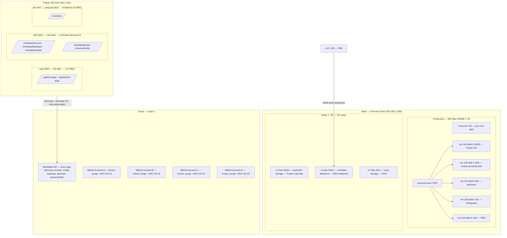

# Backup Architecture — Astra Homelab

> **Status:** both layers in service, restore tested end to end
> ([restore.md](restore.md#11-restore-testing)).

---

## Table of Contents

1. [Overview](#1-overview)
   - [Nightly Timeline](#nightly-timeline)
2. [Physical Infrastructure](#2-physical-infrastructure)
   - 2.1 [Astra — Proxmox Host](#21-astra--proxmox-host)
   - 2.2 [Pulsar — Main VM](#22-pulsar--main-vm)
   - 2.3 [Accepted Constraints](#23-accepted-constraints)
3. [Data Classification Model — 3 Tiers](#3-data-classification-model--3-tiers)
   - 3.1 [Tier Definitions](#31-tier-definitions)
   - 3.2 [Complete Data Inventory](#32-complete-data-inventory)
4. [Layer 1 — Proxmox Backup Server (PBS)](#4-layer-1--proxmox-backup-server-pbs)
   - 4.1 [Mechanism](#41-mechanism)
   - 4.2 [Scope](#42-scope)
   - 4.3 [Retention Policy](#43-retention-policy)
   - 4.4 [PBS Schedule](#44-pbs-schedule)
   - 4.5 [RTO / RPO](#45-rto--rpo)
5. [Layer 2 — Zerobyte + Rclone (Cloud)](#5-layer-2--zerobyte--rclone-cloud)
   - 5.1 [Mechanism](#51-mechanism)
   - 5.2 [Cloud Storage Strategy](#52-cloud-storage-strategy)
   - 5.3 [Rclone Remotes](#53-rclone-remotes)
   - 5.4 [Backup Jobs](#54-backup-jobs)
   - 5.5 [RTO / RPO](#55-rto--rpo)
6. [Database Dump Strategy](database-dumps.md)
7. [Secrets Management](#7-secrets-management)
8. [Storage Layout](#8-storage-layout)
   - 8.1 [Current Layout](#81-current-layout)
9. [Restoration Runbooks](restore.md)
   - 9.1 [Scenario A — Logical Corruption (service-level)](restore.md#91-scenario-a--logical-corruption-service-level)
   - 9.2 [Scenario B — Netac NVMe Failure](restore.md#92-scenario-b--netac-nvme-failure)
   - 9.3 [Scenario C — Total Loss of Astra](restore.md#93-scenario-c--total-loss-of-astra)
   - 9.4 [Restoring the Proxmox configuration](proxmox-config-copy.md#94-restoring-the-proxmox-configuration)
   - 9.5 [Restoring the Obsidian notes (CouchDB)](../../k3s/couchdb/README.md)
   - 9.6 [Restoring files with Zerobyte](restore.md#96-restoring-files-with-zerobyte)
10. [Monitoring & Alerts](../monitoring.md)
11. [Restore Testing](restore.md#11-restore-testing)
12. [Pending Tasks & Future Work](../todo.md)

---

## 1. Overview

The Astra homelab backup system follows a **3-2-1 strategy** (3 copies, 2 different media types, 1 offsite) implemented across two complementary layers.

| Rule          | Implementation                                           |
| ------------- | -------------------------------------------------------- |
| **3 copies**  | Production + Layer 1 (PBS, local NVMe) + Layer 2 (cloud) |
| **2 media**   | NVMe storage + cloud storage (Backblaze B2 and MEGA)     |
| **1 offsite** | Backblaze B2 bucket + MEGA accounts (off-premises)       |

> Not every path gets all three copies. Pulsar's cold disk (`/mnt/data`) is excluded from PBS
> by decision (§4.2): its Tier 2 content has production + cloud only.

### Architecture Diagram


```mermaid
graph TB
    subgraph ASTRA["Astra — Proxmox Host (192.168.1.200)"]
        subgraph PROD["Production — WD Blue SN580 1 TB"]
            PVE_OS[Proxmox OS — pve-root 96G]
            LVM[local-lvm pool 793G]
            LVM --> DISK0[vm-100-disk-0 200G — Pulsar OS]
            LVM --> DISK4[vm-100-disk-1 64G — Pulsar personal disk]
            LVM --> DISK1[vm-101-disk-0 8G — AdGuard]
            LVM --> DISK2[vm-102-disk-0 4G — Wireguard]
            LVM --> DISK3[vm-103-disk-0 16G — PBS]
        end

        subgraph VAULT["Netac 1 TB — VG netac"]
            VAULT_THIN[LV thin 620G — vault-thin storage — Pulsar cold disk]
            PBS_DS[LV pbs 300G — /mnt/pbs-datastore — PBS Datastore]
            VAULT_FILES[LV files 32G — vault storage — ISOs]
        end
    end

    subgraph PULSAR["Pulsar VM (192.168.1.201)"]
        subgraph SDA["sda 200G — OS disk → / (in PBS)"]
            OPT[/opt/k3s-data/ · /opt/docker-data/]
        end
        subgraph SDB["sdb 500G — cold disk → /mnt/data (backup=0)"]
            MNT[/mnt/data/k3s-pvc/ · /mnt/data/backups/ · /mnt/data/media/]
            CRAFTY_VOL[/mnt/data/docker-volumes/crafty/]
        end
        subgraph SDC["sdc 64G — personal disk → /mnt/drive (in PBS)"]
            DRIVE[/mnt/drive/]
        end
    end

    subgraph CLOUD["Cloud — Layer 2"]
        B2[Backblaze B2 — every app directory, Immich, Crafty backups, backups, personal files]
        MEGA_A[MEGA Account A — frozen, purge ~2027-03-23]
        MEGA_B[MEGA Account B — retired, purge ~2027-03-23]
        MEGA_C[MEGA Account C — frozen, purge ~2027-03-23]
        MEGA_D[MEGA Account D — frozen, purge ~2027-03-23]
    end

    PBS_LXC[LXC 103 — PBS] -->|block-level snapshots| PBS_DS
    PULSAR -->|file-level · Zerobyte S3, only active path| B2
```

### Layer Responsibilities

| Layer       | Tool                                         | Level | Purpose                                                           |
| ----------- | -------------------------------------------- | ----- | ----------------------------------------------------------------- |
| **Layer 1** | Proxmox Backup Server (LXC 103)              | Block | Fast local restore from logical corruption or accidental deletion |
| **Layer 2** | Zerobyte + Rclone (Docker Compose on Pulsar) | File  | Offsite disaster recovery — survives total hardware loss          |

### Nightly Timeline

Everything that runs on its own at night, both layers together, in Europe/Paris time. Each
section holds the details; this table only puts them in order.

| Time           | What                                                                 | Layer   | Details                 |
| -------------- | -------------------------------------------------------------------- | ------- | ----------------------- |
| 01:00 daily    | Database dumps written to `/mnt/data/backups/dumps/`                 | —       | [§6](database-dumps.md) |
| 01:00 daily    | Zerobyte jobs K3s Data and Docker Data → Backblaze                   | Layer 2 | §5.4                    |
| 01:30 daily    | Proxmox configuration copied to `/mnt/data/backups/proxmox-configs/` | —       | §4.2                    |
| 02:00 daily    | Zerobyte jobs Immich Library, Backups and Drive → Backblaze          | Layer 2 | §5.4                    |
| 03:00 daily    | PBS snapshots Pulsar, AdGuard, template 9000                         | Layer 1 | §4.4                    |
| 04:00 daily    | PBS prune                                                            | Layer 1 | §4.4                    |
| 04:00 daily    | Crafty writes Roots SMP's archive                                    | —       | §5.4                    |
| 05:00 Saturday | PBS verify                                                           | Layer 1 | §4.4                    |
| 05:00 Sunday   | PBS garbage collection                                               | Layer 1 | §4.4                    |
| 06:00 daily    | Zerobyte job Crafty Backups → Backblaze                              | Layer 2 | §5.4                    |

The order matters twice: the Backups job at 02:00 sends the dumps (01:00) and the Proxmox
configuration (01:30) off-site, and the Crafty Backups job waits for Crafty's 04:00 archive
and for PBS to leave the Netac free.

---

## 2. Physical Infrastructure

### 2.1 Astra — Proxmox Host

Moved to [`docs/infrastructure.md`](../infrastructure.md#astra--proxmox-host).

### 2.2 Pulsar — Main VM

Moved to [`docs/infrastructure.md`](../infrastructure.md#pulsar--main-vm).

### 2.3 Accepted Constraints

The Netac NVMe hosts both the Pulsar cold disk and the PBS datastore. This means Layer 1 backups and the associated production data reside on the same physical device. A single Netac failure would result in simultaneous loss of Pulsar's cold data AND its Layer 1 backups.

This is a known, accepted constraint given the single-server hardware budget. Layer 2 (cloud) is the mitigation: every Tier 2 path on the Netac has an off-site copy, which is what made it acceptable to exclude `sdb` from PBS (§4.2).

The Netac holds no personal file: they live on `drive`, on the WD Blue
([infrastructure.md](../infrastructure.md#disks)). What stays on the Netac is either a copy
(Crafty archives, dumps, the Proxmox configuration copy, the PBS datastore) or replaceable
(movies, Crafty logs).

---

## 3. Data Classification Model — 3 Tiers

### 3.1 Tier Definitions

**Tier 1 — Active System (Layer 1 only)**
Live databases and application runtime state. PBS snapshots them at block level. Zerobyte
copies every app directory (§5.4) but leaves out the data directories of the live PostgreSQL,
MariaDB and Redis servers, which a file-level copy could catch half-written; those databases
reach the cloud as the dumps of §6. SQLite files are copied as they are: usually readable,
not guaranteed consistent. The dumps remain the consistent copy.

**Tier 2 — Critical Vault (Layer 1 + Layer 2)**
Static personal files, cold PVC data, pre-generated database dumps, and other irreplaceable data that is safe to copy at the file level. This is the only data sent to cloud storage.

**Tier 3 — Disposable (No cloud backup)**
Bulk data that is either reconstructible (Minecraft servers) or acceptable to lose and re-download (movies). Tier 3 data on `sda` (Crafty server worlds, container images) is protected by PBS snapshots of the Pulsar VM. Tier 3 data on `sdb` (`/mnt/data`: movies, Crafty logs) has **no backup at all** (`backup=0`, §4.2), an accepted loss.

### 3.2 Complete Data Inventory

> **Sizes:** `du -sh` on the paths below, in Pulsar. "K3s Data" and "Docker Data" are the
> Zerobyte jobs that copy the whole of `/opt/k3s-data` and `/opt/docker-data` (§5.4). A raw
> copy of a live SQLite file is usually readable but not guaranteed consistent.

| Service / Path                | Location                                                                                                                           | Tier | Layer 2                                                                                                                              | DB dump                                                                                                                   |
| ----------------------------- | ---------------------------------------------------------------------------------------------------------------------------------- | ---- | ------------------------------------------------------------------------------------------------------------------------------------ | ------------------------------------------------------------------------------------------------------------------------- |
| **Vaultwarden**               | `/opt/k3s-data/vaultwarden/`                                                                                                       | 1    | ✅ Backblaze B2, K3s Data (raw SQLite)                                                                                               | SQLite — dumped nightly (§6)                                                                                              |
| **Immich DB**                 | `/opt/k3s-data/immich/postgres/`                                                                                                   | 1    | covered — Immich dumps itself into `library/backups/`; raw directory excluded from K3s Data                                          | PostgreSQL 14 + vectorchord                                                                                               |
| **Umami DB**                  | `/opt/k3s-data/umami/postgres/`                                                                                                    | 1    | its dump, Backups job — raw directory excluded from K3s Data                                                                         | PostgreSQL 16.14 — dumped nightly (§6)                                                                                    |
| **Infisical DB**              | `/opt/k3s-data/infisical/postgres/` + `redis/`                                                                                     | 1    | its dump, Backups job — both directories excluded from K3s Data                                                                      | PostgreSQL 16.14 — dumped nightly (§6)                                                                                    |
| **n8n**                       | `/opt/k3s-data/n8n/`                                                                                                               | 1    | ✅ Backblaze B2, K3s Data (raw SQLite)                                                                                               | SQLite — dumped nightly (§6)                                                                                              |
| **Scanopy**                   | `/opt/k3s-data/scanopy/`                                                                                                           | 1    | ✅ Backblaze B2, K3s Data — not deployed, so the raw PostgreSQL copy is consistent                                                   | PostgreSQL                                                                                                                |
| **AppFlowy**                  | `/opt/k3s-data/appflowy/`                                                                                                          | 1    | ✅ Backblaze B2, K3s Data — not deployed, raw copy consistent                                                                        | PostgreSQL                                                                                                                |
| **Uptimekuma**                | `/opt/k3s-data/uptimekuma/`                                                                                                        | 1    | ✅ Backblaze B2, K3s Data, **except** `mariadb/`, which leaves as its dump through the Backups job                                   | **embedded MariaDB** 10.11.14 (`db-config.json`, Uptime Kuma 2.5.3) — not SQLite; `kuma.db` is empty; dumped nightly (§6) |
| **Crowdsec**                  | `/opt/docker-data/crowdsec/`                                                                                                       | 1    | ✅ Backblaze B2, Docker Data (raw SQLite)                                                                                            | SQLite                                                                                                                    |
| **SFTPgo**                    | `/opt/k3s-data/sftpgo/`                                                                                                            | 1    | ✅ Backblaze B2, K3s Data (raw SQLite)                                                                                               | SQLite — dumped nightly (§6)                                                                                              |
| **Docker Registry**           | `/opt/k3s-data/docker-registry/`                                                                                                   | 1    | ✅ Backblaze B2, K3s Data                                                                                                            | —                                                                                                                         |
| **NPM**                       | `/opt/docker-data/npm/`                                                                                                            | 1    | ✅ Backblaze B2, Docker Data (raw SQLite)                                                                                            | SQLite — dumped nightly (§6)                                                                                              |
| **Portainer**                 | `/opt/docker-data/portainer/`                                                                                                      | 1    | ✅ Backblaze B2, Docker Data                                                                                                         | BoltDB                                                                                                                    |
| **Filebrowser Quantum**       | `/opt/k3s-data/filebrowser-quantum/`                                                                                               | 1    | ✅ Backblaze B2, K3s Data (raw)                                                                                                      | BoltDB — `database.db` is not SQLite                                                                                      |
| **Ntfy**                      | `/opt/k3s-data/ntfy/`                                                                                                              | 1    | ✅ Backblaze B2, K3s Data — disabled                                                                                                 | SQLite — `user.db` dumped nightly, `cache.db` not (§6)                                                                    |
| **CouchDB (Obsidian notes)**  | `/opt/k3s-data/couchdb/`                                                                                                           | 1    | ✅ Backblaze B2, K3s Data (raw `.couch` files) — end-to-end encrypted by LiveSync, restore tested (§9.5)                             | — not dumped, on purpose (§6)                                                                                             |
| **Every other app directory** | `/opt/k3s-data/*`, `/opt/docker-data/*` — Jellyfin, Beszel, Homarr, Speedtest Tracker, Wallos, Loandash, Diun, ConvertX, Scrutiny… | 1–2  | ✅ Backblaze B2, K3s Data and Docker Data — any new directory is picked up automatically                                             | mostly SQLite — Jellyfin, Beszel, Homarr, Speedtest Tracker, Wallos and Loandash dumped nightly (§6)                      |
| **Termix**                    | `/opt/ops/docker/termix/data/`                                                                                                     | 1    | ❌ none — outside the app roots                                                                                                      | —                                                                                                                         |
| `/etc/pve/`                   | Astra host                                                                                                                         | 1    | ✅ Backblaze B2 — nightly copy to Pulsar, Backups job (§4.2)                                                                         | —                                                                                                                         |
| `/etc/proxmox-backup/`        | LXC 103                                                                                                                            | 1    | ✅ Backblaze B2 — nightly copy to Pulsar, Backups job (§4.2)                                                                         | —                                                                                                                         |
| **Immich photos**             | `/opt/k3s-data/immich/library/`                                                                                                    | 2    | ✅ Backblaze B2, Immich Library job — excluded from K3s Data                                                                         | —                                                                                                                         |
| **Personal files**            | `/mnt/drive/` — `Documents/`, `Photos/`, `Téléphone/`, `Archives/`                                                                 | 2    | ✅ PBS with VM 100 (`scsi2`) and Backblaze B2, Drive job                                                                             | —                                                                                                                         |
| **Homer config**              | `/opt/k3s-data/homer/`                                                                                                             | 2    | ✅ Backblaze B2, K3s Data                                                                                                            | —                                                                                                                         |
| **Criteri-fresque**           | `/opt/k3s-data/criteri-fresque/`                                                                                                   | 2    | ✅ Backblaze B2, K3s Data                                                                                                            | —                                                                                                                         |
| **DB dumps**                  | `/mnt/data/backups/dumps/`                                                                                                         | 2    | ✅ Backblaze B2, Backups job — restore tested (§6)                                                                                   | —                                                                                                                         |
| **Secrets**                   | hand-applied `secrets.yaml` and Infisical bootstrap files ([secrets.md](../secrets.md))                                            | 2    | ❌ none in Zerobyte — copies in the official Bitwarden cloud, except criteri-fresque, ntfy and scanopy ([secrets.md](../secrets.md)) | —                                                                                                                         |
| **Crafty backups**            | `/mnt/data/docker-volumes/crafty/backups/`                                                                                         | 2    | ✅ Backblaze B2, Crafty Backups job — all 3 servers                                                                                  | —                                                                                                                         |
| **Crafty config**             | `/opt/docker-data/crafty/config/`                                                                                                  | 2    | ✅ Backblaze B2, Docker Data                                                                                                         | SQLite — `crafty.sqlite` dumped nightly (§6)                                                                              |
| **Crafty servers**            | `/opt/docker-data/crafty/servers/`                                                                                                 | ❌ 3 | — excluded from Docker Data; the worlds leave through Crafty's archives (Crafty Backups job)                                         | —                                                                                                                         |
| **Crafty logs**               | `/mnt/data/docker-volumes/crafty/logs/`                                                                                            | ❌ 3 | —                                                                                                                                    | —                                                                                                                         |
| **Portracker**                | `/opt/docker-data/portracker/`                                                                                                     | ❌ 3 | in Docker Data anyway (whole root)                                                                                                   | —                                                                                                                         |
| **Movies**                    | `/mnt/data/media/movies/`                                                                                                          | ❌ 3 | —                                                                                                                                    | —                                                                                                                         |

---

## 4. Layer 1 — Proxmox Backup Server (PBS)

### 4.1 Mechanism

PBS (LXC 103 on Astra) operates at the **block level**. It uses QEMU dirty bitmaps to track modified storage blocks since the last backup. Only changed blocks are transferred, so there are no full copies after the first run.

Data is hashed, deduplicated, and compressed with **ZSTD** on the fly before being written to the datastore. Backups are taken in **snapshot mode**: the hypervisor momentarily freezes VM/LXC state (RAM + filesystem), reads the data, then releases the snapshot. Services continue running with no downtime.

Datastore location: `/mnt/pbs-datastore` (Netac NVMe, its own LVM volume).

The container: Debian 13 (trixie) and PBS 4, unprivileged, `features: nesting=1`, time zone
`timezone: host` (Europe/Paris), so the times of §4.4 are Paris time. Root disk 16G. APT
pulls from `pbs-no-subscription` only; `pbs-enterprise` is disabled (no subscription, it
answers `401`) in the PBS UI (Administration → Repositories → Disable), which writes
`Enabled: false` in `/etc/apt/sources.list.d/pbs-enterprise.sources`. A major upgrade can
bring it back enabled: check that screen afterwards. Proxmox refuses to snapshot the
container because of the bind mount `mp0`, so the safety net before maintenance is
`vzdump 103 --mode stop --storage local`: about 1 GB and 20 seconds of downtime.

> **"No valid subscription" popup silenced.** PBS shares the exact same
> `proxmox-widget-toolkit` package (and the same `proxmoxlib.js`) as Astra's own PVE web UI,
> so the same fix applies unchanged: `infra/astra/disable-subscription-nag.sh` and
> `infra/astra/89no-subscription-nag`, pushed into the container with `pct push`/`pct exec`
> (`docs/deployment.md` §7) instead of `scp`/`ssh`, since LXC 103 has no SSH of its own.

> **`pam_systemd` removed.** `/etc/pam.d/common-session` lacks the
> `session optional pam_systemd.so` line, the usual workaround for logins that hang while
> `systemd-logind` is dead, as it was before `nesting=1`. A PAM upgrade asks whether to
> override the local changes: answer **No** unless you mean to restore the line.

### 4.2 Scope

| Guest               | ID   | Type        | Included                                                                           |
| ------------------- | ---- | ----------- | ---------------------------------------------------------------------------------- |
| Pulsar              | 100  | VM          | ✅ OS disk `scsi0` and personal disk `scsi2` — cold disk `scsi1` set to `backup=0` |
| AdGuard             | 101  | LXC         | ✅                                                                                 |
| Wireguard           | 102  | LXC         | ❌ Replaced by the Box's WireGuard VPN; stopped, to be deleted                     |
| PBS                 | 103  | LXC         | ❌ Excluded by design                                                              |
| `debian13-template` | 9000 | VM template | ✅                                                                                 |

**Why Pulsar's cold disk is excluded.** `scsi1` (a raw LVM-thin volume on `vault-thin`) and
the PBS datastore sit on the same Netac drive, in separate LVM volumes. A PBS copy of `scsi1`
never protects against the drive failing, only against accidental deletion, which Zerobyte
already covers for every Tier 2 path on `/mnt/data` (§3.2). It also stored each new Crafty
`.zip` twice on the drive (the datastore grew 26G in two days). What has no backup at all:
movies (re-downloadable) and Crafty logs.

- VM backups cannot exclude directories. `vzdump`'s `exclude-path` applies to containers
  only; for a VM the unit of exclusion is a whole disk (`backup=<1|0>` on `scsi[n]`).
  A dedicated third virtual disk for Crafty archives was considered and rejected as too
  much work for what it would keep.
- **Restore caution:** the documentation does not say what happens to an excluded disk when a
  VM is restored over itself. Restore Pulsar to a **new VMID**, never over VM 100.
- Set in the UI (VM 100 → Hardware → `scsi1` → Edit → Advanced → uncheck _Backup_). Verify
  with `qm config 100 | grep scsi1`, which must end in `backup=0`.

**The personal disk `scsi2` is backed up.** It sits on `local-lvm` (the WD Blue) without
`backup=0`, so vzdump picks it up with no change to the job. Its PBS copy lands on the Netac,
a different drive, which is exactly what `scsi1` lacks. A VM 100 snapshot therefore holds
`drive-scsi0.img.fidx` and `drive-scsi2.img.fidx`, never `drive-scsi1.img.fidx`.

PBS (LXC 103) is excluded on purpose. Backing it up would not loop on itself: LXC 103 reaches
its datastore through a _bind mount_ (`mp0: /mnt/pbs-datastore,mp=/mnt/datastore`), and the
Proxmox VE documentation is explicit: _"The contents of bind mount points are not backed up
when using vzdump."_ The `backup=1` option exists only for **volume** mount points. A `vzdump`
of LXC 103 would therefore capture its 16G rootfs and nothing else.

The reason to exclude it: a backup of LXC 103 would live **inside the datastore it is
meant to help rebuild**, making it useless in the one scenario that matters: loss of the
Netac drive. And it is unnecessary, because the datastore is self-describing: point a fresh
PBS install at the existing directory (or pass `reuse-datastore`) and every chunk and index
is recovered.

What genuinely needs protecting is the **configuration**, which is _not_ in the datastore:
`/etc/proxmox-backup/`.

| File                                           | Lost without it                                 |
| ---------------------------------------------- | ----------------------------------------------- |
| `datastore.cfg`                                | datastore definition, GC schedule (`Sun 05:00`) |
| `verification.cfg`                             | the `verify-weekly` job                         |
| `prune.cfg`                                    | retention policy                                |
| `notifications.cfg` + `notifications-priv.cfg` | the Resend notification target                  |
| `user.cfg`, `acl.cfg`, `shadow.json`           | accounts, permissions, password hashes          |
| `authkey.key`, `csrf.key`, `proxy.pem`         | API tokens and TLS certificate                  |

#### Proxmox configuration copy

Moved to [proxmox-config-copy.md](proxmox-config-copy.md).

### 4.3 Retention Policy

| Window      | Copies kept |
| ----------- | ----------- |
| Most recent | 3           |
| Daily       | 7 days      |
| Weekly      | 4 weeks     |
| Monthly     | 6 months    |

### 4.4 PBS Schedule

PBS jobs only. The whole night, Zerobyte included, is in the
[Nightly Timeline](#nightly-timeline) of §1.

| Time           | Job                | Description                                                        |
| -------------- | ------------------ | ------------------------------------------------------------------ |
| 03:00 daily    | Backup             | PBS snapshots Pulsar, AdGuard, template 9000                       |
| 04:00 daily    | Prune              | Retention policy applied; old index entries dereferenced logically |
| 05:00 Saturday | Verify             | `verify-weekly` re-reads the chunks and checks their checksums     |
| 05:00 Sunday   | Garbage Collection | Orphaned data chunks physically deleted from disk                  |

> **PBS reads these times on its own clock.** LXC 103 uses `timezone: host`, so they are Paris
> time all year (configuration: `vzdump` job, `prune.cfg`, `verification.cfg`,
> `datastore.cfg`). Keep heavy jobs that read the Netac (Zerobyte's Crafty upload, manual
> `fstrim`) out of the 03:00–05:59 window; the Saturday verify takes about 40 minutes.

### 4.5 RTO / RPO

| Metric              | Value            | Notes                                                          |
| ------------------- | ---------------- | -------------------------------------------------------------- |
| **RPO**             | ≤ 24 hours       | Daily backup at 03:00; worst case = ~23h of data loss          |
| **RTO**             | 30 min – 2 hours | Depends on VM size and disk throughput (~400–500 MB/s on NVMe) |
| **Backup duration** | ~15–45 min       | Incremental after first run; full first backup is longer       |

---

## 5. Layer 2 — Zerobyte + Rclone (Cloud)

### 5.1 Mechanism

Zerobyte is a self-hosted backup automation tool running as a **Docker Compose service on Pulsar**. It provides a web UI over **Restic**, handling scheduling, retention, and monitoring.

Restic operates at the **file level**: it chunks files, deduplicates content across snapshots, compresses with ZSTD, and encrypts with AES-256 before uploading. Rclone provides the transport layer, mapping Restic's backend protocol to MEGA's API. Backblaze B2 is reached directly through Restic's S3 backend, without Rclone.

Because Restic cuts files by **content**, identical files cost nothing twice: the first Crafty upload read 25 GiB and stored 12 GiB, as five byte-identical archives were stored once. PBS, which cuts a disk into fixed blocks, gets almost no such benefit from new `.zip` files.

### 5.2 Cloud Storage Strategy

Two providers, with a clear split:

- **Backblaze B2**: bucket `astra-pulsar-backup`, no size limit. Everything large or growing
  goes here. Two safeguards: the account's spending cap (_Caps & Alerts_) must be raised
  before adding a large job, or the upload stops at the cap; and the bucket lifecycle rule
  `daysFromHidingToDeleting: 1` makes deleted data disappear the next day. Zerobyte's S3
  connector has no path field, so one Zerobyte repository = one bucket.
- **MEGA** free accounts (20 GB each): small, slowly-changing data only. A full MEGA account
  fails **silently**, so nothing that grows is sent to MEGA.

| Zerobyte repository            | Backend         | Holds                                                                                                                                        |
| ------------------------------ | --------------- | -------------------------------------------------------------------------------------------------------------------------------------------- |
| **Backblaze**                  | S3 (B2)         | Immich, Crafty backups, dumps and Proxmox configuration (Backups job), every app directory (K3s Data, Docker Data), personal files (Drive)   |
| **Mega A**                     | rclone `mega-a` | Homer, Criteri'Fresque, Crafty config, Docker Registry — **jobs disabled**, purge planned ~2027-03-23 ([todo.md](../todo.md))                |
| **Mega C**                     | rclone `mega-c` | Filebrowser files — **job disabled**, purge planned ~2027-03-23 ([todo.md](../todo.md))                                                      |
| **Mega D**                     | rclone `mega-d` | old Nous Deux snapshots only — **job disabled**, purge planned ~2027-03-23 ([todo.md](../todo.md))                                           |
| Mega B                         | rclone `mega-b` | **retired**: removed from Zerobyte, left intact on MEGA, readable with `restic --no-lock`, purge planned ~2027-03-23 ([todo.md](../todo.md)) |
| `test-backblaze`, `test-local` | —               | test repositories                                                                                                                            |

**Tier 3 data (movies, Crafty server worlds, logs) receives no cloud backup.** Movies are
re-downloadable. Crafty worlds reach the cloud indirectly, through the `.zip` archives Crafty
makes of them (Crafty Backups job below).

### 5.3 Rclone Remotes

Rclone only serves the MEGA repositories, until their purge (§5.4). It must be configured on the Pulsar host before the Zerobyte container starts. The rclone config is bind-mounted read-only into the container.

```bash
# Install rclone on Pulsar
curl https://rclone.org/install.sh | sudo bash

# Configure each MEGA remote interactively
rclone config
# → New remote → name: mega-a → type: mega → authenticate

# Verify
rclone listremotes
# mega-a:
# mega-b:   (retired — kept only to read the old snapshots)
# mega-c:
# mega-d:
```

The Zerobyte container mounts the rclone config from a path set in its `.env`
(`docker/zerobyte/docker-compose.yml`):

```yaml
volumes:
  - ${RCLONE_CONFIG_PATH}:/root/.config/rclone:ro
```

The Backblaze repository does not use Rclone: its S3 endpoint and key are stored in
Zerobyte's own (encrypted) configuration.

### 5.4 Backup Jobs

Jobs ("schedules") are defined in the Zerobyte web UI at `zerobyte.lan`, where they appear by
name; the `id` column below is their number in `zerobyte.db`. Each one links a **volume** (a
directory bind-mounted into the container, see `docker-compose.yml`) to a **repository**.
Declaring a volume alone backs up nothing.

Times are Europe/Paris (the container's `TZ`). Every job keeps **7 daily, 4 weekly, 3
monthly** snapshots.

| id  | Schedule              | Host path                                               | Repository | Cron          | State                                               |
| --- | --------------------- | ------------------------------------------------------- | ---------- | ------------- | --------------------------------------------------- |
| 16  | K3s Data              | `/opt/k3s-data` (whole root)                            | Backblaze  | `00 01 * * *` | active                                              |
| 17  | Docker Data           | `/opt/docker-data` (whole root)                         | Backblaze  | `00 01 * * *` | active                                              |
| 4   | Homer                 | `/opt/k3s-data/homer`                                   | Mega A     | `00 01 * * *` | **disabled**, covered by K3s Data                   |
| 6   | Criteri'Fresque       | `/opt/k3s-data/criteri-fresque`                         | Mega A     | `00 01 * * *` | **disabled**, covered by K3s Data                   |
| 7   | Crafty Config         | `/opt/docker-data/crafty/config`                        | Mega A     | `00 01 * * *` | **disabled**, covered by Docker Data                |
| 11  | Docker Registry       | `/opt/k3s-data/docker-registry`                         | Mega A     | `00 01 * * *` | **disabled**, covered by K3s Data                   |
| 12  | Portainer             | `/opt/docker-data/portainer`                            | Backblaze  | `00 01 * * *` | **disabled**, covered by Docker Data                |
| 8   | Immich Library        | `/opt/k3s-data/immich/library`                          | Backblaze  | `00 02 * * *` | active                                              |
| 10  | Filebrowser Files     | `/mnt/data/k3s-pvc/filebrowser`                         | Mega C     | `00 02 * * *` | **disabled**, covered by Drive; the folder is empty |
| 13  | Backups               | `/mnt/data/backups`                                     | Backblaze  | `00 02 * * *` | active                                              |
| 14  | Photos                | `/mnt/data/media/photos`                                | Backblaze  | `00 02 * * *` | **disabled**, covered by Drive; the folder is empty |
| 18  | Drive                 | `/mnt/drive` (whole disk)                               | Backblaze  | `00 02 * * *` | active                                              |
| 15  | Crafty Backups        | `/mnt/data/docker-volumes/crafty/backups` (all servers) | Backblaze  | `00 06 * * *` | active                                              |
| 9   | Crafty Backups (MEGA) | same volume, Nous Deux folder only                      | Mega D     | `00 03 * * 0` | **disabled**                                        |

- **K3s Data and Docker Data copy the app roots whole, minus what is covered elsewhere or
  unsafe to copy live.** Exclusion patterns, one per line in the job:
  - K3s Data: `/immich/library` (Immich Library job), `/immich/model-cache` (re-downloaded),
    `/immich/postgres` (Immich dumps itself), `/umami/postgres`, `/infisical/postgres`,
    `/infisical/redis`, `/uptimekuma/mariadb` (live servers; the databases leave as dumps, §6);
  - Docker Data: `/crafty/servers` (Crafty's archives, Crafty Backups job), `/homarr/redis`.

  A leading `/` anchors a pattern to the **volume root** (Zerobyte's `processPattern`); without
  it, restic matches the name at any depth, so `postgres` would drop every directory of that
  name. Restic does not warn when a pattern matches nothing: to check the patterns, compare
  the file count of the last run with what `find` counts on disk with those paths pruned.

- **Stopped databases stay in the copy on purpose.** Scanopy and AppFlowy have no running
  deployment, so their PostgreSQL files are cold and the raw copy is consistent. The dump
  script cannot export a database that is not running.
- **Disabled jobs keep their snapshots, frozen.** Zerobyte runs retention right after each
  backup and only for that job's tag (`forget --group-by tags --tag <short_id>`), so a
  disabled job's snapshots are never pruned. The Portainer job (Backblaze) gets deleted
  about **2026-12-13**, once Docker Data has built its own three months of history covering
  the same path. The four MEGA repositories are purged together instead, about
  **2027-03-23**: their snapshots deleted on MEGA, `Mega A`, `Mega C` and `Mega D` removed
  from Zerobyte (`Mega B` already is), and the per-app mounts dropped from
  `docker-compose.yml` ([decisions.md](../decisions.md)).
- **Drive copies the personal disk whole** (no exclusion, no include filter), for the same
  reason as K3s Data and Docker Data: a folder added to `drive` is covered without touching
  Zerobyte. Zerobyte sees the disk read-only at `/data/drive` (volume `Drive`).
- **Filebrowser Files and Photos are disabled.** Their snapshots stay frozen like those of the
  other disabled jobs, and hold the off-site history of the personal files from before the
  move to `drive`. Their mounts in `docker-compose.yml` (`/data/filebrowser`,
  `/data/media/photos`) are kept so that the two volumes stay `mounted`; the host folders
  exist but are empty.
- **Do not keep more than two or three Zerobyte tabs open.** Each tab holds an `EventSource`
  stream; `zerobyte.lan` is plain HTTP/1.1, where Chrome allows 6 connections per host across
  all tabs. With five tabs open the site looks dead while the container still answers.
  Closing tabs is enough.
- **Jobs starting at the same minute on the same repository are fine.** Zerobyte runs the
  backups in parallel and only queues the retention `forget` runs, one per repository. K3s
  Data and Docker Data (01:00), then Immich Library, Backups and Drive (02:00), share a minute
  and a repository every night.
- **Crafty Backups runs at 06:00** because Crafty writes Roots SMP's archive at 04:00: earlier
  would upload the previous day's archive, 04:00 itself could catch a half-written `.zip`, and
  05:00 belongs to PBS verify/GC on the same drive.
- **What a day of Crafty costs off-site:** about 0.5 GiB, one new Roots SMP archive; the
  other archives are deduplicated.
- **Crafty names archive folders by server UUID**, not by name; see the table in
  [`docker/crafty/README.md`](../../docker/crafty/README.md#servers). Crafty Backups takes
  the whole volume, so every server is covered.

#### No dedicated job

Two kinds of data reach the cloud through the existing **Backups** job instead of a job of
their own:

- the Proxmox configuration, which Astra copies nightly into
  `/mnt/data/backups/proxmox-configs/` (§4.2);
- the database dumps, which the script of §6 writes to `/mnt/data/backups/dumps/` at 01:00.

### 5.5 RTO / RPO

| Metric              | Value             | Notes                                                                                      |
| ------------------- | ----------------- | ------------------------------------------------------------------------------------------ |
| **RPO**             | ≤ 24 hours        | Daily jobs; worst case = ~23h of data loss                                                 |
| **RTO**             | 4–24 hours        | Depends on bandwidth and the total size of the repositories                                |
| **Backup duration** | seconds – minutes | Nightly runs take 3–30 s; a first upload takes minutes (Crafty: 12 GiB in about 3 minutes) |

> **Restores go through `/restore`.** Every data mount in `docker-compose.yml` is `:ro`, so
> Zerobyte restores into its one writable directory, `/mnt/data/restore`, and the files are
> copied into place by hand (§9.6).

---

## 6. Database Dump Strategy

Moved to [database-dumps.md](database-dumps.md).

---

## 7. Secrets Management

Moved to [`docs/secrets.md`](../secrets.md).

---

## 8. Storage Layout

### 8.1 Current Layout

Moved to [`docs/infrastructure.md`](../infrastructure.md#what-lives-where).

## 9. Restoration Runbooks

Moved to [restore.md](restore.md).

---

## 10. Monitoring & Alerts

Moved to [`docs/monitoring.md`](../monitoring.md).

---

## 11. Restore Testing

Moved to [restore.md](restore.md#11-restore-testing).

---

## 12. Pending Tasks & Future Work

Moved: open work to [`docs/todo.md`](../todo.md), finished work and the decisions behind
it to [`docs/decisions.md`](../decisions.md).
