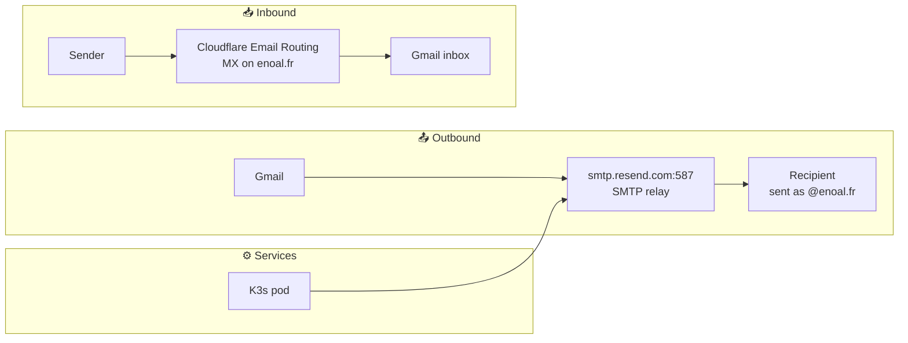

# Email

## Email aliases

All `*@enoal.fr` addresses are caught by Cloudflare Email Routing and forwarded to the
personal Gmail inbox. No per-alias configuration is needed — the catch-all rule handles
everything automatically.

Here are some example aliases and their intended purposes:

| Alias               | Purpose                                      |
| ------------------- | -------------------------------------------- |
| `enoal@enoal.fr`    | Primary professional address (CV, LinkedIn)  |
| `contact@enoal.fr`  | General contact, portfolio                   |
| `admin@enoal.fr`    | Infrastructure accounts (OVH, Cloudflare...) |
| `dev@enoal.fr`      | Developer accounts (GitHub, npm, forums)     |
| `noreply@enoal.fr`  | Sender address for homelab services          |
| `alerts@enoal.fr`   | Monitoring alerts (Uptime Kuma, SFTPGo...)   |
| `discord@enoal.fr`  | Discord account — breach tracing             |
| `github@enoal.fr`   | GitHub account — breach tracing              |
| `epitech@enoal.fr`  | Epitech services — breach tracing            |
| `shopping@enoal.fr` | E-commerce accounts — breach tracing         |

> [!TIP]
> Breach tracing: if spam arrives on a specific alias, the leaking service is immediately
> identified. Compromised aliases can be silently dropped in Cloudflare Email Routing
> without changing any account password or primary address.

## Email infrastructure

Self-hosting a mail server on a residential IP is not viable — ISPs block port 25 and
residential IPs are universally blacklisted. The stack instead relies on two external
services that handle inbound and outbound mail separately, at zero cost.

### Email Flow



### Inbound — Cloudflare Email Routing

[Cloudflare Email Routing](https://developers.cloudflare.com/email-routing/) intercepts
all mail addressed to `@enoal.fr` and forwards it to Gmail. No infrastructure required.

- **Catch-all rule**: active — any `*@enoal.fr` address works immediately without
  per-alias configuration
- **MX records**: managed automatically by Cloudflare

### Outbound — Resend

[Resend](https://resend.com) acts as the SMTP relay for all outbound mail. It authenticates
sends from `@enoal.fr` via DKIM and routes them through AWS SES infrastructure, ensuring
high deliverability.

- **Free tier**: 3 000 emails/month, 100/day — sufficient for personal and homelab use
- **Domain**: `enoal.fr` verified via Cloudflare DomainConnect (one-time authorization)
- **SMTP credentials**: `smtp.resend.com:587`, username `resend`, password = API key

DNS records added by Resend:

| Type | Name                | Purpose                              |
| ---- | ------------------- | ------------------------------------ |
| TXT  | `resend._domainkey` | DKIM signature key                   |
| MX   | `send`              | Bounce handling (via AWS SES)        |
| TXT  | `send`              | SPF for the `send.enoal.fr` envelope |

> [!NOTE]
> The `send.enoal.fr` subdomain is used exclusively as the SMTP `Return-Path` for bounce
> processing. It does not conflict with the `enoal.fr` MX records used by Cloudflare Email
> Routing.

### DNS authentication records

| Type | Name     | Value                                             | Purpose                        |
| ---- | -------- | ------------------------------------------------- | ------------------------------ |
| TXT  | `@`      | `v=spf1 include:_spf.mx.cloudflare.net ~all`      | SPF — authorizes Cloudflare MX |
| TXT  | `_dmarc` | `v=DMARC1; p=none; rua=mailto:<dmarcreport-addr>` | DMARC policy (monitoring mode) |

> [!TIP]
> DMARC is currently in `p=none` (monitoring) mode. Switch to `p=quarantine` or `p=reject`
> once aggregate reports confirm all legitimate senders pass SPF/DKIM. Reports are parsed
> by [dmarcreport.com](https://dmarcreport.com).

### Gmail — sending as @enoal.fr

Gmail is configured to send as any `@enoal.fr` address via **Settings → Accounts and
Import → Send mail as**, using the Resend SMTP credentials. Each address requires a
one-time verification email (delivered via Cloudflare Email Routing).

### Homelab services — SMTP secret

Vaultwarden and SFTPGo read their SMTP credentials (`SMTP_HOST`, `SMTP_PASSWORD`, etc.)
from Kubernetes Secrets injected as environment variables. The values are stored in
Infisical and synced into the cluster by ESO, through the `ExternalSecret` of each chart —
no manual `kubectl apply` required after the initial bootstrap ([secrets.md](secrets.md)).
The other services that send email (n8n, Immich, Uptime Kuma) have no SMTP setting in this
repository.

Reference in deployments is unchanged:

```yaml
env:
  - name: SMTP_HOST
    valueFrom:
      secretKeyRef:
        name: vaultwarden-secrets
        key: SMTP_HOST
  - name: SMTP_PASSWORD
    valueFrom:
      secretKeyRef:
        name: vaultwarden-secrets
        key: SMTP_PASSWORD
```

### Services using SMTP

| Service     | Usage                                              | Priority    |
| ----------- | -------------------------------------------------- | ----------- |
| Vaultwarden | User invitations, password reset, 2FA alerts       | 🔴 Critical |
| n8n         | User invitations + `Send Email` workflow node      | 🔴 Critical |
| Uptime Kuma | Downtime alerts                                    | 🟠 Optional |
| Immich      | New user welcome, shared album notifications       | 🟠 Optional |
| SFTPGo      | Upload/download events, backup status, share codes | 🟠 Optional |
