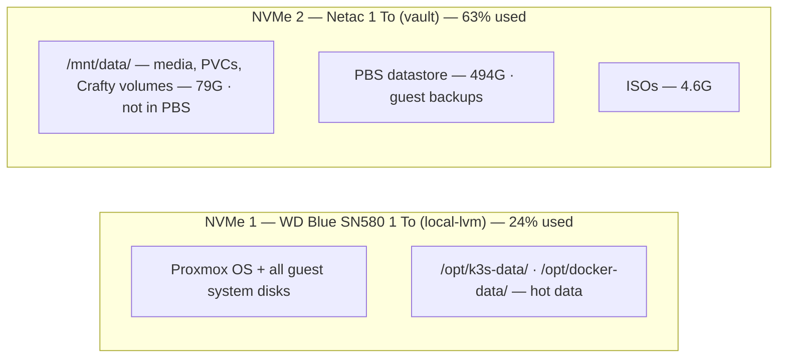

# Infrastructure

## Network and DNS

### Domain strategy

| Domain       | Scope             | Resolution                                         |
| ------------ | ----------------- | -------------------------------------------------- |
| `*.enoal.fr` | Public services   | Public DNS (internet-accessible via NAT)           |
| `*.lan`      | Internal services | AdGuard Home local DNS (LXC 101 — `192.168.1.202`) |

AdGuard Home acts as the local DNS server, resolving `.lan` hostnames to the Pulsar VM
(`192.168.1.201`). Internal services are accessible on the LAN without internet exposure.

### Port allocation

| Port        | Protocol | Service                    |
| ----------- | -------- | -------------------------- |
| 80          | TCP      | NPM (HTTP entry)           |
| 443         | TCP      | NPM (HTTPS entry)          |
| 81          | TCP      | NPM Admin UI               |
| 8098        | TCP      | squaremap SMP (web map)    |
| 8443        | TCP      | Crafty Admin UI            |
| 9444        | TCP      | Portainer                  |
| 25500-25599 | TCP      | Minecraft servers (Crafty) |
| 30022       | TCP      | SFTPGo SFTP (K3s NodePort) |

## Storage strategy

Both drives are NVMe, with distinct roles:

| Disk                            | Path on Pulsar                        | Usage                                 |
| ------------------------------- | ------------------------------------- | ------------------------------------- |
| **NVMe 1** — WD Blue SN580 1 To | `/opt/k3s-data/`, `/opt/docker-data/` | Hot data: databases, app state        |
| **NVMe 2** — Netac 1 To         | `/mnt/data/`                          | Cold data: media, backups, large PVCs |

### Path conventions

| Path                                  | Content                                     |
| ------------------------------------- | ------------------------------------------- |
| `/opt/k3s-data/<service>/`            | Persistent data for K3s services            |
| `/opt/docker-data/<service>/`         | Persistent data for Docker Compose services |
| `/mnt/data/media/`                    | Media library (films, music, etc.)          |
| `/mnt/data/backups/`                  | Backup archives                             |
| `/mnt/data/k3s-pvc/<service>/`        | Large or cold PVC data for K3s services     |
| `/mnt/data/docker-volumes/<service>/` | Large volume data for Docker services       |

> [!IMPORTANT]
> Docker Compose bind mounts **must use absolute paths**. Portainer deploys these stacks
> from Git into a per-commit directory (`/data/compose/<stack-id>/<sha>/`), so a relative
> source such as `./<service>-data` resolves inside that throwaway clone and is recreated
> empty on every commit. Always mount `/opt/docker-data/<service>/`.

## Storage layout

> **The Netac holds the PBS datastore — every Layer 1 backup — next to the cold data.** At
> 494 G the datastore is the single largest consumer of this disk. Since 2026-09-11 the cold
> disk itself is excluded from PBS (`backup=0`): a copy on the same drive never survived its
> failure. Its irreplaceable content goes off-site through Layer 2 instead. A single Netac
> failure still loses every PBS snapshot; this is a deliberate trade-off, documented in
> [`docs/backup/README.md` §2.3](backup/README.md#23-accepted-constraints) and §4.2.
>
> Both M.2 slots are occupied — two free SATA ports are the only internal expansion path.
> Sizes measured 2026-09-09.
