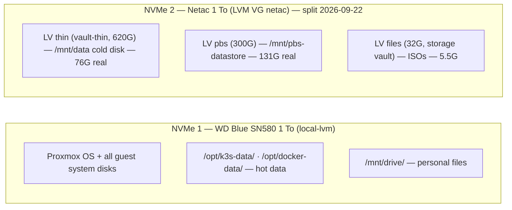

# Infrastructure

## Network and DNS

### Domain strategy

| Domain       | Scope             | Resolution                                         |
| ------------ | ----------------- | -------------------------------------------------- |
| `*.enoal.fr` | Public services   | Public DNS (internet-accessible via NAT)           |
| `*.lan`      | Internal services | AdGuard Home local DNS (LXC 101 — `192.168.1.202`) |

AdGuard Home acts as the local DNS server, resolving `.lan` hostnames to the Pulsar VM
(`192.168.1.201`). Internal services are accessible on the LAN without internet exposure.

### Port allocation

| Port        | Protocol | Service                    |
| ----------- | -------- | -------------------------- |
| 80          | TCP      | NPM (HTTP entry)           |
| 443         | TCP      | NPM (HTTPS entry)          |
| 81          | TCP      | NPM Admin UI               |
| 8098        | TCP      | squaremap SMP (web map)    |
| 8443        | TCP      | Crafty Admin UI            |
| 9444        | TCP      | Portainer                  |
| 25500-25599 | TCP      | Minecraft servers (Crafty) |
| 30022       | TCP      | SFTPGo SFTP (K3s NodePort) |

## Storage strategy

Both drives are NVMe, with distinct roles:

| Disk                            | Path on Pulsar                        | Usage                                 |
| ------------------------------- | ------------------------------------- | ------------------------------------- |
| **NVMe 1** — WD Blue SN580 1 To | `/opt/k3s-data/`, `/opt/docker-data/` | Hot data: databases, app state        |
| **NVMe 1** — WD Blue SN580 1 To | `/mnt/drive/`                         | Personal files (own virtual disk)     |
| **NVMe 2** — Netac 1 To         | `/mnt/data/`                          | Cold data: media, backups, large PVCs |

### Path conventions

| Path                                  | Content                                     |
| ------------------------------------- | ------------------------------------------- |
| `/opt/k3s-data/<service>/`            | Persistent data for K3s services            |
| `/opt/docker-data/<service>/`         | Persistent data for Docker Compose services |
| `/mnt/drive/`                         | Personal files (Documents, Photos, …)       |
| `/mnt/data/media/`                    | Media library (films, music, etc.)          |
| `/mnt/data/backups/`                  | Backup archives                             |
| `/mnt/data/k3s-pvc/<service>/`        | Large or cold PVC data for K3s services     |
| `/mnt/data/docker-volumes/<service>/` | Large volume data for Docker services       |

> [!IMPORTANT]
> Docker Compose bind mounts **must use absolute paths**. Portainer deploys these stacks
> from Git into a per-commit directory (`/data/compose/<stack-id>/<sha>/`), so a relative
> source such as `./<service>-data` resolves inside that throwaway clone and is recreated
> empty on every commit. Always mount `/opt/docker-data/<service>/`.

## Storage layout



> **The Netac holds the PBS datastore — every Layer 1 backup — next to the cold data.** Since
> 2026-09-11 the cold disk itself is excluded from PBS (`backup=0`): a copy on the same drive
> never survived its failure. Its irreplaceable content goes off-site through Layer 2 instead.
> A single Netac failure still loses every PBS snapshot; this is a deliberate trade-off,
> documented in [`backup/README.md` §2.3](backup/README.md#23-accepted-constraints). **Splitting
> the Netac into LVM compartments (2026-09-22, below) does not change this**: the datastore and
> the cold disk sit in separate logical volumes so neither can starve the other, but both still
> live on the same physical drive — a Netac failure still takes both at once.

## Disks

Figures measured 2026-09-21 unless stated otherwise.

### Astra — Proxmox host

| Disk              | Model in `lsblk`    | Mount                    | Role                                           |
| ----------------- | ------------------- | ------------------------ | ---------------------------------------------- |
| WD Blue SN580 1To | `WD Blue SN580 1TB` | `pve-root` + `local-lvm` | Proxmox OS + VM/LXC virtual disks (production) |
| Netac 1To         | `G932E1Q 1T`        | VG `netac` (3 LVs, below) | Pulsar cold disk + PBS datastore + ISOs        |

> **Kernel names are not stable — found 2026-09-13.** Linux names NVMe drives in the order
> they answer at boot. Until then the WD Blue was `nvme0n1` and the Netac `nvme1n1`; on the
> 2026-09-13 reboot they came up the other way round. Nothing broke: LVM finds `pve` and
> `netac` by their own UUIDs regardless of kernel name. This document therefore names drives
> by model. Before any command on a drive, check `lsblk -d -o NAME,MODEL` and address it as
> `/dev/disk/by-id/nvme-<model>_…` or by UUID, never as `nvmeXn1`.

```txt
WD Blue SN580 (931G)
├── pve-swap        8G
├── pve-root       96G   → Proxmox OS (/etc/pve, /etc/proxmox-backup)
└── pve-data      793G   → local-lvm pool (thin)
    ├── vm-100-disk-0   200G  → Pulsar OS disk (= sda in Pulsar)
    ├── vm-100-disk-1    64G  → Pulsar personal disk `drive` (= sdc in Pulsar)
    ├── vm-101-disk-0     8G  → AdGuard
    ├── vm-102-disk-0     4G  → Wireguard
    └── vm-103-disk-0    16G  → PBS

Netac (954G — VG `netac`, split 2026-09-22, method A of the disk plan)
├── LV pbs          300G ext4   → /mnt/pbs-datastore (nofail in fstab)  131G real  → PBS backup chunks
├── LV files          32G ext4   → /mnt/pve/vault (Proxmox storage `vault`)  5.5G real  → ISOs, templates
├── LV thin (pool)   620G thin   → Proxmox storage `vault-thin`  ~500G real  → Pulsar cold disk (= sdb)
│                                  (started at 520G; grown same-day, see incident below)
└── unallocated      672M
```

The cold disk is a **raw LVM-thin volume** (not a `.qcow2` file): space freed inside Pulsar
only returns to the `thin` pool once `fstrim` runs in the guest **and** the discard reaches
the pool. This broke during the 2026-09-22 split — see the incident note in
[`decisions.md`](decisions.md) — leaving the pool at ~80% real usage against ~15% real usage
inside the guest until a proper reclaim (unmount, not just remount) is done.

Both M.2 slots are populated; only **two unused SATA ports** remain, and the case has no
room for a SATA drive.

### Pulsar — main VM

Pulsar (VM 100) sees three virtual disks:

| Disk                                           | Proxmox | Device | Mount        | Size | Role                                                             | In PBS                                                                                 |
| ---------------------------------------------- | ------- | ------ | ------------ | ---- | ---------------------------------------------------------------- | -------------------------------------------------------------------------------------- |
| OS disk (`vm-100-disk-0` on `local-lvm`)       | `scsi0` | `sda`  | `/`          | 200G | OS, hot app data, K3s/Docker state                               | ✅                                                                                     |
| Cold disk (`vm-100-disk-0` on `vault-thin`)     | `scsi1` | `sdb`  | `/mnt/data`  | 500G | Cold data: media, PVCs, Crafty volumes                           | ❌ `backup=0` since 2026-09-11, see [backup/README.md §4.2](backup/README.md#42-scope) |
| Personal disk (`vm-100-disk-1` on `local-lvm`) | `scsi2` | `sdc`  | `/mnt/drive` | 64G  | Personal files, served by Filebrowser Quantum and SFTPGo (below) | ✅ since 2026-09-21                                                                    |

```txt
sda (200G) → /
├── /opt/k3s-data/      Hot persistent data for K3s services
├── /opt/docker-data/   Hot persistent data for Docker services
└── /opt/ops/           GitOps repo (astra-ops — also on GitHub)

sdb (500G) → /mnt/data
├── /mnt/data/k3s-pvc/          Cold PVC data for K3s services
├── /mnt/data/docker-volumes/   Cold volume data for Docker services
├── /mnt/data/backups/          Database dumps and the Proxmox configuration copy
└── /mnt/data/media/            Movies (replaceable)

sdc (64G) → /mnt/drive          Personal files (since 2026-09-20)
```

`sdc` is mounted by UUID (`e6ec6a2d-878e-4843-a8de-f10c55e200e7`, label `drive`) in
`/etc/fstab`: kernel names follow detection order and are not stable. It is thin: the 64G
reserve nothing on the WD Blue, and `fstrim.timer` hands deleted blocks back to the pool.

Usage: `sda` **115G / 195G (62 %)** · `sdb` **76G / 492G (15 %)** · `sdc` **5.7G / 63G
(10 %)**. [2026-09-22]

### What lives where

The § numbers below refer to [backup/README.md](backup/README.md); tiers are defined in its §3.

```txt
Pulsar /opt/ (sda — hot)          sizes below measured 2026-09-09
├── k3s-data/                    → Backblaze, job 16, since 2026-09-13 (exclusions §5.4)
│   ├── immich/            32G   ├── library/upload   29G   (Tier 2)
│   │                            ├── library/thumbs  1.5G   (Tier 3, regenerable)
│   │                            ├── model-cache     786M   (Tier 3, re-downloaded)
│   │                            └── postgres        295M   (Tier 1)
│   ├── uptimekuma/       231M
│   ├── scanopy/           68M
│   ├── docker-registry/   57M
│   ├── n8n/               41M
│   ├── criteri-fresque/   38M
│   ├── vaultwarden/      6.7M
│   ├── homer/            5.3M
│   ├── filebrowser-quantum/ 896K · sftpgo/ 380K · ntfy/ 160K
│   └── diun/ 536K · convertx/ 356K
├── docker-data/                 → Backblaze, job 17, since 2026-09-13 (exclusions §5.4)
│   ├── crafty/            17G   └── servers/ 17G (Tier 3) · config/ 169M (Tier 2)
│   ├── portainer/         83M   (Tier 1)
│   ├── crowdsec/          92M
│   ├── npm/               20M
│   └── portracker/        68K
└── ops/                   11M   GitOps clone (also on GitHub)

  Not application data, but the bulk of this disk:
  /var/lib/rancher/k3s/.../containerd  25G   container images (reconstructible)
  /var/lib/containerd                  13G   second image store (reconstructible)
  /var/lib/docker                     8.0G   (reconstructible)
  /swap.img 4.1G · /usr 3.6G · /var/log 2.7G

Pulsar /mnt/data/ (sdb — cold)     76G used / 492G (15 %)   [2026-09-22]
                                   not in PBS since backup=0, 2026-09-11 (§4.2)
├── media/
│   ├── movies/            47G   (Tier 3 — 19 re-downloadable files, no backup),
│   │                            shown read-only in Filebrowser Quantum and SFTPGo
│   └── photos/          empty   moved to /mnt/drive/Photos, emptied 2026-09-21
├── docker-volumes/crafty/
│   ├── backups/           26G   (Tier 2) → Backblaze since 2026-09-11, all 3 servers
│   └── logs/             432M   (Tier 3, no backup)
├── backups/              156M   (Tier 2) → Backblaze, job 13
│   ├── dumps/            154M   nightly database dumps (§6)
│   └── proxmox-configs/   70K   Astra + PBS configuration, refreshed nightly (§4.2)
└── k3s-pvc/
    ├── filebrowser/     empty   moved to /mnt/drive, emptied 2026-09-21
    ├── crafty/            92K
    └── kiwix/            empty  (136G deleted 2026-09-09)

Pulsar /mnt/drive/ (sdc — personal) 5.7G used / 63G (10 %)  [2026-09-21]
                                   in PBS with VM 100 (§4.2) → Backblaze, job 18
├── Archives/             4.7G   Nexus Backup/ 3.9G, Snapchat/ 750M
├── Photos/               946M   AstralRedshift/ 807M, Timelaps/ 139M
├── Téléphone/            102M   DataBackup/ — the OnePlus 10T backup
└── Documents/             15M
```

Both apps mount `/mnt/drive` read-write and `/mnt/data/media/movies` read-only (commit
`c9e98e1`): Filebrowser Quantum at `/srv/drive` and `/srv/Films`, SFTPGo at `/data/drive` and
`/data/Films`. The read-only flag is set on the Kubernetes mount, so no setting inside either
app can make the movies writable. Neither app mounts anything under `/mnt/data/backups` any
more. Quantum's own sources are configured outside this repository: see
[`k3s/filebrowser-quantum/README.md`](../k3s/filebrowser-quantum/README.md).
