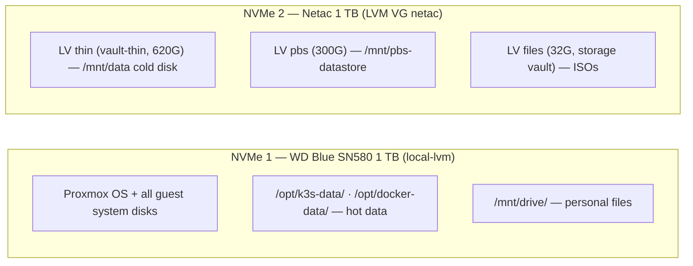

# Infrastructure

## Network and DNS

### Domain strategy

| Domain       | Scope             | Resolution                                         |
| ------------ | ----------------- | -------------------------------------------------- |
| `*.enoal.fr` | Public services   | Cloudflare DNS, most hosts proxied; NAT to Pulsar  |
| `*.lan`      | Internal services | AdGuard Home local DNS (LXC 101 — `192.168.1.202`) |

AdGuard Home acts as the local DNS server, resolving `.lan` hostnames to the Pulsar VM
(`192.168.1.201`). Internal services are accessible on the LAN without internet exposure.

### Port allocation

| Port        | Protocol | Service                    |
| ----------- | -------- | -------------------------- |
| 80          | TCP      | NPM (HTTP entry)           |
| 443         | TCP      | NPM (HTTPS entry)          |
| 81          | TCP      | NPM Admin UI               |
| 4040        | TCP      | Prism SMP (block log)      |
| 8098        | TCP      | squaremap SMP (web map)    |
| 8099        | TCP      | OPanel SMP (admin panel)   |
| 8100        | TCP      | BlueMap SMP (3D map)       |
| 8443        | TCP      | Crafty Admin UI            |
| 8804        | TCP      | Plan SMP (player stats)    |
| 9000        | TCP      | Portainer                  |
| 25500-25599 | TCP      | Minecraft servers (Crafty) |
| 30022       | TCP      | SFTPGo SFTP (K3s NodePort) |

### Firewalls

The internet box's IPv6 firewall is on: to reproduce, turn it on in the box's settings. In
IPv4 the box only lets in the ports it forwards, but in IPv6 each machine has its own public
address, so without that option a machine's own firewall is the only filter. The option is
all or nothing: it blocks every incoming IPv6 connection and has no per-port rules. Nothing
here needs incoming IPv6, since no DNS record points home over IPv6.

Each machine also filters on its own, so a box reset or replacement exposes nothing that
should stay private. "LAN" below means `192.168.1.0/24`, and "VPN" the box's WireGuard
clients, `192.168.27.0/24`.

| Machine           | Tool     | Open to everyone                      | LAN and VPN only                                       |
| ----------------- | -------- | ------------------------------------- | ------------------------------------------------------ |
| Pulsar            | UFW      | SSH (keys only), Minecraft and Crafty | Samba, k3s API `6443`, Roots SMP web plugins           |
| LXC 101 `adguard` | nftables | nothing                               | DNS `53`, web UI `80`, SSH `22`, Beszel `45876`        |
| LXC 103 `pbs`     | nftables | nothing                               | web UI and backup API `8007`, SSH `22`, Beszel `45876` |

The LAN-only rules are IPv4 only. No device reaches Samba, AdGuard or PBS over IPv6, and
allowing the home IPv6 prefix would hard-code a prefix Free can change.

**Pulsar.** UFW does not govern the ports Docker publishes in IPv4: Docker writes its own
rules ahead of UFW's, so NPM's `80`, `443` and `81` answer whatever UFW says. In IPv6, Docker
relays those ports through a process on the host, and UFW does apply. The k3s API must also
accept the pod network (`10.42.0.0/16`): pods reach it through the `kubernetes` service, and
without that rule ArgoCD and every app that talks to the cluster lose it.

Roots SMP's web plugins (Prism `4040`, squaremap `8098`, OPanel `8099`, BlueMap `8100`, Plan
`8804`) bind on every interface. NPM serves them under `rootssmp-*` hostnames and reaches
them through Pulsar's LAN address from its Docker network, `172.19.0.0/16`, so that network
is allowed too.

```sh
sudo ufw allow from 192.168.1.0/24 to any port 6443 proto tcp comment "k3s API (LAN)"
sudo ufw allow from 192.168.27.0/24 to any port 6443 proto tcp comment "k3s API (VPN Freebox)"
sudo ufw allow from 10.42.0.0/16 to any port 6443 proto tcp comment "k3s API <- pods"
sudo ufw allow from 192.168.1.0/24 to any app Samba comment "samba (LAN)"
sudo ufw allow from 192.168.27.0/24 to any app Samba comment "samba (VPN Freebox)"
for plugin in 4040:Prism 8098:squaremap 8099:OPanel 8100:BlueMap 8804:Plan; do
  port=${plugin%%:*} name=${plugin#*:}
  sudo ufw allow from 192.168.1.0/24 to any port "$port" proto tcp comment "$name SMP (LAN)"
  sudo ufw allow from 192.168.27.0/24 to any port "$port" proto tcp comment "$name SMP (VPN Freebox)"
  sudo ufw allow from 172.19.0.0/16 to any port "$port" proto tcp comment "$name SMP <- NPM"
done
```

**AdGuard.** Its rules are [`infra/adguard/nftables.conf`](../infra/adguard/nftables.conf),
loaded at boot by the `nftables` service. They keep ICMP open in both versions: IPv6 needs
it to find its neighbours and keep its address. To change them without risk of locking
yourself out, arm a rollback first:

```sh
scp infra/adguard/nftables.conf adguard:/etc/nftables.conf.new
ssh adguard
nft -c -f /etc/nftables.conf.new          # syntax check only
systemd-run --on-active=120 --unit=nft-rollback nft -f /etc/nftables.conf
nft -f /etc/nftables.conf.new
# From another machine: DNS, web UI, SSH, then Beszel from Pulsar. If all answer:
systemctl stop nft-rollback.timer
mv /etc/nftables.conf.new /etc/nftables.conf
```

If nothing answers, wait two minutes: the timer reloads the previous file. As a last
resort, `pct enter 101` on Astra opens a shell in the container, where `nft flush ruleset`
opens everything again.

**PBS.** Same layout and procedure with
[`infra/pbs/nftables.conf`](../infra/pbs/nftables.conf) in LXC 103. Check the web UI, the
`pbs-local` storage from Astra (`pvesm status --storage pbs-local`) and Beszel from Pulsar
before stopping the rollback timer.

## Storage strategy

Both drives are NVMe, with distinct roles:

| Disk                            | Path on Pulsar                        | Usage                                 |
| ------------------------------- | ------------------------------------- | ------------------------------------- |
| **NVMe 1** — WD Blue SN580 1 TB | `/opt/k3s-data/`, `/opt/docker-data/` | Hot data: databases, app state        |
| **NVMe 1** — WD Blue SN580 1 TB | `/mnt/drive/`                         | Personal files (own virtual disk)     |
| **NVMe 2** — Netac 1 TB         | `/mnt/data/`                          | Cold data: media, backups, large PVCs |

### Path conventions

| Path                                  | Content                                     |
| ------------------------------------- | ------------------------------------------- |
| `/opt/k3s-data/<service>/`            | Persistent data for K3s services            |
| `/opt/docker-data/<service>/`         | Persistent data for Docker Compose services |
| `/mnt/drive/`                         | Personal files (Documents, Photos, …)       |
| `/mnt/data/media/`                    | Media library (films, music, etc.)          |
| `/mnt/data/backups/`                  | Backup archives                             |
| `/mnt/data/k3s-pvc/<service>/`        | Large or cold PVC data for K3s services     |
| `/mnt/data/docker-volumes/<service>/` | Large volume data for Docker services       |

> [!IMPORTANT]
> Docker Compose bind mounts **must use absolute paths**. Portainer deploys these stacks
> from Git into a per-commit directory (`/data/compose/<stack-id>/<sha>/`), so a relative
> source such as `./<service>-data` resolves inside that throwaway clone and is recreated
> empty on every commit. Always mount `/opt/docker-data/<service>/`.

## Storage layout


```mermaid
graph LR
    subgraph NVMe1["NVMe 1 — WD Blue SN580 1 TB (local-lvm)"]
        OS[Proxmox OS + all guest system disks]
        HOT["/opt/k3s-data/ · /opt/docker-data/ — hot data"]
        DRIVE["/mnt/drive/ — personal files"]
    end
    subgraph NVMe2["NVMe 2 — Netac 1 TB (LVM VG netac)"]
        COLD["LV thin (vault-thin, 620G) — /mnt/data cold disk"]
        PBS["LV pbs (300G) — /mnt/pbs-datastore"]
        ISO["LV files (32G, storage vault) — ISOs"]
    end
```

> **The Netac holds the PBS datastore next to the cold data.** The cold disk is excluded from
> PBS (`backup=0`), since a copy on the same drive would not survive its failure; its
> irreplaceable content goes off-site through Layer 2. A Netac failure still loses every PBS
> snapshot, a trade-off documented in
> [`backup/README.md` §2.3](backup/README.md#23-accepted-constraints). The LVM split keeps the
> datastore and the cold disk from starving each other, but both sit on the same physical
> drive.

## Disks

### Astra — Proxmox host

| Disk               | Model in `lsblk`    | Mount                     | Role                                           |
| ------------------ | ------------------- | ------------------------- | ---------------------------------------------- |
| WD Blue SN580 1 TB | `WD Blue SN580 1TB` | `pve-root` + `local-lvm`  | Proxmox OS + VM/LXC virtual disks (production) |
| Netac 1 TB         | `G932E1Q 1T`        | VG `netac` (3 LVs, below) | Pulsar cold disk + PBS datastore + ISOs        |

> **Kernel names are not stable.** Linux names NVMe drives in the order they answer at boot,
> and the two drives have already swapped `nvme0n1` and `nvme1n1` across a reboot. LVM finds
> `pve` and `netac` by UUID, so nothing depends on these names. Before any command on a
> drive, check `lsblk -d -o NAME,MODEL` and address it as `/dev/disk/by-id/nvme-<model>_…` or
> by UUID, never as `nvmeXn1`.

```txt
WD Blue SN580 (931G)
├── pve-swap        8G
├── pve-root       96G   → Proxmox OS (/etc/pve, /etc/proxmox-backup)
└── pve-data      793G   → local-lvm pool (thin)
    ├── vm-100-disk-0   200G  → Pulsar OS disk (= sda in Pulsar)
    ├── vm-100-disk-1    64G  → Pulsar personal disk `drive` (= sdc in Pulsar)
    ├── vm-101-disk-0     8G  → AdGuard
    ├── vm-102-disk-0     4G  → Wireguard
    └── vm-103-disk-0    16G  → PBS

Netac (954G — VG `netac`)
├── LV pbs          300G ext4   → /mnt/pbs-datastore (nofail in fstab)       → PBS backup chunks
├── LV files         32G ext4   → /mnt/pve/vault (Proxmox storage `vault`)   → ISOs, templates
├── LV thin (pool)  620G thin   → Proxmox storage `vault-thin`               → Pulsar cold disk (= sdb)
└── unallocated     672M
```

The cold disk is a **raw LVM-thin volume** (not a `.qcow2` file): space freed inside Pulsar
only returns to the `thin` pool once `fstrim` runs in the guest **and** the discard reaches
the pool. After a live `qm disk move` onto a thin pool it does not: stop and start the VM from
Proxmox, then run `fstrim` (see [`decisions.md`](decisions.md), 2026-09-22). Real usage of the
pool: `lvs netac/thin` on Astra.

Both M.2 slots are populated; only **two unused SATA ports** remain, and the case has no
room for a SATA drive.

### Pulsar — main VM

Pulsar (VM 100) sees three virtual disks:

| Disk                                           | Proxmox | Device | Mount        | Size | Role                                                             | In PBS                                                                |
| ---------------------------------------------- | ------- | ------ | ------------ | ---- | ---------------------------------------------------------------- | --------------------------------------------------------------------- |
| OS disk (`vm-100-disk-0` on `local-lvm`)       | `scsi0` | `sda`  | `/`          | 200G | OS, hot app data, K3s/Docker state                               | ✅                                                                    |
| Cold disk (`vm-100-disk-0` on `vault-thin`)    | `scsi1` | `sdb`  | `/mnt/data`  | 500G | Cold data: media, PVCs, Crafty volumes                           | ❌ `backup=0`, see [backup/README.md §4.2](backup/README.md#42-scope) |
| Personal disk (`vm-100-disk-1` on `local-lvm`) | `scsi2` | `sdc`  | `/mnt/drive` | 64G  | Personal files, served by Filebrowser Quantum and SFTPGo (below) | ✅                                                                    |

```txt
sda (200G) → /
├── /opt/k3s-data/      Hot persistent data for K3s services
├── /opt/docker-data/   Hot persistent data for Docker services
└── /opt/ops/           GitOps repo (astra-ops — also on GitHub)

sdb (500G) → /mnt/data
├── /mnt/data/k3s-pvc/          Cold PVC data for K3s services
├── /mnt/data/docker-volumes/   Cold volume data for Docker services
├── /mnt/data/backups/          Database dumps and the Proxmox configuration copy
└── /mnt/data/media/            Movies (replaceable)

sdc (64G) → /mnt/drive          Personal files
```

`sdc` is mounted by UUID (`e6ec6a2d-878e-4843-a8de-f10c55e200e7`, label `drive`) in
`/etc/fstab`: kernel names follow detection order and are not stable. It is thin: the 64G
reserve nothing on the WD Blue, and `fstrim.timer` hands deleted blocks back to the pool.

Usage: `df -h / /mnt/data /mnt/drive` in Pulsar.

### What lives where

The § numbers below refer to [backup/README.md](backup/README.md); tiers are defined in its §3.
Sizes: `du -sh /opt/k3s-data/* /opt/docker-data/* /mnt/data/*/* /mnt/drive/*` in Pulsar.

```txt
Pulsar /opt/ (sda — hot)
├── k3s-data/                    → Backblaze, K3s Data job (exclusions §5.4)
│   ├── <service>/               one directory per app
│   └── immich/                  ├── library/upload    (Tier 2)
│                                ├── library/thumbs    (Tier 3, regenerable)
│                                ├── model-cache       (Tier 3, re-downloaded)
│                                └── postgres          (Tier 1)
├── docker-data/                 → Backblaze, Docker Data job (exclusions §5.4)
│   ├── <service>/               one directory per app
│   ├── crafty/                  └── servers/ (Tier 3) · config/ (Tier 2)
│   └── portainer/               (Tier 1)
└── ops/                         GitOps clone (also on GitHub)

  Also on this disk, reconstructible: container images
  (/var/lib/rancher/k3s/.../containerd, /var/lib/containerd, /var/lib/docker)

Pulsar /mnt/data/ (sdb — cold)     not in PBS, backup=0 (§4.2)
├── media/
│   └── movies/                  (Tier 3, re-downloadable, no backup),
│                                shown read-only in Filebrowser Quantum and SFTPGo
├── docker-volumes/crafty/
│   ├── backups/                 (Tier 2) → Backblaze, all 3 servers
│   └── logs/                    (Tier 3, no backup)
├── backups/                     (Tier 2) → Backblaze, Backups job
│   ├── dumps/                   nightly database dumps (§6)
│   └── proxmox-configs/         Astra + PBS configuration, refreshed nightly (§4.2)
└── k3s-pvc/
    └── crafty/

Pulsar /mnt/drive/ (sdc — personal)
                                 in PBS with VM 100 (§4.2) → Backblaze, Drive job
├── Archives/
├── Photos/
├── Téléphone/                   phone backup
└── Documents/
```

Both apps mount `/mnt/drive` read-write and `/mnt/data/media/movies` read-only: Filebrowser
Quantum at `/srv/drive` and `/srv/Films`, SFTPGo at `/data/drive` and `/data/Films`. The
read-only flag is set on the Kubernetes mount, so no setting inside either app can make the
movies writable. Quantum's own sources are configured outside this repository: see
[`k3s/filebrowser-quantum/README.md`](../k3s/filebrowser-quantum/README.md).
