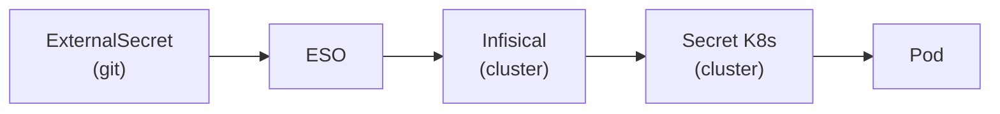

# Secrets management

Secrets are **never** committed to this repository. Three mechanisms coexist today:

| Mechanism                                                                                                                    | Used by                                                                                 |
| ---------------------------------------------------------------------------------------------------------------------------- | --------------------------------------------------------------------------------------- |
| [External Secrets Operator](https://external-secrets.io) (ESO) pulling from a self-hosted [Infisical](https://infisical.com) | azerbot, botenoal, couchdb, docker-registry, github-runners, sftpgo, umami, vaultwarden |
| A `secrets.yaml` filled by hand from a committed `.example` template, applied with `kubectl apply`                           | criteri-fresque, immich, and the disabled ntfy and scanopy                              |
| Portainer's **Environment variables** for each stack                                                                         | every Docker Compose stack (Layer A)                                                    |

GHCR images also need a registry pull secret, created by hand (below).

## ESO and Infisical



Each of these services has a committed `ExternalSecret` (`templates/external-secret.yaml`
in its chart, `k3s/github-runners/external-secret.yaml` for the runners) that describes which
keys to pull from Infisical and how to map them into a Kubernetes Secret. ArgoCD deploys
the `ExternalSecret` object; ESO resolves it automatically against Infisical and creates
the `Secret` — no manual intervention required.

### What lives in git

| File                                           | Status        | Description                          |
| ---------------------------------------------- | ------------- | ------------------------------------ |
| `k3s/<service>/templates/external-secret.yaml` | ✅ Committed  | Maps Infisical keys → K8s Secret     |
| `k3s/<service>/secrets.example.yaml`           | ✅ Committed  | Template for a hand-applied secret   |
| `k3s/<service>/secrets.yaml`                   | 🔒 Gitignored | Filled copy of the template          |
| `infra/eso/cluster-secret-store.yaml`          | ✅ Committed  | ESO connection config to Infisical   |
| `infra/eso/infisical-bootstrap.example`        | ✅ Committed  | Template for the bootstrap secret    |
| `infra/eso/infisical-token.example`            | ✅ Committed  | Template for the service token       |
| `infra/eso/infisical-bootstrap.yaml`           | 🔒 Gitignored | Real bootstrap secret (fill locally) |
| `infra/eso/infisical-token.yaml`               | 🔒 Gitignored | Real service token (fill locally)    |

### Adding a secret to a service

1. Add the key/value in the Infisical UI (`infisical.lan` → project `astra-yrel` → env `prod`)
2. Reference the key in the service's `ExternalSecret` and push — ArgoCD + ESO handle the rest

### Bootstrap after a K3s reinstall

Infisical data persists on disk (`/opt/k3s-data/infisical/`). After a cluster reinstall,
two manual `kubectl apply` are needed before ArgoCD can sync secrets. Both filled files are
kept in the **official Bitwarden cloud** (notes `Astra – Infisical bootstrap` and
`Astra – Infisical service token`), not in Vaultwarden, which runs on Astra and would be lost
with it:

```bash
# Fill in values from infra/eso/infisical-bootstrap.example, then:
kubectl apply -f infra/eso/infisical-bootstrap.yaml

# Fill in the Infisical service token, then:
kubectl apply -f infra/eso/infisical-token.yaml
```

ArgoCD deploys everything else automatically.

## Hand-applied secrets

For the services not on ESO yet, copy the template, fill it in, and apply it:

```bash
cp k3s/<service>/secrets.example.yaml k3s/<service>/secrets.yaml   # immich, scanopy: 10-secrets.example.yaml
kubectl apply -f k3s/<service>/secrets.yaml
```

The filled files are gitignored. Off Astra, the AppFlowy and Immich ones are in the official
Bitwarden cloud (notes `Astra – AppFlowy secrets` and `Astra – Immich DB`). criteri-fresque's
secrets have no copy off Astra, nor do those of the disabled ntfy and scanopy.

## Registry credentials

Services using GHCR images need a `regcred` pull secret. Each such service includes a
`generate-regcred.sh` script:

```bash
cd k3s/<service>
./generate-regcred.sh   # prompts for GitHub username + PAT
kubectl apply -f regcred.yaml
```

## Layer A — Docker Compose

Secrets for Docker Compose stacks are injected via Portainer's **Environment variables**
UI — no `.env` file on disk, no repository changes required. Portainer stores them on
Astra only: a value that must survive the loss of Astra needs a copy elsewhere (Zerobyte's
`APP_SECRET`, for instance — [backup/restore.md](backup/restore.md), scenario C). Those
copies are in the official Bitwarden cloud: Zerobyte's `APP_SECRET`, and the notes
`Astra – Homarr` (`SECRET_ENCRYPTION_KEY`) and `Astra – Speedtest` (`APP_KEY`).

## gitignore patterns

```text
.env
*-secret.yaml       # catch-all for manual secrets
!external-secret.yaml  # exception: ExternalSecret manifests are committed
*-secrets.yaml
*-regcred.yaml
regcred.yaml
secrets.yaml
infisical-bootstrap.yaml
infisical-token.yaml
```
