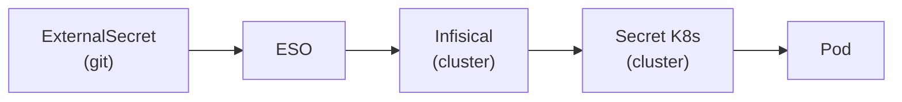

# Secrets management

Secrets are **never** committed to this repository. The stack uses
[External Secrets Operator](https://external-secrets.io) (ESO) backed by a self-hosted
[Infisical](https://infisical.com) instance running on the cluster itself.

## How it works



Each service has a committed `k3s/<service>/external-secret.yaml` that describes which
keys to pull from Infisical and how to map them into a Kubernetes Secret. ArgoCD deploys
the `ExternalSecret` object; ESO resolves it automatically against Infisical and creates
the `Secret` — no manual intervention required.

## What lives in git

| File                                    | Status        | Description                          |
| --------------------------------------- | ------------- | ------------------------------------ |
| `k3s/<service>/external-secret.yaml`    | ✅ Committed  | Maps Infisical keys → K8s Secret     |
| `infra/eso/cluster-secret-store.yaml`   | ✅ Committed  | ESO connection config to Infisical   |
| `infra/eso/infisical-bootstrap.example` | ✅ Committed  | Template for the bootstrap secret    |
| `infra/eso/infisical-token.example`     | ✅ Committed  | Template for the service token       |
| `infra/eso/infisical-bootstrap.yaml`    | 🔒 Gitignored | Real bootstrap secret (fill locally) |
| `infra/eso/infisical-token.yaml`        | 🔒 Gitignored | Real service token (fill locally)    |

## Adding a secret to a service

1. Add the key/value in the Infisical UI (`infisical.lan` → project `astra-yrel` → env `prod`)
2. Push the `external-secret.yaml` for the service (already in repo) — ArgoCD + ESO handle the rest

## Bootstrap after a K3s reinstall

Infisical data persists on disk (`/opt/k3s-data/infisical/`). After a cluster reinstall,
two manual `kubectl apply` are needed before ArgoCD can sync secrets — retrieve them from
Vaultwarden if needed:

```bash
# Fill in values from infra/eso/infisical-bootstrap.example, then:
kubectl apply -f infra/eso/infisical-bootstrap.yaml

# Fill in the Infisical service token, then:
kubectl apply -f infra/eso/infisical-token.yaml
```

ArgoCD deploys everything else automatically.

## Registry credentials

Services using GHCR images need a `regcred` pull secret. Each such service includes a
`generate-regcred.sh` script:

```bash
cd k3s/<service>
./generate-regcred.sh   # prompts for GitHub username + PAT
kubectl apply -f regcred.yaml
```

## Layer A — Docker Compose

Secrets for Docker Compose stacks are injected via Portainer's **Environment variables**
UI — no `.env` file on disk, no repository changes required.

## gitignore patterns

```text
.env
*-secret.yaml       # catch-all for manual secrets
!external-secret.yaml  # exception: ExternalSecret manifests are committed
*-secrets.yaml
*-regcred.yaml
regcred.yaml
secrets.yaml
infisical-bootstrap.yaml
infisical-token.yaml
```
